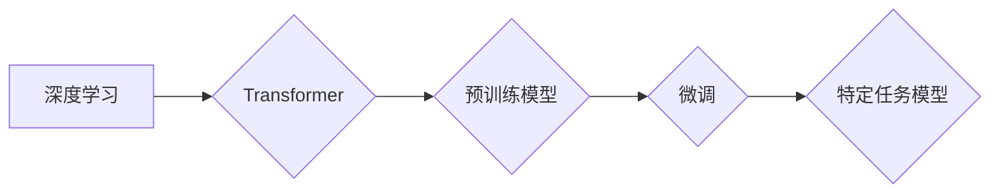

> 大模型、深度学习、Transformer、微调、自然语言处理、计算机视觉

## 1. 背景介绍

近年来，深度学习技术取得了飞速发展，尤其是在自然语言处理（NLP）和计算机视觉（CV）领域取得了突破性进展。这些进展离不开大模型的出现。大模型是指参数量巨大、训练数据海量、能够处理复杂任务的深度学习模型。

大模型的优势在于：

* **强大的泛化能力:** 大模型在海量数据上训练，能够学习到更丰富的知识和模式，从而在未见过的任务上表现出色。
* **多任务学习能力:** 大模型可以同时学习多个任务，提高资源利用率和模型效率。
* **可微调性:** 大模型可以针对特定任务进行微调，快速提升性能。

然而，大模型的训练和部署也面临着诸多挑战：

* **高昂的训练成本:** 大模型需要大量的计算资源和时间进行训练，成本非常高昂。
* **模型规模庞大:** 大模型的参数量巨大，部署和推理需要强大的硬件支持。
* **数据获取和标注困难:** 大模型的训练需要海量高质量数据，数据获取和标注成本高。

## 2. 核心概念与联系

大模型的开发和微调涉及到多个核心概念和技术，包括：

* **深度学习:** 深度学习是一种机器学习的子领域，利用多层神经网络学习数据特征。
* **Transformer:** Transformer是一种新型的深度学习架构，能够有效处理序列数据，在NLP领域取得了突破性进展。
* **微调:** 微调是指在预训练模型的基础上，针对特定任务进行参数调整，提高模型性能。
* **数据增强:** 数据增强是指通过对现有数据进行各种变换，增加训练数据的多样性，提高模型鲁棒性。

**Mermaid 流程图:**



## 3. 核心算法原理 & 具体操作步骤

### 3.1  算法原理概述

Transformer是一种基于注意力机制的深度学习架构，能够有效处理序列数据，例如文本和音频。其核心思想是通过注意力机制学习不同词之间的关系，从而捕捉长距离依赖关系。

Transformer由以下几个主要模块组成：

* **编码器:** 将输入序列转换为隐藏表示。
* **解码器:** 根据编码器的输出生成目标序列。
* **注意力机制:** 用于学习不同词之间的关系。
* **多头注意力:** 使用多个注意力头，学习不同类型的关系。
* **前馈神经网络:** 用于对隐藏表示进行非线性变换。

### 3.2  算法步骤详解

1. **输入序列处理:** 将输入序列转换为词嵌入向量。
2. **编码器:** 将词嵌入向量输入编码器，通过多层Transformer模块进行处理，最终得到隐藏表示。
3. **解码器:** 将隐藏表示输入解码器，通过多层Transformer模块进行处理，并使用注意力机制生成目标序列。
4. **输出序列处理:** 将生成的输出序列转换为目标格式。

### 3.3  算法优缺点

**优点:**

* **能够有效处理长距离依赖关系:** 注意力机制能够捕捉不同词之间的长距离关系，提高模型性能。
* **并行化能力强:** Transformer的架构允许并行化训练，提高训练效率。
* **可扩展性强:** Transformer可以轻松扩展到更大的模型规模。

**缺点:**

* **训练成本高:** Transformer模型参数量巨大，训练成本高昂。
* **推理速度慢:** Transformer模型推理速度相对较慢。

### 3.4  算法应用领域

Transformer在NLP和CV领域都有广泛的应用，例如：

* **自然语言处理:** 机器翻译、文本摘要、问答系统、情感分析等。
* **计算机视觉:** 图像分类、目标检测、图像生成等。

## 4. 数学模型和公式 & 详细讲解 & 举例说明

### 4.1  数学模型构建

Transformer模型的数学模型主要基于线性变换、激活函数和注意力机制。

**线性变换:**

$$
\mathbf{x} = \mathbf{W} \mathbf{h} + \mathbf{b}
$$

其中，$\mathbf{x}$ 是输出向量，$\mathbf{W}$ 是权重矩阵，$\mathbf{h}$ 是输入向量，$\mathbf{b}$ 是偏置向量。

**激活函数:**

$$
\mathbf{a} = f(\mathbf{x})
$$

其中，$\mathbf{a}$ 是激活后的向量，$f$ 是激活函数，例如ReLU函数。

**注意力机制:**

$$
\mathbf{a}_{ij} = \frac{\exp( \mathbf{q}_i \cdot \mathbf{k}_j / \sqrt{d_k})}{\sum_{l=1}^{N} \exp( \mathbf{q}_i \cdot \mathbf{k}_l / \sqrt{d_k})}
$$

其中，$\mathbf{q}_i$ 是查询向量，$\mathbf{k}_j$ 是键向量，$d_k$ 是键向量的维度，$N$ 是序列长度。

### 4.2  公式推导过程

注意力机制的公式推导过程可以参考相关文献，例如Vaswani et al. (2017)。

### 4.3  案例分析与讲解

例如，在机器翻译任务中，Transformer模型可以将源语言句子编码为隐藏表示，然后利用注意力机制学习目标语言句子与源语言句子的对应关系，最终生成目标语言句子。

## 5. 项目实践：代码实例和详细解释说明

### 5.1  开发环境搭建

* Python 3.7+
* PyTorch 1.7+
* CUDA 10.2+

### 5.2  源代码详细实现

```python
import torch
import torch.nn as nn

class Transformer(nn.Module):
    def __init__(self, vocab_size, embedding_dim, num_heads, num_layers):
        super(Transformer, self).__init__()
        self.embedding = nn.Embedding(vocab_size, embedding_dim)
        self.encoder = nn.TransformerEncoder(nn.TransformerEncoderLayer(embedding_dim, num_heads), num_layers)
        self.decoder = nn.TransformerDecoder(nn.TransformerDecoderLayer(embedding_dim, num_heads), num_layers)
        self.linear = nn.Linear(embedding_dim, vocab_size)

    def forward(self, src, tgt, src_mask, tgt_mask):
        src = self.embedding(src)
        tgt = self.embedding(tgt)
        encoder_output = self.encoder(src, src_mask)
        decoder_output = self.decoder(tgt, encoder_output, tgt_mask)
        output = self.linear(decoder_output)
        return output
```

### 5.3  代码解读与分析

* `__init__` 方法初始化模型参数，包括词嵌入层、编码器和解码器。
* `forward` 方法定义模型的正向传播过程，包括词嵌入、编码、解码和输出层。
* `src_mask` 和 `tgt_mask` 用于屏蔽输入和输出序列中不应关注的部分。

### 5.4  运行结果展示

运行模型并评估其性能，例如使用BLEU指标评估机器翻译模型的性能。

## 6. 实际应用场景

### 6.1  自然语言处理

* **机器翻译:** 将一种语言翻译成另一种语言。
* **文本摘要:** 将长文本压缩成短文本。
* **问答系统:** 回答用户提出的问题。
* **情感分析:** 分析文本的情感倾向。

### 6.2  计算机视觉

* **图像分类:** 将图像分类到不同的类别。
* **目标检测:** 在图像中检测到特定目标。
* **图像生成:** 生成新的图像。

### 6.3  其他领域

* **语音识别:** 将语音转换为文本。
* **代码生成:** 自动生成代码。
* **药物发现:** 预测药物的活性。

### 6.4  未来应用展望

大模型在未来将应用于更多领域，例如：

* **个性化教育:** 根据学生的学习情况提供个性化的学习内容。
* **医疗诊断:** 辅助医生进行疾病诊断。
* **科学研究:** 加速科学研究的进展。

## 7. 工具和资源推荐

### 7.1  学习资源推荐

* **书籍:**
    * Deep Learning by Ian Goodfellow, Yoshua Bengio, and Aaron Courville
    * Attention Is All You Need by Ashish Vaswani et al.
* **课程:**
    * Stanford CS224N: Natural Language Processing with Deep Learning
    * Deep Learning Specialization by Andrew Ng

### 7.2  开发工具推荐

* **PyTorch:** 深度学习框架
* **TensorFlow:** 深度学习框架
* **Hugging Face Transformers:** 预训练模型库

### 7.3  相关论文推荐

* Attention Is All You Need (Vaswani et al., 2017)
* BERT: Pre-training of Deep Bidirectional Transformers for Language Understanding (Devlin et al., 2018)
* GPT-3: Language Models are Few-Shot Learners (Brown et al., 2020)

## 8. 总结：未来发展趋势与挑战

### 8.1  研究成果总结

近年来，大模型在NLP和CV领域取得了突破性进展，展现出强大的应用潜力。

### 8.2  未来发展趋势

* **模型规模进一步扩大:** 随着计算资源的不断发展，大模型的规模将继续扩大，性能将进一步提升。
* **多模态学习:** 大模型将融合文本、图像、音频等多模态数据，实现更智能的理解和生成。
* **可解释性增强:** 研究如何提高大模型的可解释性，使其决策过程更加透明。

### 8.3  面临的挑战

* **训练成本高:** 大模型的训练成本非常高，需要大量的计算资源和时间。
* **数据获取和标注困难:** 大模型的训练需要海量高质量数据，数据获取和标注成本高。
* **模型安全性:** 大模型可能存在安全风险，例如生成虚假信息或被用于恶意攻击。

### 8.4  研究展望

未来，大模型研究将继续朝着更强大、更智能、更安全的方向发展。

## 9. 附录：常见问题与解答

* **什么是预训练模型?** 预训练模型是在大量数据上进行训练的模型，可以用于各种下游任务。
* **如何进行微调?** 微调是指在预训练模型的基础上，针对特定任务进行参数调整。
* **大模型的训练成本如何降低?** 可以通过使用更有效的训练算法、并行训练、模型压缩等方法降低训练成本。


作者：禅与计算机程序设计艺术 / Zen and the Art of Computer Programming 
<end_of_turn>