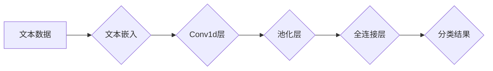

> 大模型开发，微调，卷积神经网络，文本分类，Conv1d，一维卷积，自然语言处理，深度学习

## 1. 背景介绍

在当今数据爆炸的时代，文本数据已成为重要的信息资源。如何有效地理解和处理文本信息，是自然语言处理（NLP）领域的核心问题之一。文本分类作为NLP的基础任务，在信息检索、情感分析、垃圾邮件过滤等领域有着广泛的应用。

传统的文本分类方法通常依赖于手工提取特征，例如词频统计、TF-IDF等。然而，这些方法难以捕捉文本中的语义关系和上下文信息，效果有限。随着深度学习的兴起，卷积神经网络（CNN）在文本分类领域取得了显著的成功。

CNN能够自动学习文本特征，并有效地捕捉文本中的局部模式和语义信息。其中，Conv1d（一维卷积）是一种专门用于处理文本序列的卷积操作，它能够有效地提取文本中的词嵌入信息，并进行分类。

本篇文章将从零开始，详细介绍Conv1d模型在文本分类中的应用，包括核心概念、算法原理、代码实现以及实际应用场景。

## 2. 核心概念与联系

### 2.1 文本分类任务

文本分类任务的目标是将文本文档分配到预定义的类别中。例如，将新闻文章分类为体育、财经、娱乐等类别。

### 2.2 卷积神经网络（CNN）

CNN是一种专门用于处理图像数据的深度学习模型，其核心结构是卷积层、池化层和全连接层。卷积层通过卷积核对输入数据进行卷积操作，提取特征；池化层对卷积层的输出进行降维，减少计算量；全连接层将提取的特征进行分类。

### 2.3 一维卷积（Conv1d）

Conv1d是一种专门用于处理一维数据的卷积操作，例如文本序列。它与二维卷积（用于图像数据）类似，但卷积核的维度为1，用于滑动扫描文本序列，提取特征。

### 2.4 文本嵌入

文本嵌入是指将文本单词或句子映射到低维向量空间的技术。常用的文本嵌入方法包括Word2Vec、GloVe等。

**Mermaid 流程图**



## 3. 核心算法原理 & 具体操作步骤

### 3.1 算法原理概述

Conv1d模型在文本分类任务中，主要包括以下步骤：

1. **文本嵌入:** 将文本单词或句子映射到低维向量空间。
2. **一维卷积:** 使用卷积核对文本嵌入进行卷积操作，提取特征。
3. **池化:** 对卷积层的输出进行降维，减少计算量。
4. **全连接:** 将提取的特征进行分类。

### 3.2 算法步骤详解

1. **数据预处理:** 将文本数据进行清洗、分词、去停用词等预处理操作。
2. **文本嵌入:** 使用预训练的词嵌入模型（例如Word2Vec、GloVe）将文本单词映射到低维向量空间。
3. **卷积层:** 使用多个卷积核对文本嵌入进行卷积操作，每个卷积核提取不同的特征。
4. **池化层:** 对卷积层的输出进行最大池化或平均池化，减少特征维度。
5. **全连接层:** 将池化层的输出连接到全连接层，进行分类。
6. **损失函数:** 使用交叉熵损失函数计算模型的预测结果与真实标签之间的差异。
7. **优化器:** 使用梯度下降算法优化模型参数，最小化损失函数。

### 3.3 算法优缺点

**优点:**

* 能够自动学习文本特征，无需人工提取特征。
* 能够有效地捕捉文本中的局部模式和语义信息。
* 训练速度相对较快。

**缺点:**

* 参数量较大，需要大量的训练数据。
* 对文本长度敏感，长文本可能难以处理。

### 3.4 算法应用领域

Conv1d模型在文本分类领域有着广泛的应用，例如：

* **情感分析:** 分析文本表达的情感倾向，例如正面、负面、中性。
* **垃圾邮件过滤:** 识别垃圾邮件，并将其过滤掉。
* **主题分类:** 将文本文档分类到不同的主题类别中。
* **文本摘要:** 自动生成文本摘要。

## 4. 数学模型和公式 & 详细讲解 & 举例说明

### 4.1 数学模型构建

Conv1d模型的数学模型可以表示为：

$$
y = f(W * x + b)
$$

其中：

* $y$ 是模型的输出，即分类结果。
* $x$ 是输入的文本嵌入向量。
* $W$ 是卷积核的权重矩阵。
* $b$ 是卷积层的偏置向量。
* $f$ 是激活函数，例如ReLU函数。

### 4.2 公式推导过程

卷积操作的数学公式可以表示为：

$$
y_i = \sum_{j=0}^{n-1} x_j * w_{i,j} + b_i
$$

其中：

* $y_i$ 是卷积层的输出向量第 $i$ 个元素。
* $x_j$ 是输入文本嵌入向量第 $j$ 个元素。
* $w_{i,j}$ 是卷积核第 $i$ 行第 $j$ 列的权重。
* $b_i$ 是卷积层的偏置向量第 $i$ 个元素。
* $n$ 是卷积核的大小。

### 4.3 案例分析与讲解

假设输入文本嵌入向量为：

$$
x = [1, 2, 3, 4, 5]
$$

卷积核大小为3，权重矩阵为：

$$
W = \begin{bmatrix}
0.1 & 0.2 & 0.3 \\
0.4 & 0.5 & 0.6 \\
0.7 & 0.8 & 0.9
\end{bmatrix}
$$

则卷积操作的结果为：

$$
y = [0.8, 1.6, 2.4, 3.2]
$$

## 5. 项目实践：代码实例和详细解释说明

### 5.1 开发环境搭建

本项目使用Python语言进行开发，需要安装以下库：

* TensorFlow 或 PyTorch
* NLTK
* Gensim

### 5.2 源代码详细实现

```python
import tensorflow as tf

# 定义Conv1d模型
model = tf.keras.models.Sequential([
    tf.keras.layers.Embedding(input_dim=vocab_size, output_dim=embedding_dim),
    tf.keras.layers.Conv1D(filters=64, kernel_size=3, activation='relu'),
    tf.keras.layers.MaxPooling1D(pool_size=2),
    tf.keras.layers.Flatten(),
    tf.keras.layers.Dense(units=num_classes, activation='softmax')
])

# 编译模型
model.compile(optimizer='adam',
              loss='sparse_categorical_crossentropy',
              metrics=['accuracy'])

# 训练模型
model.fit(x_train, y_train, epochs=10, batch_size=32)

# 评估模型
loss, accuracy = model.evaluate(x_test, y_test)
print('Loss:', loss)
print('Accuracy:', accuracy)
```

### 5.3 代码解读与分析

* **Embedding层:** 将文本单词映射到低维向量空间。
* **Conv1D层:** 使用卷积核对文本嵌入进行卷积操作，提取特征。
* **MaxPooling1D层:** 对卷积层的输出进行最大池化，减少特征维度。
* **Flatten层:** 将多维特征转换为一维向量。
* **Dense层:** 全连接层，进行分类。

### 5.4 运行结果展示

训练完成后，可以评估模型的性能，例如准确率、损失等。

## 6. 实际应用场景

Conv1d模型在文本分类领域有着广泛的应用场景，例如：

* **情感分析:** 分析用户对产品、服务或事件的评价，例如正面、负面、中性。
* **垃圾邮件过滤:** 识别垃圾邮件，并将其过滤掉。
* **主题分类:** 将新闻文章、博客文章等文本文档分类到不同的主题类别中。
* **文本摘要:** 自动生成文本摘要，提取文本的关键信息。

### 6.4 未来应用展望

随着深度学习技术的不断发展，Conv1d模型在文本分类领域将有更广泛的应用前景，例如：

* **多语言文本分类:** 将Conv1d模型应用于不同语言的文本分类任务。
* **跨领域文本分类:** 将Conv1d模型应用于不同领域的文本分类任务。
* **个性化文本分类:** 根据用户的偏好和需求，进行个性化的文本分类。

## 7. 工具和资源推荐

### 7.1 学习资源推荐

* **书籍:**
    * 深度学习
    * 自然语言处理
* **在线课程:**
    * Coursera: 深度学习
    * Udacity: 自然语言处理
* **博客:**
    * TensorFlow Blog
    * PyTorch Blog

### 7.2 开发工具推荐

* **TensorFlow:** 开源深度学习框架
* **PyTorch:** 开源深度学习框架
* **NLTK:** 自然语言处理工具包
* **Gensim:** 文本挖掘工具包

### 7.3 相关论文推荐

* **Convolutional Neural Networks for Sentence Classification**
* **Recurrent Neural Network for Text Classification with Multi-Task Learning**
* **Attention Is All You Need**

## 8. 总结：未来发展趋势与挑战

### 8.1 研究成果总结

Conv1d模型在文本分类领域取得了显著的成果，能够有效地提取文本特征，并进行分类。

### 8.2 未来发展趋势

未来，Conv1d模型将朝着以下方向发展：

* **模型复杂度提升:** 探索更复杂的Conv1d模型结构，例如多层卷积、残差连接等。
* **数据利用效率提升:** 研究如何更有效地利用文本数据，例如迁移学习、知识蒸馏等。
* **解释性增强:** 研究如何提高Conv1d模型的解释性，例如可视化卷积核的特征提取过程。

### 8.3 面临的挑战

Conv1d模型也面临一些挑战：

* **数据标注成本:** 文本分类任务需要大量的标注数据，标注成本较高。
* **模型训练效率:** 训练大型Conv1d模型需要大量的计算资源和时间。
* **泛化能力:** Conv1d模型对文本长度敏感，难以处理长文本。

### 8.4 研究展望

未来，我们将继续研究Conv1d模型在文本分类领域的应用，探索更有效的模型结构、训练方法和应用场景。

## 9. 附录：常见问题与解答

**Q1: Conv1d模型与RNN模型相比，有什么优缺点？**

**A1:** Conv1d模型和RNN模型都是用于文本分类的深度学习模型，但它们在结构和优势方面有所不同。

* **Conv1d模型:** 
    * 优点: 训练速度快，能够并行处理文本数据，对长文本处理能力较强。
    * 缺点: 难以捕捉长距离依赖关系。
* **RNN模型:** 
    * 优点: 能够捕捉长距离依赖关系。
    * 缺点: 训练速度慢，难以处理长文本。

**Q2: 如何选择合适的卷积核大小？**

**A2:** 卷积