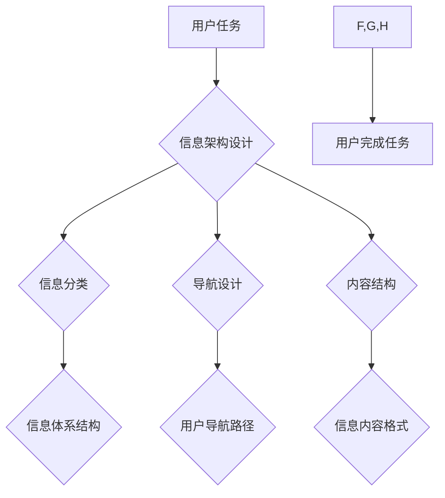

> 任务导向设计，信息架构，用户体验，用户需求，信息组织，导航设计，交互设计

## 1. 背景介绍

在当今信息爆炸的时代，用户每天需要处理海量的数字信息。如何有效地组织、检索和利用这些信息，成为了一个至关重要的挑战。信息架构 (Information Architecture，IA) 作为解决这一问题的关键技术，致力于通过合理地组织和结构化信息，帮助用户轻松找到所需的信息，并提高用户体验。

任务导向设计 (Task-Oriented Design) 是一种以用户任务为中心的設計方法，强调理解用户想要完成的任务，并根据任务需求设计产品和服务。将任务导向设计理念应用于信息架构，可以帮助我们构建更加用户友好、高效的信息系统。

## 2. 核心概念与联系

**2.1 任务导向设计**

任务导向设计的核心思想是将用户视为行动者，关注用户想要完成的具体任务，并根据任务需求设计产品和服务。它强调以下几个关键点：

* **用户任务中心:** 将用户任务作为设计的主要驱动力，深入理解用户的目标、需求和行为模式。
* **流程化设计:** 将用户完成任务的过程分解成一系列具体的步骤，并设计相应的交互流程和界面。
* **迭代优化:** 通过用户测试和反馈，不断迭代优化设计方案，以提高用户体验和任务完成效率。

**2.2 信息架构**

信息架构是指对信息进行组织、结构化和导航的设计。它涉及以下几个关键方面：

* **信息分类:** 将信息按照一定的逻辑和规则进行分类和组织，形成信息体系结构。
* **导航设计:** 设计用户在信息体系中导航和查找信息的路径和方式。
* **内容结构:** 确定信息内容的层次结构、格式和排版，以提高信息的可读性和理解性。

**2.3 任务导向设计与信息架构的联系**

任务导向设计和信息架构是相互关联、相互促进的两个重要概念。

* **信息架构为任务导向设计提供基础:**  信息架构为用户提供了一个清晰、有序的信息空间，帮助用户更容易地找到所需的信息，从而完成任务。
* **任务导向设计指导信息架构的设计:** 通过深入理解用户任务，我们可以更好地设计信息分类、导航和内容结构，以满足用户需求，提高信息架构的有效性和用户体验。

**2.4  Mermaid 流程图**



## 3. 核心算法原理 & 具体操作步骤

**3.1 算法原理概述**

在任务导向设计中，信息架构的构建需要依赖于一些算法和模型，以帮助我们进行信息分类、导航设计和内容结构的优化。

* **聚类算法:** 用于将信息按照相似性进行分组，形成信息类别。常见的聚类算法包括K-means聚类、层次聚类等。
* **路径规划算法:** 用于设计用户在信息体系中导航的路径，例如A*算法、Dijkstra算法等。
* **信息检索算法:** 用于帮助用户快速找到所需的信息，例如TF-IDF算法、BM25算法等。

**3.2 算法步骤详解**

以信息分类为例，使用K-means聚类算法进行信息分类的步骤如下：

1. **数据预处理:** 将待分类的信息进行清洗、格式化和特征提取。
2. **初始化聚类中心:** 随机选择K个数据点作为聚类中心。
3. **计算距离:** 计算每个数据点到每个聚类中心的距离。
4. **分配类别:** 将每个数据点分配到距离最近的聚类中心所属的类别。
5. **更新聚类中心:** 计算每个类别的中心点作为新的聚类中心。
6. **重复步骤3-5:** 直到聚类中心不再发生变化，或者达到预设的迭代次数。

**3.3 算法优缺点**

* **优点:** 
    * 算法简单易实现。
    * 能够有效地将信息按照相似性进行分组。
* **缺点:** 
    * 需要预先设定聚类数量K，选择合适的K值比较困难。
    * 对数据分布的敏感性较高，如果数据分布不均匀，聚类效果可能不理想。

**3.4 算法应用领域**

* **信息检索:** 将搜索结果按照相关性进行排序。
* **推荐系统:** 根据用户的历史行为和偏好，推荐相关的商品或内容。
* **用户画像:** 将用户按照特征进行分组，构建用户画像。

## 4. 数学模型和公式 & 详细讲解 & 举例说明

**4.1 数学模型构建**

在信息架构中，可以使用数学模型来描述信息之间的关系和用户行为模式。例如，可以使用图论模型来表示信息之间的连接关系，可以使用概率模型来描述用户选择信息的概率。

**4.2 公式推导过程**

以信息检索为例，可以使用TF-IDF算法来计算文档的权重。TF-IDF算法的公式如下：

$$TF-IDF(t, d) = TF(t, d) \times IDF(t)$$

其中：

* $TF(t, d)$ 表示词语 $t$ 在文档 $d$ 中的词频。
* $IDF(t)$ 表示词语 $t$ 在整个语料库中的逆向文档频率。

**4.3 案例分析与讲解**

假设我们有一个语料库包含1000个文档，其中包含以下词语：

* "计算机"
* "编程"
* "人工智能"

如果一个文档包含以下内容：

"计算机科学是一门研究计算机的学科，编程是计算机科学的核心内容，人工智能是计算机科学的一个重要分支。"

那么，我们可以使用TF-IDF算法计算每个词语在该文档中的权重：

* $TF("计算机", d) = 2$
* $TF("编程", d) = 1$
* $TF("人工智能", d) = 1$

$IDF("计算机") = log(1000/100) = 2$

$IDF("编程") = log(1000/50) = 1.3$

$IDF("人工智能") = log(1000/20) = 1.6$

因此，该文档中每个词语的TF-IDF权重为：

* $TF-IDF("计算机", d) = 2 \times 2 = 4$
* $TF-IDF("编程", d) = 1 \times 1.3 = 1.3$
* $TF-IDF("人工智能", d) = 1 \times 1.6 = 1.6$

## 5. 项目实践：代码实例和详细解释说明

**5.1 开发环境搭建**

* 操作系统: Ubuntu 20.04
* 编程语言: Python 3.8
* 开发工具: VS Code

**5.2 源代码详细实现**

```python
import nltk
from nltk.corpus import stopwords
from sklearn.feature_extraction.text import TfidfVectorizer

# 下载停用词列表
nltk.download('stopwords')

# 定义文本数据
documents = [
    "计算机科学是一门研究计算机的学科，编程是计算机科学的核心内容，人工智能是计算机科学的一个重要分支。",
    "人工智能可以自动学习和解决问题，它正在改变着我们的生活。",
    "编程是一门需要逻辑思维和创造力的技能。"
]

# 创建TF-IDF向量化器
vectorizer = TfidfVectorizer(stop_words=stopwords.words('english'))

# 将文本数据转换为TF-IDF矩阵
tfidf_matrix = vectorizer.fit_transform(documents)

# 打印TF-IDF矩阵
print(tfidf_matrix.toarray())
```

**5.3 代码解读与分析**

* 首先，我们使用NLTK库下载停用词列表，并创建TF-IDF向量化器。
* 然后，我们将文本数据转换为TF-IDF矩阵。
* 最后，我们打印TF-IDF矩阵，可以看到每个词语在每个文档中的权重。

**5.4 运行结果展示**

运行上述代码后，会输出一个TF-IDF矩阵，其中每个元素代表一个词语在某个文档中的权重。

## 6. 实际应用场景

**6.1 网站信息架构**

在网站设计中，任务导向设计和信息架构可以帮助我们构建更加用户友好的网站结构。例如，我们可以根据用户的搜索习惯和浏览行为，设计合理的导航菜单和分类体系，帮助用户快速找到所需的信息。

**6.2 移动应用信息架构**

在移动应用设计中，由于屏幕空间有限，信息架构的设计尤为重要。我们可以根据用户的任务需求，设计简洁明了的界面，并使用卡片式布局、滑动导航等交互方式，提高用户体验。

**6.3 数据可视化**

在数据可视化中，信息架构可以帮助我们将复杂的数据信息进行有效地组织和呈现。我们可以根据数据的类型和用户需求，选择合适的图表类型和布局方式，使数据更加直观易懂。

**6.4 未来应用展望**

随着人工智能技术的不断发展，任务导向设计和信息架构将更加智能化和个性化。例如，我们可以利用机器学习算法，根据用户的行为数据，个性化定制信息架构，提供更加精准的推荐和服务。

## 7. 工具和资源推荐

**7.1 学习资源推荐**

* **书籍:**
    * 《信息架构》 by Peter Morville
    * 《用户体验》 by Steve Krug
* **在线课程:**
    * Coursera: Information Architecture Specialization
    * Udemy: Information Architecture for Beginners

**7.2 开发工具推荐**

* **信息架构工具:**
    * Miro
    * Figma
    * Balsamiq
* **数据可视化工具:**
    * Tableau
    * Power BI
    * D3.js

**7.3 相关论文推荐**

* **任务导向设计:**
    * Nielsen, J. (1993). Usability engineering.
* **信息架构:**
    * Morville, P., & Rosenfeld, L. (2006). Information architecture for the World Wide Web.

## 8. 总结：未来发展趋势与挑战

**8.1 研究成果总结**

任务导向设计和信息架构已经取得了显著的成果，帮助我们构建更加用户友好、高效的信息系统。

**8.2 未来发展趋势**

* **智能化:** 利用人工智能技术，实现信息架构的智能化设计和个性化定制。
* **跨平台:** 将信息架构应用于各种平台，包括网站、移动应用、物联网等。
* **可持续性:** 关注信息架构的可持续发展，例如信息的可访问性和可维护性。

**8.3 面临的挑战**

* **数据获取和分析:** 需要获取大量用户行为数据，并进行有效的分析和挖掘。
* **算法模型的改进:** 需要不断改进算法模型，提高信息架构的准确性和效率。
* **跨学科合作:** 需要加强信息架构与其他学科的合作，例如心理学、计算机科学等。

**8.4 研究展望**

未来，我们将继续深入研究任务导向设计和信息架构，探索其在更多领域和场景中的应用，并致力于构建更加智能、高效、用户友好的信息系统。

## 9. 附录：常见问题与解答

**9.1 如何确定信息架构的层次结构？**

信息架构的层次结构应该根据用户任务和信息内容的特点进行设计。可以使用用户调研、卡片排序等方法，确定信息分类的层次和关系。

**9.2 如何设计用户友好的导航菜单？**

导航菜单应该清晰、简洁、易于理解。可以使用面包屑导航、搜索功能等方式，帮助用户快速找到所需的信息。

**9.3 如何评估信息架构的有效性？**

可以使用用户测试、网站分析等方法，评估信息架构的有效性。例如，可以测量用户完成任务的时间、错误率、满意度等指标。


作者：禅与计算机程序设计艺术