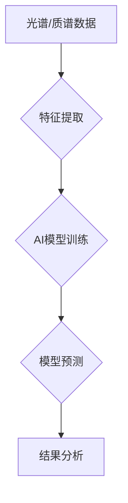

> 光谱技术, 质谱技术, AI, 机器学习, 数据分析, 预测建模, 化学识别, 生物医学

## 1. 背景介绍

随着人工智能 (AI) 技术的飞速发展，数据分析和预测建模已成为许多领域的关键应用。光谱和质谱技术作为强大的分析工具，能够提供丰富的物质结构和组成信息，为AI算法的训练和应用提供了宝贵的资源。

光谱技术通过分析物质对特定波长的光的吸收、发射或散射特性，来识别和定量物质的组成。质谱技术则通过测量物质离子在磁场或电场中的运动轨迹，来确定物质的分子量和结构。

将光谱和质谱技术与AI相结合，可以实现更精准、更智能的数据分析和预测建模。例如，在化学领域，可以利用光谱和质谱数据训练AI模型，识别未知化合物，预测化学反应结果；在生物医学领域，可以利用光谱和质谱数据训练AI模型，诊断疾病，监测药物疗效。

## 2. 核心概念与联系

光谱和质谱技术为AI提供了丰富的特征数据，这些数据可以用于训练机器学习模型，实现各种应用。

**2.1 光谱技术与AI**

光谱技术可以提供物质的吸收、发射或散射特性，这些特性可以作为AI模型的输入特征。例如，在化学领域，可以利用红外光谱、核磁共振光谱等技术获取物质的结构信息，并将其作为AI模型的输入特征，用于识别未知化合物。

**2.2 质谱技术与AI**

质谱技术可以提供物质的分子量和结构信息，这些信息可以作为AI模型的输入特征。例如，在生物医学领域，可以利用质谱技术分析血液样本中的蛋白质组，并将其作为AI模型的输入特征，用于诊断疾病。

**2.3 AI模型与光谱/质谱数据**

AI模型可以利用光谱和质谱数据进行训练，学习物质的特征和规律。常见的AI模型包括：

* **支持向量机 (SVM)**：用于分类和回归任务。
* **决策树 (Decision Tree)**：用于分类任务。
* **随机森林 (Random Forest)**：用于分类和回归任务。
* **神经网络 (Neural Network)**：用于复杂模式识别和预测任务。

**Mermaid 流程图**



## 3. 核心算法原理 & 具体操作步骤

### 3.1  算法原理概述

光谱和质谱数据分析的算法原理主要基于以下几个方面：

* **特征提取**: 从光谱和质谱数据中提取具有代表性的特征，例如峰值位置、峰值强度、峰形等。
* **数据预处理**: 对提取的特征进行预处理，例如归一化、标准化等，以提高模型的训练效果。
* **模型训练**: 利用训练数据和提取的特征，训练AI模型，学习物质的特征和规律。
* **模型预测**: 将训练好的模型应用于新的数据，进行预测。

### 3.2  算法步骤详解

**3.2.1 光谱数据分析算法步骤**

1. **数据采集**: 使用光谱仪采集物质的光谱数据。
2. **数据预处理**: 对光谱数据进行平滑、去噪等处理，去除干扰信号。
3. **特征提取**: 从光谱数据中提取特征，例如峰值位置、峰值强度、峰形等。
4. **模型训练**: 利用提取的特征和已知物质信息，训练AI模型。
5. **模型预测**: 将训练好的模型应用于新的光谱数据，预测物质的组成和结构。

**3.2.2 质谱数据分析算法步骤**

1. **数据采集**: 使用质谱仪采集物质的质谱数据。
2. **数据预处理**: 对质谱数据进行去噪、基线校正等处理，去除干扰信号。
3. **特征提取**: 从质谱数据中提取特征，例如峰值位置、峰值强度、峰形等。
4. **模型训练**: 利用提取的特征和已知物质信息，训练AI模型。
5. **模型预测**: 将训练好的模型应用于新的质谱数据，预测物质的分子量和结构。

### 3.3  算法优缺点

**优点**:

* **高精度**: 光谱和质谱技术能够提供高精度的物质信息。
* **自动化**: AI算法可以自动化分析光谱和质谱数据，提高效率。
* **可扩展性**: AI模型可以应用于多种类型的物质和应用场景。

**缺点**:

* **数据依赖**: AI模型的性能取决于训练数据的质量和数量。
* **计算资源**: 训练复杂的AI模型需要大量的计算资源。
* **解释性**: 一些AI模型的决策过程难以解释。

### 3.4  算法应用领域

光谱和质谱技术与AI相结合，在多个领域都有广泛的应用，例如：

* **化学**: 化合物识别、反应预测、药物发现。
* **生物医学**: 疾病诊断、药物疗效监测、蛋白质组学研究。
* **环境科学**: 污染物检测、环境监测。
* **食品安全**: 食品成分分析、食品安全检测。

## 4. 数学模型和公式 & 详细讲解 & 举例说明

### 4.1  数学模型构建

光谱和质谱数据分析的数学模型通常基于以下几个方面：

* **特征提取**: 使用数学函数或算法提取光谱和质谱数据的特征，例如傅里叶变换、主成分分析等。
* **回归模型**: 使用线性回归、逻辑回归等模型预测物质的组成或结构。
* **分类模型**: 使用支持向量机、决策树等模型对物质进行分类。

### 4.2  公式推导过程

例如，使用线性回归模型预测物质的浓度，其数学模型可以表示为：

$$
C = aX + b
$$

其中：

* $C$ 是物质的浓度。
* $X$ 是光谱或质谱数据的特征值。
* $a$ 和 $b$ 是模型的参数。

通过最小化模型误差，可以求解出 $a$ 和 $b$ 的值。

### 4.3  案例分析与讲解

例如，可以使用线性回归模型预测红外光谱数据中物质的浓度。

假设我们收集了不同浓度的物质的红外光谱数据，并提取了光谱数据中的特征值，例如峰值强度。

我们可以使用这些数据训练一个线性回归模型，预测未知浓度的物质的浓度。

## 5. 项目实践：代码实例和详细解释说明

### 5.1  开发环境搭建

本项目使用 Python 语言进行开发，需要安装以下软件包：

* NumPy
* Pandas
* Scikit-learn
* Matplotlib

### 5.2  源代码详细实现

```python
import numpy as np
from sklearn.linear_model import LinearRegression
from sklearn.model_selection import train_test_split
import matplotlib.pyplot as plt

# 准备数据
X = np.array([[1], [2], [3], [4], [5]])  # 光谱数据特征值
y = np.array([2, 4, 6, 8, 10])  # 物质浓度

# 将数据分成训练集和测试集
X_train, X_test, y_train, y_test = train_test_split(X, y, test_size=0.2)

# 创建线性回归模型
model = LinearRegression()

# 训练模型
model.fit(X_train, y_train)

# 预测测试集数据
y_pred = model.predict(X_test)

# 绘制预测结果
plt.scatter(X_test, y_test, label='真实值')
plt.plot(X_test, y_pred, color='red', label='预测值')
plt.xlabel('光谱数据特征值')
plt.ylabel('物质浓度')
plt.legend()
plt.show()
```

### 5.3  代码解读与分析

这段代码首先准备了光谱数据特征值和物质浓度数据。然后，将数据分成训练集和测试集。

接下来，创建了一个线性回归模型，并使用训练集数据训练模型。

最后，使用训练好的模型预测测试集数据的物质浓度，并绘制预测结果图。

### 5.4  运行结果展示

运行代码后，会生成一个散点图，其中真实值和预测值都显示在图中。

如果模型训练成功，预测值应该与真实值相近。

## 6. 实际应用场景

### 6.1  化学领域

* **化合物识别**: 利用光谱和质谱数据训练AI模型，识别未知化合物。
* **反应预测**: 利用光谱和质谱数据预测化学反应的结果，例如产物类型和产率。
* **药物发现**: 利用光谱和质谱数据筛选潜在的药物候选物。

### 6.2  生物医学领域

* **疾病诊断**: 利用质谱数据分析血液样本中的蛋白质组，诊断疾病。
* **药物疗效监测**: 利用光谱和质谱数据监测药物的疗效，调整用药方案。
* **蛋白质组学研究**: 利用质谱数据分析蛋白质的结构和功能。

### 6.3  环境科学领域

* **污染物检测**: 利用光谱和质谱数据检测环境中的污染物。
* **环境监测**: 利用光谱和质谱数据监测环境的变化，例如空气质量、水质等。

### 6.4  未来应用展望

随着AI技术的不断发展，光谱和质谱技术与AI的结合将有更广泛的应用前景，例如：

* **个性化医疗**: 利用光谱和质谱数据分析个体差异，提供个性化的医疗方案。
* **精准农业**: 利用光谱和质谱数据分析土壤和作物状况，提高农业生产效率。
* **智能制造**: 利用光谱和质谱数据进行材料检测和质量控制，提高制造效率。

## 7. 工具和资源推荐

### 7.1  学习资源推荐

* **书籍**:
    * "Machine Learning for Chemists" by  David J. C. MacKay
    * "Pattern Recognition and Machine Learning" by Christopher M. Bishop
* **在线课程**:
    * Coursera: Machine Learning
    * edX: Artificial Intelligence

### 7.2  开发工具推荐

* **Python**: 广泛用于数据分析和机器学习。
* **NumPy**: 用于数值计算。
* **Pandas**: 用于数据处理和分析。
* **Scikit-learn**: 用于机器学习算法。
* **Matplotlib**: 用于数据可视化。

### 7.3  相关论文推荐

* "Deep Learning for Spectroscopy" by  A. J. Bell et al.
* "Applications of Machine Learning in Mass Spectrometry" by  J. R. Smith et al.

## 8. 总结：未来发展趋势与挑战

### 8.1  研究成果总结

光谱和质谱技术与AI的结合取得了显著成果，在化学、生物医学、环境科学等领域都有广泛的应用。

### 8.2  未来发展趋势

未来，光谱和质谱技术与AI的结合将朝着以下方向发展：

* **更深层次的AI模型**: 使用更复杂的AI模型，例如深度学习模型，提高分析精度和效率。
* **更广泛的应用场景**: 将光谱和质谱技术与AI结合，应用于更多领域，例如个性化医疗、精准农业等。
* **更智能的分析系统**: 开发更智能的分析系统，能够自动识别物质、预测反应结果等。

### 8.3  面临的挑战

光谱和质谱技术与AI的结合也面临一些挑战：

* **数据质量**: AI模型的性能取决于训练数据的质量和数量。
* **算法解释性**: 一些AI模型的决策过程难以解释，这可能会影响其应用。
* **计算资源**: 训练复杂的AI模型需要大量的计算资源。

