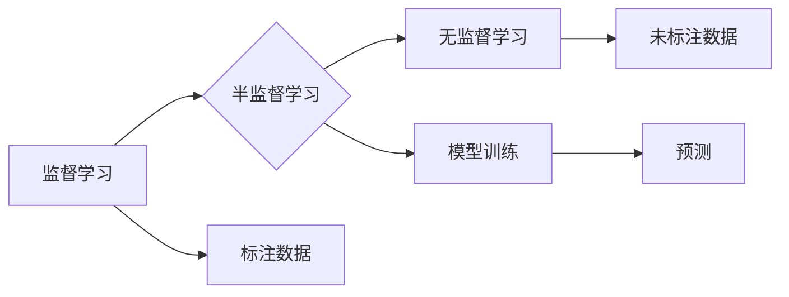

> 半监督学习、监督学习、无监督学习、标签扩增、图模型、迁移学习、代码实例、深度学习

## 1. 背景介绍

在机器学习领域，训练模型通常需要大量的标注数据。然而，获取高质量标注数据往往成本高昂且耗时费力。半监督学习 (Semi-Supervised Learning) 应运而生，它利用少量标注数据和大量未标注数据来训练模型，从而降低对标注数据的依赖。

半监督学习在图像识别、自然语言处理、语音识别等领域取得了显著成果，成为机器学习研究的热点方向之一。

## 2. 核心概念与联系

半监督学习的核心思想是利用未标注数据的结构信息和模式来辅助标注数据的学习。

**核心概念：**

* **监督学习 (Supervised Learning):** 利用标注数据训练模型，模型学习输入与输出之间的映射关系。
* **无监督学习 (Unsupervised Learning):** 利用未标注数据学习数据的内在结构和模式，例如聚类、降维等。
* **半监督学习 (Semi-Supervised Learning):** 利用少量标注数据和大量未标注数据训练模型，结合监督和无监督学习的优势。

**架构图：**



## 3. 核心算法原理 & 具体操作步骤

### 3.1  算法原理概述

半监督学习算法通常分为两类：

* **基于图模型的算法:** 将数据点表示为图中的节点，利用节点之间的连接关系来学习数据的结构信息。
* **基于概率模型的算法:** 利用概率模型来学习数据分布，并利用未标注数据的概率分布信息来辅助标注数据的学习。

### 3.2  算法步骤详解

以基于图模型的算法为例，其具体步骤如下：

1. **构建图模型:** 将数据点表示为图中的节点，节点之间的连接关系可以根据数据之间的相似度或相关性来确定。
2. **传播标签:** 利用图模型的结构信息，将已知的标签信息传播到未标注的数据点。
3. **训练模型:** 利用传播后的标签信息和原始的标注数据来训练模型。

### 3.3  算法优缺点

**优点:**

* 可以利用未标注数据的丰富信息，提高模型的泛化能力。
* 相比于完全监督学习，可以降低对标注数据的依赖。

**缺点:**

* 算法的性能依赖于图模型的构建和标签传播策略。
* 对于噪声数据或不完整的数据集，算法的性能可能会下降。

### 3.4  算法应用领域

半监督学习算法广泛应用于以下领域:

* **图像识别:** 利用少量标注图像和大量未标注图像来训练图像分类模型。
* **自然语言处理:** 利用少量标注文本和大量未标注文本来训练文本分类、情感分析等模型。
* **语音识别:** 利用少量标注语音数据和大量未标注语音数据来训练语音识别模型。

## 4. 数学模型和公式 & 详细讲解 & 举例说明

### 4.1  数学模型构建

假设我们有 $N$ 个数据点，其中 $M$ 个数据点被标注，$N-M$ 个数据点未标注。

* $x_i$ 表示第 $i$ 个数据点。
* $y_i$ 表示第 $i$ 个数据点的标签。
* $f(x_i)$ 表示模型对第 $i$ 个数据点的预测标签。

我们的目标是找到一个函数 $f(x)$，使得 $f(x_i)$ 与 $y_i$ 的差异最小。

### 4.2  公式推导过程

我们可以使用以下损失函数来衡量模型的预测误差：

$$
L(f) = \sum_{i=1}^{M} L_{i}(f(x_i), y_i) + \lambda \sum_{i=1}^{N} L_{u}(f(x_i))
$$

其中：

* $L_{i}(f(x_i), y_i)$ 是第 $i$ 个标注数据点的损失函数。
* $L_{u}(f(x_i))$ 是第 $i$ 个未标注数据点的损失函数。
* $\lambda$ 是一个权重参数，用于平衡标注数据和未标注数据的贡献。

### 4.3  案例分析与讲解

例如，我们可以使用交叉熵损失函数来衡量分类任务的预测误差：

$$
L_{i}(f(x_i), y_i) = -y_i \log(f(x_i)) - (1-y_i) \log(1-f(x_i))
$$

对于未标注数据点，我们可以使用以下损失函数来鼓励模型预测概率分布的平滑性：

$$
L_{u}(f(x_i)) = -\sum_{j=1}^{K} p(j|x_i) \log(p(j|x_i))
$$

其中 $K$ 是类别数，$p(j|x_i)$ 是模型预测第 $i$ 个数据点属于第 $j$ 个类别的概率。

## 5. 项目实践：代码实例和详细解释说明

### 5.1  开发环境搭建

* Python 3.6+
* TensorFlow 2.0+
* PyTorch 1.0+

### 5.2  源代码详细实现

```python
import tensorflow as tf

# 定义模型
class SemiSupervisedModel(tf.keras.Model):
    def __init__(self, num_classes):
        super(SemiSupervisedModel, self).__init__()
        self.layers = tf.keras.Sequential([
            tf.keras.layers.Dense(128, activation='relu'),
            tf.keras.layers.Dense(num_classes, activation='softmax')
        ])

    def call(self, x):
        return self.layers(x)

# 定义损失函数
def semi_supervised_loss(y_true, y_pred, unlabeled_data):
    # 计算标注数据损失
    labeled_loss = tf.keras.losses.categorical_crossentropy(y_true, y_pred)
    # 计算未标注数据损失
    unlabeled_loss = tf.keras.losses.KLDivergence()(tf.one_hot(y_true, depth=num_classes), y_pred)
    # 结合标注数据和未标注数据损失
    total_loss = labeled_loss + unlabeled_loss * 0.1
    return total_loss

# 训练模型
model = SemiSupervisedModel(num_classes=10)
optimizer = tf.keras.optimizers.Adam()
# ... 训练代码 ...

```

### 5.3  代码解读与分析

* 我们定义了一个半监督学习模型 `SemiSupervisedModel`，它包含一个简单的全连接神经网络。
* 我们定义了一个半监督损失函数 `semi_supervised_loss`，它结合了标注数据和未标注数据的损失。
* 训练代码中，我们将使用标注数据和未标注数据来训练模型。

### 5.4  运行结果展示

* 训练完成后，我们可以使用模型对新的数据进行预测。
* 我们还可以评估模型的性能，例如使用准确率、召回率等指标。

## 6. 实际应用场景

半监督学习在许多实际应用场景中取得了成功，例如：

* **图像识别:** 利用少量标注图像和大量未标注图像来训练图像分类模型，例如识别物体、场景、人物等。
* **自然语言处理:** 利用少量标注文本和大量未标注文本来训练文本分类、情感分析、机器翻译等模型。
* **语音识别:** 利用少量标注语音数据和大量未标注语音数据来训练语音识别模型，例如语音转文本、语音助手等。

### 6.4  未来应用展望

随着数据量的不断增长和算法的不断改进，半监督学习将在未来发挥更加重要的作用。

## 7. 工具和资源推荐

### 7.1  学习资源推荐

* **书籍:**
    * 半监督学习 (Semi-Supervised Learning) -  Christopher M. Bishop
    * Pattern Recognition and Machine Learning - Christopher M. Bishop
* **论文:**
    * Semi-Supervised Learning -  Andrew Ng
    * Large-Scale Semi-Supervised Learning -  Pascal Vincent

### 7.2  开发工具推荐

* **TensorFlow:** https://www.tensorflow.org/
* **PyTorch:** https://pytorch.org/

### 7.3  相关论文推荐

* **Semi-Supervised Learning with Graph Convolutional Networks**
* **Self-Training with an Ensemble of Learners**
* **Co-Training**

## 8. 总结：未来发展趋势与挑战

### 8.1  研究成果总结

半监督学习取得了显著的进展，在许多领域取得了成功应用。

### 8.2  未来发展趋势

* **迁移学习:** 利用预训练模型和少量标注数据来训练新的模型。
* **主动学习:** 选择最能帮助模型学习的数据点进行标注。
* **联邦学习:** 在分布式数据环境下进行半监督学习。

### 8.3  面临的挑战

* 如何更好地利用未标注数据的结构信息。
* 如何设计更有效的半监督学习算法。
* 如何解决半监督学习算法的泛化能力问题。

### 8.4  研究展望

半监督学习是一个充满挑战和机遇的领域，未来将会有更多的研究成果涌现，推动半监督学习技术的发展。

## 9. 附录：常见问题与解答

* **什么是半监督学习？**

半监督学习是一种机器学习方法，它利用少量标注数据和大量未标注数据来训练模型。

* **半监督学习的优势是什么？**

半监督学习可以利用未标注数据的丰富信息，提高模型的泛化能力，并降低对标注数据的依赖。

* **半监督学习有哪些应用场景？**

半监督学习广泛应用于图像识别、自然语言处理、语音识别等领域。


作者：禅与计算机程序设计艺术 / Zen and the Art of Computer Programming<end_of_turn>