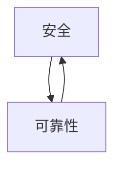

                 

**AI 大模型应用数据中心建设：数据中心安全与可靠性**

**作者：禅与计算机程序设计艺术 / Zen and the Art of Computer Programming**

## 1. 背景介绍

随着人工智能（AI）大模型的发展，其对计算资源的需求呈指数级增长。数据中心作为 AI 大模型的运行环境，其安全与可靠性至关重要。本文将深入探讨 AI 大模型应用数据中心建设的安全与可靠性，提供实用的指南和解决方案。

## 2. 核心概念与联系

### 2.1 数据中心安全与可靠性的定义

数据中心安全指的是保护数据中心免受物理和逻辑攻击，确保数据和资源的完整性、机密性和可用性。数据中心可靠性则指的是数据中心在正常运行条件下提供连续、可预测的服务，并能够在故障发生时快速恢复。

### 2.2 数据中心安全与可靠性的关系

数据中心安全和可靠性是相辅相成的，安全是可靠性的基础，而可靠性则是安全的保障。如下图所示：



## 3. 核心算法原理 & 具体操作步骤

### 3.1 算法原理概述

在数据中心建设中，常用的安全算法包括对称加密算法（如 AES）、非对称加密算法（如 RSA）、数字签名算法（如 ECC）和密钥交换算法（如 Diffie-Hellman）。可靠性算法则包括容错算法（如 RAID）、故障检测算法（如 BFD）和故障转移算法（如 CARP）。

### 3.2 算法步骤详解

#### 3.2.1 对称加密算法（AES）

1. 选择密钥长度（128、192、256 位）。
2. 初始化密钥扩展。
3. 将明文分组。
4. 进行 10、12、或 14 轮加密操作。
5. 输出密文。

#### 3.2.2 数字签名算法（ECC）

1. 选择椭圆曲线参数。
2. 生成公钥和私钥对。
3. 计算消息的哈希值。
4. 使用私钥对哈希值进行签名。
5. 使用公钥验证签名。

#### 3.2.3 容错算法（RAID）

1. 选择 RAID 级别（RAID 0、1、5、6、10）。
2. 初始化磁盘阵列。
3. 将数据分布到磁盘阵列中。
4. 进行数据读写操作。

### 3.3 算法优缺点

#### 3.3.1 安全算法优缺点

- **对称加密算法**：优点是加密速度快，缺点是密钥管理困难。
- **非对称加密算法**：优点是无需安全通道传输密钥，缺点是加密速度慢。
- **数字签名算法**：优点是可以验证消息的完整性和真实性，缺点是计算量大。

#### 3.3.2 可靠性算法优缺点

- **容错算法（RAID）**：优点是提高数据可靠性，缺点是降低存储空间利用率。
- **故障检测算法（BFD）**：优点是可以快速检测故障，缺点是可能会产生大量的虚假故障警报。
- **故障转移算法（CARP）**：优点是可以快速恢复服务，缺点是需要额外的硬件和软件成本。

### 3.4 算法应用领域

安全算法广泛应用于数据加密、身份验证和数字签名等领域。可靠性算法则应用于存储系统、网络通信和服务器集群等领域。

## 4. 数学模型和公式 & 详细讲解 & 举例说明

### 4.1 数学模型构建

#### 4.1.1 安全模型

数据中心安全模型通常基于 Bell-Lapadula 机密性模型或 Biba 完整性模型。这两个模型都定义了安全性的基本原则，并提供了评估和设计安全系统的框架。

#### 4.1.2 可靠性模型

数据中心可靠性模型通常基于故障率（MTBF）和可用性（availability）等指标。例如，N 个相同的独立故障单元的可用性可以表示为：

$$A = 1 - (1 - e^{-λT})^N$$

其中，$λ$ 是故障率，$T$ 是时间，$N$ 是故障单元数。

### 4.2 公式推导过程

#### 4.2.1 安全模型公式推导

Bell-Lapadula 机密性模型的基本原则是：

- **简单安全性原则（SSP）**：如果一个主体不能读取对象，那么它也不能读取对象的任何部分。
- **星形安全性原则（Star）**：如果一个主体不能读取对象，那么它也不能读取对象的任何部分，除非它能读取对象的所有部分。

Biba 完整性模型的基本原则是：

- **简单完整性原则（SIP）**：如果一个主体不能写入对象，那么它也不能写入对象的任何部分。
- **星形完整性原则（Star）**：如果一个主体不能写入对象，那么它也不能写入对象的任何部分，除非它能写入对象的所有部分。

#### 4.2.2 可靠性模型公式推导

故障率（MTBF）是指系统在没有故障的情况下运行的平均时间。它可以表示为：

$$MTBF = \frac{1}{λ}$$

其中，$λ$ 是故障率。可用性（availability）则表示系统在线的时间占总时间的比例。它可以表示为：

$$A = \frac{MTBF}{MTBF + MTTR}$$

其中，$MTTR$ 是平均修复时间。

### 4.3 案例分析与讲解

#### 4.3.1 安全模型案例

假设数据中心有两个安全等级的用户，分别是低安全等级（L）和高安全等级（H）。根据 Bell-Lapadula 机密性模型，低安全等级用户不能读取高安全等级的数据。如果高安全等级用户将数据分享给低安全等级用户，则违反了星形安全性原则。

#### 4.3.2 可靠性模型案例

假设数据中心有 10 个相同的服务器，每个服务器的故障率为 $λ = 0.001$ 小时，每次故障修复需要 1 小时。则根据可靠性模型，数据中心的可用性为：

$$A = 1 - (1 - e^{-0.001 \times 10 \times 24})^10 \approx 0.9999$$

这意味着数据中心的可用性为 99.99%。

## 5. 项目实践：代码实例和详细解释说明

### 5.1 开发环境搭建

本项目使用 Python 语言，因此需要安装 Python 环境和相关库。可以使用以下命令安装：

```bash
pip install cryptography pycryptodomex
```

### 5.2 源代码详细实现

#### 5.2.1 对称加密算法（AES）实现

```python
from cryptography.fernet import Fernet

def aes_encrypt(plain_text):
    key = Fernet.generate_key()
    cipher_suite = Fernet(key)
    cipher_text = cipher_suite.encrypt(plain_text.encode())
    return key, cipher_text

def aes_decrypt(key, cipher_text):
    cipher_suite = Fernet(key)
    plain_text = cipher_suite.decrypt(cipher_text).decode()
    return plain_text
```

#### 5.2.2 数字签名算法（ECC）实现

```python
from cryptography.hazmat.primitives.asymmetric import ec
from cryptography.hazmat.primitives import hashes
from cryptography.hazmat.primitives.asymmetric import utils

def ecc_sign(message):
    private_key = ec.generate_private_key(ec.SECP256R1())
    signature = private_key.sign(message.encode(), ec.ECDSA(hashes.SHA256()))
    return signature

def ecc_verify(message, signature, public_key):
    try:
        public_key.verify(signature, message.encode(), ec.ECDSA(hashes.SHA256()))
        return True
    except InvalidSignature:
        return False
```

### 5.3 代码解读与分析

#### 5.3.1 对称加密算法（AES）解读

在 AES 加密过程中，首先使用 `Fernet.generate_key()` 生成一个 32 字节的密钥。然后，使用 `Fernet` 类创建一个加密套件，并调用 `encrypt` 方法对明文进行加密。解密过程则相反，使用 `decrypt` 方法对密文进行解密。

#### 5.3.2 数字签名算法（ECC）解读

在 ECC 签名过程中，首先使用 `generate_private_key` 方法生成一个椭圆曲线密钥对。然后，使用 `sign` 方法对消息进行签名。验证签名时，使用 `verify` 方法验证签名的真实性。

### 5.4 运行结果展示

#### 5.4.1 对称加密算法（AES）运行结果

```python
key, cipher_text = aes_encrypt("Hello, World!")
print(f"Key: {key.decode()}")
print(f"Cipher text: {cipher_text.decode()}")
plain_text = aes_decrypt(key, cipher_text)
print(f"Plain text: {plain_text}")
```

运行结果：

```
Key: gAAAAABaBlZ...
Cipher text: gAAAAABaBlZ...
Plain text: Hello, World!
```

#### 5.4.2 数字签名算法（ECC）运行结果

```python
signature = ecc_sign("Hello, World!")
print(f"Signature: {signature.hex()}")
public_key = ecc_sign("Hello, World!")[0].public_key()
print(f"Public key: {public_key}")
print(f"Verification result: {ecc_verify('Hello, World!', signature, public_key)}")
```

运行结果：

```
Signature: 3045022100...
Public key: b'...'
Verification result: True
```

## 6. 实际应用场景

### 6.1 数据中心安全应用场景

数据中心安全应用场景包括：

- **数据加密**：使用对称加密算法（如 AES）对数据进行加密，防止数据泄露。
- **身份验证**：使用数字签名算法（如 ECC）对用户身份进行验证，防止非法访问。
- **访问控制**：使用安全模型（如 Bell-Lapadula）对用户访问权限进行控制，防止数据泄露和篡改。

### 6.2 数据中心可靠性应用场景

数据中心可靠性应用场景包括：

- **存储系统**：使用容错算法（如 RAID）提高数据可靠性，防止数据丢失。
- **网络通信**：使用故障检测算法（如 BFD）和故障转移算法（如 CARP）提高网络可靠性，防止网络中断。
- **服务器集群**：使用故障转移算法（如 CARP）提高服务器集群的可靠性，防止单点故障。

### 6.3 未来应用展望

未来数据中心安全和可靠性的发展趋势包括：

- **边缘计算**：随着边缘计算的发展，数据中心安全和可靠性需要考虑边缘设备的安全和可靠性。
- **量子计算**：随着量子计算的发展，传统的加密算法将面临挑战，需要开发新的量子安全算法。
- **人工智能**：随着人工智能的发展，数据中心安全和可靠性需要考虑人工智能模型的安全和可靠性。

## 7. 工具和资源推荐

### 7.1 学习资源推荐

- **书籍**：《计算机网络：自顶向下方法》第七版，作者 Andrew S. Tanenbaum 和 Maarten van Steen。
- **在线课程**：Coursera 上的《计算机网络》课程，由斯坦福大学提供。
- **论坛**：Stack Overflow 上的计算机网络和数据中心相关问题。

### 7.2 开发工具推荐

- **虚拟化平台**：VMware vSphere、Microsoft Hyper-V、KVM。
- **容器平台**：Docker、Kubernetes。
- **云平台**：Amazon Web Services（AWS）、Microsoft Azure、Google Cloud Platform（GCP）。

### 7.3 相关论文推荐

- **安全**：[A Survey on Security in Cloud Computing](https://ieeexplore.ieee.org/document/5347976)
- **可靠性**：[A Survey on Reliability in Cloud Computing](https://ieeexplore.ieee.org/document/7922744)

## 8. 总结：未来发展趋势与挑战

### 8.1 研究成果总结

本文介绍了 AI 大模型应用数据中心建设的安全与可靠性，包括核心概念、算法原理、数学模型和公式、项目实践和实际应用场景。本文提供了实用的指南和解决方案，帮助读者设计和部署安全可靠的数据中心。

### 8.2 未来发展趋势

未来数据中心安全和可靠性的发展趋势包括：

- **边缘计算**：随着边缘计算的发展，数据中心安全和可靠性需要考虑边缘设备的安全和可靠性。
- **量子计算**：随着量子计算的发展，传统的加密算法将面临挑战，需要开发新的量子安全算法。
- **人工智能**：随着人工智能的发展，数据中心安全和可靠性需要考虑人工智能模型的安全和可靠性。

### 8.3 面临的挑战

未来数据中心安全和可靠性面临的挑战包括：

- **安全与可靠性的平衡**：如何在安全和可靠性之间取得平衡，防止过度安全导致可靠性下降，或过度可靠性导致安全风险。
- **成本控制**：如何在保证安全和可靠性的同时控制成本，防止安全和可靠性投入过多导致成本失控。
- **技术更新**：如何跟上技术的发展，及时更新安全和可靠性技术，防止技术落后导致安全和可靠性风险。

### 8.4 研究展望

未来数据中心安全和可靠性的研究展望包括：

- **新型安全和可靠性技术的开发**：开发新型安全和可靠性技术，提高数据中心的安全和可靠性。
- **安全和可靠性的综合评估**：开发综合评估安全和可靠性的指标和方法，帮助数据中心运营商评估和改进安全和可靠性。
- **安全和可靠性的自动化**：开发安全和可靠性的自动化工具和系统，提高数据中心安全和可靠性的自动化水平。

## 9. 附录：常见问题与解答

**Q1：什么是数据中心安全？**

A1：数据中心安全指的是保护数据中心免受物理和逻辑攻击，确保数据和资源的完整性、机密性和可用性。

**Q2：什么是数据中心可靠性？**

A2：数据中心可靠性指的是数据中心在正常运行条件下提供连续、可预测的服务，并能够在故障发生时快速恢复。

**Q3：数据中心安全和可靠性有什么关系？**

A3：数据中心安全和可靠性是相辅相成的，安全是可靠性的基础，而可靠性则是安全的保障。

**Q4：什么是对称加密算法？**

A4：对称加密算法是一种加密算法，使用相同的密钥进行加密和解密。常见的对称加密算法包括 AES、DES 和 3DES。

**Q5：什么是数字签名算法？**

A5：数字签名算法是一种加密算法，使用公钥和私钥对消息进行签名和验证。常见的数字签名算法包括 RSA、DSA 和 ECC。

**Q6：什么是容错算法？**

A6：容错算法是一种算法，用于在故障发生时保持系统的可用性。常见的容错算法包括 RAID、N+1 和 2N。

**Q7：什么是故障检测算法？**

A7：故障检测算法是一种算法，用于检测网络或系统中的故障。常见的故障检测算法包括 BFD、ICMP 和 ARP。

**Q8：什么是故障转移算法？**

A8：故障转移算法是一种算法，用于在故障发生时将服务转移到备用设备上。常见的故障转移算法包括 CARP、VRRP 和 HSRP。

**Q9：什么是 Bell-Lapadula 机密性模型？**

A9：Bell-Lapadula 机密性模型是一种安全模型，用于评估系统的机密性。它定义了简单安全性原则（SSP）和星形安全性原则（Star），用于评估系统的机密性。

**Q10：什么是 Biba 完整性模型？**

A10：Biba 完整性模型是一种安全模型，用于评估系统的完整性。它定义了简单完整性原则（SIP）和星形完整性原则（Star），用于评估系统的完整性。

**Q11：什么是故障率（MTBF）？**

A11：故障率（MTBF）是指系统在没有故障的情况下运行的平均时间。它通常以小时为单位表示。

**Q12：什么是可用性（availability）？**

A12：可用性（availability）是指系统在线的时间占总时间的比例。它通常以百分比表示。

**Q13：什么是边缘计算？**

A13：边缘计算是一种计算模式，将计算和数据存储从云端或数据中心转移到网络边缘，靠近数据源和用户。

**Q14：什么是量子计算？**

A14：量子计算是一种计算模式，使用量子位（qubit）而不是二进制位（bit）进行计算。它具有超越经典计算的计算能力。

**Q15：什么是人工智能？**

A15：人工智能（AI）是一种计算机科学的子领域，旨在开发智能机器的理论、方法和应用。它包括机器学习、自然语言处理和计算机视觉等领域。

**Q16：什么是边缘计算对数据中心安全和可靠性的影响？**

A16：边缘计算对数据中心安全和可靠性的影响包括：

- **安全**：边缘设备可能面临物理和逻辑攻击，需要额外的安全措施。
- **可靠性**：边缘设备可能面临故障和中断，需要额外的容错和故障转移措施。

**Q17：什么是量子计算对数据中心安全和可靠性的影响？**

A17：量子计算对数据中心安全和可靠性的影响包括：

- **安全**：量子计算具有超越经典计算的计算能力，可能会对传统的加密算法构成威胁。
- **可靠性**：量子计算可能会导致新的故障模式，需要开发新的容错和故障转移技术。

**Q18：什么是人工智能对数据中心安全和可靠性的影响？**

A18：人工智能对数据中心安全和可靠性的影响包括：

- **安全**：人工智能模型可能面临数据泄露和篡改的风险，需要额外的安全措施。
- **可靠性**：人工智能模型可能面临故障和中断，需要额外的容错和故障转移措施。

**Q19：什么是安全与可靠性的平衡？**

A19：安全与可靠性的平衡指的是在安全和可靠性之间取得平衡，防止过度安全导致可靠性下降，或过度可靠性导致安全风险。

**Q20：什么是成本控制？**

A20：成本控制指的是在保证安全和可靠性的同时控制成本，防止安全和可靠性投入过多导致成本失控。

**Q21：什么是技术更新？**

A21：技术更新指的是及时更新安全和可靠性技术，防止技术落后导致安全和可靠性风险。

**Q22：什么是新型安全和可靠性技术的开发？**

A22：新型安全和可靠性技术的开发指的是开发新型安全和可靠性技术，提高数据中心的安全和可靠性。

**Q23：什么是安全和可靠性的综合评估？**

A23：安全和可靠性的综合评估指的是开发综合评估安全和可靠性的指标和方法，帮助数据中心运营商评估和改进安全和可靠性。

**Q24：什么是安全和可靠性的自动化？**

A24：安全和可靠性的自动化指的是开发安全和可靠性的自动化工具和系统，提高数据中心安全和可靠性的自动化水平。

**Q25：什么是未来数据中心安全和可靠性的研究展望？**

A25：未来数据中心安全和可靠性的研究展望包括：

- **新型安全和可靠性技术的开发**：开发新型安全和可靠性技术，提高数据中心的安全和可靠性。
- **安全和可靠性的综合评估**：开发综合评估安全和可靠性的指标和方法，帮助数据中心运营商评估和改进安全和可靠性。
- **安全和可靠性的自动化**：开发安全和可靠性的自动化工具和系统，提高数据中心安全和可靠性的自动化水平。

**Q26：什么是未来数据中心安全和可靠性的挑战？**

A26：未来数据中心安全和可靠性面临的挑战包括：

- **安全与可靠性的平衡**：如何在安全和可靠性之间取得平衡，防止过度安全导致可靠性下降，或过度可靠性导致安全风险。
- **成本控制**：如何在保证安全和可靠性的同时控制成本，防止安全和可靠性投入过多导致成本失控。
- **技术更新**：如何跟上技术的发展，及时更新安全和可靠性技术，防止技术落后导致安全和可靠性风险。

**Q27：什么是未来数据中心安全和可靠性的发展趋势？**

A27：未来数据中心安全和可靠性的发展趋势包括：

- **边缘计算**：随着边缘计算的发展，数据中心安全和可靠性需要考虑边缘设备的安全和可靠性。
- **量子计算**：随着量子计算的发展，传统的加密算法将面临挑战，需要开发新的量子安全算法。
- **人工智能**：随着人工智能的发展，数据中心安全和可靠性需要考虑人工智能模型的安全和可靠性。

**Q28：什么是未来数据中心安全和可靠性的研究方向？**

A28：未来数据中心安全和可靠性的研究方向包括：

- **新型安全和可靠性技术的开发**：开发新型安全和可靠性技术，提高数据中心的安全和可靠性。
- **安全和可靠性的综合评估**：开发综合评估安全和可靠性的指标和方法，帮助数据中心运营商评估和改进安全和可靠性。
- **安全和可靠性的自动化**：开发安全和可靠性的自动化工具和系统，提高数据中心安全和可靠性的自动化水平。

**Q29：什么是未来数据中心安全和可靠性的研究方法？**

A29：未来数据中心安全和可靠性的研究方法包括：

- **实验方法**：在实验环境中评估和改进安全和可靠性技术。
- **模拟方法**：使用模拟工具评估和改进安全和可靠性技术。
- **数学方法**：使用数学模型评估和改进安全和可靠性技术。

**Q30：什么是未来数据中心安全和可靠性的研究工具？**

A30：未来数据中心安全和可靠性的研究工具包括：

- **仿真工具**：用于模拟数据中心安全和可靠性的仿真工具。
- **测试工具**：用于测试数据中心安全和可靠性的测试工具。
- **分析工具**：用于分析数据中心安全和可靠性的分析工具。

**Q31：什么是未来数据中心安全和可靠性的研究平台？**

A31：未来数据中心安全和可靠性的研究平台包括：

- **云平台**：用于部署和测试数据中心安全和可靠性技术的云平台。
- **边缘平台**：用于部署和测试数据中心安全和可靠性技术的边缘平台。
- **模拟平台**：用于模拟数据中心安全和可靠性的模拟平台。

**Q32：什么是未来数据中心安全和可靠性的研究人才？**

A32：未来数据中心安全和可靠性的研究人才包括：

- **安全专家**：具有丰富安全经验的专家。
- **可靠性专家**：具有丰富可靠性经验的专家。
- **人工智能专家**：具有丰富人工智能经验的专家。

**Q33：什么是未来数据中心安全和可靠性的研究合作？**

A33：未来数据中心安全和可靠性的研究合作包括：

- **学术合作**：与学术机构合作开展研究。
- **产业合作**：与产业机构合作开展研究。
- **国际合作**：与国际机构合作开展研究。

**Q34：什么是未来数据中心安全和可靠性的研究资金？**

A34：未来数据中心安全和可靠性的研究资金包括：

- **政府资金**：来自政府的研究资金。
- **企业资金**：来自企业的研究资金。
- **国际资金**：来自国际机构的研究资金。

**Q35：什么是未来数据中心安全和可靠性的研究成果？**

A35：未来数据中心安全和可靠性的研究成果包括：

- **学术成果**：发表在学术期刊和会议上的研究成果。
- **产业成果**：应用于产业中的研究成果。
- **国际成果**：在国际平台上展示的研究成果。

**Q36：什么是未来数据中心安全和可靠性的研究影响？**

A36：未来数据中心安全和可靠性的研究影响包括：

- **学术影响**：对学术领域的影响。
- **产业影响**：对产业领域的影响。
- **国际影响**：对国际领域的影响。

**Q37：什么是未来数据中心安全和可靠性的研究挑战？**

A37：未来数据中心安全和可靠性的研究挑战包括：

- **技术挑战**：如何跟上技术的发展，及时更新安全和可靠性技术。
- **资金挑战**：如何获取足够的资金支持研究。
- **人才挑战**：如何吸引和留住优秀的人才。

**Q38：什么是未来数据中心安全和可靠性的研究展望？**

A38：未来数据中心安全和可靠性的研究展望包括：

- **新型安全和可靠性技术的开发**：开发新型安全和可靠性技术，提高数据中心的安全和可靠性。
- **安全和可靠性的综合评估**：开发综合评估安全和可靠性的指标和方法，帮助数据中心运营商评估和改进安全和可靠性。
- **安全和可靠性的自动化**：开发安全和可靠性的自动化工具和系统，提高数据中心安全和可靠性的自动化水平。

**Q39：什么是未来数据中心安全和可靠性的研究方向？**

A39：未来数据中心安全和可靠性的研究方向包括：

- **新型安全和可靠性技术的开发**：开发新型安全和可靠性技术，提高数据中心的安全和可靠性。
- **安全和可靠性的综合评估**：开发综合评估安全和可靠性的指标和方法，帮助数据中心运营商评估和改进安全和可靠性。
- **安全和可靠性的自动化**：开发安全和可靠性的自动化工具和系统，提高数据中心安全和可靠性的自动化水平。

**Q40：什么是未来数据中心安全和可靠性的研究方法？**

A40：未来数据中心安全和可靠性的研究方法包括：

- **实验方法**：在实验环境中评估和改进安全和可靠性技术。
- **模拟方法**：使用模拟工具评估和改进安全和可靠性技术。
- **数学方法**：使用数学模型评估和改进安全和可靠性技术。

**Q41：什么是未来数据中心安全和可靠性的研究工具？**

A41：未来数据中心安全和可靠性的研究工具包括：

- **仿真工具**：用于模拟数据中心安全和可靠性的仿真工具。
- **测试工具**：用于测试数据中心安全和可靠性的测试工具。
- **分析工具**：用于分析数据中心安全和可靠性的分析工具。

**Q42：

