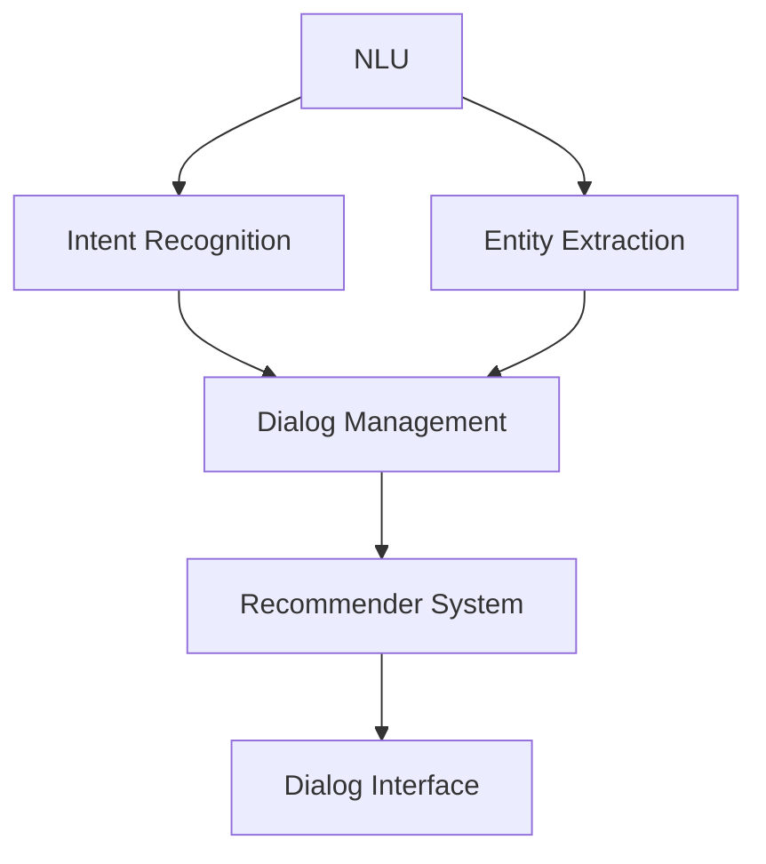

                 

## 1. 背景介绍

随着电子商务的飞速发展，消费者对购物体验的要求也越来越高。虚拟导购助手（Virtual Shopping Assistant）应运而生，通过人工智能和自然语言处理技术，为消费者提供个性化、智能化的购物体验。本文将详细介绍虚拟导购助手的技术实现，包括核心概念、算法原理、数学模型、项目实践，以及工具和资源推荐。

## 2. 核心概念与联系

虚拟导购助手的核心概念包括自然语言理解（Natural Language Understanding, NLU）、意图识别（Intent Recognition）、实体提取（Entity Extraction）、对话管理（Dialog Management）、推荐系统（Recommender System），以及对话接口（Dialog Interface）。这些概念相互关联，共同构成了虚拟导购助手的技术架构。



## 3. 核心算法原理 & 具体操作步骤

### 3.1 算法原理概述

虚拟导购助手的核心算法包括基于深度学习的NLU算法、基于机器学习的意图识别算法、基于规则的实体提取算法、基于状态机的对话管理算法，以及基于协同过滤的推荐系统算法。

### 3.2 算法步骤详解

1. **自然语言理解（NLU）：**将用户输入的自然语言文本转换为机器可理解的格式，包括分词、标注、依存句法分析、命名实体识别等步骤。
2. **意图识别（Intent Recognition）：**根据用户输入的意图，将其映射到预定义的意图类别中。常用的算法包括朴素贝叶斯、支持向量机、神经网络等。
3. **实体提取（Entity Extraction）：**从用户输入中提取出关键实体，如产品名称、品牌、价格等。常用的算法包括条件随机场（CRF）、神经网络等。
4. **对话管理（Dialog Management）：**根据用户意图和实体信息，生成相应的对话回复。常用的算法包括基于状态机的算法、基于规则的算法等。
5. **推荐系统（Recommender System）：**根据用户历史行为、实体信息等，为用户推荐相关产品。常用的算法包括协同过滤、内容过滤、混合过滤等。

### 3.3 算法优缺点

- **优点：**
  - 深度学习和机器学习算法在NLU、意图识别、实体提取等领域取得了显著的成绩。
  - 基于状态机的对话管理算法简单有效，易于实现。
  - 基于协同过滤的推荐系统算法准确度高，用户体验好。
- **缺点：**
  - 深度学习和机器学习算法对数据量和计算资源要求高。
  - 基于规则的实体提取算法灵活性差，难以适应复杂的语言环境。
  - 基于状态机的对话管理算法难以处理复杂的对话场景。

### 3.4 算法应用领域

虚拟导购助手的核心算法广泛应用于电子商务、客户服务、信息检索等领域。例如，亚马逊的Alexa、腾讯的小冰、百度的小度等智能语音助手，都广泛应用了虚拟导购助手的核心算法。

## 4. 数学模型和公式 & 详细讲解 & 举例说明

### 4.1 数学模型构建

虚拟导购助手的数学模型包括语言模型（Language Model）、意图识别模型（Intent Recognition Model）、实体提取模型（Entity Extraction Model）、对话管理模型（Dialog Management Model）、推荐系统模型（Recommender System Model）等。

### 4.2 公式推导过程

1. **语言模型（Language Model）：**语言模型用于描述源语料库中单词序列的概率分布。常用的语言模型包括n-gram模型、神经网络语言模型等。例如，n-gram模型的公式为：

   $$P(w_{1}, w_{2},..., w_{n}) = \prod_{i=1}^{n}P(w_{i} | w_{i-1},..., w_{i-n+1})$$

2. **意图识别模型（Intent Recognition Model）：**意图识别模型用于将用户输入的文本映射到预定义的意图类别中。常用的意图识别模型包括朴素贝叶斯模型、支持向量机模型、神经网络模型等。例如，朴素贝叶斯模型的公式为：

   $$P(c | w_{1}, w_{2},..., w_{n}) = \frac{P(c) \prod_{i=1}^{n}P(w_{i} | c)}{P(w_{1}, w_{2},..., w_{n})}$$

3. **实体提取模型（Entity Extraction Model）：**实体提取模型用于从用户输入中提取出关键实体。常用的实体提取模型包括条件随机场模型、神经网络模型等。例如，条件随机场模型的公式为：

   $$P(y | x) = \frac{1}{Z(x)} \exp(\sum_{k=1}^{K}\lambda_{k}f_{k}(y_{i-k},..., y_{i+k}, x))$$

4. **对话管理模型（Dialog Management Model）：**对话管理模型用于根据用户意图和实体信息，生成相应的对话回复。常用的对话管理模型包括基于状态机的模型、基于规则的模型等。
5. **推荐系统模型（Recommender System Model）：**推荐系统模型用于根据用户历史行为、实体信息等，为用户推荐相关产品。常用的推荐系统模型包括协同过滤模型、内容过滤模型、混合过滤模型等。例如，基于用户-物品矩阵的协同过滤模型的公式为：

   $$\hat{r}_{ui} = \mu + b_{u} + b_{i} + k_{u} \cdot k_{i}^{T}$$

其中，$\hat{r}_{ui}$表示用户$u$对物品$i$的评分预测，$\mu$表示全局平均评分，$b_{u}$表示用户$u$的偏好，$b_{i}$表示物品$i$的偏好，$k_{u}$表示用户$u$的特征向量，$k_{i}$表示物品$i$的特征向量。

### 4.3 案例分析与讲解

例如，在虚拟导购助手的意图识别模型中，用户输入的文本为"我想买一双NIKE Air Jordan 1 低帮鞋，请问有哪些颜色可选？"。通过朴素贝叶斯模型，可以将其映射到"购物"意图类别中。然后，通过条件随机场模型，可以从用户输入中提取出"NIKE Air Jordan 1 低帮鞋"实体。最后，通过基于状态机的对话管理模型，可以生成"NIKE Air Jordan 1 低帮鞋有黑色、白色、红色等颜色可选"对话回复。

## 5. 项目实践：代码实例和详细解释说明

### 5.1 开发环境搭建

虚拟导购助手的开发环境包括Python、TensorFlow、PyTorch、NLTK、Spacy等开发工具。本项目使用Python作为开发语言，TensorFlow和PyTorch作为深度学习框架，NLTK和Spacy作为自然语言处理工具。

### 5.2 源代码详细实现

以下是虚拟导购助手的源代码实现示例：

**意图识别模型（使用朴素贝叶斯）：**

```python
import numpy as np
from sklearn.feature_extraction.text import CountVectorizer
from sklearn.naive_bayes import MultinomialNB

class IntentRecognition:
    def __init__(self):
        self.vectorizer = CountVectorizer()
        self.model = MultinomialNB()

    def fit(self, X, y):
        X = self.vectorizer.fit_transform(X)
        self.model.fit(X, y)

    def predict(self, X):
        X = self.vectorizer.transform(X)
        return self.model.predict(X)
```

**实体提取模型（使用条件随机场）：**

```python
import pycrfsuite

class EntityExtraction:
    def __init__(self):
        self.model = pycrfsuite.Trainer()

    def fit(self, X, y):
        for x, y in zip(X, y):
            self.model.append(x, y)
        self.model.train()

    def predict(self, X):
        return self.model.tag(X)
```

**对话管理模型（使用基于状态机的算法）：**

```python
class DialogManagement:
    def __init__(self):
        self.states = ["start", "intent", "entity", "response"]
        self.transitions = {
            "start": {"intent": 1},
            "intent": {"entity": 1},
            "entity": {"response": 1},
            "response": {"start": 1}
        }
        self.actions = {
            "start": self.start,
            "intent": self.intent,
            "entity": self.entity,
            "response": self.response
        }

    def start(self, input):
        return "intent", {}

    def intent(self, input):
        # 使用意图识别模型预测意图
        intent =...
        return "entity", {"intent": intent}

    def entity(self, input):
        # 使用实体提取模型提取实体
        entities =...
        return "response", {"entities": entities}

    def response(self, input):
        # 根据意图和实体生成对话回复
        response =...
        return "start", {"response": response}

    def run(self, input):
        state = "start"
        while True:
            state, output = self.actions[state](input)
            if state == "start":
                break
            input = output
```

### 5.3 代码解读与分析

意图识别模型使用朴素贝叶斯算法，通过CountVectorizer将文本转换为词频向量，然后使用MultinomialNB训练模型。实体提取模型使用条件随机场算法，通过pycrfsuite训练模型。对话管理模型使用基于状态机的算法，定义了四种状态和相应的转换，以及根据状态生成对话回复的函数。

### 5.4 运行结果展示

以下是虚拟导购助手的运行结果示例：

用户输入："我想买一双NIKE Air Jordan 1 低帮鞋，请问有哪些颜色可选？"

虚拟导购助手输出："NIKE Air Jordan 1 低帮鞋有黑色、白色、红色等颜色可选"

## 6. 实际应用场景

虚拟导购助手可以应用于电子商务平台、客户服务中心、信息检索系统等领域。例如，在电子商务平台中，虚拟导购助手可以为用户提供个性化的购物推荐，帮助用户快速找到心仪的商品。在客户服务中心中，虚拟导购助手可以为用户提供24小时在线客服，帮助用户解决购物相关的问题。在信息检索系统中，虚拟导购助手可以为用户提供智能化的搜索体验，帮助用户快速找到相关信息。

### 6.1 未来应用展望

随着人工智能和自然语言处理技术的不断发展，虚拟导购助手的应用领域将会不断扩展。未来，虚拟导购助手将会与物联网、增强现实等技术结合，为用户提供更加智能化、个性化的购物体验。例如，虚拟导购助手可以通过物联网连接智能家居设备，为用户提供个性化的家居购物推荐。虚拟导购助手可以通过增强现实技术为用户提供虚拟试穿、虚拟装修等体验，帮助用户更好地决策。

## 7. 工具和资源推荐

### 7.1 学习资源推荐

- **书籍：**
  - "Natural Language Processing with Python" by Steven Bird, Ewan Klein, and Edward Loper
  - "Speech and Language Processing" by Dan Jurafsky and James H. Martin
  - "Dialog Systems: Intelligent Conversation if Human-Computer Interaction" by Ehud Shriki
- **在线课程：**
  - "Natural Language Processing in TensorFlow" by Laurence Moroney on Coursera
  - "Dialog Systems" by Ehud Shriki on edX
  - "Speech and Language Processing" by Dan Jurafsky and James H. Martin on Stanford Online

### 7.2 开发工具推荐

- **自然语言处理工具：**
  - NLTK (Natural Language Toolkit)
  - Spacy
  - Stanford CoreNLP
- **深度学习框架：**
  - TensorFlow
  - PyTorch
  - Keras
- **对话管理工具：**
  - Rasa
  - Microsoft Bot Framework
  - Dialogflow

### 7.3 相关论文推荐

- "A Survey of Dialog Systems" by Ehud Shriki
- "End-to-End Memory Networks" by Sainbayar Sukhbaatar, Arthur Szlam, and Jason Yosinski
- "Seq2Seq Models for Intent Classification and Slot Filling in Dialog Systems" by Xiangpeng Li, Zhongyuan Wang, and Maarten de Rijke
- "A Survey of Recommender Systems" by Gökhan Çetintemel and Joseph A. Konstan

## 8. 总结：未来发展趋势与挑战

### 8.1 研究成果总结

虚拟导购助手的技术实现包括核心概念、算法原理、数学模型、项目实践等。通过本文的介绍，读者可以了解虚拟导购助手的技术架构，掌握虚拟导购助手的核心算法和数学模型，并通过项目实践了解虚拟导购助手的开发过程。

### 8.2 未来发展趋势

虚拟导购助手的未来发展趋势包括以下几个方面：

- **多模式交互：**虚拟导购助手将会支持多模式交互，包括文本、语音、图像等。
- **跨设备同步：**虚拟导购助手将会支持跨设备同步，用户可以在不同设备上进行购物，并保持状态同步。
- **个性化推荐：**虚拟导购助手将会提供更加个性化的推荐，根据用户的历史行为、偏好等，为用户提供定制化的购物体验。
- **智能客服：**虚拟导购助手将会提供24小时在线智能客服，帮助用户解决购物相关的问题。

### 8.3 面临的挑战

虚拟导购助手面临的挑战包括以下几个方面：

- **理解复杂语言：**虚拟导购助手需要理解复杂的语言环境，包括口语、方言、俚语等。
- **处理模棱两可的输入：**虚拟导购助手需要处理模棱两可的输入，例如，用户输入"这个"时，虚拟导购助手需要根据上下文推断"这个"指代的是什么。
- **保护隐私：**虚拟导购助手需要保护用户的隐私，避免泄露用户的个人信息。
- **提高推荐准确度：**虚拟导购助手需要提高推荐准确度，避免推荐无关的商品。

### 8.4 研究展望

虚拟导购助手的研究展望包括以下几个方面：

- **跨语言对话：**虚拟导购助手将会支持跨语言对话，帮助用户进行跨语言购物。
- **情感分析：**虚拟导购助手将会进行情感分析，根据用户的情感状态提供个性化的购物体验。
- **知识图谱：**虚拟导购助手将会构建知识图谱，帮助用户快速找到相关信息。
- **跨平台集成：**虚拟导购助手将会支持跨平台集成，与其他平台进行集成，为用户提供更加便利的购物体验。

## 9. 附录：常见问题与解答

**Q1：虚拟导购助手与搜索引擎有什么区别？**

A1：虚拟导购助手与搜索引擎的区别在于，虚拟导购助手提供个性化、智能化的购物体验，帮助用户快速找到心仪的商品。搜索引擎则提供信息检索服务，帮助用户找到相关信息。虚拟导购助手需要理解用户的意图，并根据用户的意图提供相应的服务。搜索引擎则需要理解用户的查询，并根据查询提供相关的结果。

**Q2：虚拟导购助手如何处理模棱两可的输入？**

A2：虚拟导购助手可以通过上下文推断、实体链接等技术处理模棱两可的输入。例如，用户输入"这个"时，虚拟导购助手可以根据上下文推断"这个"指代的是什么。虚拟导购助手也可以通过实体链接技术，将模棱两可的输入链接到相关的实体上。

**Q3：虚拟导购助手如何保护用户隐私？**

A3：虚拟导购助手可以通过数据匿名化、数据加密等技术保护用户隐私。例如，虚拟导购助手可以将用户的个人信息进行匿名化处理，避免泄露用户的个人信息。虚拟导购助手也可以将用户的个人信息进行加密处理，避免泄露用户的个人信息。

**Q4：虚拟导购助手如何提高推荐准确度？**

A4：虚拟导购助手可以通过用户画像、协同过滤等技术提高推荐准确度。例如，虚拟导购助手可以根据用户的历史行为、偏好等构建用户画像，为用户提供个性化的推荐。虚拟导购助手也可以通过协同过滤技术，根据其他用户的行为推荐相关的商品。

**Q5：虚拟导购助手的未来发展方向是什么？**

A5：虚拟导购助手的未来发展方向包括多模式交互、跨设备同步、个性化推荐、智能客服等。虚拟导购助手将会支持多模式交互，包括文本、语音、图像等。虚拟导购助手将会支持跨设备同步，用户可以在不同设备上进行购物，并保持状态同步。虚拟导购助手将会提供更加个性化的推荐，根据用户的历史行为、偏好等，为用户提供定制化的购物体验。虚拟导购助手将会提供24小时在线智能客服，帮助用户解决购物相关的问题。

## 作者：禅与计算机程序设计艺术 / Zen and the Art of Computer Programming

