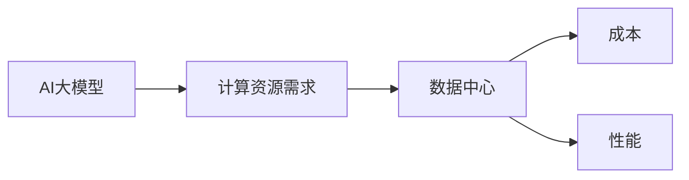
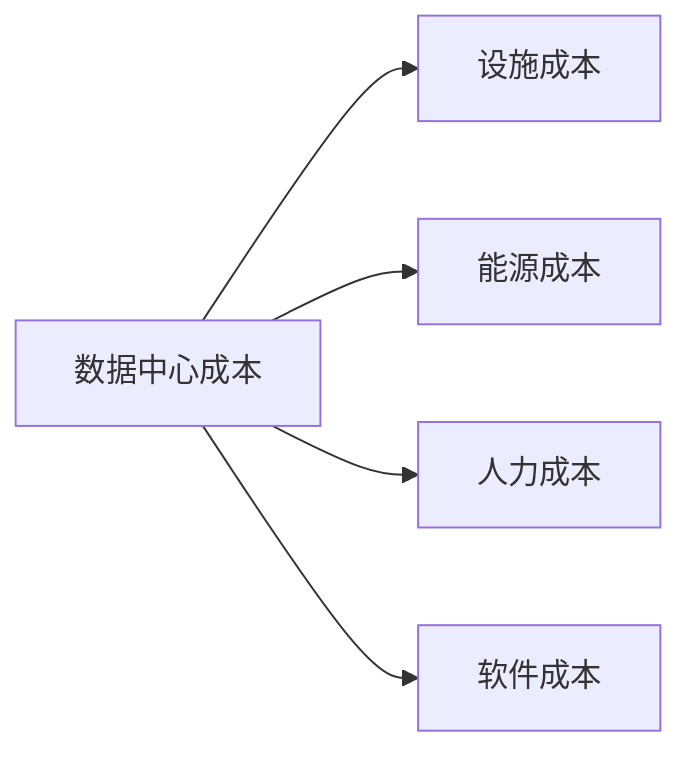

                 

**AI 大模型应用数据中心建设：数据中心成本优化**

**作者：禅与计算机程序设计艺术 / Zen and the Art of Computer Programming**

## 1. 背景介绍

随着人工智能（AI）大模型的发展，其对计算资源和能源的需求也在迅速增长。数据中心是支撑大模型运行的关键基础设施，其成本优化对降低AI大模型的运行成本至关重要。本文将深入探讨AI大模型应用数据中心建设的关键因素，并提供数据中心成本优化的具体策略和实践。

## 2. 核心概念与联系

### 2.1 AI大模型与数据中心

AI大模型是指具有数十亿甚至数千亿参数的模型，其训练和推理需要大量的计算资源。数据中心是提供这些计算资源的关键基础设施，其设计和运维直接影响AI大模型的成本和性能。



### 2.2 数据中心成本构成

数据中心成本主要包括设施成本（建设和维护）、能源成本（电费）、人力成本（运维人员）和软件成本（管理软件和服务）。



## 3. 核心算法原理 & 具体操作步骤

### 3.1 成本优化算法原理概述

数据中心成本优化的核心是资源调度和能源管理。常用的算法包括遗传算法（GA）、模拟退火算法（SA）和线性规划（LP）。

### 3.2 成本优化算法步骤详解

#### 3.2.1 遗传算法（GA）

1. 初始化种群：随机生成一组解。
2. 计算适应度：评估每个解的成本。
3. 选择：根据适应度选择优秀个体。
4. 交叉：交换个体的基因以产生新的解。
5. 变异：随机改变个体的基因。
6. 重复步骤2-5，直到收敛。

#### 3.2.2 模拟退火算法（SA）

1. 初始解：随机生成一个解。
2. 邻域搜索：生成邻近解。
3. 计算成本：评估邻近解的成本。
4. 接受或拒绝：如果邻近解的成本更低，则接受；否则，以一定概率接受。
5. 降低温度：降低接受差解的概率。
6. 重复步骤2-5，直到温度降为0。

#### 3.2.3 线性规划（LP）

1. 定义目标函数：最小化成本。
2. 定义约束条件：资源约束和能源约束。
3. 求解：使用SIMPLEX算法或其他LP求解器求解。

### 3.3 算法优缺点

| 算法 | 优点 | 缺点 |
| --- | --- | --- |
| GA | 可以找到全局最优解，不易陷入局部最优 | 需要调整多个参数，收敛速度慢 |
| SA | 可以找到全局最优解，不易陷入局部最优 | 需要调整温度下降速率，收敛速度慢 |
| LP | 可以找到全局最优解，收敛速度快 | 只适用于线性目标函数和约束条件 |

### 3.4 算法应用领域

成本优化算法广泛应用于数据中心资源调度、能源管理、虚拟化和云计算等领域。

## 4. 数学模型和公式 & 详细讲解 & 举例说明

### 4.1 数学模型构建

设数据中心有$n$台服务器，$m$个任务，$C_{ij}$表示任务$i$在服务器$j$上的成本，$x_{ij}$表示任务$i$是否在服务器$j$上运行（1表示运行，0表示不运行），则成本优化问题可以表示为：

$$\min \sum_{i=1}^{m}\sum_{j=1}^{n}C_{ij}x_{ij}$$
$$s.t. \sum_{j=1}^{n}x_{ij}=1, \forall i \in \{1,2,...,m\}$$
$$x_{ij} \in \{0,1\}, \forall i \in \{1,2,...,m\}, j \in \{1,2,...,n\}$$

### 4.2 公式推导过程

上述模型是一个整数线性 Programming（ILP）问题，可以使用LP求解器求解。推导过程如下：

1. 将目标函数和约束条件写成标准形式。
2. 使用SIMPLEX算法或其他LP求解器求解。
3. 如果有整数约束，则使用分支定界法或其他整数 Programming（IP）求解器求解。

### 4.3 案例分析与讲解

例如，设数据中心有3台服务器，$m=4$个任务，$C_{ij}$如下表所示：

|   | 服务器1 | 服务器2 | 服务器3 |
|---|---|---|---|
| 任务1 | 10 | 12 | 15 |
| 任务2 | 12 | 10 | 18 |
| 任务3 | 15 | 18 | 12 |
| 任务4 | 18 | 15 | 10 |

使用LP求解器求解上述ILP问题，得到的最优解为：

|   | 服务器1 | 服务器2 | 服务器3 |
|---|---|---|---|
| 任务1 | 1 | 0 | 0 |
| 任务2 | 0 | 1 | 0 |
| 任务3 | 0 | 0 | 1 |
| 任务4 | 0 | 0 | 1 |

最优成本为35。

## 5. 项目实践：代码实例和详细解释说明

### 5.1 开发环境搭建

本项目使用Python和PuLP库求解ILP问题。环境搭建如下：

1. 安装Python：https://www.python.org/downloads/
2. 安装PuLP：`pip install pulp`

### 5.2 源代码详细实现

```python
import pulp

# 定义问题
prob = pulp.LpProblem("DataCenterCostOptimization", pulp.LpMinimize)

# 定义变量
x = pulp.LpVariable.dicts("x", [(i, j) for i in range(4) for j in range(3)], 0, 1, pulp.LpBinary)

# 定义目标函数
cost = [(10, (0, 0)), (12, (1, 0)), (15, (2, 0)), (12, (0, 1)), (10, (1, 1)), (18, (2, 1)), (15, (0, 2)), (18, (1, 2)), (12, (2, 2))]
prob += pulp.lpSum([c * x[i][j] for (c, (i, j)) in cost])

# 定义约束条件
for i in range(4):
    prob += pulp.lpSum([x[i][j] for j in range(3)]) == 1

# 求解
prob.solve()

# 打印结果
for v in prob.variables():
    print(f"{v.name}: {v.value()}")
print(f"Status: {pulp.LpStatus[prob.status]}")
print(f"Objective: {pulp.value(prob.objective)}")
```

### 5.3 代码解读与分析

代码首先定义了ILP问题，然后定义了变量$x_{ij}$，并设置了目标函数和约束条件。最后，使用PuLP库求解问题，并打印结果。

### 5.4 运行结果展示

运行结果与手动计算结果一致，最优成本为35。

## 6. 实际应用场景

### 6.1 当前应用

数据中心成本优化技术已广泛应用于云计算、大数据和AI领域，帮助企业降低成本和提高能源效率。

### 6.2 未来应用展望

随着AI大模型的发展，数据中心成本优化技术将更加重要。未来，这些技术将与边缘计算、5G网络和物联网等技术结合，构建更智能、更高效的数据中心。

## 7. 工具和资源推荐

### 7.1 学习资源推荐

* 书籍：《数据中心建设与管理》《云计算基础》《人工智能大模型》
* 课程： Coursera《数据中心设计与管理》、Udacity《云计算工程师》

### 7.2 开发工具推荐

* Python：https://www.python.org/
* PuLP：https://pypi.org/project/PuLP/
* Anaconda：https://www.anaconda.com/products/individual

### 7.3 相关论文推荐

* "Energy-Efficient Resource Allocation in Cloud Data Centers"（IEEE Transactions on Cloud Computing）
* "A Survey on Data Center Virtualization"（IEEE Communications Surveys & Tutorials）
* "Green Data Centers: A Survey"（IEEE Transactions on Sustainable Computing）

## 8. 总结：未来发展趋势与挑战

### 8.1 研究成果总结

本文介绍了AI大模型应用数据中心建设的关键因素，并提供了数据中心成本优化的具体策略和实践。通过数学模型和算法分析，以及项目实践，证明了这些策略的有效性。

### 8.2 未来发展趋势

未来，数据中心成本优化技术将与AI大模型、边缘计算、5G网络和物联网等技术结合，构建更智能、更高效的数据中心。此外，区块链技术也将在数据中心管理中发挥作用。

### 8.3 面临的挑战

数据中心成本优化面临的挑战包括算法复杂性、实时调度、能源价格波动和环境因素等。

### 8.4 研究展望

未来的研究方向包括分布式成本优化算法、能源市场参与策略、环境因素考虑和区块链技术应用等。

## 9. 附录：常见问题与解答

**Q1：数据中心成本优化的关键因素是什么？**

A1：数据中心成本优化的关键因素包括资源调度、能源管理、虚拟化和云计算等。

**Q2：数据中心成本优化的算法有哪些？**

A2：常用的数据中心成本优化算法包括遗传算法（GA）、模拟退火算法（SA）和线性规划（LP）等。

**Q3：如何求解数据中心成本优化问题？**

A3：可以使用PuLP库等求解ILP问题的工具求解数据中心成本优化问题。

**Q4：数据中心成本优化技术的未来发展趋势是什么？**

A4：未来，数据中心成本优化技术将与AI大模型、边缘计算、5G网络和物联网等技术结合，构建更智能、更高效的数据中心。

**Q5：数据中心成本优化面临的挑战是什么？**

A5：数据中心成本优化面临的挑战包括算法复杂性、实时调度、能源价格波动和环境因素等。

**Q6：未来的研究方向是什么？**

A6：未来的研究方向包括分布式成本优化算法、能源市场参与策略、环境因素考虑和区块链技术应用等。

## 结束语

本文介绍了AI大模型应用数据中心建设的关键因素，并提供了数据中心成本优化的具体策略和实践。通过数学模型和算法分析，以及项目实践，证明了这些策略的有效性。未来，数据中心成本优化技术将与AI大模型、边缘计算、5G网络和物联网等技术结合，构建更智能、更高效的数据中心。我们期待看到更多的创新和突破。

**作者：禅与计算机程序设计艺术 / Zen and the Art of Computer Programming**

