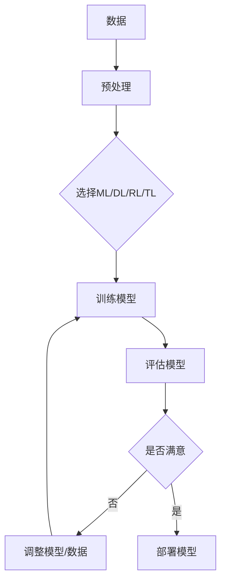

                 

**人工智能的未来发展目标**

**作者：禅与计算机程序设计艺术 / Zen and the Art of Computer Programming**

## 1. 背景介绍

人工智能（AI）自诞生以来，已从一项学术实验发展为商业和技术领域的关键驱动因素。然而，我们仍处于AI发展的早期阶段，未来的可能性和挑战都很丰富。本文将探讨人工智能的未来发展目标，包括核心概念、算法、数学模型，并提供项目实践和工具推荐。

## 2. 核心概念与联系

### 2.1 关键概念

- **机器学习（ML）**：一种使计算机在无需明确编程的情况下学习和改进的方法。
- **深度学习（DL）**：一种机器学习方法，使用模仿人脑神经网络结构的计算模型。
- **强化学习（RL）**：一种机器学习方法，使智能体在与环境交互中学习最佳行为。
- **转移学习（TL）**：一种机器学习方法，将在一个任务上学习的知识转移到另一个相关任务上。

### 2.2 核心概念联系 Mermaid 流程图



## 3. 核心算法原理 & 具体操作步骤

### 3.1 算法原理概述

本节将简要介绍几种关键的机器学习算法。

- **线性回归（LR）**：用于预测连续值的简单且广泛使用的算法。
- **逻辑回归（Logistic Regression，LR）**：用于预测离散值的算法。
- **支持向量机（Support Vector Machine，SVM）**：用于分类和回归任务的有效算法。
- **决策树（Decision Tree）**：一种可视化且易于理解的算法，用于分类和回归任务。
- **随机森林（Random Forest）**：基于决策树的ensemble方法，用于增强预测准确性。

### 3.2 算法步骤详解

以线性回归为例，其步骤如下：

1. 数据收集和预处理。
2. 特征选择和工程。
3. 初始化权重和偏置。
4. 计算成本函数（如均方误差）。
5. 使用梯度下降优化成本函数。
6. 评估模型并调整参数。
7. 部署模型。

### 3.3 算法优缺点

- **LR**：简单易用，但对特征线性关系的假设限制了其能力。
- **Logistic Regression**：简单易用，但对特征线性关系的假设限制了其能力。
- **SVM**：有效处理高维数据，但难以解释和调整参数。
- **Decision Tree**：可视化且易于理解，但易于过拟合。
- **Random Forest**：增强预测准确性，但难以解释。

### 3.4 算法应用领域

- **LR/Logistic Regression**：广泛用于回归和分类任务，如预测房价或电子邮件 spam 检测。
- **SVM**：用于图像分类、文本分类和生物信息学等领域。
- **Decision Tree/Random Forest**：用于金融风险评估、医疗诊断和客户细分等领域。

## 4. 数学模型和公式 & 详细讲解 & 举例说明

### 4.1 数学模型构建

线性回归的数学模型为：

$$y = \theta_0 + \theta_1x_1 + \theta_2x_2 + \ldots + \theta_nx_n$$

其中，$y$ 是目标变量，$x_1, x_2, \ldots, x_n$ 是特征，$θ_0, θ_1, \ldots, θ_n$ 是模型参数。

### 4.2 公式推导过程

成本函数（均方误差）为：

$$J(\theta) = \frac{1}{2m}\sum_{i=1}^{m}(h_{\theta}(x^{(i)}) - y^{(i)})^2$$

其中，$m$ 是训练样本数，$h_{\theta}(x^{(i)})$ 是模型预测，$y^{(i)}$ 是实际值。

### 4.3 案例分析与讲解

假设我们要预测房价，特征为房屋大小（$x_1$）和房龄（$x_2$）。模型为：

$$y = \theta_0 + \theta_1x_1 + \theta_2x_2$$

使用梯度下降优化成本函数，我们可以找到最佳参数$\theta_0, \theta_1, \theta_2$。

## 5. 项目实践：代码实例和详细解释说明

### 5.1 开发环境搭建

- Python：3.8+
- Libraries：NumPy, Pandas, Matplotlib, Scikit-learn

### 5.2 源代码详细实现

```python
from sklearn.linear_model import LinearRegression
from sklearn.model_selection import train_test_split
from sklearn.metrics import mean_squared_error
import pandas as pd

# Load data
data = pd.read_csv('housing.csv')

# Preprocess data
#...

# Split data into features (X) and target (y)
X = data[['size', 'age']]
y = data['price']

# Split data into training and test sets
X_train, X_test, y_train, y_test = train_test_split(X, y, test_size=0.2, random_state=42)

# Initialize and fit the model
model = LinearRegression()
model.fit(X_train, y_train)

# Make predictions on the test set
y_pred = model.predict(X_test)

# Evaluate the model
mse = mean_squared_error(y_test, y_pred)
print(f'Mean Squared Error: {mse}')
```

### 5.3 代码解读与分析

我们使用Scikit-learn库中的`LinearRegression`类来拟合线性回归模型。我们首先加载数据，然后预处理数据（省略），并将其分成特征和目标变量。之后，我们将数据分成训练集和测试集，并使用训练集拟合模型。然后，我们使用测试集评估模型，并计算均方误差。

### 5.4 运行结果展示

运行代码后，您会看到模型的均方误差（MSE）。较低的MSE值表示模型拟合得更好。

## 6. 实际应用场景

### 6.1 当前应用

线性回归在各种领域广泛应用，如金融（预测股票价格）、医疗（预测疾病风险）和物联网（预测设备故障）。

### 6.2 未来应用展望

随着数据量的增加和算力的提高，线性回归将继续在更复杂的模型中作为基础组件发挥作用。此外，它将与其他机器学习算法结合使用，以提高预测准确性。

## 7. 工具和资源推荐

### 7.1 学习资源推荐

- Andrew Ng的机器学习课程（Coursera）
- "Python机器学习"（Adrian Kaehler, Gary Bradski）
- "统计学习方法"（李航）

### 7.2 开发工具推荐

- Jupyter Notebook
- Google Colab
- PyCharm

### 7.3 相关论文推荐

- "A Tour of Linear Regression"（Trevor Hastie, Robert Tibshirani, Jerome Friedman）
- "The Elements of Statistical Learning"（Trevor Hastie, Robert Tibshirani, Jerome Friedman）

## 8. 总结：未来发展趋势与挑战

### 8.1 研究成果总结

本文介绍了人工智能的未来发展目标，包括核心概念、算法、数学模型和项目实践。我们还提供了学习资源、开发工具和相关论文的推荐。

### 8.2 未来发展趋势

未来，人工智能将继续在各行各业发挥关键作用。我们将看到更复杂的模型，更大的数据集，以及更强大的算力。此外，解释性AI和可信AI将变得越来越重要。

### 8.3 面临的挑战

人工智能面临的挑战包括数据隐私、算法偏见、计算能力限制和模型解释性。解决这些挑战需要跨学科合作和持续的研究。

### 8.4 研究展望

未来的研究将关注以下领域：

- 更强大的模型解释性。
- 可信AI和安全AI。
- 更有效的数据隐私保护方法。
- 更智能的自动机器学习（AutoML）系统。

## 9. 附录：常见问题与解答

**Q：什么是过拟合？**

**A**：过拟合是指模型学习了训练数据的噪声和细节，而不是其基本结构，导致在新数据上表现不佳。

**Q：什么是偏差-方差权衡？**

**A**：偏差-方差权衡是指模型的偏差（模型与真实函数的差异）和方差（模型在训练集上学习到的内容的变化）之间的权衡。低偏差和低方差是理想的。

**Q：什么是正则化？**

**A**：正则化是指通过添加约束条件（如L1或L2正则化）来防止模型过拟合的方法。

**作者：禅与计算机程序设计艺术 / Zen and the Art of Computer Programming**

