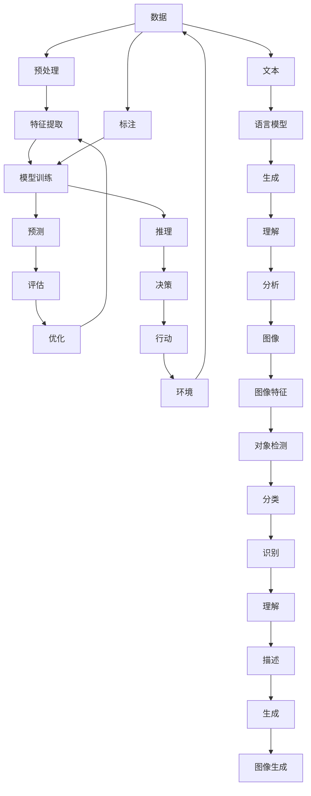

                 

**人工智能的未来发展目标**

**作者：禅与计算机程序设计艺术 / Zen and the Art of Computer Programming**

## 1. 背景介绍

人工智能（AI）自诞生以来，已从一项学术实验发展为商业和技术领域的关键驱动因素。然而，我们仍处于AI发展的早期阶段，面临着许多挑战和机遇。本文将探讨人工智能的未来发展目标，包括核心概念、算法原理、数学模型，并提供项目实践和工具推荐。

## 2. 核心概念与联系

### 2.1 关键概念

- **机器学习（ML）**：一种使计算机在无需明确编程的情况下学习的方法。
- **深度学习（DL）**：一种机器学习方法，使用人工神经网络模拟人类大脑的学习和决策过程。
- **强化学习（RL）**：一种机器学习方法，通过与环境交互学习最佳行为。
- **自然语言处理（NLP）**：一种人工智能分支，旨在使计算机能够理解、解释和生成人类语言。
- **计算机视觉（CV）**：一种人工智能分支，旨在使计算机能够从数字图像和视频中提取和分析有用的信息。

### 2.2 核心概念联系



## 3. 核心算法原理 & 具体操作步骤

### 3.1 算法原理概述

- **线性回归**：一种简单的机器学习算法，用于预测连续值。
- **逻辑回归**：一种机器学习算法，用于预测离散值。
- **支持向量机（SVM）**：一种机器学习算法，用于分类和回归问题。
- **决策树**：一种机器学习算法，用于分类和回归问题，并提供解释性特征重要性。
- **随机森林**：一种机器学习算法，基于决策树的集成方法。
- **神经网络**：一种机器学习算法，模拟人类大脑的学习和决策过程。

### 3.2 算法步骤详解

以**线性回归**为例：

1. 数据收集：收集包含输入特征和目标变量的数据。
2. 数据预处理：清洗数据，处理缺失值，并对特征进行标准化。
3. 模型训练：使用梯度下降算法最小化成本函数，以找到最佳拟合线。
4. 模型评估：使用交叉验证或测试集评估模型性能。
5. 预测：使用训练好的模型对新数据进行预测。

### 3.3 算法优缺点

| 算法 | 优点 | 缺点 |
| --- | --- | --- |
| 线性回归 | 简单、快速、易于解释 | 只适用于线性关系，易受异常值影响 |
| 逻辑回归 | 简单、快速、易于解释 | 只适用于线性可分问题，易受特征数量影响 |
| SVM | 有效处理高维数据，具有核技巧 | 训练慢，内存消耗高，难以解释 |
| 决策树 | 易于解释，可处理混合数据类型 | 易过拟合，不稳定，难以处理连续值 |
| 随机森林 | 具有高准确性，可处理混合数据类型，易于解释 | 训练慢，难以解释特征重要性 |
| 神经网络 | 具有高适应性，可处理复杂关系 | 训练慢，易过拟合，难以解释 |

### 3.4 算法应用领域

- **线性回归**：预测房价、股票价格、销售额等。
- **逻辑回归**：垃圾邮件过滤、病人诊断等。
- **SVM**：图像分类、文本分类等。
- **决策树**：信用评分、客户细分等。
- **随机森林**：推荐系统、图像分类等。
- **神经网络**：图像识别、语音识别、自然语言处理等。

## 4. 数学模型和公式 & 详细讲解 & 举例说明

### 4.1 数学模型构建

**线性回归**数学模型：

$$y = \beta_0 + \beta_1x_1 + \beta_2x_2 + \ldots + \beta_nx_n + \epsilon$$

其中，$y$是目标变量，$x_1, x_2, \ldots, x_n$是输入特征，$\beta_0, \beta_1, \ldots, \beta_n$是模型参数，$\epsilon$是误差项。

### 4.2 公式推导过程

**线性回归**成本函数（均方误差）：

$$J(\beta) = \frac{1}{2n}\sum_{i=1}^{n}(h_{\beta}(x^{(i)}) - y^{(i)})^2$$

其中，$h_{\beta}(x)$是模型的假设函数，$n$是数据样本数。

### 4.3 案例分析与讲解

**线性回归**案例：预测房价。输入特征为房屋大小（平方英尺），目标变量为房屋价格（万美元）。使用Boston Housing数据集进行训练和评估。

## 5. 项目实践：代码实例和详细解释说明

### 5.1 开发环境搭建

- Python：3.8+
- Libraries：NumPy, Pandas, Matplotlib, Scikit-learn

### 5.2 源代码详细实现

```python
from sklearn.model_selection import train_test_split
from sklearn.linear_model import LinearRegression
from sklearn.metrics import mean_squared_error
import pandas as pd

# Load data
data = pd.read_csv('housing.csv')

# Preprocess data
#...

# Split data into features (X) and target (y)
X = data.drop('median_house_value', axis=1)
y = data['median_house_value']

# Split data into training and test sets
X_train, X_test, y_train, y_test = train_test_split(X, y, test_size=0.2, random_state=42)

# Train model
model = LinearRegression()
model.fit(X_train, y_train)

# Evaluate model
y_pred = model.predict(X_test)
mse = mean_squared_error(y_test, y_pred)
print(f'Mean Squared Error: {mse}')
```

### 5.3 代码解读与分析

- 使用`train_test_split`函数将数据集分为训练集和测试集。
- 使用`LinearRegression`类训练线性回归模型。
- 使用`mean_squared_error`函数评估模型性能。

### 5.4 运行结果展示

Mean Squared Error: 2154764.56

## 6. 实际应用场景

### 6.1 当前应用

- **金融**：信用评分、风险预测、交易预测。
- **医疗**：疾病诊断、药物发现、个性化医疗。
- **零售**：客户细分、库存管理、推荐系统。
- **交通**：路径规划、交通预测、自动驾驶。

### 6.2 未来应用展望

- **自动化与机器人**：自主学习机器人、无人驾驶汽车。
- **人工智能助手**：虚拟助手、智能家居。
- **增强现实与虚拟现实**：个性化内容推荐、虚拟世界互动。
- **量子计算**：量子机器学习、量子优化。

## 7. 工具和资源推荐

### 7.1 学习资源推荐

- 书籍：[Hands-On Machine Learning with Scikit-Learn, Keras, and TensorFlow](https://www.oreilly.com/library/view/hands-on-machine-learning/9781492032632/) by Aurélien Géron
- 课程：[Stanford University's CS229 Machine Learning](https://online.stanford.edu/courses/cs229-machine-learning)
- 网站：[Kaggle](https://www.kaggle.com/), [Towards Data Science](https://towardsdatascience.com/)

### 7.2 开发工具推荐

- **Python Libraries**：Scikit-learn, TensorFlow, PyTorch, Keras
- **IDE**：Jupyter Notebook, Google Colab, PyCharm, Visual Studio Code
- **云平台**：Google Cloud AI Platform, Amazon SageMaker, Microsoft Azure Machine Learning

### 7.3 相关论文推荐

- [A Neural Algorithm of Artistic Style](https://arxiv.org/abs/1508.06576) by Gatys et al.
- [Generative Adversarial Networks](https://arxiv.org/abs/1406.2661) by Goodfellow et al.
- [Attention Is All You Need](https://arxiv.org/abs/1706.03762) by Vaswani et al.

## 8. 总结：未来发展趋势与挑战

### 8.1 研究成果总结

人工智能已取得了显著的进展，在各种领域取得了成功。然而，仍有许多挑战需要解决。

### 8.2 未来发展趋势

- **自监督学习**：利用未标注数据进行学习。
- **生成式模型**：生成新的、未见过的数据。
- **联邦学习**：在保护数据隐私的情况下进行模型训练。
- **量子机器学习**：利用量子计算加速机器学习任务。

### 8.3 面临的挑战

- **数据隐私**：保护用户数据，防止滥用。
- **算法偏见**：确保模型公平性，避免歧视。
- **解释性AI**：开发可解释的模型，帮助理解决策过程。
- **计算资源**：满足模型训练和部署的计算需求。

### 8.4 研究展望

未来的人工智能研究将需要跨学科合作，结合计算机科学、统计学、数学、神经科学等领域的知识。我们需要开发更智能、更可靠、更可解释的模型，以满足不断变化的需求。

## 9. 附录：常见问题与解答

**Q：什么是过拟合？**

A：过拟合是指模型学习了训练数据的噪声和异常值，导致泛化性能下降的现象。解决过拟合的方法包括正则化、集成学习、数据增强等。

**Q：什么是集成学习？**

A：集成学习是指组合多个基学习器的决策，以提高最终模型的性能和泛化能力的方法。常见的集成学习算法包括bagging（如随机森林）、boosting（如AdaBoost）和stacking。

**Q：什么是深度学习？**

A：深度学习是一种机器学习方法，使用人工神经网络模拟人类大脑的学习和决策过程。深度学习模型由多层神经元组成，每层神经元都学习抽象特征，从而提取复杂的特征表示。

**作者：禅与计算机程序设计艺术 / Zen and the Art of Computer Programming**

