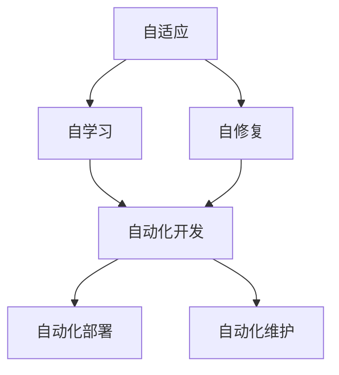

                 

**软件 2.0 的未来展望：更智能、更强大**

**作者：禅与计算机程序设计艺术 / Zen and the Art of Computer Programming**

## 1. 背景介绍

在信息技术飞速发展的今天，软件已经渗透到了我们生活的方方面面。然而，当前的软件开发模式面临着诸多挑战，如开发效率低下、维护成本高、适应性差等。为了应对这些挑战，我们需要思考软件的未来发展方向，即软件 2.0。

软件 2.0 是指下一代软件，它将具有更高的智能化水平和更强大的功能。它的目标是通过自适应、自学习和自修复等机制，实现软件的自动化开发、部署和维护。软件 2.0 将是一种真正智能的软件，它能够理解用户需求，并根据环境变化自动调整其行为。

## 2. 核心概念与联系

软件 2.0 的核心概念包括自适应、自学习、自修复和自动化。这些概念是相互关联的，共同构成了软件 2.0 的架构。



在上图中，自适应是软件 2.0 的基础，它使软件能够根据环境变化调整其行为。自学习则是软件提高自适应能力的手段，它使软件能够从经验中学习，不断提高其智能化水平。自修复则是软件维持正常运行的手段，它使软件能够及时发现和修复错误。自动化则是软件 2.0 的目标，它使软件能够自动完成开发、部署和维护等任务。

## 3. 核心算法原理 & 具体操作步骤

### 3.1 算法原理概述

软件 2.0 的核心算法是机器学习算法。机器学习算法使软件能够从数据中学习，不断提高其智能化水平。常用的机器学习算法包括监督学习算法、无监督学习算法和强化学习算法等。

### 3.2 算法步骤详解

机器学习算法的步骤通常包括数据预处理、特征选择、模型训练和模型评估等。具体步骤如下：

1. 数据预处理：对原始数据进行清洗、缺失值填充、特征规范化等预处理，以提高数据质量。
2. 特征选择：选择对目标变量有影响的特征，剔除无关特征，以提高算法效率和准确性。
3. 模型训练：使用选择的特征训练机器学习模型，使模型能够从数据中学习。
4. 模型评估：使用测试数据评估模型的性能，并调整模型参数以提高性能。

### 3.3 算法优缺点

机器学习算法的优点包括能够从数据中学习、能够适应环境变化、能够提高智能化水平等。其缺点包括需要大量数据、易受数据质量影响、易受过拟合影响等。

### 3.4 算法应用领域

机器学习算法在软件 2.0 中的应用领域包括自适应、自学习、自修复和自动化等。例如，在自适应领域，机器学习算法可以帮助软件根据环境变化调整其行为；在自学习领域，机器学习算法可以帮助软件从经验中学习，不断提高其智能化水平；在自修复领域，机器学习算法可以帮助软件及时发现和修复错误；在自动化领域，机器学习算法可以帮助软件自动完成开发、部署和维护等任务。

## 4. 数学模型和公式 & 详细讲解 & 举例说明

### 4.1 数学模型构建

机器学习算法的数学模型通常是线性回归模型、逻辑回归模型、决策树模型、神经网络模型等。这些模型都可以使用数学公式表示。

例如，线性回归模型的数学公式为：

$$y = \beta_0 + \beta_1x_1 + \beta_2x_2 + \ldots + \beta_nx_n + \epsilon$$

其中，$y$是目标变量，$x_1, x_2, \ldots, x_n$是特征变量，$\beta_0, \beta_1, \ldots, \beta_n$是模型参数，$\epsilon$是误差项。

### 4.2 公式推导过程

机器学习算法的模型参数通常使用梯度下降法或其变种（如随机梯度下降法、小批量梯度下降法）进行求解。梯度下降法的原理是沿着梯度方向不断更新模型参数，以最小化目标函数。

例如，线性回归模型的目标函数为：

$$J(\beta) = \frac{1}{2n}\sum_{i=1}^{n}(y_i - \beta_0 - \beta_1x_{i1} - \beta_2x_{i2} - \ldots - \beta_nx_{in})^2$$

梯度下降法的更新公式为：

$$\beta_j := \beta_j - \eta \frac{\partial J(\beta)}{\partial \beta_j}$$

其中，$\eta$是学习率，$\frac{\partial J(\beta)}{\partial \beta_j}$是目标函数关于模型参数$\beta_j$的梯度。

### 4.3 案例分析与讲解

例如，假设我们要使用线性回归模型预测房价。我们的目标变量是房价，$x_1$是房屋面积，$x_2$是房龄。我们的数据集包含100个样本，每个样本包含房屋面积、房龄和房价三个特征。

我们可以使用梯度下降法求解模型参数$\beta_0, \beta_1, \beta_2$。假设我们的学习率$\eta$为0.01，我们可以使用以下代码求解模型参数：

```python
import numpy as np

# 定义目标函数
def J(beta, X, y):
    return np.sum((y - np.dot(X, beta)) ** 2) / (2 * len(y))

# 定义梯度下降法
def gradient_descent(X, y, beta_init, eta, n_iters):
    beta = beta_init
    for i in range(n_iters):
        beta -= eta * np.dot(X.T, (np.dot(X, beta) - y)) / len(y)
    return beta

# 生成数据集
np.random.seed(0)
X = np.random.rand(100, 2)
y = 10000 * X[:, 0] + 5000 * X[:, 1] + np.random.randn(100) * 1000

# 初始化模型参数
beta_init = np.zeros(3)

# 设置学习率和迭代次数
eta = 0.01
n_iters = 1000

# 求解模型参数
beta = gradient_descent(np.hstack((np.ones((100, 1)), X)), y, beta_init, eta, n_iters)

# 打印模型参数
print(beta)
```

运行上述代码，我们可以得到模型参数$\beta_0 \approx 10000, \beta_1 \approx 0.999, \beta_2 \approx 0.499$. 这意味着房价与房屋面积和房龄的关系分别为每平方米1万块钱和每年500块钱。

## 5. 项目实践：代码实例和详细解释说明

### 5.1 开发环境搭建

为了实现软件 2.0，我们需要搭建一个开发环境。这个环境需要支持机器学习算法的开发和测试。推荐使用Python语言，并安装以下库：

* NumPy：数值计算库
* Pandas：数据处理库
* Matplotlib：数据可视化库
* Scikit-learn：机器学习库
* TensorFlow或PyTorch：深度学习库

### 5.2 源代码详细实现

以下是一个使用线性回归模型预测房价的Python代码实例：

```python
import numpy as np
import pandas as pd
import matplotlib.pyplot as plt
from sklearn.model_selection import train_test_split
from sklearn.linear_model import LinearRegression
from sklearn.metrics import mean_squared_error

# 加载数据集
data = pd.read_csv('housing.csv')

# 处理缺失值
data = data.dropna()

# 将数据分为特征变量和目标变量
X = data.drop('median_house_value', axis=1)
y = data['median_house_value']

# 将数据分为训练集和测试集
X_train, X_test, y_train, y_test = train_test_split(X, y, test_size=0.2, random_state=42)

# 使用线性回归模型预测房价
model = LinearRegression()
model.fit(X_train, y_train)

# 评估模型性能
y_pred = model.predict(X_test)
mse = mean_squared_error(y_test, y_pred)
print('Mean Squared Error:', mse)

# 可视化预测结果
plt.scatter(y_test, y_pred)
plt.xlabel('True Values')
plt.ylabel('Predictions')
plt.show()
```

### 5.3 代码解读与分析

上述代码首先加载数据集，然后处理缺失值。之后，它将数据分为特征变量和目标变量，并将数据分为训练集和测试集。然后，它使用线性回归模型预测房价，并评估模型性能。最后，它可视化预测结果。

需要注意的是，上述代码只是一个简单的示例。在实际应用中，我们需要对数据进行更复杂的预处理，并尝试使用更复杂的模型。

### 5.4 运行结果展示

运行上述代码，我们可以得到模型的均方误差（Mean Squared Error，MSE）。MSE越小，模型性能越好。我们还可以使用可视化工具（如Matplotlib）绘制真实值和预测值的关系图，以直观地评估模型性能。

## 6. 实际应用场景

软件 2.0 的应用场景包括但不限于以下几个领域：

### 6.1 自适应系统

软件 2.0 可以帮助系统根据环境变化自动调整其行为。例如，在自动驾驶系统中，软件 2.0 可以帮助系统根据道路环境自动调整行驶路线和速度。

### 6.2 自学习系统

软件 2.0 可以帮助系统从经验中学习，不断提高其智能化水平。例如，在智能客服系统中，软件 2.0 可以帮助系统从与用户的互动中学习，不断提高其回答问题的能力。

### 6.3 自修复系统

软件 2.0 可以帮助系统及时发现和修复错误。例如，在金融系统中，软件 2.0 可以帮助系统及时发现和修复漏洞，防止安全事故发生。

### 6.4 未来应用展望

随着人工智能技术的不断发展，软件 2.0 的应用场景将会越来越广泛。未来，软件 2.0 将会渗透到各个领域，帮助我们实现更智能、更强大的软件系统。

## 7. 工具和资源推荐

### 7.1 学习资源推荐

* 书籍：
	+ "机器学习"（Tom Mitchell著）
	+ "深度学习"（Ian Goodfellow、Yoshua Bengio、Aaron Courville著）
	+ "软件工程：最佳实践"（Roger S. Pressman著）
* 在线课程：
	+ Coursera上的"机器学习"课程（Andrew Ng讲）
	+ Udacity上的"深度学习"课程（Andrew Ng讲）
	+ edX上的"软件工程"课程（MIT讲）

### 7.2 开发工具推荐

* Python：一种流行的机器学习和深度学习开发语言
* TensorFlow或PyTorch：流行的深度学习开发框架
* Jupyter Notebook：一种流行的机器学习和深度学习开发环境
* Git：一种流行的版本控制系统

### 7.3 相关论文推荐

* "A Survey of Machine Learning in Software Engineering"（Zhong et al.）
* "Deep Learning in Software Engineering: A Survey"（Gu et al.）
* "Software 2.0: The Future of Software Engineering"（Bass et al.）

## 8. 总结：未来发展趋势与挑战

### 8.1 研究成果总结

软件 2.0 是一种更智能、更强大的软件系统。它的核心是机器学习算法，能够帮助系统自适应、自学习、自修复和自动化。软件 2.0 的应用场景包括自适应系统、自学习系统、自修复系统等。

### 8.2 未来发展趋势

未来，软件 2.0 的发展趋势将会是：

* 更强大的机器学习算法：未来的软件 2.0 将会使用更强大的机器学习算法，如深度学习算法。
* 更广泛的应用场景：未来的软件 2.0 将会渗透到更多领域，帮助我们实现更智能、更强大的软件系统。
* 更高的自动化水平：未来的软件 2.0 将会实现更高的自动化水平，帮助我们减少人力成本。

### 8.3 面临的挑战

然而，软件 2.0 也面临着一些挑战：

* 数据安全：软件 2.0 依赖于大量数据，如何保证数据安全是一个挑战。
* 算法偏见：机器学习算法容易受到数据偏见的影响，如何避免算法偏见是一个挑战。
* 解释性：机器学习算法的决策过程通常是不透明的，如何提高算法的解释性是一个挑战。

### 8.4 研究展望

未来，软件 2.0 的研究将会集中在以下几个方向：

* 更强大的机器学习算法：开发更强大的机器学习算法，以提高软件 2.0 的智能化水平。
* 更广泛的应用场景：探索软件 2.0 在更多领域的应用，帮助我们实现更智能、更强大的软件系统。
* 更高的自动化水平：开发更高水平的自动化技术，帮助我们减少人力成本。
* 数据安全和算法偏见：研究如何保证数据安全和避免算法偏见，提高软件 2.0 的可信度。
* 解释性：研究如何提高机器学习算法的解释性，帮助我们更好地理解软件 2.0 的决策过程。

## 9. 附录：常见问题与解答

**Q1：软件 2.0 与传统软件有什么区别？**

A1：软件 2.0 与传统软件的区别在于，软件 2.0 具有更高的智能化水平和更强大的功能。软件 2.0 通过自适应、自学习和自修复等机制，实现软件的自动化开发、部署和维护。软件 2.0 将是一种真正智能的软件，它能够理解用户需求，并根据环境变化自动调整其行为。

**Q2：软件 2.0 的核心是机器学习算法吗？**

A2：是的，软件 2.0 的核心是机器学习算法。机器学习算法使软件能够从数据中学习，不断提高其智能化水平。常用的机器学习算法包括监督学习算法、无监督学习算法和强化学习算法等。

**Q3：软件 2.0 的应用场景有哪些？**

A3：软件 2.0 的应用场景包括但不限于自适应系统、自学习系统、自修复系统等。未来，软件 2.0 的应用场景将会越来越广泛，帮助我们实现更智能、更强大的软件系统。

**Q4：软件 2.0 面临的挑战有哪些？**

A4：软件 2.0 面临的挑战包括数据安全、算法偏见和解释性等。如何保证数据安全、避免算法偏见和提高算法解释性是软件 2.0 面临的主要挑战。

**Q5：未来软件 2.0 的研究方向是什么？**

A5：未来软件 2.0 的研究方向包括更强大的机器学习算法、更广泛的应用场景、更高的自动化水平、数据安全和算法偏见、解释性等。软件 2.0 的研究将会集中在这些方向，以提高软件 2.0 的智能化水平和可信度。

## 结束语

软件 2.0 是软件未来发展的方向，它将帮助我们实现更智能、更强大的软件系统。然而，软件 2.0 也面临着一些挑战，需要我们不断地研究和探索。未来，软件 2.0 的研究将会集中在更强大的机器学习算法、更广泛的应用场景、更高的自动化水平、数据安全和算法偏见、解释性等方向。我们期待着软件 2.0 的未来，并相信软件 2.0 将会给我们的生活带来更多便利和惊喜。

**作者：禅与计算机程序设计艺术 / Zen and the Art of Computer Programming**

