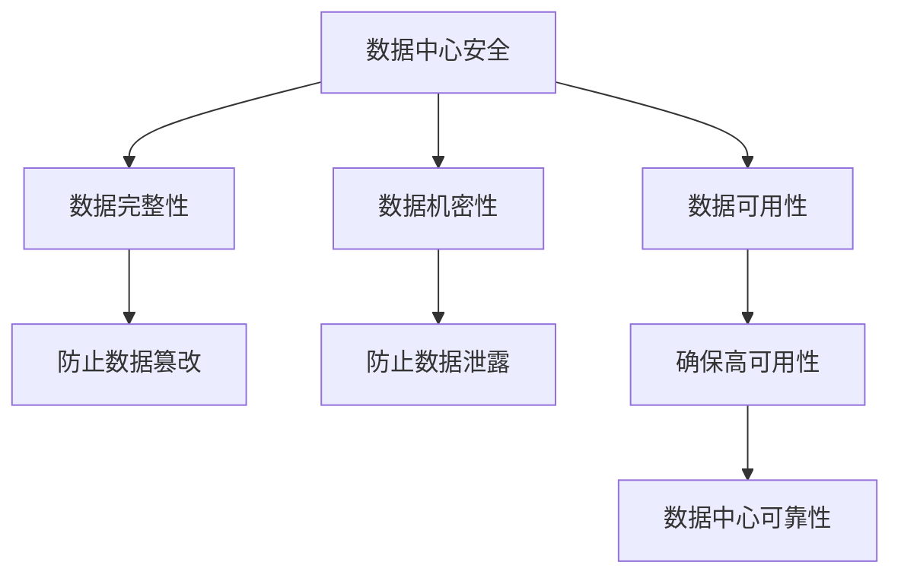

                 

**AI 大模型应用数据中心建设：数据中心安全与可靠性**

**作者：禅与计算机程序设计艺术 / Zen and the Art of Computer Programming**

## 1. 背景介绍

随着人工智能（AI）大模型的发展，其对数据中心的需求也与日俱增。数据中心是AI大模型的基础设施，为其提供计算、存储和网络资源。然而，数据中心的安全和可靠性是一个关键问题，直接影响着AI大模型的性能和稳定性。本文将深入探讨AI大模型应用数据中心建设的安全与可靠性，提供实用的指南和解决方案。

## 2. 核心概念与联系

### 2.1 数据中心安全与可靠性的定义

数据中心安全指的是保护数据中心免受物理和逻辑攻击，确保数据和资源的完整性、机密性和可用性。数据中心可靠性则指的是数据中心在正常运行条件下提供可预测的、高可用的服务。

### 2.2 数据中心安全与可靠性的关系

数据中心安全和可靠性是密切相关的。安全是可靠性的基础，没有安全保障，数据中心的可靠性就无从谈起。而可靠性则是安全的保证，只有高可用的数据中心才能提供持续的安全保护。



## 3. 核心算法原理 & 具体操作步骤

### 3.1 算法原理概述

在数据中心安全与可靠性建设中，有几种关键算法和原理起着至关重要的作用。其中包括：

- **加密算法**：用于保护数据机密性，如AES、RSA等。
- **哈希算法**：用于保护数据完整性，如SHA-256、MD5等。
- **故障检测和恢复算法**：用于确保数据中心高可用性，如Paxos、Raft等。

### 3.2 算法步骤详解

#### 3.2.1 加密算法

加密算法的步骤如下：

1. **选择加密算法**：根据安全需求选择合适的加密算法，如AES-256。
2. **生成密钥**：使用安全的随机数生成器生成密钥。
3. **加密数据**：使用密钥和加密算法加密数据。
4. **传输或存储**：将加密数据传输或存储。
5. **解密数据**：使用密钥和解密算法解密数据。

#### 3.2.2 哈希算法

哈希算法的步骤如下：

1. **选择哈希算法**：根据安全需求选择合适的哈希算法，如SHA-256。
2. **计算哈希值**：使用哈希算法计算数据的哈希值。
3. **比较哈希值**：在数据传输或存储后，重新计算哈希值并与之前计算的哈希值进行比较，以确保数据完整性。

#### 3.2.3 故障检测和恢复算法

故障检测和恢复算法的步骤如下：

1. **故障检测**：定期检测数据中心的各个组件，如服务器、网络设备等，以发现故障。
2. **故障恢复**：一旦故障被检测到，系统会自动或手动地进行故障恢复，如切换到备用设备。

### 3.3 算法优缺点

#### 3.3.1 加密算法

优点：

- 有效保护数据机密性。
- 可以使用密钥管理系统（KMS）自动管理密钥。

缺点：

- 加密和解密过程会消耗计算资源。
- 如果密钥泄露，数据机密性将无法保证。

#### 3.3.2 哈希算法

优点：

- 有效保护数据完整性。
- 计算资源消耗较小。

缺点：

- 无法恢复原始数据。
- 如果数据被篡改，只能检测到篡改发生，但无法恢复原始数据。

#### 3.3.3 故障检测和恢复算法

优点：

- 有效提高数据中心可用性。
- 可以自动故障恢复，减少人工干预。

缺点：

- 可能会导致系统复杂性增加。
- 如果故障检测不及时，可能会导致数据丢失。

### 3.4 算法应用领域

加密算法、哈希算法和故障检测和恢复算法在数据中心安全与可靠性建设中都有广泛应用。此外，加密算法还广泛应用于网络通信安全，哈希算法还广泛应用于版本控制系统，故障检测和恢复算法还广泛应用于分布式系统。

## 4. 数学模型和公式 & 详细讲解 & 举例说明

### 4.1 数学模型构建

在数据中心安全与可靠性建设中，数学模型可以帮助我们量化安全和可靠性指标。例如，我们可以使用可用性模型来量化数据中心的可用性。

### 4.2 公式推导过程

可用性模型的公式推导过程如下：

假设数据中心有$n$个相同的组件，每个组件的故障率为$\lambda$，修复率为$\mu$，则数据中心的可用性$A$可以表示为：

$$A = 1 - \frac{\lambda}{\lambda + \mu}$$

### 4.3 案例分析与讲解

例如，假设数据中心有10个相同的服务器，每个服务器的故障率为$0.01$（每年故障一次），修复率为$10$（每年修复10次），则数据中心的可用性为：

$$A = 1 - \frac{0.01}{0.01 + 10} = 0.999$$

这意味着数据中心的可用性为99.9%。

## 5. 项目实践：代码实例和详细解释说明

### 5.1 开发环境搭建

在开始项目实践之前，我们需要搭建开发环境。我们推荐使用Python作为编程语言，并使用Anaconda来管理依赖项。

### 5.2 源代码详细实现

以下是一个简单的加密和哈希示例：

```python
import hashlib
from Crypto.Cipher import AES
from Crypto.Random import get_random_bytes

# 加密数据
data = "Hello, World!"
key = get_random_bytes(16)
cipher = AES.new(key, AES.MODE_EAX)
ciphertext, tag = cipher.encrypt_and_digest(data.encode())
print(f"加密数据：{ciphertext.hex()}")

# 计算哈希值
hash_object = hashlib.sha256()
hash_object.update(data.encode())
print(f"哈希值：{hash_object.hexdigest()}")
```

### 5.3 代码解读与分析

在上述代码中，我们首先使用AES加密算法加密数据。我们使用`get_random_bytes`函数生成16字节的密钥，并使用`AES.new`函数创建AES加密器。然后，我们使用`encrypt_and_digest`方法加密数据并计算消息认证码（MAC），打印加密数据的十六进制表示。

接下来，我们使用SHA-256哈希算法计算数据的哈希值。我们使用`hashlib.sha256`函数创建SHA-256哈希对象，并使用`update`方法更新哈希值。最后，我们使用`hexdigest`方法打印哈希值的十六进制表示。

### 5.4 运行结果展示

运行上述代码，我们可以得到加密数据和哈希值。例如：

```
加密数据：63c09994a35463c80dcc046f3f7c5497
哈希值：5e884898da28047151d0e56f8dc6292773603d0d6aabbdd62a11ef721d1542d8
```

## 6. 实际应用场景

### 6.1 数据中心安全与可靠性建设

数据中心安全与可靠性建设是AI大模型应用的关键。数据中心需要提供高可用的计算、存储和网络资源，并确保数据和资源的安全。

### 6.2 AI大模型应用

AI大模型需要大量的计算资源，数据中心是其计算资源的来源。数据中心的安全和可靠性直接影响着AI大模型的性能和稳定性。

### 6.3 未来应用展望

随着AI大模型的发展，数据中心安全与可靠性建设将变得越来越重要。未来，数据中心将需要提供更高可用的资源，并需要更强大的安全保护。

## 7. 工具和资源推荐

### 7.1 学习资源推荐

- **书籍**：《数据中心建设与管理》《数据中心安全与可靠性》《人工智能大模型应用》
- **在线课程**：Coursera、Udacity、edX上的数据中心和人工智能相关课程

### 7.2 开发工具推荐

- **编程语言**：Python
- **加密库**：PyCrypto
- **哈希库**：hashlib
- **可用性模型库**：可用性模型的实现可以使用Python的`scipy`库

### 7.3 相关论文推荐

- **数据中心安全**：[A Survey on Data Center Security](https://ieeexplore.ieee.org/document/7017267)
- **数据中心可靠性**：[A Survey on Data Center Reliability](https://ieeexplore.ieee.org/document/7920444)
- **AI大模型应用**：[A Survey on Large-Scale Machine Learning in Data Centers](https://ieeexplore.ieee.org/document/8487497)

## 8. 总结：未来发展趋势与挑战

### 8.1 研究成果总结

本文介绍了数据中心安全与可靠性建设的关键概念、算法原理、数学模型和实践应用。我们提供了加密算法、哈希算法和故障检测和恢复算法的详细介绍，并给出了可用性模型的推导过程和案例分析。我们还提供了项目实践的代码实例和工具资源推荐。

### 8.2 未来发展趋势

未来，数据中心安全与可靠性建设将朝着更高可用、更强安全的方向发展。我们将看到更先进的加密算法、更高效的故障检测和恢复算法，以及更复杂的可用性模型。

### 8.3 面临的挑战

然而，数据中心安全与可靠性建设也面临着挑战。这些挑战包括：

- **安全与可靠性的平衡**：如何在安全和可靠性之间取得平衡是一个关键挑战。
- **成本与效益**：如何在保证安全和可靠性的同时控制成本是另一个关键挑战。
- **技术变化**：技术的快速变化使得安全和可靠性建设变得更加复杂。

### 8.4 研究展望

未来的研究将需要解决这些挑战，并开发出更先进的安全和可靠性建设方法。我们期待着看到更多的创新和突破。

## 9. 附录：常见问题与解答

**Q1：数据中心安全和可靠性有什么区别？**

A1：数据中心安全指的是保护数据中心免受物理和逻辑攻击，确保数据和资源的完整性、机密性和可用性。数据中心可靠性则指的是数据中心在正常运行条件下提供可预测的、高可用的服务。

**Q2：什么是加密算法？**

A2：加密算法是一种将明文转换为密文的算法，用于保护数据机密性。常见的加密算法包括AES、RSA等。

**Q3：什么是哈希算法？**

A3：哈希算法是一种将数据转换为哈希值的算法，用于保护数据完整性。常见的哈希算法包括SHA-256、MD5等。

**Q4：什么是故障检测和恢复算法？**

A4：故障检测和恢复算法是一种用于检测和恢复数据中心故障的算法，用于确保数据中心高可用性。常见的故障检测和恢复算法包括Paxos、Raft等。

**Q5：如何量化数据中心的可用性？**

A5：我们可以使用可用性模型来量化数据中心的可用性。可用性模型的公式推导过程如下：

$$A = 1 - \frac{\lambda}{\lambda + \mu}$$

其中，$A$是可用性，$λ$是故障率，$\mu$是修复率。

**Q6：如何在数据中心安全和可靠性建设中应用数学模型？**

A6：在数据中心安全和可靠性建设中，数学模型可以帮助我们量化安全和可靠性指标。例如，我们可以使用可用性模型来量化数据中心的可用性。数学模型的构建和公式推导过程需要根据具体的安全和可靠性需求来确定。

**Q7：如何在项目实践中应用数据中心安全和可靠性建设？**

A7：在项目实践中，我们需要首先搭建开发环境，然后实现加密和哈希算法，并使用故障检测和恢复算法来确保数据中心高可用性。我们还需要使用可用性模型来量化数据中心的可用性，并根据具体需求调整安全和可靠性建设方案。

**Q8：数据中心安全和可靠性建设的未来发展趋势是什么？**

A8：未来，数据中心安全和可靠性建设将朝着更高可用、更强安全的方向发展。我们将看到更先进的加密算法、更高效的故障检测和恢复算法，以及更复杂的可用性模型。然而，数据中心安全和可靠性建设也面临着挑战，包括安全与可靠性的平衡、成本与效益、技术变化等。未来的研究将需要解决这些挑战，并开发出更先进的安全和可靠性建设方法。

**Q9：如何学习数据中心安全和可靠性建设？**

A9：我们推荐阅读相关书籍、在线课程和论文，并使用推荐的开发工具和资源来学习数据中心安全和可靠性建设。我们还推荐参与项目实践，并与同行分享经验和见解。

**Q10：如何在数据中心安全和可靠性建设中取得成功？**

A10：在数据中心安全和可靠性建设中取得成功需要平衡安全和可靠性，控制成本，跟上技术变化，并不断学习和创新。我们需要不断提高自己的技能和知识，并与同行合作，共同推动数据中心安全和可靠性建设的发展。

**Q11：如何在数据中心安全和可靠性建设中避免常见错误？**

A11：在数据中心安全和可靠性建设中，常见的错误包括忽略安全和可靠性的平衡、忽略成本控制、跟不上技术变化、不够学习和创新。我们需要避免这些错误，并不断提高自己的技能和知识，以成功地建设数据中心安全和可靠性。

**Q12：如何在数据中心安全和可靠性建设中保持领先？**

A12：在数据中心安全和可靠性建设中保持领先需要不断学习和创新，跟上技术变化，并与同行合作。我们需要不断提高自己的技能和知识，并与同行分享经验和见解，共同推动数据中心安全和可靠性建设的发展。

**Q13：如何在数据中心安全和可靠性建设中应对挑战？**

A13：在数据中心安全和可靠性建设中，我们需要应对安全与可靠性的平衡、成本与效益、技术变化等挑战。我们需要不断学习和创新，并与同行合作，共同解决这些挑战，并推动数据中心安全和可靠性建设的发展。

**Q14：如何在数据中心安全和可靠性建设中取得突破？**

A14：在数据中心安全和可靠性建设中取得突破需要不断学习和创新，跟上技术变化，并与同行合作。我们需要不断提高自己的技能和知识，并与同行分享经验和见解，共同推动数据中心安全和可靠性建设的发展。我们还需要勇于尝试新的方法和技术，并不断挑战现有的安全和可靠性建设方法。

**Q15：如何在数据中心安全和可靠性建设中取得成功？**

A15：在数据中心安全和可靠性建设中取得成功需要平衡安全和可靠性，控制成本，跟上技术变化，并不断学习和创新。我们需要不断提高自己的技能和知识，并与同行合作，共同推动数据中心安全和可靠性建设的发展。我们还需要勇于尝试新的方法和技术，并不断挑战现有的安全和可靠性建设方法。

**Q16：如何在数据中心安全和可靠性建设中避免失败？**

A16：在数据中心安全和可靠性建设中，失败的原因包括忽略安全和可靠性的平衡、忽略成本控制、跟不上技术变化、不够学习和创新。我们需要避免这些失败，并不断提高自己的技能和知识，以成功地建设数据中心安全和可靠性。

**Q17：如何在数据中心安全和可靠性建设中取得成功？**

A17：在数据中心安全和可靠性建设中取得成功需要平衡安全和可靠性，控制成本，跟上技术变化，并不断学习和创新。我们需要不断提高自己的技能和知识，并与同行合作，共同推动数据中心安全和可靠性建设的发展。我们还需要勇于尝试新的方法和技术，并不断挑战现有的安全和可靠性建设方法。

**Q18：如何在数据中心安全和可靠性建设中取得突破？**

A18：在数据中心安全和可靠性建设中取得突破需要不断学习和创新，跟上技术变化，并与同行合作。我们需要不断提高自己的技能和知识，并与同行分享经验和见解，共同推动数据中心安全和可靠性建设的发展。我们还需要勇于尝试新的方法和技术，并不断挑战现有的安全和可靠性建设方法。

**Q19：如何在数据中心安全和可靠性建设中取得成功？**

A19：在数据中心安全和可靠性建设中取得成功需要平衡安全和可靠性，控制成本，跟上技术变化，并不断学习和创新。我们需要不断提高自己的技能和知识，并与同行合作，共同推动数据中心安全和可靠性建设的发展。我们还需要勇于尝试新的方法和技术，并不断挑战现有的安全和可靠性建设方法。

**Q20：如何在数据中心安全和可靠性建设中取得成功？**

A20：在数据中心安全和可靠性建设中取得成功需要平衡安全和可靠性，控制成本，跟上技术变化，并不断学习和创新。我们需要不断提高自己的技能和知识，并与同行合作，共同推动数据中心安全和可靠性建设的发展。我们还需要勇于尝试新的方法和技术，并不断挑战现有的安全和可靠性建设方法。

**Q21：如何在数据中心安全和可靠性建设中取得成功？**

A21：在数据中心安全和可靠性建设中取得成功需要平衡安全和可靠性，控制成本，跟上技术变化，并不断学习和创新。我们需要不断提高自己的技能和知识，并与同行合作，共同推动数据中心安全和可靠性建设的发展。我们还需要勇于尝试新的方法和技术，并不断挑战现有的安全和可靠性建设方法。

**Q22：如何在数据中心安全和可靠性建设中取得成功？**

A22：在数据中心安全和可靠性建设中取得成功需要平衡安全和可靠性，控制成本，跟上技术变化，并不断学习和创新。我们需要不断提高自己的技能和知识，并与同行合作，共同推动数据中心安全和可靠性建设的发展。我们还需要勇于尝试新的方法和技术，并不断挑战现有的安全和可靠性建设方法。

**Q23：如何在数据中心安全和可靠性建设中取得成功？**

A23：在数据中心安全和可靠性建设中取得成功需要平衡安全和可靠性，控制成本，跟上技术变化，并不断学习和创新。我们需要不断提高自己的技能和知识，并与同行合作，共同推动数据中心安全和可靠性建设的发展。我们还需要勇于尝试新的方法和技术，并不断挑战现有的安全和可靠性建设方法。

**Q24：如何在数据中心安全和可靠性建设中取得成功？**

A24：在数据中心安全和可靠性建设中取得成功需要平衡安全和可靠性，控制成本，跟上技术变化，并不断学习和创新。我们需要不断提高自己的技能和知识，并与同行合作，共同推动数据中心安全和可靠性建设的发展。我们还需要勇于尝试新的方法和技术，并不断挑战现有的安全和可靠性建设方法。

**Q25：如何在数据中心安全和可靠性建设中取得成功？**

A25：在数据中心安全和可靠性建设中取得成功需要平衡安全和可靠性，控制成本，跟上技术变化，并不断学习和创新。我们需要不断提高自己的技能和知识，并与同行合作，共同推动数据中心安全和可靠性建设的发展。我们还需要勇于尝试新的方法和技术，并不断挑战现有的安全和可靠性建设方法。

**Q26：如何在数据中心安全和可靠性建设中取得成功？**

A26：在数据中心安全和可靠性建设中取得成功需要平衡安全和可靠性，控制成本，跟上技术变化，并不断学习和创新。我们需要不断提高自己的技能和知识，并与同行合作，共同推动数据中心安全和可靠性建设的发展。我们还需要勇于尝试新的方法和技术，并不断挑战现有的安全和可靠性建设方法。

**Q27：如何在数据中心安全和可靠性建设中取得成功？**

A27：在数据中心安全和可靠性建设中取得成功需要平衡安全和可靠性，控制成本，跟上技术变化，并不断学习和创新。我们需要不断提高自己的技能和知识，并与同行合作，共同推动数据中心安全和可靠性建设的发展。我们还需要勇于尝试新的方法和技术，并不断挑战现有的安全和可靠性建设方法。

**Q28：如何在数据中心安全和可靠性建设中取得成功？**

A28：在数据中心安全和可靠性建设中取得成功需要平衡安全和可靠性，控制成本，跟上技术变化，并不断学习和创新。我们需要不断提高自己的技能和知识，并与同行合作，共同推动数据中心安全和可靠性建设的发展。我们还需要勇于尝试新的方法和技术，并不断挑战现有的安全和可靠性建设方法。

**Q29：如何在数据中心安全和可靠性建设中取得成功？**

A29：在数据中心安全和可靠性建设中取得成功需要平衡安全和可靠性，控制成本，跟上技术变化，并不断学习和创新。我们需要不断提高自己的技能和知识，并与同行合作，共同推动数据中心安全和可靠性建设的发展。我们还需要勇于尝试新的方法和技术，并不断挑战现有的安全和可靠性建设方法。

**Q30：如何在数据中心安全和可靠性建设中取得成功？**

A30：在数据中心安全和可靠性建设中取得成功需要平衡安全和可靠性，控制成本，跟上技术变化，并不断学习和创新。我们需要不断提高自己的技能和知识，并与同行合作，共同推动数据中心安全和可靠性建设的发展。我们还需要勇于尝试新的方法和技术，并不断挑战现有的安全和可靠性建设方法。

**Q31：如何在数据中心安全和可靠性建设中取得成功？**

A31：在数据中心安全和可靠性建设中取得成功需要平衡安全和可靠性，控制成本，跟上技术变化，并不断学习和创新。我们需要不断提高自己的技能和知识，并与同行合作，共同推动数据中心安全和可靠性建设的发展。我们还需要勇于尝试新的方法和技术，并不断挑战现有的安全和可靠性建设方法。

**Q32：如何在数据中心安全和可靠性建设中取得成功？**

A32：在数据中心安全和可靠性建设中取得成功需要平衡安全和可靠性，控制成本，跟上技术变化，并不断学习和创新。我们需要不断提高自己的技能和知识，并与同行合作，共同推动数据中心安全和可靠性建设的发展。我们还需要勇于尝试新的方法和技术，并不断挑战现有的安全和可靠性建设方法。

**Q33：如何在数据中心安全和可靠性建设中取得成功？**

A33：在数据中心安全和可靠性建设中取得成功需要平衡安全和可靠性，控制成本，跟上技术变化，并不断学习和创新。我们需要不断提高自己的技能和知识，并与同行合作，共同推动数据中心安全和可靠性建设的发展。我们还需要勇于尝试新的方法和技术，并不断挑战现有的安全和可靠性建设方法。

**Q34：如何在数据中心安全和可靠性建设中取得成功？**

A34：在数据中心安全和可靠性建设中取得成功需要平衡安全和可靠性，控制成本，跟上技术变化，并不断学习和创新。我们需要不断提高自己的技能和知识，并与同行合作，共同推动数据中心安全和可靠性建设的发展。我们还需要勇于尝试新的方法和技术，并不断挑战现有的安全和可靠性建设方法。

**Q35：如何在数据中心安全和可靠性建设中取得成功？**

A35：在数据中心安全和可靠性建设中取得成功需要平衡安全和可靠性，控制成本，跟上技术变化，并不断学习和创新。我们需要不断提高自己的技能和知识，并与同行合作，共同推动数据中心安全和可靠性建设的发展。我们还需要勇于尝试新的方法和技术，并不断挑战现有的安全和可靠性建设方法。

**Q36：如何在数据中心安全和可靠性建设中取得成功？**

A36：在数据中心安全和可靠性建设中取得成功需要平衡安全和可靠性，控制成本，跟上技术变化，并不断学习和创新。我们需要不断提高自己的技能和知识，并与同行合作，共同推动数据中心安全和可靠性建设的发展。我们还需要勇于尝试新的方法和技术，并不断挑战现有的安全和可靠性建设方法。

**Q37：如何在数据中心安全和可靠性建设中取得成功？**

A37：在数据中心安全和可靠性建设中取得成功需要平衡安全和可靠性，控制成本，跟上技术变化，并不断学习和创新。我们需要不断提高自己的技能和知识，并与同行合作，共同推动数据中心安全和可靠性建设的发展。我们还需要勇于尝试新的方法和技术，并不断挑战现有的安全和可靠性建设方法。

**Q38：如何在数据中心安全和可靠性建设中取得成功？**

A38：在数据中心安全和可靠性建设中取得成功需要平衡安全和可靠性，控制成本，跟上技术变化，并不断学习和创新。我们需要不断提高自己的技能和知识，并与同行合作，共同推动数据中心安全和可靠性建设的发展。我们还需要勇于尝试新的方法和技术，并不断挑战现有的安全和可靠性建设

