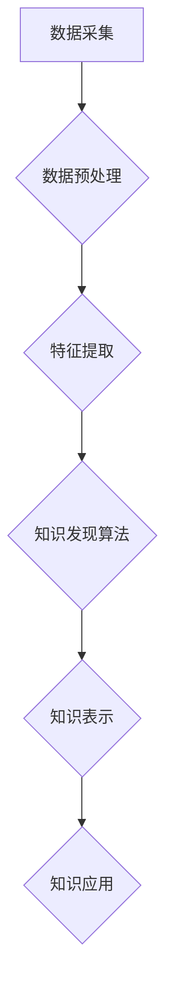

                 

## 知识发现引擎：人工智能时代的创新引擎

> 关键词：知识发现、人工智能、机器学习、深度学习、数据挖掘、数据分析、知识图谱

### 1. 背景介绍

在海量数据时代，数据已成为不可或缺的生产要素。然而，数据的价值并不在于其本身，而在于从中发现隐藏的知识和洞察力。知识发现（Knowledge Discovery，KD）作为数据挖掘的延伸，旨在从海量数据中自动提取有价值、可解释的知识，并将其转化为可利用的决策支持信息。

传统的数据挖掘方法主要依赖于人工特征工程和规则设定，效率低下且难以应对复杂、多变的数据场景。随着人工智能技术的飞速发展，特别是深度学习的突破，知识发现引擎迎来了新的机遇。人工智能算法能够自动学习数据中的复杂模式和关系，并生成更精准、更深入的知识发现结果。

### 2. 核心概念与联系

知识发现引擎的核心是将人工智能技术与数据挖掘技术相结合，构建一个智能化的知识发现系统。该系统通常包含以下几个关键模块：

* **数据预处理模块:** 对原始数据进行清洗、转换、整合等操作，使其符合知识发现算法的输入要求。
* **特征提取模块:** 利用机器学习算法自动提取数据中的特征，并构建特征向量，为后续知识发现算法提供输入。
* **知识发现算法模块:** 采用深度学习、强化学习等人工智能算法，从特征向量中挖掘出隐藏的知识和模式。
* **知识表示模块:** 将发现的知识以可理解、可解释的形式进行表示，例如知识图谱、规则表达式等。
* **知识应用模块:** 将知识应用于实际场景，例如决策支持、预测分析、个性化推荐等。

**Mermaid 流程图**



### 3. 核心算法原理 & 具体操作步骤

#### 3.1  算法原理概述

知识发现引擎的核心算法通常基于深度学习和机器学习技术。常见的算法包括：

* **深度神经网络 (DNN):** 能够学习数据中的复杂非线性关系，适用于文本、图像、音频等多种数据类型。
* **循环神经网络 (RNN):** 擅长处理序列数据，例如文本、时间序列等，能够捕捉数据中的时间依赖性。
* **图神经网络 (GNN):** 能够处理图结构数据，例如知识图谱、社交网络等，能够学习节点之间的关系和模式。

#### 3.2  算法步骤详解

以深度神经网络为例，其知识发现步骤可以概括为以下几个阶段：

1. **数据预处理:** 对原始数据进行清洗、转换、整合等操作，例如文本数据需要进行分词、词向量化等处理。
2. **特征提取:** 利用卷积神经网络 (CNN) 或递归神经网络 (RNN) 等深度学习模型，从数据中提取特征，例如文本数据可以提取词嵌入、句向量等特征。
3. **模型训练:** 利用训练数据训练深度神经网络模型，学习数据中的知识和模式。
4. **模型评估:** 利用测试数据评估模型的性能，例如准确率、召回率等指标。
5. **知识提取:** 利用训练好的模型对新的数据进行预测或分析，并提取出有价值的知识。

#### 3.3  算法优缺点

**优点:**

* 自动学习数据中的复杂模式和关系，无需人工特征工程。
* 能够处理海量数据，并发现隐藏的知识和洞察力。
* 能够适应复杂、多变的数据场景。

**缺点:**

* 训练深度学习模型需要大量数据和计算资源。
* 模型的解释性较差，难以理解模型是如何得出结论的。
* 模型容易受到数据偏差的影响。

#### 3.4  算法应用领域

知识发现引擎在各个领域都有广泛的应用，例如：

* **商业智能:** 从销售数据、客户行为数据等中发现商业模式和趋势，辅助决策。
* **医疗保健:** 从患者病历、基因数据等中发现疾病的风险因素和治疗方案。
* **金融科技:** 从交易数据、市场数据等中发现投资机会和风险。
* **科学研究:** 从实验数据、天文观测数据等中发现新的科学规律和知识。

### 4. 数学模型和公式 & 详细讲解 & 举例说明

#### 4.1  数学模型构建

知识发现引擎的数学模型通常基于概率论、统计学和机器学习算法。例如，深度神经网络的数学模型可以描述为：

* **激活函数:** 将神经元的输入映射到输出，常用的激活函数包括 sigmoid 函数、ReLU 函数等。
* **权重:** 连接神经元的参数，决定了神经元之间的连接强度。
* **偏置:** 每个神经元的常数项，用于调整神经元的输出。

#### 4.2  公式推导过程

深度神经网络的训练过程基于梯度下降算法，其目标是最小化模型的损失函数。损失函数通常定义为预测值与真实值的差值，例如均方误差 (MSE)。

**公式:**

$$
L = \frac{1}{N} \sum_{i=1}^{N} (y_i - \hat{y}_i)^2
$$

其中：

* $L$ 为损失函数
* $N$ 为样本数量
* $y_i$ 为真实值
* $\hat{y}_i$ 为预测值

梯度下降算法通过迭代更新模型的权重和偏置，使得损失函数逐渐减小。

#### 4.3  案例分析与讲解

以图像分类为例，假设我们训练一个深度神经网络模型，用于识别猫和狗的图像。

* **输入数据:** 猫和狗的图像数据，每个图像经过预处理后，转换为特征向量。
* **模型结构:** 深度神经网络模型包含多个卷积层、池化层和全连接层。
* **训练过程:** 利用训练数据训练模型，并使用梯度下降算法更新模型的权重和偏置。
* **测试过程:** 利用测试数据评估模型的性能，例如准确率、召回率等指标。

### 5. 项目实践：代码实例和详细解释说明

#### 5.1  开发环境搭建

* **操作系统:** Linux 或 macOS
* **编程语言:** Python
* **深度学习框架:** TensorFlow 或 PyTorch
* **其他工具:** Jupyter Notebook、Git

#### 5.2  源代码详细实现

以下是一个简单的深度神经网络模型的代码示例，使用 TensorFlow 框架实现图像分类任务：

```python
import tensorflow as tf

# 定义模型结构
model = tf.keras.models.Sequential([
  tf.keras.layers.Conv2D(32, (3, 3), activation='relu', input_shape=(28, 28, 1)),
  tf.keras.layers.MaxPooling2D((2, 2)),
  tf.keras.layers.Conv2D(64, (3, 3), activation='relu'),
  tf.keras.layers.MaxPooling2D((2, 2)),
  tf.keras.layers.Flatten(),
  tf.keras.layers.Dense(10, activation='softmax')
])

# 编译模型
model.compile(optimizer='adam',
              loss='sparse_categorical_crossentropy',
              metrics=['accuracy'])

# 训练模型
model.fit(x_train, y_train, epochs=5)

# 评估模型
loss, accuracy = model.evaluate(x_test, y_test)
print('Test loss:', loss)
print('Test accuracy:', accuracy)
```

#### 5.3  代码解读与分析

* **模型结构:** 该模型包含两个卷积层、两个池化层、一个扁平化层和一个全连接层。卷积层用于提取图像特征，池化层用于降低特征维度，扁平化层将多维特征转换为一维向量，全连接层用于分类。
* **编译模型:** 使用 Adam 优化器、稀疏类别交叉熵损失函数和准确率作为评估指标。
* **训练模型:** 使用训练数据训练模型，训练 epochs 次。
* **评估模型:** 使用测试数据评估模型的性能。

#### 5.4  运行结果展示

训练完成后，可以查看模型的测试损失和准确率。

### 6. 实际应用场景

#### 6.1  商业智能

知识发现引擎可以帮助企业从海量销售数据、客户行为数据等中发现商业模式和趋势，例如：

* **客户画像:** 分析客户的购买行为、浏览记录等数据，构建客户画像，进行精准营销。
* **产品推荐:** 根据用户的购买历史和浏览记录，推荐相关的产品，提高销售额。
* **市场趋势分析:** 分析市场数据，预测未来的市场趋势，帮助企业制定战略决策。

#### 6.2  医疗保健

知识发现引擎可以帮助医疗机构从患者病历、基因数据等中发现疾病的风险因素和治疗方案，例如：

* **疾病诊断:** 分析患者的症状、检查结果等数据，辅助医生进行疾病诊断。
* **个性化治疗:** 根据患者的基因信息、病史等数据，制定个性化的治疗方案。
* **药物研发:** 分析药物的临床试验数据，发现新的药物靶点和治疗方法。

#### 6.3  金融科技

知识发现引擎可以帮助金融机构从交易数据、市场数据等中发现投资机会和风险，例如：

* **欺诈检测:** 分析交易数据，识别异常交易行为，防止欺诈。
* **风险管理:** 分析市场数据，预测金融风险，帮助机构进行风险管理。
* **投资决策:** 分析市场数据，发现投资机会，辅助投资决策。

#### 6.4  未来应用展望

随着人工智能技术的不断发展，知识发现引擎将在更多领域得到应用，例如：

* **教育:** 个性化学习推荐、自动批改作业等。
* **智能制造:** 产品质量控制、生产过程优化等。
* **智能城市:** 交通管理、环境监测等。

### 7. 工具和资源推荐

#### 7.1  学习资源推荐

* **书籍:**
    * 《深度学习》 by Ian Goodfellow, Yoshua Bengio, Aaron Courville
    * 《机器学习》 by Tom Mitchell
* **在线课程:**
    * Coursera: 深度学习 Specialization
    * edX: 机器学习
* **博客和网站:**
    * TensorFlow Blog: https://blog.tensorflow.org/
    * PyTorch Blog: https://pytorch.org/blog/

#### 7.2  开发工具推荐

* **深度学习框架:** TensorFlow, PyTorch, Keras
* **数据处理工具:** Pandas, NumPy
* **可视化工具:** Matplotlib, Seaborn

#### 7.3  相关论文推荐

* **《Attention Is All You Need》:** https://arxiv.org/abs/1706.03762
* **《BERT: Pre-training of Deep Bidirectional Transformers for Language Understanding》:** https://arxiv.org/abs/1810.04805
* **《Graph Convolutional Networks》:** https://arxiv.org/abs/1609.02907

### 8. 总结：未来发展趋势与挑战

#### 8.1  研究成果总结

知识发现引擎在人工智能时代取得了显著的进展，能够自动学习数据中的复杂模式和关系，并生成有价值的知识和洞察力。

#### 8.2  未来发展趋势

* **更强大的模型:** 研究更深、更复杂的深度学习模型，例如 Transformer、Generative Adversarial Networks (GAN) 等，以提高知识发现的精度和效率。
* **更有效的算法:** 研究更有效的知识发现算法，例如强化学习、联邦学习等，以应对更复杂、更海量的数据场景。
* **更可解释的模型:** 研究更可解释的深度学习模型，例如可视化解释、规则提取等，以提高模型的透明度和可信度。

#### 8.3  面临的挑战

* **数据质量:** 知识发现引擎的性能依赖于数据的质量，而现实世界的数据往往存在噪声、缺失和不一致等问题。
* **计算资源:** 训练深度学习模型需要大量的计算资源，这对于一些资源有限的机构来说是一个挑战。
* **伦理问题:** 知识发现引擎可能会产生带有偏见或歧视性的结果，因此需要关注其伦理问题。

#### 8.4  研究展望

未来，知识发现引擎将继续朝着更智能、更强大、更可解释的方向发展，并将在更多领域发挥重要作用。


### 9. 附录：常见问题与解答

**Q1: 知识发现引擎与数据挖掘有什么区别？**

**A1:** 知识发现引擎是数据挖掘的延伸，它利用人工智能技术，能够自动学习数据中的复杂模式和关系，并生成更精准、更深入的知识发现结果。而传统的数据挖掘方法主要依赖于人工特征工程和规则设定，效率低下且难以应对复杂、多变的数据场景。

**Q2: 如何选择合适的知识发现引擎？**

**A2:** 选择合适的知识发现引擎需要考虑以下因素：

* 数据类型：不同的数据类型需要使用不同的知识发现引擎。
* 知识发现目标：不同的知识发现目标需要使用不同的算法和模型。
* 计算资源：不同的知识发现引擎对计算资源的需求不同。
* 经验和技能：开发人员的经验和技能也会影响选择知识发现引擎。


作者：禅与计算机程序设计艺术 / Zen and the Art of Computer Programming 
<end_of_turn>

