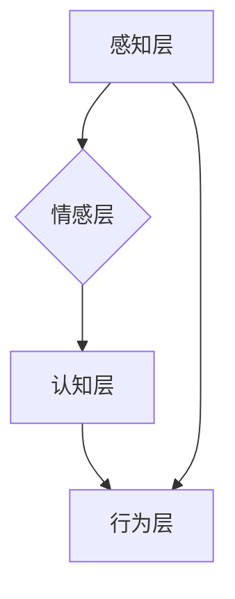

                 

## 体验层次构建器开发者：AI创造的多维感知架构师

> 关键词：人工智能、多维感知、体验层次、架构师、AI创造、感知模型、深度学习、神经网络、交互设计

## 1. 背景介绍

在当今数据爆炸的时代，人工智能（AI）正以惊人的速度发展，深刻地改变着我们生活和工作的方式。从自动驾驶到智能客服，从个性化推荐到医疗诊断，AI技术的应用领域日益广泛。然而，我们仍然面临着如何让AI更好地理解和响应人类需求的挑战。

传统的AI模型往往局限于处理单一类型的数据，例如文本、图像或音频。它们难以捕捉到人类体验的多维性和复杂性。为了解决这个问题，我们需要构建更先进的AI模型，能够理解和模拟人类的多维感知能力。

体验层次构建器（Experience Layer Builder，简称ELB）应运而生。ELB是一种全新的AI架构，旨在构建多维感知模型，能够理解和响应人类在不同层次上的体验。

## 2. 核心概念与联系

ELB的核心概念是将人类体验分解成多个层次，每个层次对应不同的感知维度和认知能力。这些层次包括：

* **感知层:** 包含视觉、听觉、触觉、嗅觉和味觉等感官感知。
* **情感层:** 包含快乐、悲伤、愤怒、恐惧等情感体验。
* **认知层:** 包含思考、记忆、学习、决策等认知能力。
* **行为层:** 包含行动、互动、交流等行为表现。

ELB通过将这些层次连接起来，构建一个多维感知网络，能够捕捉到人类体验的丰富性和复杂性。

**Mermaid 流程图:**



## 3. 核心算法原理 & 具体操作步骤

### 3.1  算法原理概述

ELB的核心算法是深度学习，它利用多层神经网络来模拟人类大脑的学习和推理过程。ELB采用了一种新的网络结构，称为多维感知网络（Multi-Dimensional Perception Network，简称MDPN）。MDPN由多个感知模块组成，每个模块负责处理不同的感知维度。这些模块之间通过连接层进行信息交互，形成一个多维感知网络。

### 3.2  算法步骤详解

1. **数据预处理:** 收集和预处理来自不同感知维度的原始数据，例如图像、音频、文本等。
2. **特征提取:** 使用卷积神经网络（CNN）、循环神经网络（RNN）等深度学习模型提取每个感知维度的特征。
3. **多维融合:** 将不同感知维度的特征融合在一起，形成一个多维特征向量。
4. **情感识别:** 使用情感识别模型识别用户的情感状态。
5. **认知推理:** 使用认知推理模型分析用户的情感和行为，理解用户的意图和需求。
6. **行为生成:** 根据用户的情感和需求，生成相应的行为响应。

### 3.3  算法优缺点

**优点:**

* 能够捕捉到人类体验的多维性和复杂性。
* 能够理解和响应用户的不同层次需求。
* 具有较强的泛化能力，能够应用于不同的场景。

**缺点:**

* 需要大量的训练数据。
* 计算复杂度较高。
* 难以解释模型的决策过程。

### 3.4  算法应用领域

ELB的应用领域非常广泛，包括：

* **人机交互:** 开发更自然、更智能的人机交互系统。
* **虚拟现实:** 创建更沉浸式、更逼真的虚拟现实体验。
* **情感计算:** 分析和理解用户的 emosi，提供个性化的服务。
* **医疗诊断:** 辅助医生进行诊断，提高医疗效率。

## 4. 数学模型和公式 & 详细讲解 & 举例说明

### 4.1  数学模型构建

ELB的数学模型基于深度学习，主要包括以下几个方面：

* **感知模块:** 使用卷积神经网络（CNN）或循环神经网络（RNN）等模型提取不同感知维度的特征。
* **连接层:** 使用全连接层或注意力机制将不同感知模块的特征融合在一起。
* **情感识别层:** 使用多层感知机（MLP）或循环神经网络（RNN）等模型识别用户的感情状态。
* **认知推理层:** 使用图神经网络（GNN）或强化学习（RL）等模型分析用户的感情和行为，理解用户的意图和需求。
* **行为生成层:** 使用生成对抗网络（GAN）或变分自编码器（VAE）等模型生成相应的行为响应。

### 4.2  公式推导过程

由于篇幅限制，这里只列举一些关键公式的推导过程，例如情感识别层的损失函数：

$$
L = -\sum_{i=1}^{N} y_i \log(\hat{y}_i) + (1-y_i) \log(1-\hat{y}_i)
$$

其中：

* $N$ 是样本数量。
* $y_i$ 是真实情感标签。
* $\hat{y}_i$ 是模型预测的情感概率。

### 4.3  案例分析与讲解

假设我们构建一个ELB模型用于分析用户的在线购物体验。

* **感知层:** 收集用户的浏览记录、购买历史、评价内容等数据。
* **情感层:** 使用情感识别模型分析用户的评论和评价，识别用户的满意度、沮丧度等情感状态。
* **认知层:** 使用认知推理模型分析用户的浏览行为和购买决策，理解用户的需求和偏好。
* **行为层:** 根据用户的需求和偏好，推荐相关的商品、提供个性化的服务，提升用户的购物体验。

## 5. 项目实践：代码实例和详细解释说明

### 5.1  开发环境搭建

ELB的开发环境需要包含以下软件：

* Python 3.x
* TensorFlow 或 PyTorch 深度学习框架
* Jupyter Notebook 或 VS Code 代码编辑器
* CUDA 和 cuDNN GPU加速库

### 5.2  源代码详细实现

由于篇幅限制，这里只提供一个简单的ELB模型的代码示例，用于情感识别任务：

```python
import tensorflow as tf

# 定义情感识别模型
model = tf.keras.Sequential([
    tf.keras.layers.Embedding(input_dim=10000, output_dim=128),
    tf.keras.layers.LSTM(units=64),
    tf.keras.layers.Dense(units=3, activation='softmax')
])

# 编译模型
model.compile(optimizer='adam',
              loss='sparse_categorical_crossentropy',
              metrics=['accuracy'])

# 训练模型
model.fit(x_train, y_train, epochs=10)

# 评估模型
loss, accuracy = model.evaluate(x_test, y_test)
print('Loss:', loss)
print('Accuracy:', accuracy)
```

### 5.3  代码解读与分析

这段代码定义了一个简单的ELB模型，用于情感识别任务。

* **Embedding层:** 将文本单词转换为向量表示。
* **LSTM层:** 使用循环神经网络提取文本序列的上下文信息。
* **Dense层:** 使用全连接层进行分类，输出情感类别概率。

### 5.4  运行结果展示

训练完成后，可以使用测试数据评估模型的性能。

## 6. 实际应用场景

ELB的实际应用场景非常广泛，例如：

* **智能客服:** ELB可以帮助智能客服更好地理解用户的需求，提供更精准的回复。
* **个性化推荐:** ELB可以根据用户的喜好和行为，推荐更个性化的商品和服务。
* **医疗诊断辅助:** ELB可以帮助医生分析患者的症状和病史，辅助进行诊断。

### 6.4  未来应用展望

未来，ELB将应用于更多领域，例如：

* **教育:** ELB可以帮助教育机构提供个性化的学习体验。
* **娱乐:** ELB可以帮助游戏开发者创建更沉浸式的游戏体验。
* **艺术创作:** ELB可以帮助艺术家创作更具创意的艺术作品。

## 7. 工具和资源推荐

### 7.1  学习资源推荐

* **深度学习书籍:** 《深度学习》 (Ian Goodfellow, Yoshua Bengio, Aaron Courville)
* **在线课程:** Coursera、edX、Udacity 等平台提供深度学习课程。
* **开源项目:** TensorFlow、PyTorch 等深度学习框架的官方文档和示例代码。

### 7.2  开发工具推荐

* **Python:** 深度学习开发的主要编程语言。
* **Jupyter Notebook:** 用于编写和执行深度学习代码的交互式环境。
* **VS Code:** 强大的代码编辑器，支持深度学习开发。

### 7.3  相关论文推荐

* **Attention Is All You Need:** https://arxiv.org/abs/1706.03762
* **Generative Adversarial Networks:** https://arxiv.org/abs/1406.2661
* **Deep Learning for Natural Language Processing:** https://arxiv.org/abs/1803.01076

## 8. 总结：未来发展趋势与挑战

### 8.1  研究成果总结

ELB为构建更智能、更具感知能力的AI模型提供了新的思路和方法。它能够更好地理解和响应人类体验的多维性和复杂性，在人机交互、虚拟现实、情感计算等领域具有广阔的应用前景。

### 8.2  未来发展趋势

未来，ELB的研究将朝着以下几个方向发展：

* **多模态感知:** 将不同类型的感知数据融合在一起，构建更全面的感知模型。
* **自监督学习:** 利用无标签数据进行训练，降低模型对标注数据的依赖。
* **可解释性:** 提高模型的透明度和可解释性，帮助人类更好地理解模型的决策过程。

### 8.3  面临的挑战

ELB的发展也面临着一些挑战：

* **数据获取:** 收集高质量的多维感知数据仍然是一个难题。
* **模型复杂度:** ELB模型的复杂度较高，训练和部署成本也相对较高。
* **伦理问题:** ELB的应用可能引发一些伦理问题，例如隐私保护和算法偏见。

### 8.4  研究展望

尽管面临挑战，但ELB的研究前景依然光明。随着人工智能技术的不断发展，ELB将成为构建更智能、更具感知能力的AI模型的重要工具，为人类社会带来更多福祉。

## 9. 附录：常见问题与解答

**Q1: ELB与传统的AI模型有什么区别？**

**A1:** ELB与传统的AI模型最大的区别在于其能够捕捉到人类体验的多维性和复杂性。传统的AI模型往往局限于处理单一类型的数据，而ELB则能够处理来自不同感知维度的多类型数据，构建更全面的感知模型。

**Q2: ELB的应用场景有哪些？**

**A2:** ELB的应用场景非常广泛，包括人机交互、虚拟现实、情感计算、医疗诊断辅助等。

**Q3: 如何搭建ELB的开发环境？**

**A3:** ELB的开发环境需要包含Python、TensorFlow或PyTorch深度学习框架、Jupyter Notebook或VS Code代码编辑器以及CUDA和cuDNN GPU加速库。

**作者：禅与计算机程序设计艺术 / Zen and the Art of Computer Programming**


<end_of_turn>

