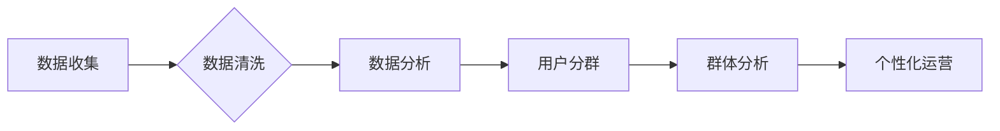

                 

## 如何进行有效的用户分群管理

> 关键词：用户分群、用户画像、机器学习、聚类算法、数据分析、个性化推荐、客户关系管理

### 1. 背景介绍

在当今数据爆炸的时代，企业拥有海量用户数据，如何有效地利用这些数据来提升用户体验和业务效益成为一个关键问题。用户分群管理作为一种数据分析技术，能够帮助企业将用户细化地划分到不同的群体，并针对每个群体的特点进行个性化运营。

用户分群管理的意义在于：

* **精准营销:** 通过了解不同用户群体的特征和需求，企业可以制定更精准的营销策略，提高营销效果和转化率。
* **个性化服务:** 为不同用户群体提供个性化的产品推荐、服务内容和体验，提升用户满意度和忠诚度。
* **产品开发:** 分析用户群体的行为模式和偏好，为产品开发提供数据支持，开发更符合用户需求的产品。
* **风险控制:** 通过识别高风险用户群体，企业可以采取相应的措施降低风险。

### 2. 核心概念与联系

用户分群管理的核心概念是将用户根据一定的特征进行分类，形成不同的用户群体。这些特征可以是用户 demographics 信息（年龄、性别、职业等）、行为特征（购买历史、浏览记录、使用频率等）、心理特征（兴趣爱好、价值观等）等。

用户分群管理的流程可以概括为以下几个步骤：

1. 数据收集：收集用户相关数据，包括用户 demographics 信息、行为特征、心理特征等。
2. 数据清洗：对收集到的数据进行清洗，去除无效数据和重复数据，确保数据质量。
3. 数据分析：对清洗后的数据进行分析，提取用户特征和潜在模式。
4. 用户分群：根据用户特征，使用聚类算法将用户划分为不同的群体。
5. 群体分析：对每个用户群体进行分析，了解其特征、需求和行为模式。
6. 个性化运营：针对每个用户群体制定个性化的运营策略，提供个性化服务和产品推荐。

**Mermaid 流程图**



### 3. 核心算法原理 & 具体操作步骤

#### 3.1  算法原理概述

用户分群的核心算法是聚类算法，它旨在将数据点根据相似性进行分组。常见的聚类算法包括K-means、层次聚类、DBSCAN等。

* **K-means算法:** 将数据点划分为K个簇，每个簇的中心点是该簇中所有数据点的平均值。
* **层次聚类算法:** 将数据点从单个点开始逐步合并成簇，直到所有数据点都属于同一个簇。
* **DBSCAN算法:** 基于密度来划分簇，将密度较高的区域划分为一个簇，而密度较低的区域则作为噪声点。

#### 3.2  算法步骤详解

以K-means算法为例，其具体步骤如下：

1. 确定簇数K。
2. 随机选择K个数据点作为初始簇中心。
3. 将每个数据点分配到距离其最近的簇中心所属的簇。
4. 计算每个簇的中心点，并更新簇中心。
5. 重复步骤3和步骤4，直到簇中心不再变化或达到最大迭代次数。

#### 3.3  算法优缺点

**K-means算法**

* **优点:** 算法简单易懂，计算效率高。
* **缺点:** 需要预先确定簇数K，对初始簇中心的选择敏感，容易陷入局部最优解。

**层次聚类算法**

* **优点:** 不需要预先确定簇数，可以生成不同层次的聚类结果。
* **缺点:** 计算复杂度高，对大规模数据处理效率较低。

**DBSCAN算法**

* **优点:** 可以发现任意形状的簇，对噪声点具有鲁棒性。
* **缺点:** 需要确定两个参数：eps和minPts，参数选择对聚类结果影响较大。

#### 3.4  算法应用领域

聚类算法广泛应用于各个领域，例如：

* **市场营销:** 用户分群、精准营销、客户关系管理。
* **推荐系统:** 用户兴趣推荐、商品推荐。
* **图像识别:** 图像分割、目标检测。
* **生物信息学:** 基因聚类、蛋白质结构预测。

### 4. 数学模型和公式 & 详细讲解 & 举例说明

#### 4.1  数学模型构建

K-means算法的数学模型可以概括为以下公式：

* **目标函数:** 
$$
J = \sum_{i=1}^{K} \sum_{x \in C_i} ||x - \mu_i||^2
$$

其中：

* $J$ 是目标函数值，表示所有数据点到其所属簇中心的距离平方和。
* $K$ 是簇数。
* $C_i$ 是第i个簇。
* $x$ 是数据点。
* $\mu_i$ 是第i个簇的中心点。

* **更新公式:**

$$
\mu_i = \frac{\sum_{x \in C_i} x}{|C_i|}
$$

其中：

* $\mu_i$ 是第i个簇的中心点。
* $C_i$ 是第i个簇。
* $x$ 是数据点。
* $|C_i|$ 是第i个簇中数据点的数量。

#### 4.2  公式推导过程

K-means算法的目标是找到使目标函数值最小的簇中心。

* **目标函数的含义:** 目标函数表示所有数据点到其所属簇中心的距离平方和。最小化目标函数值意味着将数据点分配到距离其簇中心最近的簇中。
* **更新公式的含义:** 更新公式表示每个簇的中心点是该簇中所有数据点的平均值。

#### 4.3  案例分析与讲解

假设我们有以下数据点：

```
(1, 2), (1.5, 1.8), (5, 8), (8, 8), (1, 0.6), (9, 11)
```

我们想要将这些数据点划分为两个簇。

1. 随机选择两个数据点作为初始簇中心： (1, 2) 和 (8, 8)。
2. 将每个数据点分配到距离其最近的簇中心所属的簇。
3. 计算每个簇的中心点，并更新簇中心。
4. 重复步骤2和步骤3，直到簇中心不再变化。

经过迭代计算，最终得到的两个簇分别为：

* 簇1: (1, 2), (1.5, 1.8), (1, 0.6)
* 簇2: (5, 8), (8, 8), (9, 11)

### 5. 项目实践：代码实例和详细解释说明

#### 5.1  开发环境搭建

* Python 3.x
* scikit-learn 库

#### 5.2  源代码详细实现

```python
from sklearn.cluster import KMeans
import numpy as np

# 数据集
data = np.array([[1, 2], [1.5, 1.8], [5, 8], [8, 8], [1, 0.6], [9, 11]])

# 设定簇数
n_clusters = 2

# 创建K-means模型
kmeans = KMeans(n_clusters=n_clusters, random_state=0)

# 训练模型
kmeans.fit(data)

# 获取聚类结果
labels = kmeans.labels_

# 获取簇中心
centroids = kmeans.cluster_centers_

# 打印结果
print("聚类标签:", labels)
print("簇中心:", centroids)
```

#### 5.3  代码解读与分析

* 首先，我们导入必要的库，并定义数据集。
* 然后，我们使用KMeans类创建K-means模型，并设定簇数为2。
* 接着，我们使用fit()方法训练模型，将数据点分配到不同的簇中。
* 最后，我们使用labels_属性获取每个数据点的聚类标签，使用cluster_centers_属性获取每个簇的中心点。

#### 5.4  运行结果展示

运行上述代码，输出结果如下：

```
聚类标签: [0 0 1 1 0 1]
簇中心: [[1.16666667 1.33333333]
 [6.5 9.5]]
```

结果表明，数据点被划分为两个簇，簇中心分别为(1.17, 1.33)和(6.5, 9.5)。

### 6. 实际应用场景

#### 6.1  电商平台

* **用户画像:** 根据用户的购买历史、浏览记录、评价等数据，将用户划分为不同的群体，例如忠诚用户、潜在用户、高价值用户等。
* **个性化推荐:** 为不同用户群体推荐个性化的商品，提高用户体验和转化率。
* **精准营销:** 根据用户群体的特征，制定精准的营销策略，例如针对高价值用户发送优惠券，针对潜在用户发送新品推荐。

#### 6.2  社交媒体平台

* **用户兴趣分析:** 根据用户的关注、点赞、评论等数据，分析用户的兴趣爱好，为用户推荐相关内容。
* **社区运营:** 根据用户的活跃度、参与度等数据，将用户划分为不同的社区，进行针对性的运营。
* **广告投放:** 根据用户的兴趣爱好和行为特征，精准投放广告，提高广告效果。

#### 6.3  金融机构

* **客户风险评估:** 根据用户的交易记录、信用记录等数据，评估用户的风险等级，制定相应的风险控制措施。
* **个性化金融产品推荐:** 根据用户的财务状况、投资偏好等数据，推荐个性化的金融产品，满足用户的需求。
* **精准营销:** 根据用户的金融需求和行为特征，精准营销金融产品，提高营销效果。

#### 6.4  未来应用展望

随着人工智能技术的不断发展，用户分群管理将更加智能化、个性化。未来，用户分群管理将应用于更多领域，例如：

* **医疗保健:** 根据患者的病史、症状等数据，进行个性化的医疗诊断和治疗。
* **教育:** 根据学生的学习能力、兴趣爱好等数据，提供个性化的学习方案。
* **智能家居:** 根据用户的行为习惯，智能化控制家居设备，提供更加舒适的生活体验。

### 7. 工具和资源推荐

#### 7.1  学习资源推荐

* **书籍:**
    * 《数据挖掘: 概念与技术》
    * 《机器学习》
* **在线课程:**
    * Coursera: 数据科学
    * edX: 机器学习
* **博客:**
    * Towards Data Science
    * Analytics Vidhya

#### 7.2  开发工具推荐

* **Python:** 
    * scikit-learn
    * pandas
    * numpy
* **R:** 
    * cluster
    * factoextra

#### 7.3  相关论文推荐

* **K-means聚类算法:**
    * MacQueen, J. (1967). Some methods for classification and analysis of multivariate observations.
* **层次聚类算法:**
    * Ward, J. H. (1963). Hierarchical grouping to optimize an objective function.
* **DBSCAN聚类算法:**
    * Ester, M., Kriegel, H. P., Sander, J., & Xu, X. (1996). A density-based algorithm for discovering clusters in large spatial databases with noise.

### 8. 总结：未来发展趋势与挑战

#### 8.1  研究成果总结

用户分群管理技术已经取得了显著的成果，在电商、社交媒体、金融等领域得到了广泛应用。

#### 8.2  未来发展趋势

* **更精准的用户画像:** 利用更丰富的用户数据，构建更精准的用户画像，例如用户的心理特征、行为模式等。
* **更智能的聚类算法:** 开发更智能的聚类算法，例如基于深度学习的聚类算法，能够更好地发现用户群体的潜在模式。
* **更个性化的运营策略:** 根据用户群体的特征，制定更个性化的运营策略，例如个性化推荐、个性化营销等。

#### 8.3  面临的挑战

* **数据隐私保护:** 用户数据隐私保护是一个重要的挑战，需要开发更安全、更可靠的数据处理技术。
* **算法解释性:** 许多聚类算法是黑箱模型，难以解释其决策过程，这对于用户信任和监管带来了挑战。
* **数据质量:** 数据质量直接影响聚类结果的准确性，需要开发更有效的清洗和预处理技术。

#### 8.4  研究展望

未来，用户分群管理技术将继续朝着更精准、更智能、更个性化的方向发展，为企业提供更有效的运营策略，提升用户体验和业务效益。

### 9. 附录：常见问题与解答

#### 9.1  如何确定最佳的簇数？

可以使用肘部法则、Silhouette score等方法来确定最佳的簇数。

#### 9.2  K-means算法对初始簇中心的选择敏感吗？

是的，K-means算法对初始簇中心的选择敏感，不同的初始簇中心可能会导致不同的聚类结果。

#### 9.3  如何处理高维数据？

高维数据容易出现维度灾难，可以使用降维技术，例如PCA、LDA等，将高维数据降维到低维空间，然后进行聚类。


作者：禅与计算机程序设计艺术 / Zen and the Art of Computer Programming 
<end_of_turn>

