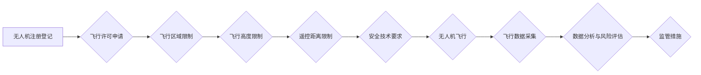

                 

## 硅谷无人机监管新规:保障航空安全

> 关键词：无人机、监管、航空安全、人工智能、机器学习、传感器、通信、数据分析、风险评估

## 1. 背景介绍

近年来，无人机技术飞速发展，其应用领域不断拓展，从物流运输、农业监测到娱乐摄影，无人机已成为现代社会不可或缺的一部分。然而，随着无人机数量的激增，其安全性和监管问题也日益凸显。

硅谷作为全球科技创新中心，无人机产业蓬勃发展，但同时也面临着监管挑战。为了保障航空安全，维护公共秩序，硅谷地区政府制定了一系列新的无人机监管新规，旨在规范无人机使用，降低安全风险。

## 2. 核心概念与联系

### 2.1 无人机监管新规的核心概念

无人机监管新规的核心概念包括：

* **注册登记:** 所有无人机用户必须将无人机注册登记，并提供相关信息，以便政府追踪和管理无人机。
* **飞行许可:**  根据无人机类型和用途，用户需要获得相应的飞行许可，确保无人机飞行符合安全规定。
* **飞行区域限制:**  为了避免与航空器冲突，无人机飞行区域受到限制，禁止在特定区域飞行，例如机场附近、人口密集区等。
* **飞行高度限制:**  无人机飞行高度受到限制，一般不超过一定高度，以避免与航空器发生碰撞。
* **遥控距离限制:**  无人机遥控距离受到限制，以确保飞行员能够有效控制无人机。
* **安全技术要求:**  无人机必须配备必要的安全技术，例如避障系统、降落备用系统等，以降低飞行风险。

### 2.2 无人机监管新规的架构



## 3. 核心算法原理 & 具体操作步骤

### 3.1 算法原理概述

无人机监管新规的实施依赖于一系列核心算法，例如：

* **路径规划算法:**  用于规划无人机飞行路径，避免与障碍物和航空器冲突。
* **避障算法:**  用于检测障碍物，并自动调整无人机飞行路径，避免碰撞。
* **风险评估算法:**  用于评估无人机飞行风险，并根据风险等级采取相应的监管措施。
* **数据分析算法:**  用于分析无人机飞行数据，识别异常行为，并进行预警。

### 3.2 算法步骤详解

以路径规划算法为例，其具体操作步骤如下：

1. **获取环境信息:**  无人机利用传感器获取周围环境信息，包括障碍物位置、地形特征等。
2. **构建地图:**  根据获取的环境信息，无人机构建环境地图，并标注障碍物位置。
3. **规划路径:**  无人机利用路径规划算法，在环境地图的基础上规划一条安全、高效的飞行路径。
4. **执行路径:**  无人机按照规划好的路径飞行，并实时监测环境变化，进行路径调整。

### 3.3 算法优缺点

* **优点:**  路径规划算法能够有效避免无人机与障碍物和航空器冲突，提高飞行安全性。
* **缺点:**  路径规划算法的复杂度较高，对计算资源要求较高，并且在复杂环境下，算法的性能可能会下降。

### 3.4 算法应用领域

路径规划算法广泛应用于无人机领域，例如：

* **物流运输:**  无人机利用路径规划算法，规划最优的配送路线，提高效率。
* **农业监测:**  无人机利用路径规划算法，规划最优的监测路线，覆盖整个农田。
* **搜索救援:**  无人机利用路径规划算法，规划最优的搜索路线，提高救援效率。

## 4. 数学模型和公式 & 详细讲解 & 举例说明

### 4.1 数学模型构建

无人机路径规划问题可以抽象为一个图论问题，其中：

* 节点代表无人机可以到达的位置。
* 边代表无人机从一个位置到另一个位置的路径。

路径规划算法的目标是找到从起点到终点的最优路径，其中最优路径可以根据不同的需求定义，例如：

* 最短路径
* 最快路径
* 最低成本路径

### 4.2 公式推导过程

假设无人机从起点 $s$ 到达终点 $t$，路径集合为 $P$，每个路径 $p \in P$ 的长度为 $l(p)$，则最短路径问题可以表示为：

$$
p^* = \arg \min_{p \in P} l(p)
$$

其中，$p^*$ 代表最短路径。

### 4.3 案例分析与讲解

例如，无人机需要从 $A$ 点飞到 $B$ 点，路径集合为 $P = \{A \to B, A \to C \to B\}$，路径 $A \to B$ 的长度为 $l(A \to B) = 5$，路径 $A \to C \to B$ 的长度为 $l(A \to C \to B) = 7$，则最短路径为 $A \to B$。

## 5. 项目实践：代码实例和详细解释说明

### 5.1 开发环境搭建

* 操作系统: Ubuntu 20.04
* 编程语言: Python 3.8
* 库依赖: ROS (Robot Operating System), OpenCV, NumPy

### 5.2 源代码详细实现

```python
import rospy
from geometry_msgs.msg import PoseStamped

class PathPlanner:
    def __init__(self):
        self.start_pose = PoseStamped()
        self.goal_pose = PoseStamped()
        self.path = []

    def set_start_pose(self, x, y, z):
        self.start_pose.pose.position.x = x
        self.start_pose.pose.position.y = y
        self.start_pose.pose.position.z = z

    def set_goal_pose(self, x, y, z):
        self.goal_pose.pose.position.x = x
        self.goal_pose.pose.position.y = y
        self.goal_pose.pose.position.z = z

    def plan_path(self):
        # 使用路径规划算法规划路径
        # ...
        return self.path

    def publish_path(self):
        # 发布规划好的路径
        # ...

if __name__ == '__main__':
    rospy.init_node('path_planner')
    planner = PathPlanner()
    planner.set_start_pose(0, 0, 0)
    planner.set_goal_pose(10, 10, 0)
    path = planner.plan_path()
    planner.publish_path()
```

### 5.3 代码解读与分析

* `PathPlanner` 类负责无人机路径规划。
* `set_start_pose` 和 `set_goal_pose` 方法设置无人机的起点和终点坐标。
* `plan_path` 方法使用路径规划算法规划路径，具体算法实现需要根据实际需求进行定制。
* `publish_path` 方法发布规划好的路径信息。

### 5.4 运行结果展示

运行代码后，无人机将根据规划好的路径飞行。

## 6. 实际应用场景

### 6.1 无人机物流运输

无人机物流运输可以提高效率，降低成本，并为偏远地区提供物流服务。

### 6.2 无人机农业监测

无人机可以用于监测农田的生长状况，识别病虫害，并进行精准施肥。

### 6.3 无人机搜索救援

无人机可以用于搜索失踪人员，并提供救援物资。

### 6.4 未来应用展望

随着无人机技术的不断发展，其应用场景将更加广泛，例如：

* 无人机空中交通管理
* 无人机医疗救援
* 无人机环境监测
* 无人机城市巡逻

## 7. 工具和资源推荐

### 7.1 学习资源推荐

* **书籍:**
    * 《无人机技术入门》
    * 《无人机编程》
* **在线课程:**
    * Coursera:无人机飞行控制
    * edX:无人机应用

### 7.2 开发工具推荐

* **ROS (Robot Operating System):**  开源机器人操作系统，提供丰富的工具和库，用于无人机开发。
* **OpenCV:**  开源计算机视觉库，用于无人机图像处理和目标识别。
* **NumPy:**  开源数值计算库，用于无人机数据分析和算法实现。

### 7.3 相关论文推荐

* **无人机路径规划算法研究**
* **无人机避障算法综述**
* **无人机风险评估方法**

## 8. 总结：未来发展趋势与挑战

### 8.1 研究成果总结

硅谷无人机监管新规的实施，标志着无人机产业迈向规范化发展的新阶段。

### 8.2 未来发展趋势

未来，无人机监管新规将更加完善，更加智能化，并与人工智能、机器学习等技术深度融合。

### 8.3 面临的挑战

* **技术挑战:**  无人机技术发展迅速，监管新规需要不断跟进更新，以适应新的技术发展。
* **法律法规挑战:**  无人机监管法律法规体系尚不完善，需要进一步完善，以规范无人机使用。
* **社会伦理挑战:**  无人机应用涉及到隐私、安全等社会伦理问题，需要引起社会广泛关注和讨论。

### 8.4 研究展望

未来，研究者将继续探索无人机监管的新技术、新方法，以保障航空安全，促进无人机产业健康发展。

## 9. 附录：常见问题与解答

### 9.1  无人机需要注册吗？

是的，所有无人机用户必须将无人机注册登记，并提供相关信息。

### 9.2  无人机可以飞到哪里？

无人机飞行区域受到限制，禁止在特定区域飞行，例如机场附近、人口密集区等。

### 9.3  无人机飞行高度限制是多少？

无人机飞行高度受到限制，一般不超过一定高度，以避免与航空器发生碰撞。

### 9.4  无人机遥控距离限制是多少？

无人机遥控距离受到限制，以确保飞行员能够有效控制无人机。

### 9.5  无人机需要配备哪些安全技术？

无人机必须配备必要的安全技术，例如避障系统、降落备用系统等，以降低飞行风险。


作者：禅与计算机程序设计艺术 / Zen and the Art of Computer Programming 
<end_of_turn>

