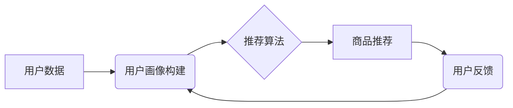

                 

## AI驱动的电商平台个性化推送策略

> 关键词：电商平台、个性化推荐、机器学习、深度学习、协同过滤、内容过滤、用户画像、推荐算法、A/B测试

## 1. 背景介绍

在当今数据爆炸的时代，电商平台面临着激烈的竞争。为了提升用户体验，提高转化率，个性化推荐已经成为电商平台的核心竞争力之一。传统的推荐算法主要依赖于用户历史行为和商品属性，但随着用户行为的复杂性和商品信息的丰富性不断增加，传统的算法难以满足个性化推荐的需求。

AI驱动的个性化推荐策略利用机器学习和深度学习等人工智能技术，能够更精准地理解用户的需求，并推荐更符合用户偏好的商品。这不仅可以提升用户满意度，还可以提高电商平台的销售额和用户粘性。

## 2. 核心概念与联系

### 2.1 个性化推荐

个性化推荐是指根据用户的个人特征、兴趣爱好、购买历史等信息，为用户提供定制化的商品推荐。其目标是提高用户体验，提升用户满意度，最终促进销售转化。

### 2.2 机器学习

机器学习是人工智能领域的重要分支，它通过算法训练模型，使模型能够从数据中学习，并对新数据进行预测或分类。在个性化推荐中，机器学习算法可以根据用户的历史行为和商品属性，学习用户的偏好，并预测用户可能感兴趣的商品。

### 2.3 深度学习

深度学习是机器学习的进一步发展，它利用多层神经网络来模拟人类大脑的学习过程。深度学习算法能够处理更复杂的数据，并学习更深层次的特征，因此在个性化推荐中具有更强的学习能力和预测精度。

**核心概念与架构流程图**



## 3. 核心算法原理 & 具体操作步骤

### 3.1 算法原理概述

个性化推荐算法主要分为两大类：协同过滤和内容过滤。

* **协同过滤:** 基于用户的相似性或商品的相似性进行推荐。例如，如果用户A和用户B都喜欢购买相同的商品，那么当用户A浏览商品C时，系统会推荐商品C给用户B。
* **内容过滤:** 基于商品的属性和用户的偏好进行推荐。例如，如果用户A喜欢购买运动鞋，那么系统会推荐其他运动鞋给用户A。

### 3.2 算法步骤详解

**协同过滤算法步骤:**

1. **数据收集:** 收集用户行为数据，例如用户购买历史、浏览记录、评分等。
2. **用户相似度计算:** 使用余弦相似度、皮尔逊相关系数等方法计算用户之间的相似度。
3. **商品相似度计算:** 使用余弦相似度、Jaccard系数等方法计算商品之间的相似度。
4. **推荐生成:** 根据用户的相似用户或商品的相似商品，生成推荐列表。

**内容过滤算法步骤:**

1. **商品特征提取:** 从商品描述、属性等信息中提取商品特征。
2. **用户偏好学习:** 使用机器学习算法学习用户的偏好，例如使用线性回归、逻辑回归等方法。
3. **推荐生成:** 根据商品特征和用户的偏好，生成推荐列表。

### 3.3 算法优缺点

**协同过滤算法:**

* **优点:** 可以发现用户之间的隐性关系，推荐更精准的商品。
* **缺点:** 数据稀疏性问题，当用户行为数据不足时，算法效果会下降。

**内容过滤算法:**

* **优点:** 不需要用户行为数据，可以推荐新商品。
* **缺点:** 难以发现用户之间的隐性关系，推荐结果可能不够个性化。

### 3.4 算法应用领域

个性化推荐算法广泛应用于电商平台、视频网站、音乐平台等领域，例如：

* **商品推荐:** 为用户推荐符合其兴趣和需求的商品。
* **内容推荐:** 为用户推荐符合其兴趣和偏好的视频、音乐等内容。
* **广告推荐:** 为用户推荐相关的广告。

## 4. 数学模型和公式 & 详细讲解 & 举例说明

### 4.1 数学模型构建

协同过滤算法中常用的数学模型是矩阵分解模型。

**矩阵分解模型:**

假设用户-商品交互矩阵为 $R \in R^{m \times n}$，其中 $m$ 为用户数量， $n$ 为商品数量。矩阵分解模型将用户-商品交互矩阵分解成两个低维矩阵 $U \in R^{m \times k}$ 和 $V \in R^{k \times n}$，其中 $k$ 为隐特征维度。

**公式:**

$$R \approx U V^T$$

其中， $U$ 为用户特征矩阵， $V$ 为商品特征矩阵。

**举例说明:**

假设有 3 个用户和 2 个商品，用户-商品交互矩阵为：

$$R = \begin{bmatrix}
5 & 3 \\
2 & 4 \\
4 & 2
\end{bmatrix}$$

我们可以将 $R$ 分解成两个低维矩阵，例如：

$$U = \begin{bmatrix}
0.8 & 0.6 \\
0.4 & 0.2 \\
0.6 & 0.8
\end{bmatrix}$$

$$V = \begin{bmatrix}
0.8 & 0.4 \\
0.6 & 0.8
\end{bmatrix}$$

### 4.2 公式推导过程

矩阵分解模型的训练目标是最小化用户-商品交互矩阵 $R$ 和分解后的矩阵 $U V^T$ 之间的误差。常用的误差函数是均方误差 (MSE)。

**公式:**

$$MSE = \frac{1}{m n} \sum_{i=1}^{m} \sum_{j=1}^{n} (R_{ij} - U_{i} V_{j}^T)^2$$

通过梯度下降算法，可以迭代更新 $U$ 和 $V$ 的值，使得 MSE 最小化。

### 4.3 案例分析与讲解

假设用户A对商品1评分为5，对商品2评分为3。根据矩阵分解模型，我们可以计算出用户A的隐特征向量 $U_A$ 和商品1、商品2的隐特征向量 $V_1$、 $V_2$。

然后，我们可以使用以下公式预测用户A对商品3的评分：

$$R_{A3} \approx U_A V_3^T$$

其中， $V_3$ 为商品3的隐特征向量。

## 5. 项目实践：代码实例和详细解释说明

### 5.1 开发环境搭建

* Python 3.x
* TensorFlow 或 PyTorch
* Pandas
* Scikit-learn

### 5.2 源代码详细实现

```python
import tensorflow as tf
from tensorflow.keras.layers import Embedding, Dot
from tensorflow.keras.models import Model

# 数据预处理
# ...

# 定义模型
user_embedding = Embedding(input_dim=num_users, output_dim=embedding_dim)
item_embedding = Embedding(input_dim=num_items, output_dim=embedding_dim)

user_input = tf.keras.Input(shape=(1,))
item_input = tf.keras.Input(shape=(1,))

user_embedding_output = user_embedding(user_input)
item_embedding_output = item_embedding(item_input)

dot_product = Dot(axes=1)([user_embedding_output, item_embedding_output])

model = Model(inputs=[user_input, item_input], outputs=dot_product)

# 模型训练
# ...

# 预测
# ...
```

### 5.3 代码解读与分析

* 使用 Embedding 层将用户和商品映射到低维向量空间。
* 使用 Dot 层计算用户向量和商品向量的点积，得到预测评分。
* 使用 TensorFlow 或 PyTorch 框架训练模型。

### 5.4 运行结果展示

* 训练后的模型可以用于预测用户对商品的评分。
* 可以使用 A/B 测试评估模型的性能。

## 6. 实际应用场景

### 6.1 电商平台商品推荐

* 为用户推荐个性化的商品，提高用户体验和转化率。
* 根据用户的浏览历史、购买记录、评分等信息，推荐用户可能感兴趣的商品。

### 6.2 视频网站内容推荐

* 为用户推荐个性化的视频内容，提高用户粘性和观看时长。
* 根据用户的观看历史、点赞记录、评论等信息，推荐用户可能感兴趣的视频。

### 6.3 音乐平台音乐推荐

* 为用户推荐个性化的音乐内容，提高用户体验和付费率。
* 根据用户的播放历史、收藏记录、点赞等信息，推荐用户可能感兴趣的音乐。

### 6.4 未来应用展望

* **更精准的个性化推荐:** 利用更先进的机器学习算法和深度学习模型，实现更精准的个性化推荐。
* **跨平台推荐:** 将用户数据整合到多个平台，实现跨平台的个性化推荐。
* **多模态推荐:** 利用文本、图像、音频等多模态数据，实现更丰富的个性化推荐。

## 7. 工具和资源推荐

### 7.1 学习资源推荐

* **书籍:**
    * 《推荐系统实践》
    * 《深度学习》
* **在线课程:**
    * Coursera: Machine Learning
    * Udacity: Deep Learning Nanodegree

### 7.2 开发工具推荐

* **Python:** 
    * TensorFlow
    * PyTorch
    * Scikit-learn
* **数据库:**
    * MySQL
    * MongoDB

### 7.3 相关论文推荐

* **协同过滤:**
    * "Collaborative Filtering: A User-Based Approach"
    * "Memory-Based Collaborative Filtering"
* **内容过滤:**
    * "Content-Based Recommendation Systems"
    * "Hybrid Recommender Systems"

## 8. 总结：未来发展趋势与挑战

### 8.1 研究成果总结

AI驱动的个性化推荐策略取得了显著的成果，能够为用户提供更精准、更个性化的商品推荐，提升用户体验和商业价值。

### 8.2 未来发展趋势

* **更精准的个性化推荐:** 利用更先进的机器学习算法和深度学习模型，实现更精准的个性化推荐。
* **跨平台推荐:** 将用户数据整合到多个平台，实现跨平台的个性化推荐。
* **多模态推荐:** 利用文本、图像、音频等多模态数据，实现更丰富的个性化推荐。

### 8.3 面临的挑战

* **数据稀疏性:** 用户行为数据往往是稀疏的，难以训练有效的推荐模型。
* **冷启动问题:** 新用户和新商品难以获得推荐，需要新的算法和策略来解决。
* **用户隐私保护:** 个性化推荐需要收集用户的个人信息，需要保证用户隐私安全。

### 8.4 研究展望

未来，AI驱动的个性化推荐策略将继续发展，朝着更精准、更个性化、更安全的方向发展。


## 9. 附录：常见问题与解答

* **Q1: 协同过滤和内容过滤哪个算法更好？**

* **A1:** 两种算法各有优缺点，选择哪种算法取决于具体场景和数据特点。

* **Q2: 如何解决数据稀疏性问题？**

* **A2:** 可以使用矩阵分解模型、深度学习模型等方法来解决数据稀疏性问题。

* **Q3: 如何保证用户隐私安全？**

* **A3:** 可以使用差分隐私、联邦学习等技术来保护用户隐私安全。


作者：禅与计算机程序设计艺术 / Zen and the Art of Computer Programming 
<end_of_turn>

