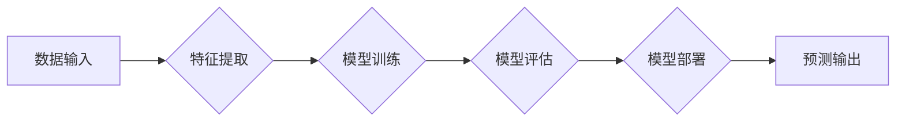

                 

## 人工智能：社会影响与思考

> 关键词：人工智能、机器学习、深度学习、伦理、社会影响、未来趋势

## 1. 背景介绍

人工智能（Artificial Intelligence，简称 AI）正以惊人的速度发展，从自动驾驶汽车到医疗诊断，从个性化推荐到金融风险评估，AI 的应用领域日益广泛。这种前所未有的技术进步不仅带来了巨大的经济效益和社会便利，也引发了人们对 AI 潜在影响的深刻思考。

### 1.1 AI 的发展历程

AI 的发展可以追溯到 20 世纪 50 年代，当时图灵提出了著名的“图灵测试”，试图量化机器是否具有智能的能力。随后，专家系统、机器学习等技术相继出现，为 AI 的发展奠定了基础。

21 世纪初，深度学习的兴起标志着 AI 进入了一个新的黄金时代。深度学习算法能够从海量数据中自动学习特征，从而在图像识别、自然语言处理等领域取得了突破性的进展。

### 1.2 AI 的社会影响

AI 的快速发展对社会产生了深远的影响，既带来机遇，也带来挑战：

* **机遇：** AI 可以提高生产效率，优化资源分配，解决复杂的社会问题，例如疾病诊断、环境保护等。
* **挑战：** AI 也可能导致失业、隐私泄露、算法偏见等问题，需要我们认真思考如何应对这些挑战。

## 2. 核心概念与联系

### 2.1 机器学习

机器学习是 AI 的核心技术之一，它通过算法让计算机从数据中学习，无需明确编程。机器学习算法可以分为监督学习、非监督学习和强化学习三大类。

* **监督学习：** 利用标记数据训练模型，预测未知数据。例如，图像分类、文本分类等。
* **非监督学习：** 从无标记数据中发现模式和结构。例如，聚类分析、异常检测等。
* **强化学习：** 通过试错学习，在环境中获得最大奖励。例如，游戏 AI、机器人控制等。

### 2.2 深度学习

深度学习是机器学习的子领域，它使用多层神经网络来模拟人类大脑的学习过程。深度学习算法能够从海量数据中自动学习复杂的特征，在图像识别、语音识别、自然语言处理等领域取得了突破性的进展。

### 2.3 算法架构

**Mermaid 流程图**



## 3. 核心算法原理 & 具体操作步骤

### 3.1 算法原理概述

深度学习算法的核心是多层神经网络。神经网络由多个层组成，每层包含多个神经元。神经元之间通过连接进行信息传递，每个连接都有一个权重。通过训练，神经网络可以调整权重，从而学习数据中的模式。

### 3.2 算法步骤详解

1. **数据预处理：** 将原始数据转换为深度学习算法可以理解的形式，例如归一化、编码等。
2. **网络结构设计：** 根据任务需求设计神经网络的结构，包括层数、神经元数量、激活函数等。
3. **模型训练：** 使用训练数据训练神经网络，通过反向传播算法调整权重，使模型的预测结果越来越准确。
4. **模型评估：** 使用测试数据评估模型的性能，例如准确率、召回率等。
5. **模型部署：** 将训练好的模型部署到实际应用场景中，用于预测未知数据。

### 3.3 算法优缺点

**优点：**

* **高准确率：** 深度学习算法能够从海量数据中学习复杂的特征，从而实现高准确率的预测。
* **自动化学习：** 深度学习算法能够自动学习特征，无需人工特征工程。
* **泛化能力强：** 深度学习算法能够泛化到新的数据，适用于不同的应用场景。

**缺点：**

* **数据依赖：** 深度学习算法需要海量数据进行训练，否则性能会下降。
* **计算资源消耗大：** 深度学习算法训练需要大量的计算资源，成本较高。
* **可解释性差：** 深度学习模型的内部机制复杂，难以解释其决策过程。

### 3.4 算法应用领域

深度学习算法已广泛应用于各个领域，例如：

* **计算机视觉：** 图像识别、目标检测、图像分割等。
* **自然语言处理：** 文本分类、机器翻译、语音识别等。
* **医疗诊断：** 疾病诊断、影像分析、药物研发等。
* **金融风险评估：** 欺诈检测、信用评分、投资预测等。

## 4. 数学模型和公式 & 详细讲解 & 举例说明

### 4.1 数学模型构建

深度学习算法的核心是神经网络，神经网络可以看作是一个复杂的数学模型。每个神经元接收多个输入信号，经过加权求和和激活函数处理后输出一个信号。

### 4.2 公式推导过程

**激活函数：**

常用的激活函数包括 sigmoid 函数、ReLU 函数、tanh 函数等。

* **sigmoid 函数：** $$f(x) = \frac{1}{1 + e^{-x}}$$
* **ReLU 函数：** $$f(x) = max(0, x)$$
* **tanh 函数：** $$f(x) = \frac{e^x - e^{-x}}{e^x + e^{-x}}$$

**反向传播算法：**

反向传播算法用于调整神经网络的权重，使其能够更好地预测数据。其核心思想是通过计算误差，反向传播到每个神经元，并根据误差调整权重。

### 4.3 案例分析与讲解

**图像分类：**

假设我们有一个图像分类任务，目标是将图像分类为猫、狗、鸟三种类别。我们可以使用深度学习算法训练一个神经网络，该网络的输入是图像像素，输出是三种类别的概率。

训练过程中，我们会使用大量的标记图像数据，让神经网络学习图像特征。通过反向传播算法，不断调整神经网络的权重，使其能够将图像准确分类。

## 5. 项目实践：代码实例和详细解释说明

### 5.1 开发环境搭建

* **操作系统：** Linux、macOS 或 Windows
* **编程语言：** Python
* **深度学习框架：** TensorFlow、PyTorch 或 Keras

### 5.2 源代码详细实现

```python
import tensorflow as tf

# 定义模型结构
model = tf.keras.models.Sequential([
    tf.keras.layers.Conv2D(32, (3, 3), activation='relu', input_shape=(28, 28, 1)),
    tf.keras.layers.MaxPooling2D((2, 2)),
    tf.keras.layers.Conv2D(64, (3, 3), activation='relu'),
    tf.keras.layers.MaxPooling2D((2, 2)),
    tf.keras.layers.Flatten(),
    tf.keras.layers.Dense(10, activation='softmax')
])

# 编译模型
model.compile(optimizer='adam',
              loss='sparse_categorical_crossentropy',
              metrics=['accuracy'])

# 训练模型
model.fit(x_train, y_train, epochs=5)

# 评估模型
loss, accuracy = model.evaluate(x_test, y_test)
print('Test loss:', loss)
print('Test accuracy:', accuracy)
```

### 5.3 代码解读与分析

这段代码定义了一个简单的卷积神经网络模型，用于图像分类任务。

* **Conv2D 层：** 用于提取图像特征。
* **MaxPooling2D 层：** 用于降维，减少计算量。
* **Flatten 层：** 将多维数据转换为一维数据。
* **Dense 层：** 全连接层，用于分类。

### 5.4 运行结果展示

训练完成后，我们可以使用测试数据评估模型的性能。

## 6. 实际应用场景

### 6.1 自动驾驶

AI 驱动的自动驾驶汽车能够感知周围环境，做出决策，实现自动驾驶。

### 6.2 医疗诊断

AI 可以辅助医生进行疾病诊断，例如分析医学影像，识别病灶。

### 6.3 金融风险评估

AI 可以用于识别欺诈交易，评估信用风险，优化投资策略。

### 6.4 未来应用展望

AI 的应用场景还在不断扩展，未来将应用于更多领域，例如教育、娱乐、个性化服务等。

## 7. 工具和资源推荐

### 7.1 学习资源推荐

* **书籍：**
    * 《深度学习》
    * 《机器学习》
* **在线课程：**
    * Coursera
    * edX
    * Udacity

### 7.2 开发工具推荐

* **深度学习框架：** TensorFlow、PyTorch、Keras
* **编程语言：** Python
* **云计算平台：** AWS、Azure、Google Cloud

### 7.3 相关论文推荐

* **《ImageNet Classification with Deep Convolutional Neural Networks》**
* **《Attention Is All You Need》**

## 8. 总结：未来发展趋势与挑战

### 8.1 研究成果总结

AI 技术取得了长足进步，在各个领域都展现出巨大的潜力。

### 8.2 未来发展趋势

* **模型更加强大：** 模型规模将继续扩大，性能将进一步提升。
* **应用更加广泛：** AI 将应用于更多领域，改变人们的生活方式。
* **解释性更强：** 研究者将致力于提高 AI 模型的可解释性，使其决策过程更加透明。

### 8.3 面临的挑战

* **数据安全和隐私保护：** AI 算法依赖大量数据，如何保护数据安全和隐私是一个重要挑战。
* **算法偏见：** AI 算法可能存在偏见，导致不公平的结果。
* **伦理问题：** AI 的发展引发了伦理问题，例如人工智能的责任和义务。

### 8.4 研究展望

未来，AI 研究将继续探索新的算法、新的应用场景，并致力于解决 AI 发展过程中面临的挑战。

## 9. 附录：常见问题与解答

* **什么是 AI？**

AI 是指能够模拟人类智能的计算机系统。

* **AI 的发展前景如何？**

AI 的发展前景广阔，将深刻改变我们的生活方式。

* **AI 会取代人类工作吗？**

AI 可能会改变一些工作内容，但不会完全取代人类工作。

作者：禅与计算机程序设计艺术 / Zen and the Art of Computer Programming


<end_of_turn>

