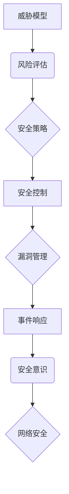

                 

## 网络安全管理：构建全面的数字防御体系

> 关键词：网络安全、威胁模型、风险评估、安全策略、安全控制、漏洞管理、事件响应、安全意识、数据保护、云安全

### 1. 背景介绍

在当今数字化时代，网络安全已成为至关重要的议题。随着互联网的普及和数字化转型进程的加速，网络攻击的频率和复杂性不断增加，对个人、企业和国家安全构成严重威胁。网络安全管理是指组织为保护其网络系统、数据和应用免受各种网络攻击和威胁而采取的一系列措施和策略。

**1.1 网络安全威胁 Landscape**

网络安全威胁日益复杂，主要包括以下几类：

* **恶意软件攻击:** 病毒、蠕虫、木马、勒索软件等恶意软件可窃取数据、破坏系统或勒索赎金。
* **网络钓鱼攻击:** 通过伪造电子邮件、网站或社交媒体消息，诱骗用户点击恶意链接或提供敏感信息。
* **拒绝服务攻击:** 攻击者试图通过大量请求淹没目标服务器，使其无法正常工作。
* **数据泄露:** 攻击者窃取敏感数据，例如个人信息、财务数据或商业机密。
* **内部威胁:** 由员工、承包商或其他内部人员造成的恶意或意外数据泄露。

**1.2 网络安全管理的重要性**

网络安全管理对于组织的生存和发展至关重要，其主要作用包括：

* **保护数据安全:** 保护组织的敏感数据免受未经授权的访问、使用或披露。
* **确保业务连续性:** 降低网络攻击对业务运营的影响，确保关键系统和应用的正常运行。
* **维护声誉:** 网络安全事件可能损害组织的声誉和客户信任。
* **合规性:** 许多行业和国家有相关的网络安全法规和标准，组织需要遵守这些规定。

### 2. 核心概念与联系

网络安全管理是一个复杂的系统，涉及多个核心概念和相互关联的组件。

**2.1 核心概念**

* **威胁模型:**  描述潜在攻击者的目标、能力和行为模式，用于识别和评估网络安全风险。
* **风险评估:**  分析网络安全威胁和漏洞，评估其潜在影响和可能性，并确定优先级。
* **安全策略:**  定义组织对网络安全的总体目标、原则和指南，为安全控制提供框架。
* **安全控制:**  具体的措施和技术，用于降低网络安全风险，例如防火墙、入侵检测系统、身份验证机制等。
* **漏洞管理:**  识别、评估和修复网络系统中的漏洞，降低攻击面。
* **事件响应:**  针对网络安全事件的预案和流程，用于快速发现、分析和处理威胁。
* **安全意识:**  提高员工对网络安全风险的认识，并培养良好的安全行为习惯。

**2.2 架构图**

### 3. 核心算法原理 & 具体操作步骤

**3.1 算法原理概述**

网络安全管理中涉及多种算法和技术，例如密码学、数据加密、身份验证、入侵检测等。这些算法和技术基于数学原理，用于保护数据安全、确保身份验证和检测恶意活动。

**3.2 算法步骤详解**

* **密码学算法:**  用于加密和解密数据，保护其机密性。常见的密码学算法包括AES、RSA、ECC等。
* **数据加密算法:**  将数据转换为不可读的形式，防止未经授权的访问。
* **身份验证算法:**  用于验证用户的身份，确保只有授权用户才能访问系统资源。常见的身份验证算法包括密码验证、多因素身份验证等。
* **入侵检测算法:**  分析网络流量和系统日志，检测异常行为和潜在的攻击活动。常见的入侵检测算法包括规则匹配、机器学习等。

**3.3 算法优缺点**

不同的算法具有不同的优缺点，需要根据实际应用场景选择合适的算法。例如，AES算法具有较高的安全性，但计算复杂度较高；RSA算法安全性高，但密钥长度较长。

**3.4 算法应用领域**

网络安全算法广泛应用于各种领域，例如：

* **电子商务:**  保护用户支付信息和交易数据安全。
* **金融服务:**  保护银行账户、信用卡信息和交易数据安全。
* **医疗保健:**  保护患者医疗记录和个人健康信息安全。
* **政府机构:**  保护国家机密和公民信息安全。

### 4. 数学模型和公式 & 详细讲解 & 举例说明

**4.1 数学模型构建**

网络安全管理中可以使用数学模型来描述和分析网络安全风险。例如，可以使用贝叶斯网络模型来表示网络安全事件之间的依赖关系，并计算事件发生的概率。

**4.2 公式推导过程**

贝叶斯网络模型中的一个核心公式是贝叶斯定理：

$$P(A|B) = \frac{P(B|A)P(A)}{P(B)}$$

其中：

* $P(A|B)$ 是事件 A 在事件 B 发生条件下的概率。
* $P(B|A)$ 是事件 B 在事件 A 发生条件下的概率。
* $P(A)$ 是事件 A 发生的概率。
* $P(B)$ 是事件 B 发生的概率。

**4.3 案例分析与讲解**

假设我们有一个网络安全模型，其中事件 A 是网络攻击事件，事件 B 是入侵检测系统报警事件。我们可以使用贝叶斯定理来计算网络攻击事件发生在入侵检测系统报警事件发生条件下的概率。

如果我们知道：

* $P(B|A) = 0.9$ (入侵检测系统在网络攻击发生时报警的概率)
* $P(A) = 0.01$ (网络攻击发生的概率)
* $P(B) = 0.05$ (入侵检测系统报警的概率)

那么，根据贝叶斯定理，我们可以计算：

$$P(A|B) = \frac{0.9 \times 0.01}{0.05} = 0.18$$

这意味着，在入侵检测系统报警的情况下，网络攻击事件发生的概率为 18%。

### 5. 项目实践：代码实例和详细解释说明

**5.1 开发环境搭建**

网络安全管理项目可以使用多种开发环境搭建，例如：

* **虚拟机:**  使用虚拟机软件创建虚拟环境，模拟真实网络环境。
* **云平台:**  使用云计算平台提供的虚拟机和网络服务。

**5.2 源代码详细实现**

网络安全管理项目涉及多种编程语言和技术，例如：

* **Python:**  用于网络安全脚本编写、数据分析和机器学习。
* **Java:**  用于开发安全应用和入侵检测系统。
* **C/C++:**  用于开发高性能网络安全工具。

**5.3 代码解读与分析**

网络安全代码需要进行严格的代码审查和测试，以确保其安全性、可靠性和性能。

**5.4 运行结果展示**

网络安全项目需要进行测试和评估，以验证其效果和性能。

### 6. 实际应用场景

**6.1 企业网络安全**

企业网络安全管理包括：

* **边界防御:**  使用防火墙、入侵检测系统和入侵防御系统保护网络边界。
* **数据加密:**  加密敏感数据，防止未经授权的访问。
* **身份验证和授权:**  使用多因素身份验证和角色权限控制，确保只有授权用户才能访问系统资源。
* **漏洞管理:**  定期扫描和修复网络系统中的漏洞。
* **安全意识培训:**  提高员工对网络安全风险的认识，并培养良好的安全行为习惯。

**6.2 个人网络安全**

个人网络安全管理包括：

* **使用强密码:**  使用复杂且唯一的密码保护账户。
* **启用多因素身份验证:**  使用短信验证码、邮件验证码或硬件令牌等方式增强身份验证。
* **谨慎点击链接:**  不要点击来自未知来源的链接。
* **安装安全软件:**  安装杀毒软件、防火墙和反恶意软件软件。
* **定期备份数据:**  定期备份重要数据，防止数据丢失。

**6.3 云安全**

云安全管理包括：

* **云访问安全:**  控制对云服务的访问权限。
* **数据加密:**  加密存储在云中的数据。
* **云端安全审计:**  监控云环境中的活动，并进行安全审计。
* **云安全合规性:**  确保云环境符合相关的安全法规和标准。

**6.4 未来应用展望**

随着人工智能、机器学习和区块链技术的不断发展，网络安全管理将更加智能化、自动化和去中心化。

### 7. 工具和资源推荐

**7.1 学习资源推荐**

* **网络安全书籍:**  《网络安全基础》、《网络安全实战》、《渗透测试》等。
* **在线课程:**  Coursera、edX、Udemy等平台提供网络安全相关的在线课程。
* **网络安全论坛:**  OWASP、SANS Institute等组织提供网络安全论坛和社区。

**7.2 开发工具推荐**

* **网络安全测试工具:**  Nmap、Metasploit、Burp Suite等。
* **入侵检测系统:**  Snort、Suricata、Zeek等。
* **安全信息和事件管理系统 (SIEM):**  Splunk、LogRhythm、IBM QRadar等。

**7.3 相关论文推荐**

* **网络安全相关期刊:**  IEEE Transactions on Information Forensics and Security、Journal of Computer Security等。
* **网络安全学术会议:**  Black Hat、DEF CON、RSA Conference等。

### 8. 总结：未来发展趋势与挑战

**8.1 研究成果总结**

近年来，网络安全领域取得了显著的进展，例如：

* **人工智能在网络安全中的应用:**  人工智能技术可以用于检测恶意活动、预测攻击趋势和自动化安全响应。
* **区块链技术的应用:**  区块链技术可以用于构建更安全的网络基础设施和数据存储系统。
* **量子计算对网络安全的挑战:**  量子计算技术可能会破解现有的加密算法，对网络安全构成新的挑战。

**8.2 未来发展趋势**

未来网络安全管理将朝着以下趋势发展：

* **更加智能化:**  人工智能和机器学习将被更广泛地应用于网络安全管理。
* **更加自动化:**  网络安全自动化将减少人工干预，提高效率和准确性。
* **更加去中心化:**  区块链技术将被用于构建更安全的网络基础设施和数据存储系统。

**8.3 面临的挑战**

网络安全管理面临着许多挑战，例如：

* **攻击者不断升级攻击手段:**  攻击者不断开发新的攻击技术，网络安全防御需要不断升级。
* **网络安全人才短缺:**  网络安全人才需求量大，但供给不足。
* **数据隐私保护:**  随着数据量的不断增长，数据隐私保护问题日益突出。

**8.4 研究展望**

未来网络安全研究将重点关注以下方面：

* **人工智能在网络安全中的应用:**  开发更智能、更有效的网络安全人工智能算法。
* **量子安全:**  研究量子计算对网络安全的挑战，并开发相应的量子安全技术。
* **网络安全法规和标准:**  制定更完善的网络安全法规和标准，保障网络安全。

### 9. 附录：常见问题与解答

**9.1 如何选择合适的网络安全工具？**

选择网络安全工具需要根据组织的具体需求和环境进行评估。

**9.2 如何提高员工的网络安全意识？**

可以通过安全意识培训、安全宣传和案例分享等方式提高员工的网络安全意识。

**9.3 如何应对网络安全事件？**

需要制定完善的网络安全事件响应计划，并进行定期演练。

作者：禅与计算机程序设计艺术 / Zen and the Art of Computer Programming 
<end_of_turn>

