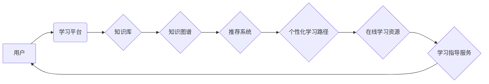

                 

## 如何利用知识付费实现在线学习与在线学习指导？

> 关键词：知识付费、在线学习、学习指导、人工智能、个性化学习、知识图谱、推荐系统

## 1. 背景介绍

在线学习近年来蓬勃发展，成为人们获取知识和技能的重要途径。知识付费模式也随之兴起，为在线学习提供了新的商业模式和发展动力。然而，在线学习的碎片化、缺乏个性化指导等问题仍然制约着学习效果。如何利用知识付费更好地实现在线学习与在线学习指导，是当前亟待解决的问题。

## 2. 核心概念与联系

**2.1 在线学习与知识付费**

在线学习是指利用互联网技术，通过网络平台提供学习资源和学习服务，学员可以在任何时间、任何地点进行学习。知识付费是指通过付费获取知识和技能，包括在线课程、电子书、咨询服务等。

**2.2 在线学习指导**

在线学习指导是指在在线学习过程中，为学员提供个性化的学习建议、答疑解惑、学习进度跟踪等服务，帮助学员更高效地学习和掌握知识。

**2.3 知识图谱与推荐系统**

知识图谱是一种结构化的知识表示形式，可以将知识点、概念、关系等进行组织和连接，形成一个庞大的知识网络。推荐系统可以根据用户的学习行为、兴趣偏好等信息，推荐相关的学习资源和学习路径。

**2.4 核心架构**



## 3. 核心算法原理 & 具体操作步骤

**3.1 算法原理概述**

在线学习指导的核心算法原理包括：

* **知识推荐算法:** 基于知识图谱和用户学习行为，推荐相关的学习资源和学习路径。
* **学习进度跟踪算法:** 跟踪用户的学习进度，识别学习瓶颈，提供个性化的学习建议。
* **智能答疑算法:** 利用自然语言处理技术，自动解答用户的学习问题。

**3.2 算法步骤详解**

1. **用户建模:** 收集用户的学习行为数据，包括学习时间、学习内容、学习进度等，构建用户的学习模型。
2. **知识图谱构建:** 将知识库中的知识点、概念、关系等进行组织和连接，构建知识图谱。
3. **推荐系统训练:** 利用机器学习算法，训练推荐系统，根据用户的学习模型和知识图谱，推荐相关的学习资源和学习路径。
4. **学习进度跟踪:** 跟踪用户的学习进度，识别学习瓶颈，提供个性化的学习建议。
5. **智能答疑:** 利用自然语言处理技术，自动解答用户的学习问题。

**3.3 算法优缺点**

**优点:**

* **个性化学习:** 根据用户的学习情况提供个性化的学习建议和学习资源。
* **提高学习效率:** 帮助用户更高效地学习和掌握知识。
* **降低学习成本:** 通过知识付费模式，降低用户的学习成本。

**缺点:**

* **数据依赖:** 需要大量的用户学习行为数据进行训练。
* **算法复杂度:** 算法的训练和部署需要一定的技术难度。
* **隐私安全:** 需要妥善处理用户的学习数据，保障用户的隐私安全。

**3.4 算法应用领域**

在线教育、在线培训、在线辅导、自学平台等。

## 4. 数学模型和公式 & 详细讲解 & 举例说明

**4.1 数学模型构建**

知识推荐算法可以采用协同过滤算法，构建用户-物品评分矩阵，其中用户和物品分别代表学习者和学习资源。

**4.2 公式推导过程**

协同过滤算法的核心是预测用户对物品的评分。可以使用以下公式进行预测：

$$
\hat{r}_{u,i} = \bar{r}_u + \frac{\sum_{v \in N(u)} (r_{v,i} - \bar{r}_v) * sim(u,v)}{\sum_{v \in N(u)} sim(u,v)}
$$

其中：

* $\hat{r}_{u,i}$: 用户 $u$ 对物品 $i$ 的预测评分
* $\bar{r}_u$: 用户 $u$ 的平均评分
* $r_{v,i}$: 用户 $v$ 对物品 $i$ 的实际评分
* $sim(u,v)$: 用户 $u$ 和用户 $v$ 之间的相似度

**4.3 案例分析与讲解**

假设有三个用户 $u_1$, $u_2$, $u_3$ 和三个学习资源 $i_1$, $i_2$, $i_3$。用户对学习资源的评分如下表所示：

| 用户 | $i_1$ | $i_2$ | $i_3$ |
|---|---|---|---|
| $u_1$ | 5 | 3 | 4 |
| $u_2$ | 4 | 5 | 2 |
| $u_3$ | 3 | 4 | 5 |

根据用户的评分数据，可以构建用户-物品评分矩阵，并计算用户之间的相似度。然后，可以使用协同过滤算法预测用户对未学习资源的评分。

## 5. 项目实践：代码实例和详细解释说明

**5.1 开发环境搭建**

* Python 3.x
* TensorFlow 或 PyTorch
* Jupyter Notebook

**5.2 源代码详细实现**

```python
# 导入必要的库
import numpy as np
from sklearn.metrics.pairwise import cosine_similarity

# 定义用户-物品评分矩阵
ratings = np.array([
    [5, 3, 4],
    [4, 5, 2],
    [3, 4, 5]
])

# 计算用户之间的相似度
user_similarity = cosine_similarity(ratings)

# 预测用户对未学习资源的评分
def predict_rating(user_id, item_id):
    # 获取用户和物品的评分
    user_ratings = ratings[user_id]
    item_ratings = ratings[:, item_id]

    # 计算用户与其他用户的相似度
    similarities = user_similarity[user_id]

    # 预测评分
    predicted_rating = np.dot(similarities, item_ratings) / np.sum(similarities)
    return predicted_rating

# 预测用户1对物品3的评分
predicted_rating = predict_rating(0, 2)
print(f"用户1对物品3的预测评分: {predicted_rating}")
```

**5.3 代码解读与分析**

* 代码首先定义了用户-物品评分矩阵，并使用余弦相似度计算用户之间的相似度。
* `predict_rating` 函数用于预测用户对未学习资源的评分。
* 函数首先获取用户和物品的评分，然后计算用户与其他用户的相似度。
* 最后，使用加权平均的方法预测评分。

**5.4 运行结果展示**

运行代码后，可以得到用户1对物品3的预测评分。

## 6. 实际应用场景

**6.1 在线教育平台**

在线教育平台可以利用知识付费模式提供在线课程，并结合在线学习指导服务，帮助用户更高效地学习和掌握知识。

**6.2 在线培训机构**

在线培训机构可以利用知识付费模式提供在线培训课程，并结合在线学习指导服务，帮助学员更好地掌握技能。

**6.3 在线辅导平台**

在线辅导平台可以利用知识付费模式提供在线辅导服务，并结合在线学习指导服务，帮助学生解决学习难题。

**6.4 未来应用展望**

随着人工智能技术的不断发展，在线学习与在线学习指导将更加智能化、个性化。未来，我们可以期待：

* 更精准的知识推荐
* 更智能的学习进度跟踪
* 更人性化的学习指导服务
* 更丰富的学习资源

## 7. 工具和资源推荐

**7.1 学习资源推荐**

* **在线学习平台:** Coursera, edX, Udemy, Khan Academy
* **知识图谱平台:** Google Knowledge Graph, DBpedia
* **推荐系统库:** Surprise, LightFM

**7.2 开发工具推荐**

* **编程语言:** Python
* **机器学习框架:** TensorFlow, PyTorch
* **数据处理工具:** Pandas, NumPy

**7.3 相关论文推荐**

* **协同过滤算法:**

    * "Collaborative Filtering: A User-Based Approach" by Goldberg et al. (1992)
    * "Item-Based Collaborative Filtering Recommendation Algorithms" by Sarwar et al. (2001)

* **知识图谱与推荐系统:**

    * "Knowledge Graph Embedding for Recommendations" by Wang et al. (2017)
    * "A Survey on Knowledge Graph-Based Recommendation" by Chen et al. (2020)

## 8. 总结：未来发展趋势与挑战

**8.1 研究成果总结**

知识付费模式为在线学习提供了新的商业模式和发展动力，在线学习指导服务可以帮助用户更高效地学习和掌握知识。

**8.2 未来发展趋势**

* **更智能的学习推荐:** 利用人工智能技术，更加精准地推荐学习资源和学习路径。
* **更个性化的学习体验:** 根据用户的学习风格、学习目标等信息，提供更加个性化的学习体验。
* **更丰富的学习内容:** 提供更加丰富的学习内容，包括视频课程、音频课程、互动练习等。

**8.3 面临的挑战**

* **数据安全和隐私保护:** 需要妥善处理用户的学习数据，保障用户的隐私安全。
* **算法的准确性和可靠性:** 需要不断改进算法，提高算法的准确性和可靠性。
* **商业模式的创新:** 需要探索新的商业模式，实现知识付费的持续发展。

**8.4 研究展望**

未来，我们将继续研究在线学习与在线学习指导的融合，探索更智能、更个性化、更有效的学习模式。


## 9. 附录：常见问题与解答

**9.1 如何选择合适的在线学习平台？**

选择在线学习平台时，可以考虑以下因素：

* 平台的课程质量
* 平台的学习资源丰富程度
* 平台的学习社区活跃度
* 平台的收费标准

**9.2 如何提高在线学习的效率？**

提高在线学习效率的建议：

* 制定学习计划，并坚持执行
* 积极参与学习讨论
* 利用碎片时间进行学习
* 定期回顾学习内容

**9.3 在线学习与线下学习相比，有哪些优势和劣势？**

**优势:**

* 时间和地点的灵活性
* 学习成本相对较低
* 学习资源丰富

**劣势:**

* 学习氛围相对单调
* 缺乏面对面的互动交流
* 需要较强的自律性

作者：禅与计算机程序设计艺术 / Zen and the Art of Computer Programming


<end_of_turn>

