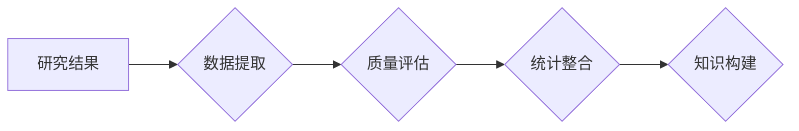

                 

## 知识的元分析：整合研究结果的方法

> 关键词：元分析、知识整合、研究结果、数据挖掘、机器学习、知识图谱、人工智能

## 1. 背景介绍

在信息爆炸的时代，海量数据和研究成果不断涌现。如何有效地整合这些分散的信息，从中提取有价值的知识，已成为一个重要的挑战。传统的研究方法往往局限于单个研究领域，难以捕捉跨领域知识的联系和规律。元分析作为一种系统性的知识整合方法，应运而生。

元分析是指对多个独立的研究结果进行系统性的总结和分析，以获得更全面、更深入的认识。它通过收集、整理、评估和分析现有研究数据，揭示研究结果的共性和差异，并识别出潜在的知识盲点和研究方向。

## 2. 核心概念与联系

元分析的核心概念包括：

* **研究结果：** 指各个独立研究所获得的结论、发现和数据。
* **数据提取：** 从研究文献中提取相关信息，包括研究设计、样本特征、数据分析方法和结果等。
* **质量评估：** 对研究结果进行客观评价，识别出高质量的研究和低质量的研究。
* **统计整合：** 使用统计方法将多个研究结果进行综合分析，以获得总体效应大小和显著性。
* **知识构建：** 基于整合后的研究结果，构建知识模型、理论框架或实践指南。

**Mermaid 流程图**



## 3. 核心算法原理 & 具体操作步骤

### 3.1  算法原理概述

元分析算法的核心是将多个研究结果进行整合，以获得更可靠和更全面的结论。常用的算法包括：

* **固定效应模型：** 假设所有研究都来自同一个总体，并使用平均效应大小来衡量研究结果的总体效应。
* **随机效应模型：** 假设每个研究都来自不同的总体，并考虑研究之间的差异，以获得更保守的估计。
* **混合效应模型：** 将固定效应模型和随机效应模型相结合，以更好地处理研究结果的异质性。

### 3.2  算法步骤详解

1. **文献检索:** 确定研究主题，并使用数据库和搜索引擎检索相关文献。
2. **文献筛选:** 根据预设的标准筛选出符合要求的文献，排除重复文献、综述文献和非英文文献等。
3. **数据提取:** 从筛选出的文献中提取研究结果、样本特征、数据分析方法等信息，并将其存储在数据库中。
4. **质量评估:** 使用预设的标准对研究结果进行质量评估，识别出高质量的研究和低质量的研究。
5. **统计整合:** 使用固定效应模型、随机效应模型或混合效应模型将多个研究结果进行整合，以获得总体效应大小和显著性。
6. **知识构建:** 基于整合后的研究结果，构建知识模型、理论框架或实践指南。

### 3.3  算法优缺点

**优点:**

* 可以整合多个研究结果，获得更全面、更深入的认识。
* 可以识别出研究结果的共性和差异，揭示潜在的知识盲点和研究方向。
* 可以提高研究结果的可靠性和可信度。

**缺点:**

* 需要大量的文献检索和数据提取工作。
* 需要对研究结果进行客观评价，避免主观偏差。
* 统计整合方法的选择和应用需要一定的专业知识。

### 3.4  算法应用领域

元分析算法广泛应用于各个领域，例如：

* 医学研究：整合临床试验结果，评估药物疗效和安全性。
* 教育研究：整合教学研究结果，改进教学方法和策略。
* 社会科学研究：整合社会调查结果，分析社会现象和趋势。
* 计算机科学研究：整合算法研究结果，评估算法性能和效率。

## 4. 数学模型和公式 & 详细讲解 & 举例说明

### 4.1  数学模型构建

元分析的核心是统计整合多个研究结果。常用的统计模型包括固定效应模型和随机效应模型。

**固定效应模型**假设所有研究都来自同一个总体，并使用平均效应大小来衡量研究结果的总体效应。

**随机效应模型**假设每个研究都来自不同的总体，并考虑研究之间的差异，以获得更保守的估计。

### 4.2  公式推导过程

**固定效应模型:**

$$
\theta = \frac{\sum_{i=1}^{k} w_i \hat{\theta}_i}{\sum_{i=1}^{k} w_i}
$$

其中：

* $\theta$ 是总体效应大小。
* $k$ 是研究数量。
* $w_i$ 是第 $i$ 个研究的权重。
* $\hat{\theta}_i$ 是第 $i$ 个研究的估计效应大小。

**随机效应模型:**

$$
\theta = \frac{\sum_{i=1}^{k} w_i \hat{\theta}_i}{\sum_{i=1}^{k} w_i} \pm \sqrt{\frac{\sigma^2}{ \sum_{i=1}^{k} w_i}}
$$

其中：

* $\sigma^2$ 是研究之间差异的方差。

### 4.3  案例分析与讲解

假设我们想要元分析关于“人工智能在医疗诊断中的应用”的研究结果。我们检索到 10 篇相关文献，并对其进行质量评估和数据提取。

使用固定效应模型和随机效应模型分别对研究结果进行整合，得到总体效应大小和显著性。

通过比较两种模型的结果，我们可以判断研究结果的异质性，并选择更合适的模型进行分析。

## 5. 项目实践：代码实例和详细解释说明

### 5.1  开发环境搭建

元分析项目可以使用 Python 语言进行开发。

需要安装以下软件包：

* pandas：用于数据处理和分析。
* scikit-learn：用于机器学习和统计分析。
* matplotlib：用于数据可视化。

### 5.2  源代码详细实现

```python
import pandas as pd
from sklearn.meta import meta_regressor
from sklearn.linear_model import LinearRegression

# 数据加载
data = pd.read_csv("meta_analysis_data.csv")

# 数据预处理
# ...

# 模型训练
model = meta_regressor.MetaRegressor(estimator=LinearRegression())
model.fit(data.drop("effect_size", axis=1), data["effect_size"])

# 模型预测
predictions = model.predict(new_data)

# 结果展示
print(predictions)
```

### 5.3  代码解读与分析

* 数据加载：使用 pandas 库加载元分析数据。
* 数据预处理：对数据进行清洗、转换和特征工程等操作。
* 模型训练：使用 meta_regressor 库构建元分析模型，并使用 LinearRegression 模型作为子模型进行训练。
* 模型预测：使用训练好的模型预测新的数据。
* 结果展示：打印模型预测结果。

### 5.4  运行结果展示

运行代码后，将输出模型预测的总体效应大小。

## 6. 实际应用场景

元分析在各个领域都有广泛的应用场景，例如：

* 医学研究：整合临床试验结果，评估药物疗效和安全性。
* 教育研究：整合教学研究结果，改进教学方法和策略。
* 社会科学研究：整合社会调查结果，分析社会现象和趋势。
* 计算机科学研究：整合算法研究结果，评估算法性能和效率。

### 6.4  未来应用展望

随着人工智能技术的不断发展，元分析方法将更加智能化和自动化。

未来，元分析将能够：

* 自动识别和提取研究结果。
* 自动评估研究结果的质量。
* 自动构建知识模型和理论框架。
* 提供更个性化和更精准的知识服务。

## 7. 工具和资源推荐

### 7.1  学习资源推荐

* **书籍:**

    *  "Meta-Analysis for Applied Research" by Robert Rosenthal
    *  "The Handbook of Meta-Analysis" by John Cooper

* **在线课程:**

    *  Coursera: "Meta-Analysis" by University of California, Irvine
    *  edX: "Meta-Analysis" by University of Oxford

### 7.2  开发工具推荐

* **R:** 强大的统计分析软件，拥有丰富的元分析包。
* **Python:** 通用编程语言，可以结合 scikit-learn 和 meta_regressor 库进行元分析。
* **Stata:** 统计软件，提供元分析功能。

### 7.3  相关论文推荐

* **"A General Approach to Meta-Analysis" by Hedges and Olkin**
* **"Meta-Analysis: A Primer" by Borenstein et al.**
* **"Meta-Analysis of Randomized Controlled Trials" by Higgins and Green**

## 8. 总结：未来发展趋势与挑战

### 8.1  研究成果总结

元分析作为一种系统性的知识整合方法，在各个领域都取得了显著的成果。它能够有效地整合分散的信息，揭示研究结果的共性和差异，并提供更可靠和更全面的知识。

### 8.2  未来发展趋势

未来，元分析将朝着以下方向发展：

* **智能化:** 利用人工智能技术，实现自动识别、提取和分析研究结果。
* **自动化:** 开发自动化元分析工具，降低门槛，方便更多人使用。
* **个性化:** 提供个性化知识服务，根据用户的需求和兴趣提供定制化的知识整合结果。

### 8.3  面临的挑战

元分析也面临一些挑战，例如：

* **数据质量:** 元分析结果的质量取决于研究结果的质量，需要加强对研究结果的评估和筛选。
* **异质性:** 研究结果之间存在异质性，需要开发更有效的处理异质性的方法。
* **解释性:** 元分析结果的解释性需要进一步加强，需要开发更直观和易懂的展示方法。

### 8.4  研究展望

未来，元分析将继续发展和完善，成为一种更强大、更智能、更实用的知识整合方法。


## 9. 附录：常见问题与解答

**常见问题:**

* **元分析和文献综述有什么区别？**

**解答:** 元分析和文献综述都是对现有研究结果进行总结和分析的方法，但元分析更注重对研究结果进行统计整合，以获得更可靠和更全面的结论。

* **如何选择合适的元分析模型？**

**解答:** 选择合适的元分析模型需要根据研究目的、研究设计和研究结果的异质性等因素进行考虑。

* **元分析结果的可靠性如何保证？**

**解答:** 元分析结果的可靠性取决于研究结果的质量、样本量和统计方法的选择等因素。需要对研究结果进行客观评价，并使用合适的统计方法进行分析。


作者：禅与计算机程序设计艺术 / Zen and the Art of Computer Programming 
<end_of_turn>

