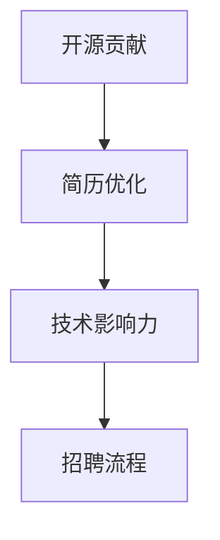

                 

# 高薪就业：如何利用开源贡献吸引雇主

> 关键词：开源贡献, 软件开发, 简历优化, 技术影响力, 招聘流程

## 1. 背景介绍

在当前竞争激烈的就业市场中，拥有丰富的开源贡献经历已经成为程序员应聘高薪职位时的重要加分项。越来越多的雇主将开源贡献视为衡量开发者专业能力和团队协作精神的重要标准。如何通过开源贡献吸引雇主的注意，成为许多编程爱好者和从业者的核心议题。本文将系统性地探讨开源贡献在求职中的价值，并给出具体的操作指南，帮助程序员提升职业竞争力，获得理想的高薪就业机会。

## 2. 核心概念与联系

### 2.1 核心概念概述

在讨论如何通过开源贡献吸引雇主前，我们需要先理解几个核心概念：

- **开源贡献**：程序员将自己的代码、文档、项目等贡献到公共仓库，与社区其他成员合作，共同推动项目进步的行为。开源贡献不仅能提升个人代码能力，还能建立良好的专业声誉和社区影响力。

- **简历优化**：通过在简历中突出开源贡献等关键经历，提高自身在招聘过程中的曝光率，增加获得面试机会的概率。

- **技术影响力**：程序员在开源社区的活跃度、代码质量、项目影响力等因素，直接反映其技术水平和行业影响力。

- **招聘流程**：公司招聘过程中从简历筛选到技术面试，再到综合评估的整个过程。通过在招聘流程中的有效展示，能够大大提升自身竞争力。

这些核心概念之间相互关联，共同构成了开源贡献在求职中的重要地位。通过在开源社区积极贡献代码、撰写文档、参与社区讨论，程序员不仅可以提升自己的编程能力，还能建立广泛的专业网络，展示技术影响力，从而在招聘流程中获得优势。

### 2.2 核心概念原理和架构的 Mermaid 流程图



## 3. 核心算法原理 & 具体操作步骤

### 3.1 算法原理概述

开源贡献提升高薪就业的核心原理在于，通过积极参与开源项目，展示出个人的编程能力、问题解决能力、团队协作精神等多方面素质。同时，开源贡献能够将个人的工作成果公开化，使得潜在的雇主能够通过代码、文档等直观地评估候选人的技术水平和专业素养。

### 3.2 算法步骤详解

#### 3.2.1 选择合适的开源项目

选择适合自己技能和兴趣的开源项目是开源贡献成功的第一步。一般建议从以下几个方面考虑：

- **技术栈**：选择自己熟练掌握或愿意学习的技术栈，确保能够高效贡献代码。
- **项目活跃度**：选择活跃的、有持续贡献的社区项目，避免参与停滞的项目。
- **个人兴趣**：选择自己感兴趣或愿意深入研究的领域，提升贡献的积极性和质量。

#### 3.2.2 有效参与项目

成功参与开源项目需要掌握以下几个步骤：

- **代码贡献**：通过在 issue 中阅读讨论，识别问题并提出解决方案，将代码提交到项目中。
- **文档撰写**：编写项目文档、教程等，帮助新贡献者更好地理解项目，同时提升个人文档写作能力。
- **代码审核**：积极参与代码审核，帮助提高代码质量，建立良好的社区形象。

#### 3.2.3 建立社区影响力

开源贡献不仅限于代码，还可以通过以下方式提升个人影响力：

- **贡献多样性**：除了代码贡献，还可以参与项目管理、社区活动、技术讨论等，展示全面的技能。
- **保持活跃度**：定期更新贡献，持续参与项目，建立稳定的社区存在感。
- **展示项目**：在简历、GitHub等平台展示自己的贡献，吸引雇主的关注。

### 3.3 算法优缺点

#### 3.3.1 优点

- **技能提升**：通过参与开源项目，提升编程能力、问题解决能力、团队协作能力。
- **社区认可**：开源贡献是社区对个人能力的认可，能够提升职业声誉和专业影响力。
- **广泛曝光**：在开源社区展示个人能力，能够吸引更多潜在雇主的注意。

#### 3.3.2 缺点

- **时间成本**：参与开源项目需要投入大量时间和精力，可能会影响日常工作和生活。
- **不确定性**：开源项目的贡献有时无法直接转化为职业发展，需要综合其他因素评估。
- **风险管理**：需要审慎选择项目，避免参与不良项目或社区。

### 3.4 算法应用领域

开源贡献在多个领域都有广泛应用，包括但不限于：

- **软件开发**：通过贡献代码、文档，提升技术栈的深度和广度，提高求职竞争力。
- **系统运维**：参与开源系统运维项目，提升系统管理和故障排查能力。
- **数据科学**：参与数据处理、模型训练等开源项目，提升数据处理和机器学习能力。

## 4. 数学模型和公式 & 详细讲解 & 举例说明

### 4.1 数学模型构建

在量化开源贡献的价值时，可以通过以下模型进行评估：

设 $C$ 为开源贡献数量，$Q$ 为代码质量评分，$I$ 为社区互动评分，$T$ 为技术影响评分，则总评分 $S$ 可以表示为：

$$ S = aC + bQ + cI + dT $$

其中，$a, b, c, d$ 为不同贡献维度的权重系数。

### 4.2 公式推导过程

为了简化计算，可以假设各项贡献相互独立，则总评分 $S$ 为各项贡献的加权和：

$$ S = aC + bQ + cI + dT $$

通过计算每个维度得分的具体数值，并根据行业标准和公司需求，设置合理的权重系数 $a, b, c, d$，可以得出最终的开源贡献评分。

### 4.3 案例分析与讲解

假设某开发者在GitHub上贡献了 100个 issue，每个issue的评分分别为2分；提交了50段代码，每段代码的评分分别为4分；在社区讨论中积极参与，互动评分3分；其技术博客在社区内获得了500次阅读，技术影响评分5分。根据上述模型，可以计算出该开发者的总评分：

$$ S = 2 \times 100 + 4 \times 50 + 3 + 5 = 393 $$

这个评分可以作为简历中的技术能力证明，增加面试邀约的概率。

## 5. 项目实践：代码实例和详细解释说明

### 5.1 开发环境搭建

#### 5.1.1 安装 Git

Git 是开源贡献的基础工具，用于版本控制和代码管理。

```bash
# 安装 Git
sudo apt-get update
sudo apt-get install git
```

#### 5.1.2 安装 GitHub Desktop

GitHub Desktop 是GitHub的桌面客户端，方便本地进行代码管理、提交、pull request等操作。

```bash
# 安装 GitHub Desktop
sudo apt-get install gitlab-desktop
```

### 5.2 源代码详细实现

#### 5.2.1 选择一个开源项目

假设我们选择了 Flask 开源项目，可以从 GitHub 搜索并选择感兴趣的项目。

```bash
# 克隆 Flask 项目
git clone https://github.com/mitsuhiko/flask.git
```

#### 5.2.2 参与项目贡献

1. 阅读项目文档和 issue，找到感兴趣的问题。
2. 编写代码并提交到项目中，确保代码质量和风格规范。
3. 更新 README 文件，添加文档或示例代码。

#### 5.2.3 提交贡献

使用 GitHub Desktop 进行代码提交和Pull Request（PR）创建。

1. 打开项目仓库，点击“New Pull Request”按钮。
2. 填写标题和描述，说明贡献内容。
3. 选择需要合并的分支，点击“Create Pull Request”提交请求。

### 5.3 代码解读与分析

通过提交代码和创建 PR，成功参与项目贡献。在贡献过程中，需要注意以下几点：

- 遵循代码风格指南，保持代码一致性。
- 编写详细的PR描述，说明贡献内容和动机。
- 积极与项目维护者和其他贡献者沟通，及时解决代码合并中的问题。

### 5.4 运行结果展示

通过成功提交代码和创建 PR，开发者将在GitHub上展示自己的贡献，提升在社区的影响力。

## 6. 实际应用场景

### 6.1 软件开发

开源贡献对于软件开发人员尤为重要。通过参与开源项目，开发者不仅能提升编程技能，还能建立专业网络，增加面试邀约概率。

### 6.2 系统运维

对于系统运维工程师，参与开源系统运维项目，能够提升故障排查和系统管理能力，丰富简历内容。

### 6.3 数据科学

数据科学家可以通过参与开源数据处理和模型训练项目，提升数据处理和机器学习能力，拓展技术视野。

## 7. 工具和资源推荐

### 7.1 学习资源推荐

为了更好地进行开源贡献，以下是推荐的资源：

1. **《开源项目最佳实践》书籍**：详细介绍了开源项目的贡献流程和最佳实践，适合初学者和经验丰富的开发者。
2. **《代码风格指南》文章**：介绍代码风格的规范，确保代码的一致性和可读性。
3. **GitHub官方文档**：提供了详细的Git和GitHub使用教程，是开源贡献的基础工具。
4. **社区管理指南**：介绍如何有效地参与社区讨论和管理项目，提升社区影响力。

### 7.2 开发工具推荐

以下是推荐的开发工具：

1. **GitHub Desktop**：GitHub的桌面客户端，方便本地代码管理和贡献。
2. **Visual Studio Code**：轻量级代码编辑器，支持多种编程语言和开源工具。
3. **CodeSpaces**：GitHub提供的在线编程环境，方便远程协作和贡献。

### 7.3 相关论文推荐

以下是几篇关于开源贡献的著名论文：

1. **《开源项目贡献与个人成长》**：探讨开源贡献对个人成长的影响，强调贡献的多样性和持续性。
2. **《开源社区动态分析》**：通过数据分析，了解开源社区的动态和趋势，指导项目选择和参与。
3. **《开源贡献与招聘关系》**：研究开源贡献与招聘成功之间的关系，提供数据支持。

## 8. 总结：未来发展趋势与挑战

### 8.1 研究成果总结

开源贡献在求职中的重要性日益凸显，通过参与开源项目，提升个人技术和职业影响力，获得高薪就业机会。

### 8.2 未来发展趋势

未来开源贡献将更注重多样性和持续性，开发者需要从代码贡献转向更广泛的项目参与。同时，开源社区也将更加重视贡献的质量和影响力。

### 8.3 面临的挑战

尽管开源贡献带来诸多好处，但仍然面临时间和精力投入高、贡献效果不确定等挑战。需要平衡好开源贡献与日常工作和生活。

### 8.4 研究展望

未来研究将更加深入探索开源贡献对求职的影响机制，提供更多实用的指导和建议。同时，社区也将通过更好的管理和激励机制，鼓励更多的高质量贡献。

## 9. 附录：常见问题与解答

**Q1：开源贡献在简历中如何展示？**

A: 在简历中，可以通过以下方式展示开源贡献：

- **GitHub账号链接**：列出GitHub账号链接，展示所有贡献记录。
- **项目清单**：列出参与过的项目，包括项目名称、贡献内容和贡献数量。
- **代码行数**：展示总代码行数，作为衡量贡献量的指标。

**Q2：如何选择适合自己的开源项目？**

A: 选择适合自己的开源项目，需要考虑以下几个方面：

- **项目方向**：选择与自己职业方向一致的项目，提升技术栈的深度。
- **社区活跃度**：选择活跃的、有持续贡献的社区项目，避免参与停滞的项目。
- **技术栈熟悉度**：选择自己熟悉的技术栈，确保能够高效贡献代码。

**Q3：开源贡献需要投入多少时间？**

A: 开源贡献需要根据自身情况合理安排时间。一般来说，每周投入5-10小时较为合适，既不会影响日常工作和生活，也能持续贡献。

**Q4：如何平衡开源贡献与日常工作？**

A: 平衡开源贡献与日常工作，可以采取以下策略：

- **优先级管理**：根据任务紧急程度和重要程度，合理分配开源贡献和日常工作时间。
- **时间管理**：利用碎片时间进行代码编写和讨论，提升贡献效率。
- **团队协作**：组建开源项目团队，分工合作，减轻个人负担。

**Q5：开源贡献如何提升职业影响力？**

A: 开源贡献可以通过以下几个方面提升职业影响力：

- **社区认可**：通过高质量的贡献和互动，获得社区和项目维护者的认可。
- **技术文章**：撰写技术文章和博客，分享自己的开源经历和心得。
- **演讲和讲座**：在技术会议和社区活动中分享开源贡献经验，提升个人影响力。

通过系统学习和实践，开源贡献不仅能提升个人技能和职业竞争力，还能建立广泛的专业网络，为高薪就业打下坚实基础。希望本文能够为你提供有益的指导和建议，助你在职业道路上更进一步。

---

作者：禅与计算机程序设计艺术 / Zen and the Art of Computer Programming

