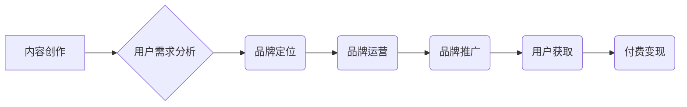

                 

## 知识付费赚钱的品牌品牌运营与品牌推广策略

> 关键词：知识付费、品牌运营、品牌推广、内容营销、社区运营、付费变现、用户增长、市场营销

### 1. 背景介绍

知识经济时代，知识成为最宝贵的资源。知识付费作为一种新型的商业模式，在近年来迅速发展，并成为众多创作者和企业关注的焦点。它指的是通过提供有价值的知识、技能和服务，向用户收取费用的一种商业模式。

知识付费的兴起，得益于以下几个因素：

* **互联网技术的普及:** 互联网为知识传播提供了便捷的平台，降低了知识获取的门槛。
* **用户需求的变化:**  用户对个性化、专业化知识的需求日益增长，传统教育模式难以满足。
* **创作者的涌现:**  越来越多的专家、学者、企业家等拥有丰富的知识和经验，希望通过知识付费的方式分享和变现。

知识付费市场呈现出蓬勃发展的态势，涵盖了各个领域，例如：

* **教育培训:**  在线课程、直播讲座、辅导服务等。
* **专业技能:**  编程、设计、写作、营销等技能培训。
* **兴趣爱好:**  摄影、绘画、音乐、舞蹈等兴趣课程。
* **健康养生:**  营养咨询、健身指导、心理咨询等。

### 2. 核心概念与联系

知识付费的核心概念包括：

* **内容:**  优质、有价值、独特性强的知识产权。
* **用户:**  对知识有需求、愿意付费的用户群体。
* **平台:**  提供知识付费服务的平台，例如：微信公众号、抖音、B站、知识付费平台等。
* **变现:**  通过订阅、课程购买、会员制度等方式实现盈利。

**品牌运营与品牌推广**是知识付费成功的关键因素。品牌运营是指建立和维护品牌形象，提升品牌价值，而品牌推广是指通过各种营销活动，扩大品牌知名度和影响力。

**Mermaid 流程图:**



### 3. 核心算法原理 & 具体操作步骤

知识付费的成功离不开数据分析和算法的驱动。

**3.1 算法原理概述**

常用的算法包括：

* **推荐算法:**  根据用户的历史行为、兴趣偏好等信息，推荐相关的知识付费内容。
* **用户画像算法:**  通过分析用户的行为数据，构建用户画像，以便精准定位目标用户。
* **内容分发算法:**  根据内容的质量、用户兴趣等因素，优化内容的展示顺序和分发策略。

**3.2 算法步骤详解**

1. **数据收集:**  收集用户行为数据、内容数据、市场数据等。
2. **数据清洗:**  对收集到的数据进行清洗和处理，去除无效数据和噪声数据。
3. **特征提取:**  从数据中提取有价值的特征，例如用户年龄、性别、兴趣爱好、阅读时长、购买记录等。
4. **模型训练:**  使用机器学习算法，对提取的特征进行训练，构建推荐模型、用户画像模型、内容分发模型等。
5. **模型评估:**  评估模型的性能，并进行调整和优化。
6. **模型部署:**  将训练好的模型部署到线上平台，实现自动化推荐、用户画像和内容分发。

**3.3 算法优缺点**

* **优点:**  能够提高推荐精准度、用户体验和内容曝光率。
* **缺点:**  需要大量的训练数据和计算资源，算法模型需要不断更新和优化。

**3.4 算法应用领域**

* **电商推荐:**  推荐商品、优惠券等。
* **内容平台推荐:**  推荐文章、视频、音频等内容。
* **社交媒体推荐:**  推荐好友、群组、话题等。
* **金融服务推荐:**  推荐理财产品、保险产品等。

### 4. 数学模型和公式 & 详细讲解 & 举例说明

**4.1 数学模型构建**

知识付费平台的运营可以抽象为一个用户-内容-平台的交互系统。我们可以使用数学模型来描述用户行为、内容传播和平台收益的关系。

例如，我们可以使用以下模型来描述用户对知识付费内容的购买意愿：

$$
P = f(C, U, P)
$$

其中：

* $P$：用户购买意愿
* $C$：内容质量
* $U$：用户价值感知
* $P$：平台价格

**4.2 公式推导过程**

我们可以通过用户行为数据和市场调研数据，对上述模型进行参数估计和优化。例如，我们可以使用回归分析方法，估计不同内容质量、用户价值感知和平台价格对用户购买意愿的影响。

**4.3 案例分析与讲解**

假设我们有一个知识付费平台，提供编程课程。我们可以通过分析用户购买数据，发现以下规律：

* 用户对高质量编程课程的购买意愿更高。
* 用户对自身价值感知高的课程更愿意付费。
* 平台价格过高会降低用户购买意愿。

根据这些规律，我们可以调整平台的课程质量、用户价值感知和价格策略，以提高用户购买意愿和平台收益。

### 5. 项目实践：代码实例和详细解释说明

**5.1 开发环境搭建**

* Python 3.x
* Flask 或 Django 框架
* 数据库 (例如 MySQL, PostgreSQL)
* 前端框架 (例如 React, Vue.js)

**5.2 源代码详细实现**

以下是一个简单的 Flask 应用程序的代码示例，用于展示知识付费平台的基本功能：

```python
from flask import Flask, render_template, request

app = Flask(__name__)

# 模拟课程数据
courses = [
    {'id': 1, 'title': 'Python 基础', 'price': 99},
    {'id': 2, 'title': '数据结构与算法', 'price': 199},
]

@app.route('/')
def index():
    return render_template('index.html', courses=courses)

@app.route('/course/<int:course_id>')
def course_detail(course_id):
    course = next((c for c in courses if c['id'] == course_id), None)
    return render_template('course_detail.html', course=course)

if __name__ == '__main__':
    app.run(debug=True)
```

**5.3 代码解读与分析**

* 应用程序使用 Flask 框架，提供简单的网页展示和路由处理。
* `courses` 变量模拟课程数据，包含课程 ID、标题和价格。
* `/` 路由返回首页，展示所有课程列表。
* `/course/<int:course_id>` 路由返回特定课程的详情页面。

**5.4 运行结果展示**

运行上述代码，访问 `http://127.0.0.1:5000/`，即可看到简单的知识付费平台首页。

### 6. 实际应用场景

知识付费的应用场景非常广泛，例如：

* **在线教育平台:**  提供各种类型的在线课程，例如编程、设计、语言学习等。
* **专业技能培训平台:**  提供专业技能培训课程，例如营销、财务、管理等。
* **兴趣爱好社区:**  提供兴趣爱好相关的课程和服务，例如摄影、绘画、音乐等。
* **个人知识分享平台:**  个人创作者可以通过平台分享自己的知识和经验，并获得收益。

**6.4 未来应用展望**

未来，知识付费将更加个性化、智能化和多元化。

* **个性化推荐:**  通过大数据分析和人工智能算法，为用户提供更精准的知识付费推荐。
* **沉浸式体验:**  利用虚拟现实、增强现实等技术，提供更沉浸式的知识付费体验。
* **社区互动:**  构建知识付费社区，促进用户之间的互动和交流。

### 7. 工具和资源推荐

**7.1 学习资源推荐**

* **书籍:**  《知识付费商业模式》、《互联网思维》、《用户增长黑客》
* **课程:**  Coursera、edX、Udemy 等在线学习平台上的知识付费课程
* **博客:**  36氪、TechCrunch、Product Hunt 等科技博客

**7.2 开发工具推荐**

* **Python:**  Flask、Django 框架
* **前端框架:**  React、Vue.js
* **数据库:**  MySQL、PostgreSQL
* **云平台:**  AWS、Azure、GCP

**7.3 相关论文推荐**

* **推荐算法:**  Collaborative Filtering, Content-Based Filtering, Hybrid Recommender Systems
* **用户画像:**  User Segmentation, Customer Relationship Management (CRM)
* **内容分发:**  Content Delivery Network (CDN), Content Recommendation Systems

### 8. 总结：未来发展趋势与挑战

**8.1 研究成果总结**

知识付费模式的成功，离不开内容质量、用户体验、平台运营和技术驱动。

**8.2 未来发展趋势**

未来，知识付费将更加个性化、智能化和多元化，并与其他技术融合，例如：

* **人工智能:**  个性化推荐、智能内容创作、自动客服
* **虚拟现实:**  沉浸式学习体验
* **区块链:**  知识产权保护、透明化交易

**8.3 面临的挑战**

知识付费模式也面临一些挑战，例如：

* **内容质量控制:**  保证知识付费内容的质量和真实性。
* **用户信任:**  建立用户对平台和内容的信任。
* **商业模式创新:**  探索新的知识付费商业模式。

**8.4 研究展望**

未来研究方向包括：

* **更精准的推荐算法:**  利用深度学习等技术，提高推荐精准度和用户体验。
* **更有效的用户画像模型:**  构建更细致的用户画像，精准定位目标用户。
* **更安全的知识付费平台:**  加强知识产权保护和用户隐私保护。

### 9. 附录：常见问题与解答

**常见问题:**

* 如何选择合适的知识付费平台？
* 如何制作高质量的知识付费内容？
* 如何推广自己的知识付费产品？

**解答:**

* 选择平台时，需要考虑平台的定位、用户群体、收费模式、技术支持等因素。
* 制作高质量内容需要注重内容的原创性、实用性、趣味性和可读性。
* 推广知识付费产品可以利用社交媒体、内容营销、付费广告等方式。


作者：禅与计算机程序设计艺术 / Zen and the Art of Computer Programming 
<end_of_turn>

