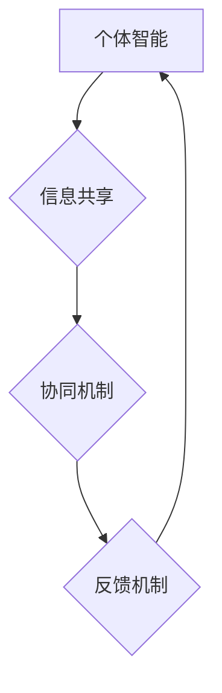

                 

## 集体智慧：解决复杂问题的创新思路

> 关键词：集体智慧、协同进化、复杂系统、人工智能、机器学习、算法优化、分布式计算、网络效应

## 1. 背景介绍

在当今科技日新月异的时代，面对日益复杂的技术挑战，单一智能的局限性越来越明显。解决这些复杂问题，需要一种全新的思维方式，一种能够汇集众多智慧的力量，共同探索解决方案的机制。这就是“集体智慧”的概念。

集体智慧是指由多个个体协同合作，通过信息共享、经验积累和相互学习，最终形成超越单个个体能力的智能表现。这种智慧的产生，并非简单的个体能力叠加，而是通过系统级的协同作用，激发出新的创造力和解决问题的能力。

在计算机领域，集体智慧的应用日益广泛，从人工智能的算法优化到软件开发的协同工作，从大规模数据分析到网络安全防护，集体智慧正在深刻地改变着我们与技术交互的方式。

## 2. 核心概念与联系

**2.1 集体智慧的构成要素**

* **个体智能:**  每个个体都拥有独立的知识和能力，能够进行基本的判断和决策。
* **信息共享:** 个体之间能够有效地共享信息，包括知识、经验和数据。
* **协同机制:**  个体之间存在着协同机制，能够共同完成任务，并从合作中学习和成长。
* **反馈机制:**  系统能够对个体的行为进行反馈，并根据反馈进行调整，以提高整体性能。

**2.2 集体智慧的实现方式**

* **人工协作:** 人类专家通过团队合作、讨论和协商，共同解决复杂问题。
* **机器学习:**  人工智能算法通过学习大量数据，发现模式和规律，并根据这些知识进行决策和预测。
* **群体智能:**  模拟生物群体行为的算法，例如蚁群算法、粒子群算法等，通过个体之间的相互作用，实现全局优化。

**2.3 集体智慧的架构**



## 3. 核心算法原理 & 具体操作步骤

**3.1 算法原理概述**

蚁群算法是一种模拟蚂蚁寻找食物路径的群体智能算法。蚂蚁通过留下信息素来引导其他蚂蚁，最终找到最优路径。

**3.2 算法步骤详解**

1. **初始化:**  随机生成若干个蚂蚁，并设置每个蚂蚁的初始位置。
2. **信息素更新:**  每个蚂蚁在移动过程中，会根据当前路径的质量留下信息素。
3. **路径选择:**  每个蚂蚁在选择下一个移动方向时，会根据信息素浓度和路径长度进行权衡。
4. **循环迭代:**  重复步骤2和3，直到达到终止条件。

**3.3 算法优缺点**

* **优点:**  能够找到全局最优解，具有较强的鲁棒性，易于实现。
* **缺点:**  收敛速度较慢，对参数设置较为敏感。

**3.4 算法应用领域**

* **路径规划:**  例如物流配送、无人驾驶等。
* **资源分配:**  例如网络流量调度、任务分配等。
* **优化问题求解:**  例如生产调度、投资组合等。

## 4. 数学模型和公式 & 详细讲解 & 举例说明

**4.1 数学模型构建**

设蚂蚁 i 在时间 t 的位置为 x<sub>i,t</sub>，路径长度为 L<sub>i,t</sub>，信息素浓度为 η<sub>i,t</sub>。

**4.2 公式推导过程**

* 信息素更新公式:

 $$ \eta_{i,t+1} = (1 - \rho) \eta_{i,t} + \alpha \frac{1}{L_{i,t}} $$

其中:

* ρ 为信息素挥发系数
* α 为信息素权重系数

* 路径选择概率:

$$ p_{i,j} = \frac{\eta_{j} ^ \alpha \cdot \tau_{j} ^ \beta}{\sum_{k \in N_i} \eta_{k} ^ \alpha \cdot \tau_{k} ^ \beta} $$

其中:

* j 为蚂蚁 i 可选择的下一个节点
* N<sub>i</sub> 为蚂蚁 i 可选择的下一个节点集合
* β 为路径长度权重系数

**4.3 案例分析与讲解**

假设有 5 个蚂蚁，每个蚂蚁需要从起点 A 到终点 B，路径长度分别为 10, 8, 12, 9, 11。

初始信息素浓度为 1，信息素挥发系数为 0.1，路径长度权重系数为 2，信息素权重系数为 1。

通过迭代计算，蚂蚁会根据信息素浓度和路径长度选择最优路径，最终信息素浓度会集中在最优路径上，其他路径的信息素浓度会逐渐降低。

## 5. 项目实践：代码实例和详细解释说明

**5.1 开发环境搭建**

* Python 3.x
* NumPy
* Matplotlib

**5.2 源代码详细实现**

```python
import numpy as np
import matplotlib.pyplot as plt

# 参数设置
num_ants = 5
num_cities = 5
alpha = 1
beta = 2
rho = 0.1
iterations = 100

# 初始化信息素浓度矩阵
eta = np.ones((num_cities, num_cities))

# 初始化蚂蚁位置
ants_pos = np.random.randint(0, num_cities, size=(num_ants, 1))

# 迭代计算
for i in range(iterations):
    # 蚂蚁移动
    for ant in range(num_ants):
        # 选择下一个城市
        next_city = choose_next_city(ants_pos[ant], eta)
        # 更新蚂蚁位置
        ants_pos[ant] = next_city

    # 更新信息素浓度
    update_eta(ants_pos, eta, rho, alpha, beta)

# 绘制结果
plot_result(ants_pos, eta)
```

**5.3 代码解读与分析**

* `choose_next_city()` 函数根据信息素浓度和路径长度选择下一个城市。
* `update_eta()` 函数更新信息素浓度矩阵。
* `plot_result()` 函数绘制蚂蚁路径和信息素浓度分布。

**5.4 运行结果展示**

运行代码后，会生成一个展示蚂蚁路径和信息素浓度分布的图形。

## 6. 实际应用场景

**6.1 物流配送优化**

利用蚁群算法可以优化物流配送路线，减少运输成本和时间。

**6.2 网络流量调度**

通过蚁群算法可以动态调整网络流量，提高网络效率和可靠性。

**6.3 股票投资组合优化**

蚁群算法可以帮助投资者构建最优的股票投资组合，最大化收益。

**6.4 未来应用展望**

随着人工智能技术的不断发展，集体智慧的应用场景将会更加广泛，例如：

* **医疗诊断:**  利用多个专家和机器学习模型的集体智慧，提高疾病诊断的准确率。
* **科学研究:**  通过模拟生物群体行为，加速科学发现和创新。
* **社会治理:**  利用集体智慧解决社会问题，例如交通拥堵、环境污染等。

## 7. 工具和资源推荐

**7.1 学习资源推荐**

* **书籍:**  《集体智慧：解决复杂问题的创新思路》
* **在线课程:**  Coursera、edX 等平台上的人工智能和群体智能课程。

**7.2 开发工具推荐**

* **Python:**  广泛应用于人工智能和群体智能开发。
* **NumPy:**  用于数值计算和矩阵操作。
* **Scikit-learn:**  机器学习库。

**7.3 相关论文推荐**

* **Ant Colony Optimization: A Metaheuristic Approach to Problem Solving**
* **Particle Swarm Optimization: An Overview**
* **Collective Intelligence: A New Paradigm for Problem Solving**

## 8. 总结：未来发展趋势与挑战

**8.1 研究成果总结**

集体智慧的研究取得了显著进展，为解决复杂问题提供了新的思路和方法。

**8.2 未来发展趋势**

* **更强大的计算能力:**  随着计算能力的提升，集体智慧算法能够处理更复杂的问题。
* **更智能的个体:**  人工智能技术的进步，将使个体智能更加强大，从而提升集体智慧的水平。
* **更广泛的应用场景:**  集体智慧将应用于更多领域，例如医疗、教育、金融等。

**8.3 面临的挑战**

* **算法效率:**  一些集体智慧算法的效率较低，需要进一步优化。
* **数据安全:**  集体智慧算法需要处理大量数据，数据安全问题需要得到重视。
* **伦理问题:**  集体智慧的应用可能会带来一些伦理问题，需要进行深入探讨。

**8.4 研究展望**

未来，集体智慧研究将继续深入，探索更有效的算法、更智能的个体和更广泛的应用场景，为人类社会带来更多福祉。

## 9. 附录：常见问题与解答

**9.1 如何选择合适的集体智慧算法？**

选择合适的集体智慧算法需要根据具体问题特点进行分析，例如问题规模、数据类型、目标函数等。

**9.2 集体智慧算法的效率如何提高？**

可以通过优化算法参数、使用更强大的计算资源、并行化计算等方式提高集体智慧算法的效率。

**9.3 集体智慧算法的安全性如何保障？**

可以通过加密算法、数据脱敏等技术保障集体智慧算法的安全性。


作者：禅与计算机程序设计艺术 / Zen and the Art of Computer Programming 
<end_of_turn>

