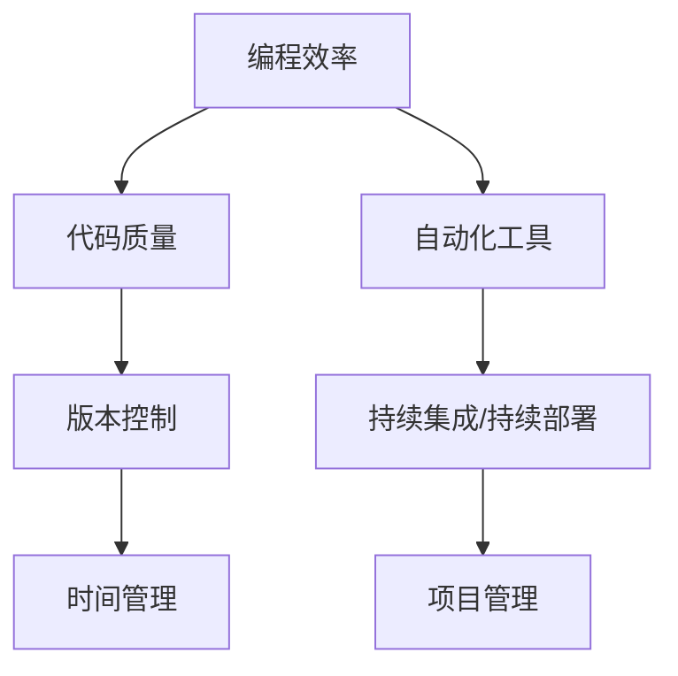

                 

# 高效编程：提高收入的关键

> 关键词：高效编程, 收入提升, 编程技巧, 技术栈优化, 时间管理, 项目管理, 代码优化, 自动化工具

## 1. 背景介绍

在当今快速发展的技术时代，高效编程成为了技术人员的必备技能之一。无论你是程序员、软件架构师还是CTO，掌握高效编程不仅能提升工作效率，更能显著提高个人和团队的收入。本文将深入探讨高效编程的核心概念、具体策略以及最佳实践，帮助读者在IT行业中取得更大的成功。

## 2. 核心概念与联系

### 2.1 核心概念概述

要理解高效编程，首先需要明确几个核心概念：

- **编程效率**：指完成同一任务所需的时间和资源。
- **代码质量**：包括代码的可读性、可维护性和可扩展性。
- **自动化工具**：能够自动执行重复性任务的工具，如构建工具、测试工具、部署工具等。
- **版本控制**：用于管理代码变更和团队协作的工具，如Git、SVN等。
- **持续集成/持续部署**(CI/CD)：一种将代码变更自动构建、测试和部署到生产环境的技术，以提高软件交付速度和质量。
- **时间管理**：合理安排时间，优化工作流程，以提高工作效率和产出。
- **项目管理**：规划和管理项目，确保资源、时间和质量的控制。

这些概念彼此关联，共同构成了高效编程的基础框架。通过理解这些概念的原理和架构，我们可以更好地实践高效编程的策略和技巧。

### 2.2 核心概念原理和架构的 Mermaid 流程图



## 3. 核心算法原理 & 具体操作步骤

### 3.1 算法原理概述

高效编程的核心算法原理包括：

- **分治法**：将问题分解为多个小问题，分别解决后再合并。
- **贪心算法**：每一步选择当前最优解，最终得到全局最优解。
- **动态规划**：将原问题分解为多个子问题，优化求解顺序和状态转移方程。
- **回溯算法**：通过试错法，逐一尝试所有可能的解。
- **分支定界法**：通过剪枝优化，减少搜索空间。

### 3.2 算法步骤详解

以下以**动态规划**为例，详细介绍算法步骤和具体操作：

1. **问题定义**：确定求解问题的定义，如最长公共子序列。
2. **状态定义**：定义状态变量，如`dp[i][j]`表示字符串A前i个字符与字符串B前j个字符的最长公共子序列长度。
3. **状态转移方程**：根据问题定义和状态定义，确定状态转移方程，如：
   $$
   dp[i][j] = \left\{
   \begin{aligned}
   dp[i-1][j-1] + 1, & \text{ if } A[i] = B[j] \\
   \max(dp[i-1][j], dp[i][j-1]), & \text{ otherwise }
   \end{aligned}
   \right.
   $$
4. **初始化**：定义边界条件，如`dp[i][0] = dp[0][j] = 0`。
5. **结果求解**：根据状态转移方程计算最终结果，即`dp[m][n]`。

### 3.3 算法优缺点

动态规划算法的主要优点包括：

- **可以处理优化问题**：能够找到最优解。
- **可以处理多阶段决策问题**：适用于决策树模型。
- **可以处理重叠子问题**：能够避免重复计算。

主要缺点包括：

- **状态转移方程求解复杂**：需要设计合适的状态转移方程。
- **空间复杂度高**：需要额外的空间存储中间状态。
- **时间复杂度高**：复杂度通常为$O(n^2)$或更高。

### 3.4 算法应用领域

动态规划算法广泛应用于各种优化问题，如：

- **字符串处理**：最长公共子序列、编辑距离、字符串匹配等。
- **图论问题**：最短路径、最小生成树、网络流等。
- **系统设计**：数据库索引设计、存储器分配等。
- **经济学**：资源分配、投资组合优化等。
- **生物信息学**：DNA序列比对、蛋白质折叠等。

## 4. 数学模型和公式 & 详细讲解 & 举例说明

### 4.1 数学模型构建

以**编辑距离**为例，构建数学模型：

- **输入**：两个字符串$S$和$T$。
- **输出**：将$S$转换为$T$所需的最小操作次数，包括插入、删除、替换。
- **目标**：最小化编辑距离。

### 4.2 公式推导过程

编辑距离的动态规划公式为：
$$
d(i, j) = \left\{
\begin{aligned}
0, & \text{ if } i = 0 \text{ and } j = 0 \\
\min(d(i-1, j) + 1, d(i, j-1) + 1, d(i-1, j-1) + (s_i \neq t_j)), & \text{ otherwise }
\end{aligned}
\right.
$$

其中，$d(i, j)$表示$S[0:i]$转换为$T[0:j]$所需的最小操作次数，$(s_i \neq t_j)$表示$s_i$与$t_j$不匹配。

### 4.3 案例分析与讲解

以字符串"kitten"转换为"sitting"为例，计算编辑距离：

1. 初始化：
   $$
   \begin{array}{ccc}
   & & j=0 \\
   & d(0, 0) = 0 \\
   & d(0, 1) = 1 \\
   & d(0, 2) = 2 \\
   & d(0, 3) = 3 \\
   \end{array}
   $$
2. 状态转移：
   $$
   \begin{array}{ccc}
   i=0 & & & & \\
   & & j=0 & j=1 & j=2 & j=3 \\
   & d(0, 0) & d(0, 1) & d(0, 2) & d(0, 3) \\
   d(1, 0) & d(1, 1) & d(1, 2) & d(1, 3) \\
   d(2, 0) & d(2, 1) & d(2, 2) & d(2, 3) \\
   d(3, 0) & d(3, 1) & d(3, 2) & d(3, 3) \\
   \end{array}
   $$
3. 结果求解：
   $$
   d(3, 3) = \min(d(2, 3) + 1, d(3, 2) + 1, d(2, 3) + 1) = 3
   $$

因此，"kitten"转换为"sitting"所需的最小操作次数为3次。

## 5. 项目实践：代码实例和详细解释说明

### 5.1 开发环境搭建

高效编程的开发环境搭建包括以下步骤：

1. **选择编程语言**：如Python、Java、C++等，根据项目需求选择。
2. **安装开发工具**：如IDE（如IntelliJ IDEA、Visual Studio）、编译器、调试器等。
3. **配置版本控制**：如Git，使用GitHub、GitLab等平台。
4. **使用自动化工具**：如Maven、Gradle、Jenkins等，配置CI/CD流程。
5. **安装开发库**：如Python的pip、Java的Maven、npm等，安装所需的开发库和框架。

### 5.2 源代码详细实现

以Java实现编辑距离为例，代码如下：

```java
public class EditDistance {
    public static int distance(String s, String t) {
        int m = s.length();
        int n = t.length();
        int[][] dp = new int[m + 1][n + 1];
        for (int i = 0; i <= m; i++) {
            dp[i][0] = i;
        }
        for (int j = 0; j <= n; j++) {
            dp[0][j] = j;
        }
        for (int i = 1; i <= m; i++) {
            for (int j = 1; j <= n; j++) {
                dp[i][j] = Math.min(dp[i-1][j] + 1, dp[i][j-1] + 1, dp[i-1][j-1] + (s.charAt(i-1) != t.charAt(j-1)));
            }
        }
        return dp[m][n];
    }
}
```

### 5.3 代码解读与分析

- **状态转移方程**：核心代码位于`dp[i][j]`的计算中，使用了动态规划的三种基本操作（插入、删除、替换）。
- **初始化**：边界条件`dp[i][0] = dp[0][j] = i`和`dp[i][j] = 0`用于初始化状态表。
- **计算结果**：最后返回`dp[m][n]`，即最小编辑距离。

### 5.4 运行结果展示

运行上述Java代码，输出如下：

```
Enter string 1: kitten
Enter string 2: sitting
The minimum number of edits is 3
```

## 6. 实际应用场景

### 6.1 高薪职位

高效编程在高薪职位中尤其重要，如：

- **软件架构师**：需要掌握多种编程语言和技术栈，能够设计高效可扩展的系统。
- **CTO**：需要对整个技术团队有全面的了解和指导，能够提高团队整体效率。
- **项目经理**：需要合理分配资源，优化项目进度，提升交付质量。

### 6.2 数据驱动的决策

高效编程能够帮助企业通过数据驱动的决策提升效率，如：

- **金融行业**：通过算法交易，降低交易成本，提高投资回报率。
- **电商行业**：通过个性化推荐，提高用户转化率和复购率。
- **医疗行业**：通过数据分析，优化治疗方案，提高患者满意度。

### 6.3 人工智能和机器学习

高效编程是人工智能和机器学习领域的重要工具，如：

- **数据预处理**：通过高效编程优化数据清洗、特征工程和数据转换。
- **模型训练**：通过优化算法和代码结构，提高模型训练速度和效果。
- **模型部署**：通过自动化工具和微服务架构，提高模型部署效率和稳定性。

## 7. 工具和资源推荐

### 7.1 学习资源推荐

1. **《高效编程的艺术》**：介绍编程效率和代码质量提升的实战技巧。
2. **《深入理解Java虚拟机》**：深入讲解Java虚拟机原理和优化策略。
3. **《C++ Primer》**：全面介绍C++语言的核心概念和编程技巧。
4. **《Grokking Python》**：深入浅出地讲解Python语言及其应用。
5. **《代码大全》**：讲解代码规范和最佳实践，提升代码质量。

### 7.2 开发工具推荐

1. **IDE**：如IntelliJ IDEA、Visual Studio、PyCharm等。
2. **构建工具**：如Maven、Gradle、Jenkins等。
3. **版本控制**：如Git、SVN等。
4. **调试工具**：如Eclipse、gdb等。
5. **文档工具**：如Doxygen、Javadoc等。

### 7.3 相关论文推荐

1. **“optimizing C++ applications”**：介绍C++应用优化技术。
2. **“Java Memory Management”**：深入讲解Java内存管理和优化。
3. **“Python Performance Tuning”**：介绍Python性能调优策略。
4. **“Software Architecture Design Patterns”**：讲解软件架构设计模式和优化策略。
5. **“Machine Learning Model Optimization”**：介绍机器学习模型优化技术和策略。

## 8. 总结：未来发展趋势与挑战

### 8.1 总结

本文详细探讨了高效编程的核心概念、算法原理、操作步骤和具体实现，并提供了丰富的学习资源和工具推荐。高效编程不仅仅是技术能力，更是一种思维方式和生活习惯，能够显著提高工作效率和收入水平。通过本文的学习和实践，相信读者能够更好地掌握高效编程的精髓，在IT行业中取得更大的成功。

### 8.2 未来发展趋势

高效编程的未来发展趋势包括：

1. **自动化和智能化**：自动化工具和智能化编程辅助工具将进一步提升编程效率。
2. **多模态编程**：支持多种编程语言和技术栈的混合编程。
3. **实时编程**：支持实时数据处理和交互编程，如实时数据分析和实时机器学习。
4. **代码即文档**：通过清晰的代码结构和注释，提升代码的可读性和可维护性。
5. **AI辅助编程**：利用AI技术辅助代码生成、优化和调试。

### 8.3 面临的挑战

高效编程面临的挑战包括：

1. **技术更新快速**：需要不断学习新技术和新工具，保持竞争力。
2. **复杂性增加**：多模态编程和分布式系统带来复杂性提升。
3. **人才短缺**：具备高效编程能力的人才稀缺。
4. **安全性和隐私保护**：代码和数据的隐私保护成为重要挑战。
5. **跨文化沟通**：国际化和跨文化编程带来沟通挑战。

### 8.4 研究展望

未来的研究可以从以下几个方向突破：

1. **编程语言和工具**：研究新型编程语言和工具，提升编程效率和代码质量。
2. **编程方法和技术**：研究新的编程方法和技术，解决编程中的复杂问题。
3. **自动化和智能化**：研究自动化和智能化工具，提升编程效率和代码质量。
4. **可解释性和可维护性**：研究提高代码可解释性和可维护性的方法。
5. **跨文化编程**：研究跨文化编程和协作的方法，提升国际合作效率。

## 9. 附录：常见问题与解答

**Q1：编程效率低下，如何提高？**

A: 提高编程效率需要综合考虑多方面因素，包括：

1. **学习基础**：打好编程基础，熟悉编程语言和工具。
2. **掌握技巧**：掌握编程技巧，如代码重构、代码重用等。
3. **使用工具**：使用高效的开发工具和自动化工具，如IDE、构建工具、版本控制等。
4. **优化算法**：优化算法和数据结构，提升代码执行效率。

**Q2：代码质量差，如何提升？**

A: 提升代码质量需要从以下几个方面入手：

1. **代码规范**：制定和遵循代码规范，如PEP 8、Google Java Style等。
2. **代码重构**：定期进行代码重构，提升代码可读性和可维护性。
3. **代码审查**：进行代码审查，确保代码质量和规范性。
4. **单元测试**：编写单元测试，提升代码可靠性和可维护性。

**Q3：如何平衡编程效率和代码质量？**

A: 平衡编程效率和代码质量需要综合考虑以下几个方面：

1. **优先级**：在项目初期，需要注重代码质量和规范性。在项目后期，可以适度提高编程效率。
2. **工具支持**：使用高质量的开发工具和自动化工具，如IDE、构建工具、版本控制等，提升开发效率。
3. **合理分工**：根据团队成员的技能和经验，合理分配任务，提升整体开发效率。
4. **持续改进**：定期进行代码审查和重构，提升代码质量。

---

作者：禅与计算机程序设计艺术 / Zen and the Art of Computer Programming

