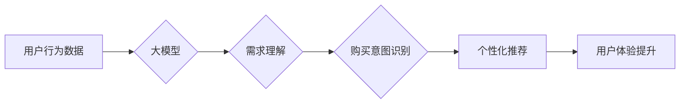

                 

## AI 大模型在电商搜索推荐中的用户行为分析：理解用户需求与购买意图

> 关键词：电商搜索推荐、用户行为分析、大模型、购买意图、需求理解、自然语言处理、推荐系统

## 1. 背景介绍

在当今数字经济时代，电商平台已成为人们获取商品和服务的首选渠道。搜索推荐系统作为电商平台的核心功能之一，直接影响着用户体验和商业转化率。传统的搜索推荐系统主要依赖于商品特征和用户历史行为，但随着用户行为的复杂性和多样性不断增加，传统的基于规则和统计模型的推荐系统逐渐难以满足用户的个性化需求。

近年来，大模型技术在自然语言处理、计算机视觉等领域取得了突破性进展，为电商搜索推荐带来了新的机遇。大模型能够学习和理解用户行为背后的复杂语义和模式，从而提供更精准、更个性化的推荐结果。

## 2. 核心概念与联系

### 2.1  电商搜索推荐系统

电商搜索推荐系统旨在根据用户的搜索查询和历史行为，推荐与用户需求相匹配的商品。它通常由以下几个模块组成：

* **搜索引擎:** 处理用户搜索查询，并返回与查询相关的商品列表。
* **推荐引擎:** 基于用户行为和商品特征，对搜索结果进行排序和推荐。
* **个性化引擎:** 根据用户的个人喜好、购买历史等信息，对推荐结果进行个性化定制。
* **展示引擎:** 将推荐结果以用户友好的方式展示给用户。

### 2.2  大模型

大模型是指参数量巨大、训练数据海量的人工智能模型。它能够学习和理解复杂的语言模式和知识关系，并应用于各种自然语言处理任务，例如文本分类、机器翻译、问答系统等。

### 2.3  用户行为分析

用户行为分析是指通过收集和分析用户在电商平台上的行为数据，以了解用户的需求、偏好和购买意图。常见的用户行为数据包括：

* **搜索历史:** 用户在搜索引擎中输入的查询词。
* **浏览历史:** 用户访问过的商品页面。
* **购买历史:** 用户购买过的商品。
* **评价和反馈:** 用户对商品的评价和反馈信息。

### 2.4  购买意图识别

购买意图识别是指通过分析用户的行为数据，预测用户是否会购买某个商品。这对于电商平台来说至关重要，因为它可以帮助平台优化商品推荐、提高转化率。

**核心概念与联系流程图:**



## 3. 核心算法原理 & 具体操作步骤

### 3.1  算法原理概述

大模型在电商搜索推荐中的用户行为分析主要基于以下核心算法：

* **自然语言处理 (NLP):** 用于分析用户搜索查询和商品描述中的文本信息，提取关键词、语义关系等。
* **机器学习 (ML):** 用于训练模型，学习用户行为模式和购买意图。
* **深度学习 (DL):** 用于构建更复杂的模型，例如 Transformer 模型，以更好地理解用户需求和商品特征。

### 3.2  算法步骤详解

1. **数据收集和预处理:** 收集用户行为数据，包括搜索历史、浏览历史、购买历史、评价和反馈等。对数据进行清洗、格式化和编码，以便于模型训练。
2. **特征工程:** 从用户行为数据中提取特征，例如用户年龄、性别、地理位置、购买频率、商品类别、价格等。这些特征可以帮助模型更好地理解用户需求和购买意图。
3. **模型训练:** 使用机器学习或深度学习算法，训练模型以预测用户购买意图。常用的模型包括逻辑回归、支持向量机、决策树、随机森林、神经网络等。
4. **模型评估:** 使用测试数据评估模型的性能，例如准确率、召回率、F1-score等。根据评估结果，调整模型参数和训练策略，以提高模型性能。
5. **模型部署:** 将训练好的模型部署到生产环境中，用于实时推荐商品。

### 3.3  算法优缺点

**优点:**

* **精准度高:** 大模型能够学习和理解用户行为背后的复杂语义和模式，从而提供更精准的推荐结果。
* **个性化强:** 大模型可以根据用户的个人喜好、购买历史等信息，对推荐结果进行个性化定制。
* **可扩展性强:** 大模型可以轻松扩展到新的数据和任务，例如跨语言推荐、跨平台推荐等。

**缺点:**

* **训练成本高:** 大模型需要海量数据和强大的计算资源进行训练，成本较高。
* **解释性差:** 大模型的决策过程较为复杂，难以解释模型的推荐结果。
* **数据安全风险:** 大模型需要处理大量用户隐私数据，需要采取相应的安全措施保护用户隐私。

### 3.4  算法应用领域

大模型在电商搜索推荐中的应用领域非常广泛，例如：

* **商品推荐:** 根据用户的搜索历史、浏览历史、购买历史等信息，推荐与用户需求相匹配的商品。
* **个性化搜索:** 根据用户的个人喜好、购买习惯等信息，对搜索结果进行个性化排序和过滤。
* **用户画像:** 通过分析用户的行为数据，构建用户画像，了解用户的兴趣爱好、消费习惯等。
* **营销推广:** 根据用户的行为数据，进行精准营销推广，提高广告转化率。

## 4. 数学模型和公式 & 详细讲解 & 举例说明

### 4.1  数学模型构建

在电商搜索推荐中，常用的数学模型包括协同过滤模型、内容推荐模型和混合推荐模型。

* **协同过滤模型:** 基于用户的历史行为数据，预测用户对商品的评分或购买意图。常用的协同过滤算法包括基于用户的协同过滤和基于物品的协同过滤。

* **内容推荐模型:** 基于商品的特征信息，预测用户对商品的兴趣。常用的内容推荐算法包括TF-IDF、Word2Vec等。

* **混合推荐模型:** 将协同过滤模型和内容推荐模型相结合，以提高推荐效果。

### 4.2  公式推导过程

**协同过滤模型的公式推导:**

假设用户u对商品i的评分为r<sub>ui</sub>，则协同过滤模型的目标是预测用户u对商品j的评分r<sub>uj</sub>。

常用的协同过滤算法之一是基于用户的协同过滤，其核心思想是找到与用户u兴趣相似的用户，并根据这些用户的评分对商品j进行预测。

**公式:**

$$r_{uj} = \bar{r}_u + \frac{\sum_{i \in N(u)} (r_{ui} - \bar{r}_u) \cdot s_{ui}}{\sum_{i \in N(u)} s_{ui}}$$

其中:

* $\bar{r}_u$ 是用户u的平均评分。
* $N(u)$ 是与用户u兴趣相似的用户集合。
* $r_{ui}$ 是用户u对商品i的评分。
* $s_{ui}$ 是用户u和用户i之间的相似度。

**举例说明:**

假设用户A和用户B都喜欢购买电子产品，并且对同一款手机的评分都为5分。如果用户A对另一款手机的评分为4分，则基于用户的协同过滤算法可以预测用户B对这款手机的评分也为4分。

### 4.3  案例分析与讲解

**案例:**

假设电商平台要推荐用户购买的书籍。

**分析:**

* 用户行为数据: 用户的浏览历史、购买历史、评价和反馈等。
* 商品特征: 书籍的类别、作者、出版社、价格等。

**推荐策略:**

* 协同过滤模型: 根据用户购买历史，找到与用户兴趣相似的用户，并推荐他们购买的书籍。
* 内容推荐模型: 根据用户的浏览历史，推荐与用户阅读偏好相匹配的书籍。
* 混合推荐模型: 将协同过滤模型和内容推荐模型相结合，以提高推荐效果。

**讲解:**

通过分析用户行为数据和商品特征，大模型可以构建出更精准的推荐模型，并提供更个性化的推荐结果。

## 5. 项目实践：代码实例和详细解释说明

### 5.1  开发环境搭建

* **操作系统:** Linux/macOS
* **编程语言:** Python
* **深度学习框架:** TensorFlow/PyTorch
* **数据处理库:** Pandas/NumPy
* **机器学习库:** Scikit-learn

### 5.2  源代码详细实现

```python
# 导入必要的库
import pandas as pd
from sklearn.model_selection import train_test_split
from sklearn.metrics import accuracy_score

# 加载用户行为数据
data = pd.read_csv('user_behavior.csv')

# 提取特征和目标变量
features = ['user_id', 'item_id', 'category', 'price']
target = 'purchase'

# 将数据划分为训练集和测试集
X_train, X_test, y_train, y_test = train_test_split(data[features], data[target], test_size=0.2)

# 训练逻辑回归模型
from sklearn.linear_model import LogisticRegression
model = LogisticRegression()
model.fit(X_train, y_train)

# 预测测试集结果
y_pred = model.predict(X_test)

# 计算模型准确率
accuracy = accuracy_score(y_test, y_pred)
print('模型准确率:', accuracy)
```

### 5.3  代码解读与分析

* **数据加载:** 使用 Pandas 库加载用户行为数据。
* **特征提取:** 从数据中提取用户、商品、类别和价格等特征。
* **数据划分:** 使用 train_test_split 函数将数据划分为训练集和测试集。
* **模型训练:** 使用 LogisticRegression 模型训练购买意图预测模型。
* **模型评估:** 使用 accuracy_score 函数计算模型准确率。

### 5.4  运行结果展示

运行上述代码后，可以得到模型的准确率。

## 6. 实际应用场景

### 6.1  电商平台商品推荐

大模型可以根据用户的搜索历史、浏览历史、购买历史等信息，推荐与用户需求相匹配的商品。例如，当用户搜索“运动鞋”时，大模型可以推荐与用户兴趣相似的运动鞋品牌、款式和价格。

### 6.2  个性化搜索结果

大模型可以根据用户的个人喜好、购买习惯等信息，对搜索结果进行个性化排序和过滤。例如，当用户搜索“手机”时，大模型可以根据用户的品牌偏好、价格预算等信息，优先推荐符合用户需求的手机。

### 6.3  用户画像构建

大模型可以分析用户的行为数据，构建用户画像，了解用户的兴趣爱好、消费习惯等。例如，大模型可以分析用户的购买历史，判断用户是否喜欢购买奢侈品、科技产品等。

### 6.4  未来应用展望

随着大模型技术的不断发展，其在电商搜索推荐中的应用场景将更加广泛，例如：

* **跨语言推荐:** 大模型可以理解不同语言的用户需求，提供跨语言的商品推荐。
* **跨平台推荐:** 大模型可以整合不同平台的用户行为数据，提供跨平台的个性化推荐。
* **多模态推荐:** 大模型可以结合文本、图像、视频等多模态数据，提供更丰富的商品推荐。

## 7. 工具和资源推荐

### 7.1  学习资源推荐

* **书籍:**
    * 深度学习
    * 自然语言处理
* **在线课程:**
    * Coursera
    * edX
    * Udacity

### 7.2  开发工具推荐

* **深度学习框架:** TensorFlow, PyTorch
* **数据处理库:** Pandas, NumPy
* **机器学习库:** Scikit-learn

### 7.3  相关论文推荐

* Attention Is All You Need
* BERT: Pre-training of Deep Bidirectional Transformers for Language Understanding
* Transformer-XL: Attentive Language Modeling Beyond Millions of Tokens

## 8. 总结：未来发展趋势与挑战

### 8.1  研究成果总结

大模型在电商搜索推荐中的应用取得了显著成果，能够提供更精准、更个性化的推荐结果，提升用户体验和商业转化率。

### 8.2  未来发展趋势

* **模型规模和能力的提升:** 未来大模型的规模和能力将进一步提升，能够更好地理解用户需求和商品特征。
* **多模态融合:** 大模型将结合文本、图像、视频等多模态数据，提供更丰富的商品推荐。
* **解释性增强:** 研究者将致力于提高大模型的解释性，使模型的决策过程更加透明。

### 8.3  面临的挑战

* **数据安全和隐私保护:** 大模型需要处理大量用户隐私数据，需要采取相应的安全措施保护用户隐私。
* **模型训练成本:** 大模型的训练成本较高，需要强大的计算资源和技术支持。
* **模型可解释性:** 大模型的决策过程较为复杂，难以解释模型的推荐结果。

### 8.4  研究展望

未来研究将重点关注以下几个方面:

* **开发更有效的训练方法:** 降低大模型的训练成本，提高训练效率。
* **增强模型的解释性:** 使模型的决策过程更加透明，提高用户对推荐结果的信任度。
* **探索新的应用场景:** 将大模型应用于更多电商场景，例如商品分类、价格预测等。

## 9. 附录：常见问题与解答

**问题:** 大模型的推荐结果是否会存在偏差？

**解答:** 大模型的推荐结果可能会存在偏差，例如性别、年龄、地域等方面的偏差。为了解决这个问题，需要进行数据预处理和模型调优，例如使用公平性评估指标，并采取措施减少模型的偏见。

**问题:** 如何评估大模型的推荐效果？

**解答:** 大模型的推荐效果可以通过多种指标进行评估，例如点击率、转化率、用户满意度等。

**问题:** 如何保护用户隐私数据？

**解答:** 在使用大模型进行用户行为分析时，需要采取相应的安全措施保护用户隐私数据，例如数据脱敏、加密传输等。


作者：禅与计算机程序设计艺术 / Zen and the Art of Computer Programming<end_of_turn>

