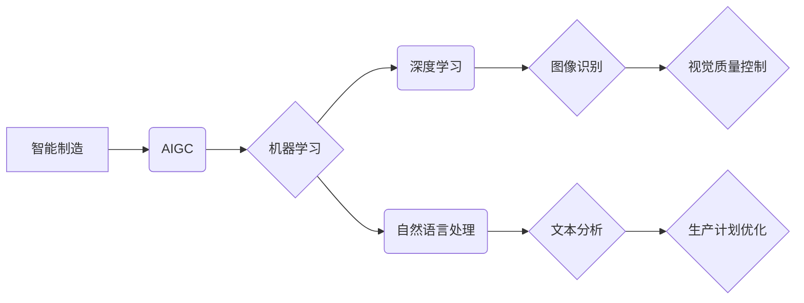

                 

## AIGC助力智能制造升级

> 关键词：AIGC, 智能制造, 机器学习, 深度学习, 自然语言处理, 图像识别, 预测维护, 自动化

## 1. 背景介绍

智能制造作为第四次工业革命的重要组成部分，正在深刻地改变着制造业的生产模式和发展方向。其核心目标是通过数字化、智能化手段，实现生产过程的自动化、优化和智能化控制，从而提高生产效率、降低成本、提升产品质量和服务水平。

然而，传统智能制造系统往往依赖于规则化编程和人工干预，难以应对复杂、多变的生产环境。随着人工智能（AI）技术的快速发展，特别是生成式人工智能（AIGC）的兴起，为智能制造的升级注入了新的活力。

AIGC是指能够生成新内容的AI模型，例如文本、图像、音频、视频等。它利用深度学习等算法，从海量数据中学习模式和规律，并生成具有创造性和创新性的内容。AIGC技术在智能制造领域具有广泛的应用前景，可以帮助企业实现以下目标：

* **智能化生产决策:** AIGC可以分析生产数据，识别趋势和异常，为生产决策提供数据支持。
* **自动化生产流程:** AIGC可以自动生成生产计划、控制生产设备、优化生产流程，提高生产效率。
* **个性化产品定制:** AIGC可以根据客户需求生成个性化产品设计方案，满足多样化的客户需求。
* **智能化质量控制:** AIGC可以识别产品缺陷，进行质量检测和评估，提高产品质量。
* **预测性维护:** AIGC可以分析设备运行数据，预测设备故障，提前进行维护，降低设备停机时间。

## 2. 核心概念与联系

**2.1 核心概念**

* **智能制造:** 利用数字化、网络化、智能化技术，实现生产过程的自动化、优化和智能化控制，提高生产效率、降低成本、提升产品质量和服务水平。
* **AIGC:** 生成式人工智能，是指能够生成新内容的AI模型，例如文本、图像、音频、视频等。
* **机器学习:** 一种人工智能技术，通过算法学习数据，发现数据中的模式和规律，并根据这些模式进行预测或决策。
* **深度学习:** 一种机器学习的子集，利用多层神经网络模拟人类大脑的学习过程，能够处理更复杂的数据和任务。
* **自然语言处理:** 一种人工智能技术，旨在使计算机能够理解和处理人类语言。

**2.2 架构关系**



## 3. 核心算法原理 & 具体操作步骤

**3.1 算法原理概述**

AIGC在智能制造中的应用主要依赖于以下核心算法：

* **深度学习:** 用于训练模型，识别模式和规律，例如图像识别、自然语言处理等。
* **强化学习:** 用于优化生产流程，例如机器人控制、生产调度等。
* **推荐系统:** 用于个性化产品定制，例如产品推荐、设计方案生成等。

**3.2 算法步骤详解**

以图像识别为例，AIGC在智能制造中的应用步骤如下：

1. **数据采集:** 收集生产过程中的图像数据，例如产品缺陷、设备状态等。
2. **数据预处理:** 对图像数据进行清洗、格式转换、增强等处理，提高数据质量。
3. **模型训练:** 利用深度学习算法，训练图像识别模型，使其能够识别不同类型的缺陷或状态。
4. **模型评估:** 对训练好的模型进行评估，测试其识别准确率和效率。
5. **模型部署:** 将训练好的模型部署到生产线上，用于实时识别图像数据。
6. **结果反馈:** 将识别结果反馈到生产系统，例如自动报警、调整生产参数等。

**3.3 算法优缺点**

**优点:**

* **自动化程度高:** AIGC可以自动完成图像识别、数据分析等任务，减少人工干预。
* **识别精度高:** 深度学习算法能够识别复杂、细微的缺陷，提高识别精度。
* **适应性强:** AIGC模型可以根据生产环境的变化进行调整，提高适应性。

**缺点:**

* **数据依赖性强:** AIGC模型需要大量的数据进行训练，数据质量直接影响模型性能。
* **计算资源需求高:** 训练深度学习模型需要大量的计算资源，成本较高。
* **解释性差:** 深度学习模型的决策过程难以解释，难以理解模型的 reasoning 机制。

**3.4 算法应用领域**

* **视觉质量控制:** 自动识别产品缺陷，提高产品质量。
* **设备状态监测:** 分析设备运行数据，预测设备故障，进行及时维护。
* **生产过程优化:** 分析生产数据，识别瓶颈和浪费，优化生产流程。
* **个性化产品定制:** 根据客户需求生成个性化产品设计方案。

## 4. 数学模型和公式 & 详细讲解 & 举例说明

**4.1 数学模型构建**

AIGC模型的构建通常基于深度学习框架，例如 TensorFlow 或 PyTorch。这些框架提供了一系列预训练模型和工具，可以帮助开发者构建和训练自己的模型。

**4.2 公式推导过程**

深度学习模型的训练过程本质上是一个优化问题，目标是找到模型参数，使得模型的预测结果与实际结果之间的误差最小化。常用的优化算法包括梯度下降法、Adam 算法等。

**梯度下降法:**

$$
\theta = \theta - \alpha \nabla J(\theta)
$$

其中：

* $\theta$ 是模型参数
* $\alpha$ 是学习率
* $\nabla J(\theta)$ 是损失函数 $J(\theta)$ 的梯度

**4.3 案例分析与讲解**

以图像识别为例，假设我们训练一个模型识别猫和狗的图像。模型的输入是图像像素数据，输出是猫和狗的概率。损失函数可以定义为交叉熵损失函数，用于衡量模型预测结果与实际标签之间的差异。

训练过程中，模型会不断调整参数，使得损失函数的值逐渐减小。最终，模型能够识别出猫和狗的图像，并输出相应的概率。

## 5. 项目实践：代码实例和详细解释说明

**5.1 开发环境搭建**

* Python 3.x
* TensorFlow 或 PyTorch
* Jupyter Notebook 或 VS Code

**5.2 源代码详细实现**

以下是一个简单的图像识别代码示例，使用 TensorFlow 框架：

```python
import tensorflow as tf

# 定义模型结构
model = tf.keras.models.Sequential([
  tf.keras.layers.Conv2D(32, (3, 3), activation='relu', input_shape=(28, 28, 1)),
  tf.keras.layers.MaxPooling2D((2, 2)),
  tf.keras.layers.Conv2D(64, (3, 3), activation='relu'),
  tf.keras.layers.MaxPooling2D((2, 2)),
  tf.keras.layers.Flatten(),
  tf.keras.layers.Dense(10, activation='softmax')
])

# 编译模型
model.compile(optimizer='adam',
              loss='sparse_categorical_crossentropy',
              metrics=['accuracy'])

# 训练模型
model.fit(x_train, y_train, epochs=5)

# 评估模型
loss, accuracy = model.evaluate(x_test, y_test)
print('Test loss:', loss)
print('Test accuracy:', accuracy)
```

**5.3 代码解读与分析**

* 代码定义了一个简单的卷积神经网络模型，用于识别手写数字。
* 模型使用 Adam 优化器，交叉熵损失函数，并使用准确率作为评估指标。
* 模型训练了 5 个 epochs，并使用测试集评估模型性能。

**5.4 运行结果展示**

运行代码后，会输出模型在测试集上的损失值和准确率。

## 6. 实际应用场景

**6.1 预测性维护**

AIGC可以分析设备运行数据，预测设备故障，提前进行维护，降低设备停机时间和维护成本。例如，可以利用 AIGC 模型分析传感器数据，识别设备磨损程度，并预测设备故障时间，以便提前进行维护。

**6.2 智能化生产调度**

AIGC可以分析生产数据，识别生产瓶颈和浪费，优化生产流程，提高生产效率。例如，可以利用 AIGC 模型分析生产订单、设备状态、人员安排等数据，生成最优的生产计划，并动态调整生产流程，以应对生产环境的变化。

**6.3 个性化产品定制**

AIGC可以根据客户需求生成个性化产品设计方案，满足多样化的客户需求。例如，可以利用 AIGC 模型分析客户的喜好、需求和使用场景，生成个性化的产品设计方案，并进行 3D 打印或其他制造方式的生产。

**6.4 未来应用展望**

随着 AIGC 技术的不断发展，其在智能制造领域的应用将更加广泛和深入。例如：

* **更智能的机器人控制:** AIGC 可以使机器人更加智能化，能够自主学习和适应不同的生产环境。
* **更精准的质量控制:** AIGC 可以实现更精准的质量控制，能够识别更细微的缺陷，提高产品质量。
* **更个性化的产品设计:** AIGC 可以帮助设计师更快、更轻松地生成个性化的产品设计方案。

## 7. 工具和资源推荐

**7.1 学习资源推荐**

* **Coursera:** 提供深度学习、机器学习等相关课程。
* **Udacity:** 提供人工智能、机器学习等相关课程和项目。
* **Fast.ai:** 提供深度学习入门教程和实践项目。

**7.2 开发工具推荐**

* **TensorFlow:** 开源深度学习框架，提供丰富的模型和工具。
* **PyTorch:** 开源深度学习框架，灵活易用，适合研究和开发。
* **Keras:** 高级深度学习 API，可以运行在 TensorFlow、Theano 或 CNTK 后端。

**7.3 相关论文推荐**

* **Attention Is All You Need:** https://arxiv.org/abs/1706.03762
* **Generative Pre-trained Transformer 3 (GPT-3):** https://openai.com/blog/gpt-3/

## 8. 总结：未来发展趋势与挑战

**8.1 研究成果总结**

AIGC 技术在智能制造领域取得了显著的成果，例如在图像识别、预测性维护、生产调度等方面取得了突破。

**8.2 未来发展趋势**

* **模型更加强大:** AIGC 模型将更加强大，能够处理更复杂的数据和任务。
* **应用更加广泛:** AIGC 将应用于更多智能制造场景，例如机器人控制、产品设计等。
* **边缘计算:** AIGC 将更加注重边缘计算，实现更快速的响应和更低的延迟。

**8.3 面临的挑战**

* **数据安全:** AIGC 模型需要大量的数据进行训练，数据安全是一个重要的挑战。
* **模型解释性:** 深度学习模型的决策过程难以解释，缺乏透明度，需要进一步研究。
* **伦理问题:** AIGC 技术的应用可能带来一些伦理问题，例如算法偏见、工作岗位替代等，需要引起重视。

**8.4 研究展望**

未来，AIGC 技术将继续发展，为智能制造带来更多创新和变革。需要加强基础研究，解决模型解释性、数据安全等问题，并关注 AIGC 技术的伦理问题，确保其安全、可控、可持续发展。

## 9. 附录：常见问题与解答

**9.1 如何选择合适的 AIGC 模型？**

选择合适的 AIGC 模型需要根据具体的应用场景和数据特点进行选择。例如，图像识别任务可以选择 ResNet、Inception 等预训练模型；文本生成任务可以选择 GPT-3、BERT 等预训练模型。

**9.2 如何训练自己的 AIGC 模型？**

训练自己的 AIGC 模型需要准备充足的数据、选择合适的模型架构和训练参数，并使用深度学习框架进行训练。

**9.3 AIGC 技术的应用有哪些风险？**

AIGC 技术的应用可能带来一些风险，例如数据安全、模型解释性、伦理问题等，需要引起重视并采取相应的措施进行规避。


作者：禅与计算机程序设计艺术 / Zen and the Art of Computer Programming 
<end_of_turn>

