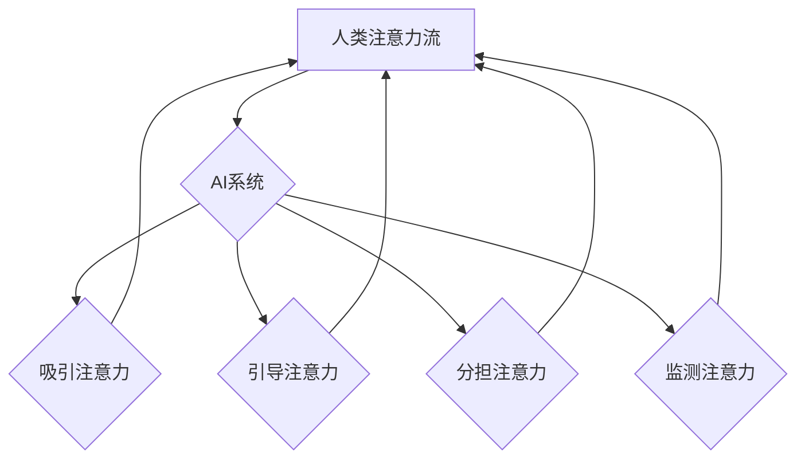

                 

## AI与人类注意力流：未来的工作、技能和道德 considerations

> 关键词：人工智能、注意力流、认知科学、工作转型、技能发展、伦理学、数据隐私、算法偏见

## 1. 背景介绍

在信息爆炸的时代，人类的注意力资源变得越来越稀缺。我们每天被来自各种渠道的信息轰炸，从社交媒体的通知到电子邮件的提醒，从新闻网站的滚动条到广告的推送，无处不在的干扰让我们难以集中精力完成任务。与此同时，人工智能（AI）技术飞速发展，其强大的计算能力和数据处理能力正在深刻地改变着我们的生活和工作方式。AI系统能够自动学习和分析海量数据，并根据这些数据提供个性化的服务和建议，这为我们带来了许多便利，但也引发了一些新的挑战和思考。

其中一个重要的挑战是AI如何与人类注意力流相协调。AI系统需要获取和处理人类的注意力才能有效地提供服务和完成任务。然而，过度依赖AI可能会导致人类注意力能力的退化，甚至引发一些伦理问题。因此，我们需要深入研究AI与人类注意力流之间的关系，探索如何利用AI技术来提升人类注意力效率，同时避免其潜在的负面影响。

## 2. 核心概念与联系

### 2.1 人类注意力流

人类注意力流是指我们对信息进行选择性感知和处理的能力。它是一个动态的过程，受到多种因素的影响，包括我们的认知能力、情绪状态、环境因素以及个体差异。注意力流可以分为以下几个方面：

* **选择性注意:**  从众多刺激中选择关注特定信息的能力。
* **集中注意:**  将注意力集中在一个特定任务或目标上，排除其他干扰的能力。
* **切换注意:**  在不同任务或目标之间灵活切换注意力的能力。
* **维持注意:**  长时间保持对特定任务或目标的关注能力。

### 2.2 人工智能与注意力流

AI系统可以通过多种方式与人类注意力流相交互：

* **吸引注意力:**  AI系统可以通过个性化推荐、视觉效果、声音提示等方式吸引用户的注意力。
* **引导注意力:**  AI系统可以通过提示、引导、交互等方式引导用户的注意力到特定信息或任务上。
* **分担注意力:**  AI系统可以帮助人类完成一些重复性或低级任务，从而释放出人类的注意力资源，用于更复杂和创造性的工作。
* **监测注意力:**  AI系统可以通过眼动追踪、生理信号监测等方式监测用户的注意力状态，并根据用户的注意力变化调整内容或交互方式。

### 2.3  AI与注意力流的交互关系

**Mermaid 流程图**



## 3. 核心算法原理 & 具体操作步骤

### 3.1  算法原理概述

AI系统与人类注意力流的交互主要依赖于以下几个核心算法：

* **深度学习:**  深度学习算法能够从海量数据中学习复杂的模式和特征，从而实现对人类注意力流的理解和预测。
* **强化学习:**  强化学习算法可以训练AI系统通过与环境交互来学习最优的策略，例如如何吸引用户的注意力或引导用户的行为。
* **自然语言处理:**  自然语言处理算法可以帮助AI系统理解和生成人类语言，从而与用户进行更自然和有效的交互。
* **计算机视觉:**  计算机视觉算法可以帮助AI系统识别和理解图像和视频，从而更好地感知用户的注意力状态。

### 3.2  算法步骤详解

以吸引用户注意力为例，具体操作步骤如下：

1. **数据收集:**  收集用户在使用AI系统时的行为数据，例如点击记录、浏览时长、眼动轨迹等。
2. **数据预处理:**  对收集到的数据进行清洗、转换和特征提取，以便于后续算法训练。
3. **模型训练:**  使用深度学习算法训练一个注意力预测模型，该模型能够根据用户的行为数据预测其对特定内容的注意力水平。
4. **模型评估:**  使用测试数据评估模型的性能，并根据评估结果进行模型调优。
5. **系统部署:**  将训练好的模型部署到AI系统中，并根据模型的预测结果调整内容的展示顺序、视觉效果、声音提示等，以吸引用户的注意力。

### 3.3  算法优缺点

**优点:**

* **个性化:**  AI系统可以根据用户的个人特征和行为数据提供个性化的注意力引导。
* **效率:**  AI系统可以自动分析和处理海量数据，从而更高效地吸引和引导用户的注意力。
* **可扩展性:**  AI系统可以轻松扩展到新的平台和设备，并支持多种类型的交互方式。

**缺点:**

* **数据依赖:**  AI系统的性能依赖于高质量的数据，而获取和处理高质量的数据可能存在挑战。
* **算法偏差:**  AI算法可能存在偏差，导致对不同用户或不同类型内容的注意力引导不公平。
* **隐私问题:**  AI系统需要收集和分析用户的行为数据，这可能会引发隐私问题。

### 3.4  算法应用领域

AI与注意力流的交互算法在以下领域具有广泛的应用前景：

* **教育:**  个性化学习、注意力训练、学习效果评估。
* **医疗:**  患者注意力监测、疾病诊断、治疗方案推荐。
* **营销:**  广告投放、内容推荐、用户行为分析。
* **游戏:**  游戏体验增强、玩家行为预测、游戏设计优化。
* **人机交互:**  智能助手、虚拟现实、增强现实。

## 4. 数学模型和公式 & 详细讲解 & 举例说明

### 4.1  数学模型构建

为了量化人类注意力流，我们可以使用以下数学模型：

**注意力分数:**  $A(t) = f(H(t), C(t))$

其中:

* $A(t)$ 表示在时间 $t$ 时刻的注意力分数。
* $H(t)$ 表示在时间 $t$ 时刻用户的认知状态，例如兴趣、疲劳、情绪等。
* $C(t)$ 表示在时间 $t$ 时刻用户的环境信息，例如周围噪音、光线、温度等。
* $f$ 是一个非线性函数，用于将认知状态和环境信息映射到注意力分数。

### 4.2  公式推导过程

我们可以使用深度学习算法来学习 $f$ 函数的具体形式。例如，我们可以使用一个多层感知机 (MLP) 来构建注意力预测模型，其输入是用户的认知状态和环境信息，输出是注意力分数。

### 4.3  案例分析与讲解

假设我们想预测用户对新闻文章的注意力水平。我们可以收集用户的阅读行为数据，例如阅读时长、点击记录、滑动速度等，以及用户的认知状态和环境信息，例如用户的兴趣爱好、阅读时间、周围环境等。然后，我们可以使用深度学习算法训练一个注意力预测模型，该模型能够根据这些数据预测用户对特定新闻文章的注意力水平。

## 5. 项目实践：代码实例和详细解释说明

### 5.1  开发环境搭建

* **操作系统:**  Linux/macOS/Windows
* **编程语言:**  Python
* **深度学习框架:**  TensorFlow/PyTorch
* **数据处理库:**  Pandas/NumPy
* **可视化库:**  Matplotlib/Seaborn

### 5.2  源代码详细实现

```python
import tensorflow as tf

# 定义注意力预测模型
model = tf.keras.models.Sequential([
    tf.keras.layers.Dense(64, activation='relu', input_shape=(10,)),
    tf.keras.layers.Dense(32, activation='relu'),
    tf.keras.layers.Dense(1)
])

# 编译模型
model.compile(optimizer='adam', loss='mse')

# 训练模型
model.fit(X_train, y_train, epochs=10)

# 评估模型
loss = model.evaluate(X_test, y_test)
```

### 5.3  代码解读与分析

* **模型定义:**  代码定义了一个简单的多层感知机 (MLP) 模型，用于预测用户的注意力分数。
* **模型编译:**  代码使用 Adam 优化器和均方误差 (MSE) 损失函数对模型进行编译。
* **模型训练:**  代码使用训练数据对模型进行训练，训练 epochs 为 10。
* **模型评估:**  代码使用测试数据对模型进行评估，并打印出损失值。

### 5.4  运行结果展示

训练完成后，我们可以使用模型预测新的用户数据，并观察其注意力分数的预测结果。

## 6. 实际应用场景

### 6.1  教育领域

* **个性化学习:**  AI系统可以根据学生的注意力水平和学习进度，个性化推荐学习内容和学习方式。
* **注意力训练:**  AI系统可以设计游戏化训练，帮助学生提高注意力集中能力。
* **学习效果评估:**  AI系统可以监测学生的注意力状态，并评估其学习效果。

### 6.2  医疗领域

* **患者注意力监测:**  AI系统可以监测患者在接受治疗时的注意力水平，帮助医生了解患者的认知状态和治疗效果。
* **疾病诊断:**  AI系统可以分析患者的注意力变化模式，辅助医生诊断一些与注意力相关的疾病。
* **治疗方案推荐:**  AI系统可以根据患者的注意力水平和疾病特征，推荐个性化的治疗方案。

### 6.3  营销领域

* **广告投放:**  AI系统可以根据用户的注意力水平和兴趣爱好，精准投放广告，提高广告效果。
* **内容推荐:**  AI系统可以根据用户的注意力水平和阅读习惯，推荐个性化的内容，提升用户粘性。
* **用户行为分析:**  AI系统可以分析用户的注意力变化模式，了解用户的兴趣和需求，为营销策略提供数据支持。

### 6.4  未来应用展望

随着AI技术的不断发展，AI与人类注意力流的交互将更加深入和广泛。未来，AI系统将能够更加精准地理解和引导用户的注意力，为我们带来更加个性化、高效、智能的体验。

## 7. 工具和资源推荐

### 7.1  学习资源推荐

* **书籍:**
    * 《深度学习》 by Ian Goodfellow, Yoshua Bengio, and Aaron Courville
    * 《强化学习：原理、算法和应用》 by Richard S. Sutton and Andrew G. Barto
* **在线课程:**
    * Coursera: Deep Learning Specialization
    * Udacity: Artificial Intelligence Nanodegree
* **博客和论坛:**
    * Towards Data Science
    * Machine Learning Mastery

### 7.2  开发工具推荐

* **深度学习框架:**
    * TensorFlow
    * PyTorch
* **数据处理库:**
    * Pandas
    * NumPy
* **可视化库:**
    * Matplotlib
    * Seaborn

### 7.3  相关论文推荐

* **Attention Is All You Need** by Vaswani et al. (2017)
* **BERT: Pre-training of Deep Bidirectional Transformers for Language Understanding** by Devlin et al. (2018)
* **Transformer-XL: Attentive Language Models Beyond a Fixed-Length Context** by Dai et al. (2019)

## 8. 总结：未来发展趋势与挑战

### 8.1  研究成果总结

近年来，AI与人类注意力流的研究取得了显著进展，涌现出许多新的算法和模型，例如注意力机制、强化学习等。这些研究成果为我们理解和操控人类注意力提供了新的工具和方法，并为未来的人机交互、教育、医疗等领域带来了新的可能性。

### 8.2  未来发展趋势

* **更精准的注意力预测:**  未来，AI系统将能够更加精准地预测用户的注意力水平，并根据用户的个性化需求提供更加个性化的服务和体验。
* **更智能的注意力引导:**  未来，AI系统将能够更加智能地引导用户的注意力，帮助用户更高效地完成任务，并提升用户的学习和工作效率。
* **更安全的注意力交互:**  未来，AI系统将更加注重用户隐私和数据安全，并采取更加有效的措施来防止算法偏差和滥用。

### 8.3  面临的挑战

* **数据获取和隐私保护:**  AI系统需要大量的数据来训练和运行，而获取高质量的数据并保护用户隐私是一个重要的挑战。
* **算法偏差和公平性:**  AI算法可能存在偏差，导致对不同用户或不同类型内容的注意力引导不公平。
* **伦理和社会影响:**  AI与人类注意力流的交互可能会引发一些伦理和社会问题，例如信息茧房、注意力经济等，需要我们认真思考和应对。

### 8.4  研究展望

未来，AI与人类注意力流的研究将继续深入，并与其他领域交叉融合，例如认知科学、心理学、社会学等，为我们提供更深入的理解和更有效的解决方案。


## 9. 附录：常见问题与解答

**Q1: AI系统如何获取用户的注意力数据？**

**A1:** AI系统可以通过多种方式获取用户的注意力数据，例如眼动追踪、生理信号监测、鼠标点击记录、键盘输入记录、阅读时长等。

**Q2: AI系统如何避免对用户的注意力造成过度依赖？**

**A2:**  AI系统的设计应该注重用户体验和自主性，避免过度引导用户的注意力。同时，用户也应该学会合理使用AI系统，并保持对自身注意力的掌控。

**Q3: AI系统如何解决算法偏差的问题？**

**A3:**  解决算法偏差需要从多个方面入手，例如收集更加多样化的训练数据、设计更加公平的算法模型、定期评估和调整算法模型等。

**Q4: AI与人类注意力流的交互会带来哪些伦理问题？**

**A4:**  AI与人类注意力流的交互可能会引发一些伦理问题，例如信息茧房、注意力经济、数据隐私等，需要我们认真思考和应对。


作者：禅与计算机程序设计艺术 / Zen and the Art of Computer Programming 


<end_of_turn>

