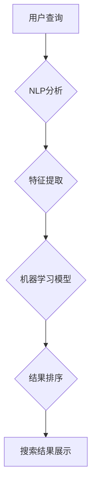

                 

## AI在提高搜索质量方面的应用

> 关键词：人工智能、自然语言处理、搜索引擎、机器学习、深度学习、信息检索、推荐系统、用户体验

## 1. 背景介绍

在信息爆炸的时代，搜索引擎已成为人们获取信息的主要途径。然而，传统基于关键词匹配的搜索方式存在着诸多局限性，难以准确理解用户意图，并提供真正满足用户需求的结果。人工智能（AI）技术的兴起为搜索引擎的质量提升带来了新的机遇。

AI技术，特别是自然语言处理（NLP）和机器学习（ML）技术，能够帮助搜索引擎更深入地理解用户查询，识别用户潜在需求，并提供更精准、更相关的搜索结果。

## 2. 核心概念与联系

### 2.1  信息检索

信息检索是指从海量信息中找到与用户查询相关的特定信息的过程。传统的信息检索模型主要基于关键词匹配，即根据用户输入的关键词在数据库中查找包含这些关键词的文档。

### 2.2  自然语言处理

自然语言处理（NLP）是人工智能的一个分支，致力于使计算机能够理解、处理和生成人类语言。NLP技术可以用于分析用户查询的语义，识别关键词、实体、关系等信息，从而更准确地理解用户的意图。

### 2.3  机器学习

机器学习（ML）是一种人工智能技术，通过训练模型学习数据中的模式，并根据这些模式进行预测或分类。在搜索引擎领域，机器学习可以用于个性化推荐、结果排序、垃圾信息过滤等方面。

**核心概念与联系流程图**



## 3. 核心算法原理 & 具体操作步骤

### 3.1  算法原理概述

在提高搜索质量方面，常用的AI算法包括：

* **BERT（Bidirectional Encoder Representations from Transformers）:** BERT是一种基于Transformer架构的预训练语言模型，能够理解上下文信息，并生成更准确的文本表示。
* **TF-IDF（Term Frequency-Inverse Document Frequency）:** TF-IDF是一种统计方法，用于衡量词语在文档中的重要性。
* **PageRank:** PageRank是一种算法，用于评估网页的重要性，并根据其重要性对搜索结果进行排序。

### 3.2  算法步骤详解

以BERT为例，其训练过程包括以下步骤：

1. **预训练:** 在大量的文本数据上进行预训练，学习语言的语法和语义知识。
2. **微调:** 将预训练的BERT模型用于特定任务，例如搜索引擎，通过在少量相关数据上进行微调，使其能够更好地理解用户查询和文档内容。
3. **查询处理:** 将用户查询转换为BERT模型可以理解的格式，并输入模型进行处理。
4. **文档匹配:** 将查询结果与文档内容进行匹配，并根据BERT模型生成的文本表示进行排序。

### 3.3  算法优缺点

**BERT:**

* **优点:** 能够理解上下文信息，生成更准确的文本表示，提升搜索结果的质量。
* **缺点:** 训练成本高，模型参数量大，部署成本较高。

**TF-IDF:**

* **优点:** 计算简单，易于实现。
* **缺点:** 难以捕捉上下文信息，对长尾关键词的匹配效果较差。

**PageRank:**

* **优点:** 能够评估网页的重要性，对搜索结果的排序有帮助。
* **缺点:** 难以捕捉网页内容的语义信息。

### 3.4  算法应用领域

* **搜索引擎:** 提高搜索结果的准确性和相关性。
* **推荐系统:** 根据用户的兴趣和行为推荐相关内容。
* **问答系统:** 理解用户的问题，并提供准确的答案。
* **机器翻译:** 将一种语言翻译成另一种语言。

## 4. 数学模型和公式 & 详细讲解 & 举例说明

### 4.1  数学模型构建

BERT模型的数学基础是Transformer架构，其核心是注意力机制。注意力机制允许模型关注输入序列中与当前任务最相关的部分，从而更好地理解上下文信息。

### 4.2  公式推导过程

注意力机制的计算公式如下：

$$
Attention(Q, K, V) = softmax(\frac{QK^T}{\sqrt{d_k}})V
$$

其中：

* $Q$：查询矩阵
* $K$：键矩阵
* $V$：值矩阵
* $d_k$：键向量的维度
* $softmax$：softmax函数，用于归一化注意力权重

### 4.3  案例分析与讲解

假设我们有一个句子“我爱吃苹果”，我们要计算“吃”这个词的注意力权重。

* $Q$：包含“吃”这个词的查询向量
* $K$：包含所有词的键向量
* $V$：包含所有词的价值向量

通过计算$QK^T$，我们可以得到每个词与“吃”的相似度。然后，使用softmax函数将这些相似度归一化，得到每个词的注意力权重。最后，将注意力权重与价值向量相乘，得到“吃”这个词的上下文表示。

## 5. 项目实践：代码实例和详细解释说明

### 5.1  开发环境搭建

* Python 3.6+
* TensorFlow 2.0+
* CUDA Toolkit (可选)

### 5.2  源代码详细实现

```python
import tensorflow as tf

# 定义BERT模型
class BERTModel(tf.keras.Model):
    def __init__(self, bert_model):
        super(BERTModel, self).__init__()
        self.bert_model = bert_model

    def call(self, inputs):
        # 使用BERT模型处理输入
        outputs = self.bert_model(inputs)
        # 返回模型输出
        return outputs

# 加载预训练的BERT模型
bert_model = tf.keras.applications.BERT_ENGLISH_BASE_uncased.from_pretrained('bert-base-uncased')

# 创建BERT模型实例
bert_model_instance = BERTModel(bert_model)

# 输入数据
inputs = tf.constant(["我爱吃苹果"])

# 模型预测
outputs = bert_model_instance(inputs)

# 打印输出结果
print(outputs)
```

### 5.3  代码解读与分析

* 该代码首先定义了一个BERT模型类，继承自`tf.keras.Model`。
* 在构造函数中，加载预训练的BERT模型。
* `call()`方法定义了模型的输入和输出。
* 使用`tf.keras.applications.BERT_ENGLISH_BASE_uncased.from_pretrained()`函数加载预训练的BERT模型。
* 创建BERT模型实例，并使用输入数据进行预测。

### 5.4  运行结果展示

运行该代码后，会输出BERT模型处理后的文本表示。

## 6. 实际应用场景

### 6.1  搜索引擎优化

AI技术可以帮助搜索引擎更好地理解用户查询，并提供更相关的搜索结果。例如，BERT模型可以帮助搜索引擎识别用户查询中的长尾关键词，并提供更精准的匹配结果。

### 6.2  个性化推荐

AI技术可以根据用户的兴趣和行为历史，推荐个性化的搜索结果。例如，电商平台可以利用AI技术推荐用户可能感兴趣的商品。

### 6.3  问答系统

AI技术可以帮助构建更智能的问答系统，能够理解用户的自然语言问题，并提供准确的答案。例如，聊天机器人可以利用AI技术回答用户的各种问题。

### 6.4  未来应用展望

随着AI技术的不断发展，其在搜索引擎领域的应用将更加广泛和深入。例如，未来搜索引擎可能能够理解用户的意图，并提供更全面的搜索结果，甚至能够进行对话式搜索。

## 7. 工具和资源推荐

### 7.1  学习资源推荐

* **Stanford NLP Group:** https://nlp.stanford.edu/
* **Hugging Face:** https://huggingface.co/
* **TensorFlow Tutorials:** https://www.tensorflow.org/tutorials

### 7.2  开发工具推荐

* **TensorFlow:** https://www.tensorflow.org/
* **PyTorch:** https://pytorch.org/
* **SpaCy:** https://spacy.io/

### 7.3  相关论文推荐

* **BERT: Pre-training of Deep Bidirectional Transformers for Language Understanding:** https://arxiv.org/abs/1810.04805
* **Attention Is All You Need:** https://arxiv.org/abs/1706.03762

## 8. 总结：未来发展趋势与挑战

### 8.1  研究成果总结

AI技术在提高搜索质量方面取得了显著的成果，例如BERT模型能够更好地理解上下文信息，提升搜索结果的准确性和相关性。

### 8.2  未来发展趋势

* **更深层次的理解:** 未来搜索引擎将能够更深入地理解用户的意图，并提供更个性化的搜索结果。
* **多模态搜索:** 搜索引擎将能够处理多种数据类型，例如文本、图像、音频等，提供更全面的搜索体验。
* **对话式搜索:** 用户将能够与搜索引擎进行对话式交互，更自然地表达需求，并获得更精准的答案。

### 8.3  面临的挑战

* **数据质量:** AI模型的训练需要大量高质量的数据，而获取高质量数据的成本较高。
* **模型解释性:** 许多AI模型是黑盒模型，难以解释其决策过程，这可能会导致用户对搜索结果的信任度降低。
* **公平性与偏见:** AI模型可能会受到训练数据中的偏见影响，导致搜索结果不公平。

### 8.4  研究展望

未来研究将重点关注以下几个方面：

* 开发更强大的AI模型，能够更好地理解用户意图和语义信息。
* 提高AI模型的解释性，使用户能够理解搜索结果背后的逻辑。
* 构建更公平、更可靠的AI模型，避免因数据偏见导致的不公平结果。

## 9. 附录：常见问题与解答

* **Q: BERT模型的训练成本很高吗？**

A: 确实，BERT模型的训练成本较高，需要大量的计算资源和时间。

* **Q: 如何评估AI模型的搜索质量？**

A: 可以使用多种指标来评估AI模型的搜索质量，例如准确率、召回率、NDCG等。

* **Q: 如何解决AI模型中的公平性问题？**

A: 可以通过多种方法来解决AI模型中的公平性问题，例如使用公平性约束、数据预处理、模型调优等。


作者：禅与计算机程序设计艺术 / Zen and the Art of Computer Programming 
<end_of_turn>

