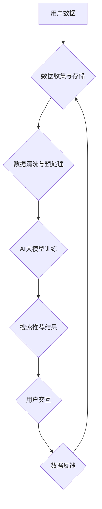

                 

## AI大模型助力电商搜索推荐业务的数据安全保障措施

> 关键词：AI大模型、电商搜索推荐、数据安全、隐私保护、安全算法、数据加密、安全审计、模型可解释性

## 1. 背景介绍

电商行业竞争日益激烈，用户体验成为核心竞争力。搜索推荐系统作为电商平台的核心功能之一，直接影响着用户购物决策和平台商业效益。近年来，随着深度学习技术的快速发展，AI大模型在电商搜索推荐领域展现出巨大的潜力，能够提供更精准、个性化的推荐服务，提升用户满意度和转化率。

然而，AI大模型的应用也带来了新的数据安全挑战。电商平台处理海量用户数据，包括个人信息、购物偏好、浏览历史等敏感信息。如果数据安全措施不到位，可能导致用户隐私泄露、数据滥用等问题，损害平台声誉和用户信任。

因此，在充分利用AI大模型优势的同时，保障数据安全至关重要。本文将探讨AI大模型助力电商搜索推荐业务的数据安全保障措施，从技术层面分析如何有效保护用户数据安全。

## 2. 核心概念与联系

### 2.1  电商搜索推荐系统

电商搜索推荐系统旨在帮助用户快速找到所需商品，并根据用户的兴趣和行为推荐相关商品。系统通常包含以下几个模块：

* **搜索引擎模块:** 处理用户搜索词，返回相关商品结果。
* **推荐引擎模块:** 基于用户历史行为、商品特征等信息，推荐个性化商品列表。
* **数据处理模块:** 收集、清洗、存储和分析用户数据。
* **展示模块:** 将搜索结果和推荐商品以用户友好的方式展示。

### 2.2  AI大模型

AI大模型是指训练规模庞大、参数数量众多的深度学习模型。它们能够学习复杂的模式和关系，在自然语言处理、图像识别、语音合成等领域展现出强大的能力。

在电商搜索推荐领域，AI大模型可以用于：

* **搜索结果排序:** 根据用户搜索词和商品特征，对搜索结果进行排序，提升用户体验。
* **个性化推荐:** 基于用户的历史行为和偏好，推荐个性化的商品列表。
* **商品分类和标签:** 自动识别商品类别和属性，提高商品搜索的准确性。
* **用户画像构建:** 分析用户行为数据，构建用户画像，为个性化推荐提供支持。

### 2.3  数据安全

数据安全是指保护数据免受未经授权访问、使用、披露、修改或销毁的措施。在电商平台，数据安全至关重要，涉及用户隐私、商业机密等敏感信息。

**数据安全风险:**

* **数据泄露:** 用户数据被窃取或泄露，导致隐私泄露和身份盗窃。
* **数据滥用:** 用户数据被用于不正当目的，例如进行营销骚扰或进行欺诈活动。
* **数据篡改:** 用户数据被恶意修改，导致信息失真或造成经济损失。

**数据安全保障措施:**

* **数据加密:** 使用加密技术保护数据在传输和存储过程中不被窃取。
* **访问控制:** 通过身份验证和授权机制，控制对数据的访问权限。
* **数据脱敏:** 对敏感数据进行脱敏处理，保护用户隐私。
* **安全审计:** 对数据访问和操作进行记录和审计，及时发现和应对安全事件。

**Mermaid 流程图:**



## 3. 核心算法原理 & 具体操作步骤

### 3.1  算法原理概述

电商搜索推荐系统通常采用基于协同过滤、内容过滤和混合推荐等算法。

* **协同过滤:** 基于用户的历史行为和商品特征，预测用户对商品的兴趣。
* **内容过滤:** 基于商品的属性和描述，推荐与用户兴趣相符的商品。
* **混合推荐:** 结合协同过滤和内容过滤算法，提高推荐的准确性和个性化程度。

AI大模型可以增强这些算法的性能，例如：

* **深度协同过滤:** 使用深度神经网络学习用户-商品交互关系，提高推荐的准确性和泛化能力。
* **内容嵌入:** 将商品属性和描述转换为向量表示，方便与用户兴趣进行比较和匹配。
* **个性化模型:** 为每个用户构建个性化模型，提供更精准的推荐服务。

### 3.2  算法步骤详解

以深度协同过滤算法为例，其具体步骤如下：

1. **数据收集和预处理:** 收集用户-商品交互数据，例如点击、购买、评分等，并进行清洗、预处理，例如去除缺失值、处理文本数据等。
2. **用户和商品嵌入:** 使用深度神经网络将用户和商品转换为向量表示，例如使用Word2Vec或BERT模型。
3. **模型训练:** 使用训练数据训练深度协同过滤模型，例如使用矩阵分解或神经网络模型。
4. **推荐生成:** 根据用户的向量表示，预测用户对商品的兴趣评分，并根据评分排序推荐商品。

### 3.3  算法优缺点

**优点:**

* **高准确率:** 深度协同过滤算法能够学习复杂的交互关系，提高推荐的准确率。
* **个性化推荐:** 可以为每个用户构建个性化模型，提供更精准的推荐服务。
* **可扩展性:** 可以处理海量用户数据和商品信息。

**缺点:**

* **冷启动问题:** 对新用户和新商品的推荐效果较差。
* **数据稀疏性:** 用户-商品交互数据往往稀疏，难以训练出准确的模型。
* **计算复杂度高:** 深度协同过滤算法的训练和预测过程计算复杂度高，需要强大的计算资源。

### 3.4  算法应用领域

深度协同过滤算法广泛应用于电商推荐、电影推荐、音乐推荐等领域。

## 4. 数学模型和公式 & 详细讲解 & 举例说明

### 4.1  数学模型构建

深度协同过滤算法通常使用矩阵分解模型，将用户-商品交互矩阵分解成用户特征矩阵和商品特征矩阵。

假设用户集合为U，商品集合为I，用户-商品交互矩阵为R，其中R(u,i)表示用户u对商品i的评分。

则矩阵分解模型可以表示为：

$$R(u,i) \approx u^T v_i$$

其中，$u$是用户u的特征向量，$v_i$是商品i的特征向量。

### 4.2  公式推导过程

模型的目标是最小化预测评分与实际评分之间的误差。常用的损失函数为均方误差（MSE）：

$$L = \frac{1}{2} \sum_{u \in U, i \in I} (R(u,i) - u^T v_i)^2$$

使用梯度下降算法优化模型参数，更新用户特征向量和商品特征向量。

### 4.3  案例分析与讲解

假设用户A对商品1评分为5，对商品2评分为3，用户B对商品1评分为4，对商品2评分为2。

使用矩阵分解模型，可以将用户和商品特征向量学习出来，例如：

$$u_A = [0.8, 0.2]$$
$$v_1 = [0.6, 0.4]$$
$$u_B = [-0.2, 0.8]$$
$$v_2 = [0.4, -0.6]$$

根据公式 $R(u,i) \approx u^T v_i$，可以预测用户A对商品2的评分：

$$R(A,2) \approx 0.8 \times 0.4 + 0.2 \times (-0.6) = 0.2$$

## 5. 项目实践：代码实例和详细解释说明

### 5.1  开发环境搭建

* Python 3.x
* TensorFlow 或 PyTorch 深度学习框架
* Jupyter Notebook 或 VS Code 代码编辑器

### 5.2  源代码详细实现

```python
import tensorflow as tf

# 定义模型
class RecommenderModel(tf.keras.Model):
    def __init__(self, user_dim, item_dim):
        super(RecommenderModel, self).__init__()
        self.user_embedding = tf.keras.layers.Embedding(user_num, user_dim)
        self.item_embedding = tf.keras.layers.Embedding(item_num, item_dim)

    def call(self, user_ids, item_ids):
        user_embeddings = self.user_embedding(user_ids)
        item_embeddings = self.item_embedding(item_ids)
        return tf.reduce_sum(user_embeddings * item_embeddings, axis=1)

# 训练模型
model = RecommenderModel(user_dim=64, item_dim=64)
model.compile(optimizer='adam', loss='mse')
model.fit(train_data, train_labels, epochs=10)

# 生成推荐
user_id = 1
item_ids = model.predict([user_id])
top_k_items = tf.argsort(item_ids)[-5:][::-1]
```

### 5.3  代码解读与分析

* **模型定义:** 使用 TensorFlow 定义了一个简单的推荐模型，包含用户嵌入层和商品嵌入层。
* **模型训练:** 使用 Adam 优化器和均方误差损失函数训练模型。
* **推荐生成:** 根据用户的ID，预测用户对商品的评分，并排序推荐前k个商品。

### 5.4  运行结果展示

训练完成后，可以将模型应用于实际场景，例如推荐商品给用户。

## 6. 实际应用场景

AI大模型在电商搜索推荐业务中的应用场景广泛，例如：

* **个性化商品推荐:** 根据用户的历史行为和偏好，推荐个性化的商品列表。
* **搜索结果排序:** 根据用户的搜索词和商品特征，对搜索结果进行排序，提升用户体验。
* **新品推荐:** 推荐新上市的商品，提高用户对新产品的认知度。
* **跨界推荐:** 基于用户的兴趣爱好，推荐跨界商品，例如推荐喜欢运动的用户购买运动服饰和运动鞋。

### 6.4  未来应用展望

未来，AI大模型在电商搜索推荐业务中的应用将更加智能化和个性化。例如：

* **多模态推荐:** 结合文本、图像、视频等多模态数据，提供更丰富的推荐体验。
* **实时推荐:** 基于用户的实时行为，提供动态更新的推荐结果。
* **解释性推荐:** 解释推荐结果背后的逻辑，提升用户对推荐的信任度。

## 7. 工具和资源推荐

### 7.1  学习资源推荐

* **书籍:**
    * Deep Learning by Ian Goodfellow, Yoshua Bengio, and Aaron Courville
    * Hands-On Machine Learning with Scikit-Learn, Keras & TensorFlow by Aurélien Géron
* **在线课程:**
    * TensorFlow Tutorials: https://www.tensorflow.org/tutorials
    * PyTorch Tutorials: https://pytorch.org/tutorials/

### 7.2  开发工具推荐

* **TensorFlow:** https://www.tensorflow.org/
* **PyTorch:** https://pytorch.org/
* **Jupyter Notebook:** https://jupyter.org/
* **VS Code:** https://code.visualstudio.com/

### 7.3  相关论文推荐

* **Collaborative Filtering for Implicit Feedback Datasets** by Hu, Y., Koren, Y., & Volinsky, C.
* **Deep Learning Recommendations for Everyone** by  Wang-Cheng Kang,  Tim Kraska,  and  Michael J. Franklin

## 8. 总结：未来发展趋势与挑战

### 8.1  研究成果总结

AI大模型在电商搜索推荐业务中取得了显著的成果，能够提供更精准、个性化的推荐服务，提升用户体验和商业效益。

### 8.2  未来发展趋势

未来，AI大模型在电商搜索推荐业务中的发展趋势包括：

* **模型规模和复杂度提升:** 训练更大规模、更复杂的AI大模型，提升推荐的准确性和泛化能力。
* **多模态融合:** 结合文本、图像、视频等多模态数据，提供更丰富的推荐体验。
* **个性化定制:** 基于用户的个性化需求，定制个性化的推荐服务。
* **解释性推荐:** 解释推荐结果背后的逻辑，提升用户对推荐的信任度。

### 8.3  面临的挑战

AI大模型在电商搜索推荐业务中也面临一些挑战：

* **数据安全和隐私保护:** 如何保护用户数据安全和隐私，防止数据泄露和滥用。
* **算法可解释性:** 如何提高AI模型的透明度和可解释性，让用户理解推荐结果背后的逻辑。
* **冷启动问题:** 如何解决新用户和新商品的推荐效果较差的问题。
* **计算资源需求:** 训练和部署大型AI模型需要大量的计算资源，成本较高。

### 8.4  研究展望

未来，需要进一步研究以下问题：

* 如何设计更安全、更可靠的AI模型，保障用户数据安全和隐私。
* 如何提高AI模型的可解释性，让用户更好地理解推荐结果。
* 如何解决冷启动问题，提高新用户和新商品的推荐效果。
* 如何降低AI模型的训练和部署成本，使其更易于推广应用。

## 9. 附录：常见问题与解答

**Q1: 如何保障用户数据安全？**

A1: 可以采用以下措施保障用户数据安全：

* **数据加密:** 使用加密技术保护数据在传输和存储过程中不被窃取。
* **访问控制:** 通过身份验证和授权机制，控制对数据的访问权限。
* **数据脱敏:** 对敏感数据进行脱敏处理，保护用户隐私。
* **安全审计:** 对数据访问和操作进行记录和审计，及时发现和应对安全事件。

**Q2: 如何提高AI模型的可解释性？**

A2: 可以采用以下方法提高AI模型的可解释性：

* **使用可解释的模型:** 选择如线性回归、决策树等可解释性较高的模型。
* **模型可视化:** 使用可视化工具展示模型的结构和决策过程。
* **特征重要性分析:** 分析哪些特征对模型预测结果影响最大。
* **案例分析:** 对模型的预测结果进行案例分析，解释模型的决策逻辑。

**Q3: 如何解决冷启动问题？**

A3: 可以采用以下方法解决冷启动问题：

* **利用用户画像:** 根据用户的基本信息和行为特征，进行初步的推荐。
* **利用协同过滤的冷启动策略:** 使用基于内容过滤或基于用户的协同过滤算法，为新用户和新商品提供推荐。
* **收集更多数据:** 随着时间的推移，收集更多用户的行为数据，训练更准确的模型。


作者：禅与计算机程序设计艺术 / Zen and the Art of Computer Programming<end_of_turn>

