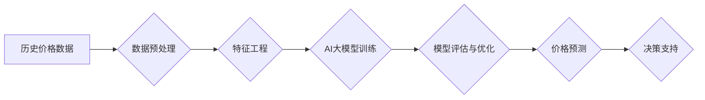

                 

## AI大模型在商品价格预测中的应用

> 关键词：商品价格预测、AI大模型、深度学习、时间序列分析、机器学习、自然语言处理、预测模型

## 1. 背景介绍

在当今数据爆炸的时代，商品价格预测已成为商业决策中不可或缺的一部分。准确的价格预测可以帮助企业优化库存管理、制定合理的定价策略、提高利润率，并更好地应对市场波动。传统的商品价格预测方法主要依赖于统计模型和专家经验，但这些方法往往难以捕捉复杂的价格波动趋势，且对新产品或市场变化的适应能力较弱。

近年来，随着人工智能（AI）技术的快速发展，特别是深度学习技术的突破，AI大模型在商品价格预测领域展现出巨大的潜力。AI大模型能够学习海量数据中的复杂模式和关系，并生成更精准、更灵活的价格预测结果。

## 2. 核心概念与联系

### 2.1  商品价格预测

商品价格预测是指利用历史数据、市场趋势和相关因素，预测未来商品价格走势的分析方法。其目标是尽可能准确地预测未来商品价格，为企业决策提供参考依据。

### 2.2  AI大模型

AI大模型是指训练规模庞大、参数数量众多的深度学习模型。这些模型能够学习复杂的数据模式，并应用于各种任务，例如图像识别、自然语言处理、语音合成等。在商品价格预测领域，AI大模型可以学习历史价格、市场需求、季节性因素、宏观经济指标等多方面数据，构建更精准的预测模型。

### 2.3  核心概念架构



## 3. 核心算法原理 & 具体操作步骤

### 3.1  算法原理概述

AI大模型在商品价格预测中的应用主要基于深度学习算法，其中包括：

* **循环神经网络（RNN）:** RNN能够处理时间序列数据，学习价格随时间变化的趋势和模式。
* **长短期记忆网络（LSTM）:** LSTM是一种改进的RNN，能够更好地捕捉长期的依赖关系，更适合预测价格的长期波动。
* **Transformer网络:** Transformer网络通过自注意力机制，能够更有效地学习价格之间的相关性，并捕捉更复杂的非线性关系。

### 3.2  算法步骤详解

1. **数据收集与预处理:** 收集历史商品价格数据、市场需求数据、季节性因素数据、宏观经济指标数据等相关信息。对数据进行清洗、缺失值处理、标准化等预处理操作，确保数据质量和模型训练效果。
2. **特征工程:** 从原始数据中提取有价值的特征，例如价格变化率、移动平均值、季节性指数、宏观经济指标等。这些特征能够帮助模型更好地理解价格的驱动因素。
3. **模型选择与训练:** 根据实际需求选择合适的深度学习模型，例如RNN、LSTM或Transformer网络。使用训练数据训练模型，并通过交叉验证等方法评估模型性能。
4. **模型评估与优化:** 使用测试数据评估模型的预测精度，并根据评估结果调整模型参数、优化模型结构，提高模型性能。
5. **价格预测:** 将训练好的模型应用于新的数据进行预测，得到未来商品价格的预测结果。

### 3.3  算法优缺点

**优点:**

* 能够学习复杂的价格波动趋势，预测精度更高。
* 对新产品或市场变化的适应能力强。
* 可以处理海量数据，挖掘隐藏的价值。

**缺点:**

* 需要大量的训练数据，数据质量对模型性能影响较大。
* 模型训练时间长，计算资源需求高。
* 模型解释性较差，难以理解模型的决策过程。

### 3.4  算法应用领域

* **电商平台:** 预测商品价格，优化库存管理，制定合理的定价策略。
* **金融机构:** 预测股票价格、债券价格等金融资产价格，进行投资决策。
* **制造业:** 预测原材料价格，优化采购策略，降低成本。
* **农业:** 预测农产品价格，帮助农民制定种植计划，降低风险。

## 4. 数学模型和公式 & 详细讲解 & 举例说明

### 4.1  数学模型构建

在商品价格预测中，常用的数学模型包括线性回归模型、ARIMA模型、神经网络模型等。

* **线性回归模型:** 假设价格与影响因素之间存在线性关系，通过最小二乘法估计模型参数，预测未来价格。

* **ARIMA模型:** ARIMA模型是一种时间序列分析模型，通过自回归（AR）、移动平均（MA）和季节性差分（I）三个部分来描述时间序列的特性，预测未来价格。

* **神经网络模型:** 神经网络模型是一种非线性模型，能够学习复杂的数据模式，预测未来价格。

### 4.2  公式推导过程

**线性回归模型:**

假设价格 $y$ 与影响因素 $x$ 之间存在线性关系，可以表示为：

$$y = \beta_0 + \beta_1x + \epsilon$$

其中：

* $\beta_0$ 是截距项
* $\beta_1$ 是斜率项
* $x$ 是影响因素
* $y$ 是价格
* $\epsilon$ 是随机误差项

通过最小二乘法，可以估计 $\beta_0$ 和 $\beta_1$ 的值，得到线性回归模型。

**ARIMA模型:**

ARIMA模型的公式比较复杂，涉及到自回归系数、移动平均系数和季节性差分系数等参数。

### 4.3  案例分析与讲解

**案例:** 假设我们想要预测某款产品的未来价格，并收集了该产品的历史价格数据、市场需求数据、季节性因素数据等相关信息。

* **线性回归模型:** 可以将历史价格作为自变量，市场需求、季节性因素等作为其他自变量，构建线性回归模型进行预测。
* **ARIMA模型:** 可以使用ARIMA模型分析历史价格的时间序列特征，预测未来价格。
* **神经网络模型:** 可以将历史价格、市场需求、季节性因素等数据作为输入，训练神经网络模型进行预测。

通过比较三种模型的预测精度，选择最优模型进行实际应用。

## 5. 项目实践：代码实例和详细解释说明

### 5.1  开发环境搭建

* **操作系统:** Linux/macOS/Windows
* **编程语言:** Python
* **深度学习框架:** TensorFlow/PyTorch
* **数据处理库:** Pandas
* **可视化库:** Matplotlib/Seaborn

### 5.2  源代码详细实现

```python
import pandas as pd
from sklearn.model_selection import train_test_split
from tensorflow.keras.models import Sequential
from tensorflow.keras.layers import LSTM, Dense

# 数据加载
data = pd.read_csv('price_data.csv')

# 数据预处理
data['Date'] = pd.to_datetime(data['Date'])
data = data.set_index('Date')
data = data[['Price']].values

# 数据分割
train_data, test_data = train_test_split(data, test_size=0.2)

# 模型构建
model = Sequential()
model.add(LSTM(units=50, return_sequences=True, input_shape=(train_data.shape[1], 1)))
model.add(LSTM(units=50))
model.add(Dense(units=1))

# 模型编译
model.compile(loss='mean_squared_error', optimizer='adam')

# 模型训练
model.fit(train_data, train_data[:, -1], epochs=100, batch_size=32)

# 模型评估
predictions = model.predict(test_data)

# 结果展示
print(predictions)
```

### 5.3  代码解读与分析

* **数据加载:** 使用Pandas库加载商品价格数据。
* **数据预处理:** 将日期转换为datetime类型，设置日期作为索引，提取价格数据。
* **数据分割:** 将数据分为训练集和测试集。
* **模型构建:** 使用TensorFlow框架构建LSTM神经网络模型，包含两层LSTM层和一层Dense输出层。
* **模型编译:** 使用均方误差作为损失函数，Adam优化器进行模型训练。
* **模型训练:** 使用训练数据训练模型，设置训练轮数和批处理大小。
* **模型评估:** 使用测试数据预测未来价格，并打印预测结果。

### 5.4  运行结果展示

运行代码后，会输出预测的未来商品价格。

## 6. 实际应用场景

### 6.1  电商平台

电商平台可以利用AI大模型预测商品价格，优化库存管理，制定合理的定价策略。例如，根据历史价格、市场需求、季节性因素等数据，预测未来某款产品的销量，并根据预测结果调整库存水平，避免缺货或积压。

### 6.2  金融机构

金融机构可以利用AI大模型预测股票价格、债券价格等金融资产价格，进行投资决策。例如，根据历史价格、市场新闻、宏观经济指标等数据，预测未来某只股票的价格走势，并根据预测结果进行买入或卖出决策。

### 6.3  制造业

制造业可以利用AI大模型预测原材料价格，优化采购策略，降低成本。例如，根据历史价格、市场供需情况、生产计划等数据，预测未来某种原材料的价格走势，并根据预测结果调整采购计划，避免价格波动带来的成本风险。

### 6.4  未来应用展望

随着AI技术的不断发展，AI大模型在商品价格预测领域的应用将更加广泛和深入。例如，可以利用自然语言处理技术，分析市场新闻、社交媒体评论等文本数据，获取更多价格影响因素；可以利用强化学习技术，训练更智能的预测模型，能够根据市场变化动态调整预测策略。

## 7. 工具和资源推荐

### 7.1  学习资源推荐

* **书籍:**
    * 深度学习
    * 自然语言处理
    * 时间序列分析
* **在线课程:**
    * Coursera
    * edX
    * Udacity
* **博客:**
    * Towards Data Science
    * Machine Learning Mastery

### 7.2  开发工具推荐

* **深度学习框架:** TensorFlow, PyTorch
* **数据处理库:** Pandas
* **可视化库:** Matplotlib, Seaborn
* **云计算平台:** AWS, Azure, GCP

### 7.3  相关论文推荐

* **Attention Is All You Need**
* **Long Short-Term Memory**
* **Recurrent Neural Networks for Sequence Learning**

## 8. 总结：未来发展趋势与挑战

### 8.1  研究成果总结

AI大模型在商品价格预测领域取得了显著的成果，能够学习复杂的价格波动趋势，预测精度更高。

### 8.2  未来发展趋势

* **模型复杂度提升:** 发展更复杂的AI大模型，例如Transformer网络、图神经网络等，能够更好地捕捉价格之间的相关性。
* **数据融合:** 将更多类型的数据融合到模型中，例如文本数据、图像数据、传感器数据等，获取更全面的价格影响因素。
* **解释性增强:** 研究更具解释性的AI模型，能够更好地理解模型的决策过程，提高模型的可信度。

### 8.3  面临的挑战

* **数据质量:** AI模型的性能依赖于数据质量，需要收集高质量、丰富的数据进行训练。
* **计算资源:** 训练大型AI模型需要大量的计算资源，成本较高。
* **模型解释性:** AI模型的决策过程往往难以理解，需要研究更具解释性的模型。

### 8.4  研究展望

未来，AI大模型在商品价格预测领域将继续发展，并应用于更多场景。需要加强对模型复杂度、数据融合、模型解释性的研究，推动AI技术在商业决策中的应用。

## 9. 附录：常见问题与解答

**Q1: 如何选择合适的AI大模型？**

**A1:** 选择合适的AI大模型需要根据实际需求和数据特点进行选择。例如，如果数据时间序列特征明显，可以选择ARIMA模型或LSTM模型；如果数据维度较高，可以选择Transformer模型。

**Q2: 如何评估AI模型的预测精度？**

**A2:** 可以使用均方误差、平均绝对误差等指标来评估AI模型的预测精度。

**Q3: 如何处理数据缺失值？**

**A3:** 可以使用线性插值、最近邻插值等方法处理数据缺失值。


作者：禅与计算机程序设计艺术 / Zen and the Art of Computer Programming 
<end_of_turn>

