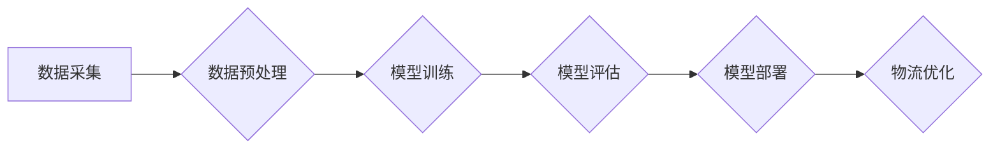

                 

## AI大模型如何优化电商平台的跨境物流体验

> 关键词：AI大模型、跨境物流、优化体验、预测模型、智能调度、路径规划、风险管理、客户服务

## 1. 背景介绍

随着全球化进程的加速和电子商务的蓬勃发展，跨境电商已成为一种重要的商业模式。然而，跨境物流的复杂性和不确定性也给消费者带来了诸多不便，例如运输时间长、物流成本高、信息透明度低等问题。这些问题严重影响着跨境电商的体验和发展。

近年来，人工智能（AI）技术取得了长足进步，特别是大模型的出现，为跨境物流的优化提供了新的机遇。AI大模型凭借其强大的学习和推理能力，能够从海量物流数据中挖掘出隐藏的规律，并应用于预测、优化、控制等环节，从而有效提升跨境物流的效率、安全性、透明度和客户体验。

## 2. 核心概念与联系

### 2.1 跨境物流

跨境物流是指跨越国家或地区边界进行的货物运输和配送服务。它涉及到多个环节，包括货物装运、海关清关、运输、仓储、配送等。跨境物流的复杂性体现在以下几个方面：

* **多方参与：** 跨境物流涉及到货主、物流供应商、海关、运输公司、仓储公司等多方参与，需要协调各方资源和流程。
* **跨境法规：** 不同国家和地区的法律法规对货物运输和清关有不同的要求，需要进行复杂的合规处理。
* **运输网络复杂：** 跨境物流需要跨越多个国家和地区的运输网络，运输路线复杂，运输时间长。
* **信息不对称：** 跨境物流信息传递不畅，货主和消费者难以获取实时物流信息。

### 2.2 AI大模型

AI大模型是指在海量数据上训练的深度学习模型，具有强大的泛化能力和学习能力。常见的AI大模型类型包括：

* **自然语言处理模型：** 例如GPT-3、BERT，能够理解和生成人类语言。
* **计算机视觉模型：** 例如YOLO、ResNet，能够识别和理解图像和视频。
* **推荐系统模型：** 例如Collaborative Filtering、Content-Based Filtering，能够根据用户行为和偏好推荐商品。

### 2.3 AI大模型在跨境物流中的应用

AI大模型可以应用于跨境物流的各个环节，例如：

* **预测模型：** 利用历史物流数据预测未来物流需求、运输时间、物流成本等，帮助物流企业优化资源配置和制定运输计划。
* **智能调度：** 利用AI算法智能调度运输资源，优化运输路线，提高运输效率。
* **路径规划：** 利用AI算法规划最优的运输路径，避开拥堵路段，降低运输成本。
* **风险管理：** 利用AI算法识别潜在的物流风险，例如货物丢失、运输延误等，并采取相应的措施进行风险控制。
* **客户服务：** 利用自然语言处理模型构建智能客服系统，为消费者提供实时物流信息查询、问题解答等服务。

**Mermaid 流程图**



## 3. 核心算法原理 & 具体操作步骤

### 3.1 算法原理概述

AI大模型在跨境物流中的应用主要基于以下核心算法：

* **机器学习算法：** 

例如线性回归、逻辑回归、决策树、支持向量机、神经网络等，用于预测物流需求、运输时间、物流成本等。

* **深度学习算法：** 

例如卷积神经网络（CNN）、循环神经网络（RNN）、Transformer等，用于图像识别、自然语言处理、序列预测等。
* **优化算法：** 

例如遗传算法、模拟退火算法、粒子群算法等，用于优化运输路线、资源调度等。

### 3.2 算法步骤详解

**以预测物流需求为例，详细说明算法步骤：**

1. **数据采集：** 收集历史物流数据，包括订单信息、运输时间、运输成本、天气信息、节日信息等。
2. **数据预处理：** 对收集到的数据进行清洗、转换、编码等处理，使其符合模型训练的要求。
3. **模型选择：** 根据实际需求选择合适的机器学习算法，例如线性回归、决策树等。
4. **模型训练：** 利用训练数据训练模型，调整模型参数，使模型能够准确预测物流需求。
5. **模型评估：** 利用测试数据评估模型的预测精度，并进行模型调优。
6. **模型部署：** 将训练好的模型部署到生产环境中，用于实时预测物流需求。

### 3.3 算法优缺点

**优点：**

* **高精度：** AI大模型能够从海量数据中学习出复杂的模式，预测精度高。
* **自动化：** AI算法能够自动完成物流预测、优化等任务，提高效率。
* **个性化：** AI模型可以根据用户的历史行为和偏好进行个性化推荐和服务。

**缺点：**

* **数据依赖：** AI模型的性能依赖于训练数据的质量和数量。
* **解释性差：** 一些AI算法的决策过程难以解释，难以理解模型的决策逻辑。
* **计算资源需求高：** 训练大型AI模型需要大量的计算资源和时间。

### 3.4 算法应用领域

AI大模型在跨境物流领域的应用领域广泛，包括：

* **物流需求预测：** 预测未来物流需求，帮助物流企业优化资源配置和运输计划。
* **运输路线优化：** 规划最优的运输路线，避开拥堵路段，降低运输成本。
* **智能调度：** 智能调度运输资源，提高运输效率。
* **风险管理：** 识别潜在的物流风险，例如货物丢失、运输延误等，并采取相应的措施进行风险控制。
* **客户服务：** 提供智能客服系统，为消费者提供实时物流信息查询、问题解答等服务。

## 4. 数学模型和公式 & 详细讲解 & 举例说明

### 4.1 数学模型构建

**预测物流需求的数学模型：**

假设我们需要预测未来时间段的物流需求量，可以使用线性回归模型进行预测。

线性回归模型的数学表达式为：

$$y = mx + c$$

其中：

* $y$ 是预测的物流需求量。
* $x$ 是历史物流数据，例如过去一周的物流需求量。
* $m$ 是回归系数，表示物流需求量随历史数据变化的趋势。
* $c$ 是截距，表示当历史数据为0时，预测的物流需求量。

### 4.2 公式推导过程

线性回归模型的回归系数 $m$ 和截距 $c$ 可以通过最小二乘法进行计算。最小二乘法旨在找到一条直线，使直线到所有数据点的距离之和最小。

具体推导过程如下：

1. 计算所有数据点到直线的距离。
2. 将所有距离平方和起来。
3. 对回归系数 $m$ 和截距 $c$ 求导，并令导数等于0。
4. 解出 $m$ 和 $c$ 的值。

### 4.3 案例分析与讲解

**举例说明：**

假设我们收集了过去一周的物流需求数据，如下表所示：

| 日期 | 物流需求量 |
|---|---|
| 周一 | 100 |
| 周二 | 120 |
| 周三 | 150 |
| 周四 | 130 |
| 周五 | 160 |
| 周六 | 140 |
| 周日 | 170 |

我们可以使用线性回归模型来预测下周的物流需求量。

通过最小二乘法计算，得到回归系数 $m$ 和截距 $c$ 的值。

假设 $m = 10$，$c = 50$。

则下周的物流需求量预测值为：

$$y = 10 * 170 + 50 = 1750$$

## 5. 项目实践：代码实例和详细解释说明

### 5.1 开发环境搭建

* **操作系统：** Ubuntu 20.04 LTS
* **编程语言：** Python 3.8
* **深度学习框架：** TensorFlow 2.0
* **数据处理库：** Pandas
* **可视化库：** Matplotlib

### 5.2 源代码详细实现

```python
import pandas as pd
from sklearn.linear_model import LinearRegression

# 1. 数据加载
data = pd.read_csv('logistics_data.csv')

# 2. 数据预处理
X = data[['历史需求量']]  # 输入特征
y = data['预测需求量']  # 目标变量

# 3. 模型训练
model = LinearRegression()
model.fit(X, y)

# 4. 模型评估
# ...

# 5. 模型预测
new_data = pd.DataFrame({'历史需求量': [180]})
prediction = model.predict(new_data)
print(f'预测需求量: {prediction[0]}')
```

### 5.3 代码解读与分析

* **数据加载：** 使用 Pandas 库读取物流数据文件。
* **数据预处理：** 将历史物流需求量作为输入特征，预测需求量作为目标变量。
* **模型训练：** 使用 Scikit-learn 库中的线性回归模型进行训练。
* **模型评估：** 使用测试数据评估模型的预测精度，例如使用均方误差（MSE）或R-squared值。
* **模型预测：** 使用训练好的模型预测新的物流需求量。

### 5.4 运行结果展示

运行代码后，会输出预测的物流需求量。

## 6. 实际应用场景

### 6.1 跨境电商物流优化

AI大模型可以帮助跨境电商平台优化物流流程，提高效率和降低成本。例如：

* **智能路由规划：** 根据实时路况、天气信息等因素，规划最优的运输路线，避免拥堵路段，缩短运输时间。
* **动态运力调度：** 根据实时物流需求变化，动态调度运输资源，提高运输效率，降低空载率。
* **智能仓储管理：** 利用AI算法优化仓储布局，提高货物存储效率，减少货物丢失和损坏。

### 6.2 物流风险管理

AI大模型可以帮助物流企业识别和控制潜在的物流风险。例如：

* **货物丢失预测：** 利用历史数据预测货物丢失的风险，采取相应的措施进行风险控制。
* **运输延误预测：** 利用天气信息、路况信息等因素预测运输延误的风险，提前通知客户，避免客户投诉。
* **欺诈检测：** 利用AI算法识别欺诈行为，例如虚假订单、货物伪造等，保护物流企业的利益。

### 6.3 客户服务提升

AI大模型可以帮助物流企业提升客户服务水平。例如：

* **智能客服系统：** 利用自然语言处理模型构建智能客服系统，为客户提供实时物流信息查询、问题解答等服务。
* **个性化服务：** 根据用户的历史行为和偏好，提供个性化的物流服务，例如推荐最优的运输方式、预警潜在的物流风险等。

### 6.4 未来应用展望

随着AI技术的不断发展，AI大模型在跨境物流领域的应用将更加广泛和深入。例如：

* **无人化物流：** 利用AI算法控制无人驾驶车辆和无人机进行货物运输，提高物流效率和安全性。
* **智能供应链管理：** 利用AI大模型优化整个供应链流程，从原材料采购到最终产品交付，实现端到端智能化管理。
* **可持续物流：** 利用AI算法优化物流路线和运输方式，减少碳排放，实现绿色物流。

## 7. 工具和资源推荐

### 7.1 学习资源推荐

* **书籍：**
    * 《深度学习》 - Ian Goodfellow, Yoshua Bengio, Aaron Courville
    * 《机器学习》 - Tom Mitchell
* **在线课程：**
    * Coursera: Machine Learning by Andrew Ng
    * Udacity: Deep Learning Nanodegree
* **博客和论坛：**
    * Towards Data Science
    * Kaggle

### 7.2 开发工具推荐

* **深度学习框架：** TensorFlow, PyTorch, Keras
* **数据处理库：** Pandas, NumPy
* **可视化库：** Matplotlib, Seaborn

### 7.3 相关论文推荐

* **Attention Is All You Need:** https://arxiv.org/abs/1706.03762
* **BERT: Pre-training of Deep Bidirectional Transformers for Language Understanding:** https://arxiv.org/abs/1810.04805
* **Generative Pre-trained Transformer 3 (GPT-3):** https://openai.com/blog/gpt-3/

## 8. 总结：未来发展趋势与挑战

### 8.1 研究成果总结

AI大模型在跨境物流领域的应用取得了显著成果，例如提高了物流效率、降低了物流成本、提升了客户服务水平等。

### 8.2 未来发展趋势

未来，AI大模型在跨境物流领域的应用将更加广泛和深入，例如：

* **更精准的预测模型：** 利用更先进的机器学习算法和更丰富的物流数据，构建更精准的物流需求预测模型。
* **更智能的物流调度：** 利用强化学习算法，实现更智能的物流资源调度，提高运输效率和降低成本。
* **更安全的物流保障：** 利用AI算法识别和控制物流风险，保障货物安全和运输顺利。

### 8.3 面临的挑战

AI大模型在跨境物流领域的应用也面临着一些挑战，例如：

* **数据质量问题：** AI模型的性能依赖于训练数据的质量，跨境物流数据往往分散、不完整、格式不统一，需要进行大量的清洗和预处理。
* **算法解释性问题：** 一些AI算法的决策过程难以解释，难以理解模型的决策逻辑，这可能会导致用户对模型的信任度降低。
* **计算资源需求高：** 训练大型AI模型需要大量的计算资源和时间，这可能会导致成本较高。

### 8.4 研究展望

未来，需要进一步研究以下问题：

* 如何提高跨境物流数据的质量和可用性。
* 如何开发更易解释的AI算法，提高模型的透明度和可信度。
* 如何降低AI模型的训练成本，使其更易于推广应用。


## 9. 附录：常见问题与解答

**Q1：AI大模型是否会取代人类物流工作者？**

A1：AI大模型可以自动化一些物流任务，例如数据分析、路线规划等，但它并不会完全取代人类物流工作者。人类物流工作者仍然需要负责一些需要复杂判断和决策的任务，例如货物装卸、客户服务等。

**Q2：AI大模型的应用需要哪些技术基础？**

A2：AI大模型的应用需要一定的机器学习、深度学习、数据处理、软件开发等技术基础。

**Q3：如何评估AI大模型在跨境物流领域的应用效果？**

A3：可以根据具体的应用场景，选择合适的评估指标，例如物流效率、成本降低、客户满意度等。


作者：禅与计算机程序设计艺术 / Zen and the Art of Computer Programming<end_of_turn>

