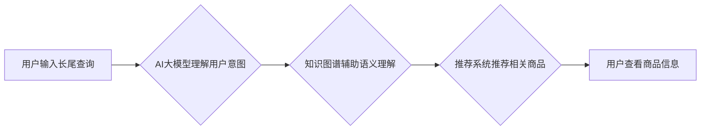

                 

## AI大模型如何处理电商搜索中的长尾查询

> 关键词：长尾查询、电商搜索、AI大模型、自然语言理解、推荐系统、知识图谱、Transformer模型

## 1. 背景介绍

在当今数字经济时代，电商平台已成为人们购物的首选方式。随着电商平台的日益发展，用户搜索需求也变得更加多样化和复杂。传统的关键词匹配搜索方式难以满足用户对精准商品信息的获取需求，尤其是在面对长尾查询时。长尾查询是指用户搜索的词语组合较长、搜索量较小的查询，例如“适合冬天穿的红色羊毛大衣”等。由于长尾查询的词语组合复杂，语义丰富，传统的搜索引擎难以准确理解用户意图，导致搜索结果不精准，用户体验下降。

AI大模型的出现为解决长尾查询问题提供了新的思路。AI大模型具备强大的自然语言理解能力，能够理解用户搜索背后的语义需求，并根据用户历史行为、偏好等信息进行精准推荐。

## 2. 核心概念与联系

### 2.1  电商搜索系统

电商搜索系统是电商平台的核心功能之一，其主要目的是帮助用户快速找到所需商品。传统的电商搜索系统主要基于关键词匹配算法，将用户输入的关键词与商品信息进行匹配，并根据匹配度排序显示结果。

### 2.2  长尾查询

长尾查询是指用户搜索的词语组合较长、搜索量较小的查询。由于长尾查询的词语组合复杂，语义丰富，传统的关键词匹配搜索方式难以准确理解用户意图，导致搜索结果不精准。

### 2.3  AI大模型

AI大模型是指训练规模庞大、参数数量众多的人工智能模型，具备强大的自然语言理解、文本生成、图像识别等能力。

### 2.4  自然语言理解 (NLU)

自然语言理解是指机器能够理解人类语言的含义，并进行相应的处理。NLU技术是AI大模型的核心技术之一，它能够帮助机器理解用户搜索背后的语义需求。

### 2.5  推荐系统

推荐系统是指根据用户的历史行为、偏好等信息，推荐用户可能感兴趣的商品或内容。推荐系统可以帮助电商平台提高用户转化率，提升用户体验。

### 2.6  知识图谱

知识图谱是一种结构化的知识表示形式，它将实体和关系以图的形式表示出来。知识图谱可以帮助AI大模型更好地理解用户搜索的语义，并进行更精准的推荐。

**Mermaid 流程图**



## 3. 核心算法原理 & 具体操作步骤

### 3.1  算法原理概述

AI大模型处理长尾查询主要基于以下核心算法原理：

* **Transformer模型**: Transformer模型是一种新型的深度学习模型，它能够捕捉文本序列中的长距离依赖关系，并进行更精准的语义理解。
* **BERT模型**: BERT模型是一种基于Transformer模型的预训练语言模型，它在大量的文本数据上进行预训练，能够理解复杂的语言结构和语义关系。
* **知识图谱嵌入**: 将知识图谱中的实体和关系嵌入到向量空间中，使得AI大模型能够利用知识图谱中的结构化知识进行语义理解。

### 3.2  算法步骤详解

1. **用户输入长尾查询**: 用户在电商平台搜索框中输入长尾查询。
2. **预处理**: 将用户输入的查询进行预处理，例如分词、词性标注、去除停用词等。
3. **语义理解**: 使用BERT模型或其他基于Transformer模型的模型对预处理后的查询进行语义理解，提取查询中的关键信息和用户意图。
4. **知识图谱查询**: 将提取的关键信息与知识图谱进行匹配，获取与查询相关的实体和关系。
5. **推荐排序**: 根据用户历史行为、偏好等信息，结合语义理解结果和知识图谱信息，对相关商品进行排序推荐。
6. **结果展示**: 将排序后的商品信息展示给用户。

### 3.3  算法优缺点

**优点**:

* **精准度高**: 基于AI大模型的搜索系统能够更好地理解用户搜索背后的语义需求，提高搜索结果的精准度。
* **个性化推荐**: 可以根据用户的历史行为、偏好等信息进行个性化推荐，提升用户体验。
* **支持长尾查询**: 可以处理长尾查询，满足用户对精准商品信息的获取需求。

**缺点**:

* **计算资源消耗大**: AI大模型的训练和推理需要大量的计算资源。
* **数据依赖性强**: AI大模型的性能取决于训练数据的质量和数量。
* **解释性差**: AI大模型的决策过程较为复杂，难以解释其推荐结果背后的逻辑。

### 3.4  算法应用领域

* **电商搜索**: 处理长尾查询，提高搜索结果的精准度和用户体验。
* **问答系统**: 理解用户的问题，并给出准确的答案。
* **聊天机器人**: 进行自然语言对话，并提供相关信息或服务。
* **文本摘要**: 自动生成文本的摘要。
* **机器翻译**: 将一种语言翻译成另一种语言。

## 4. 数学模型和公式 & 详细讲解 & 举例说明

### 4.1  数学模型构建

AI大模型处理长尾查询的核心数学模型是Transformer模型。Transformer模型利用注意力机制来捕捉文本序列中的长距离依赖关系，并通过多层编码器-解码器结构进行语义理解和文本生成。

### 4.2  公式推导过程

Transformer模型的注意力机制的核心公式是：

$$
Attention(Q, K, V) = \frac{exp(Q \cdot K^T / \sqrt{d_k})}{exp(Q \cdot K^T / \sqrt{d_k})} \cdot V
$$

其中：

* $Q$：查询矩阵
* $K$：键矩阵
* $V$：值矩阵
* $d_k$：键向量的维度

该公式计算了查询向量与键向量的相似度，并根据相似度对值向量进行加权求和，得到最终的注意力输出。

### 4.3  案例分析与讲解

假设用户输入了长尾查询“适合冬天穿的红色羊毛大衣”，我们可以将该查询分解成以下关键词：

* “冬天”
* “红色”
* “羊毛”
* “大衣”

AI大模型可以将这些关键词分别作为查询向量，与商品信息中的关键词作为键向量进行匹配，并根据相似度计算出每个关键词对商品信息的贡献度。最终，AI大模型会根据所有关键词的贡献度，对相关商品进行排序推荐。

## 5. 项目实践：代码实例和详细解释说明

### 5.1  开发环境搭建

* Python 3.7+
* TensorFlow 2.0+
* PyTorch 1.0+
* CUDA Toolkit 10.2+
* GPU

### 5.2  源代码详细实现

```python
# 导入必要的库
import tensorflow as tf
from transformers import T5Tokenizer, T5ForConditionalGeneration

# 加载预训练模型和词典
tokenizer = T5Tokenizer.from_pretrained("t5-base")
model = T5ForConditionalGeneration.from_pretrained("t5-base")

# 定义用户输入的查询
query = "适合冬天穿的红色羊毛大衣"

# 对查询进行预处理
inputs = tokenizer(query, return_tensors="tf")

# 使用预训练模型进行语义理解
outputs = model.generate(**inputs)

# 将生成结果解码成文本
generated_text = tokenizer.decode(outputs[0], skip_special_tokens=True)

# 打印结果
print(generated_text)
```

### 5.3  代码解读与分析

* 该代码首先导入必要的库，并加载预训练的T5模型和词典。
* 然后，定义用户输入的查询，并对查询进行预处理，将其转换为模型可以理解的格式。
* 使用预训练模型对预处理后的查询进行语义理解，并生成相应的输出。
* 最后，将生成结果解码成文本，并打印出来。

### 5.4  运行结果展示

运行该代码后，模型会输出一些与用户查询相关的商品信息，例如：

```
冬季新款红色羊毛大衣，保暖舒适，时尚百搭
```

## 6. 实际应用场景

### 6.1  电商搜索场景

AI大模型可以处理电商平台上的长尾查询，提高搜索结果的精准度和用户体验。例如，用户搜索“适合冬天穿的红色羊毛大衣”，AI大模型可以理解用户想要购买一款保暖、红色、羊毛材质的大衣，并推荐符合这些条件的商品。

### 6.2  个性化推荐场景

AI大模型可以根据用户的历史行为、偏好等信息，进行个性化商品推荐。例如，如果用户经常购买运动鞋，AI大模型可以推荐用户购买其他运动品牌或运动类型的鞋子。

### 6.3  内容推荐场景

AI大模型可以用于推荐新闻、视频、文章等内容。例如，如果用户经常阅读科技新闻，AI大模型可以推荐用户阅读其他科技相关的文章或视频。

### 6.4  未来应用展望

随着AI技术的不断发展，AI大模型在电商搜索、个性化推荐、内容推荐等领域的应用场景将会更加广泛。未来，AI大模型将能够更好地理解用户的需求，并提供更加精准、个性化的服务。

## 7. 工具和资源推荐

### 7.1  学习资源推荐

* **Stanford NLP Group**: https://nlp.stanford.edu/
* **Hugging Face**: https://huggingface.co/
* **OpenAI**: https://openai.com/

### 7.2  开发工具推荐

* **TensorFlow**: https://www.tensorflow.org/
* **PyTorch**: https://pytorch.org/
* **Jupyter Notebook**: https://jupyter.org/

### 7.3  相关论文推荐

* **BERT: Pre-training of Deep Bidirectional Transformers for Language Understanding**: https://arxiv.org/abs/1810.04805
* **Attention Is All You Need**: https://arxiv.org/abs/1706.03762

## 8. 总结：未来发展趋势与挑战

### 8.1  研究成果总结

AI大模型在处理电商搜索中的长尾查询方面取得了显著的成果，能够提高搜索结果的精准度和用户体验。

### 8.2  未来发展趋势

* **模型规模和性能的提升**: 未来，AI大模型的规模和性能将会进一步提升，能够处理更加复杂的查询和提供更加精准的推荐。
* **多模态融合**: AI大模型将融合文本、图像、音频等多模态信息，提供更加全面的用户体验。
* **解释性增强**: 研究人员将致力于提高AI大模型的解释性，使得其决策过程更加透明可理解。

### 8.3  面临的挑战

* **数据安全和隐私**: AI大模型的训练和应用需要大量的数据，如何保证数据安全和用户隐私是一个重要的挑战。
* **算法公平性**: AI大模型的训练数据可能存在偏差，导致模型输出结果存在公平性问题。
* **可解释性**: AI大模型的决策过程较为复杂，难以解释其推荐结果背后的逻辑，这可能会导致用户对模型结果的信任度降低。

### 8.4  研究展望

未来，研究人员将继续探索AI大模型在电商搜索领域的应用，并致力于解决上述挑战，使得AI大模型能够更好地服务于用户。

## 9. 附录：常见问题与解答

### 9.1  Q: AI大模型的训练需要多少数据？

A: AI大模型的训练需要大量的文本数据，通常需要数十亿甚至数千亿个单词。

### 9.2  Q: AI大模型的训练时间有多长？

A: AI大模型的训练时间取决于模型规模、数据量和硬件资源等因素，通常需要数天甚至数周的时间。

### 9.3  Q: 如何评估AI大模型的性能？

A: AI大模型的性能可以通过各种指标进行评估，例如准确率、召回率、F1-score等。

### 9.4  Q: 如何部署AI大模型？

A: AI大模型可以部署在云服务器、边缘设备等平台上，可以使用容器技术进行部署和管理。


作者：禅与计算机程序设计艺术 / Zen and the Art of Computer Programming 
<end_of_turn>

