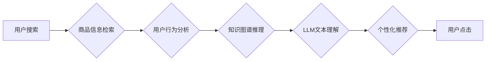

                 

## AI大模型视角下电商搜索推荐的技术创新路径

> 关键词：电商搜索推荐、大语言模型、Transformer、知识图谱、多模态学习、个性化推荐、AI创新

### 1. 背景介绍

电商搜索推荐作为电商平台的核心功能之一，直接影响着用户体验和商业转化。传统电商搜索推荐系统主要依赖于基于规则的匹配和基于协同过滤的算法，但随着用户行为的复杂化和商品信息的爆炸式增长，这些传统方法逐渐难以满足用户需求。

近年来，深度学习技术的快速发展为电商搜索推荐带来了新的机遇。大语言模型（LLM）凭借其强大的文本理解和生成能力，以及Transformer架构的突破性进展，在自然语言处理领域取得了显著成就。将LLM应用于电商搜索推荐，可以有效提升推荐的准确性和个性化程度，为用户提供更精准、更相关的商品推荐。

### 2. 核心概念与联系

#### 2.1  电商搜索推荐

电商搜索推荐是指在电商平台上，根据用户的搜索意图和历史行为，推荐相关商品的过程。其目标是帮助用户快速找到所需商品，提高用户购物体验和转化率。

#### 2.2  大语言模型（LLM）

大语言模型是一种基于深度学习的强大人工智能模型，能够理解和生成人类语言。其核心特点是：

* **规模庞大：** LLM拥有数十亿甚至数千亿个参数，能够学习和掌握海量文本数据。
* **文本理解能力强：** LLM能够理解文本的语义和上下文，进行文本分类、问答、摘要等任务。
* **文本生成能力强：** LLM能够生成流畅、自然的文本，用于对话系统、机器翻译、内容创作等领域。

#### 2.3  Transformer架构

Transformer是一种新型的神经网络架构，其核心是“注意力机制”，能够有效捕捉文本序列中的长距离依赖关系。Transformer架构的应用使得LLM的训练效率和性能得到大幅提升。

#### 2.4  知识图谱

知识图谱是一种结构化的知识表示形式，将实体和关系以图的形式表示。知识图谱能够提供丰富的商品信息和用户关系，为电商搜索推荐提供更精准的知识支持。

**核心概念与联系流程图**



### 3. 核心算法原理 & 具体操作步骤

#### 3.1  算法原理概述

基于LLM的电商搜索推荐算法通常采用以下核心原理：

* **文本嵌入：** 将商品信息和用户行为转化为向量表示，以便LLM进行理解和比较。
* **注意力机制：** 捕捉商品信息和用户行为之间的相关性，突出重要信息。
* **多模态学习：** 结合文本、图像、视频等多模态数据，构建更全面的商品理解和用户画像。
* **个性化推荐：** 根据用户的历史行为、偏好和上下文信息，生成个性化的商品推荐列表。

#### 3.2  算法步骤详解

1. **数据预处理：** 收集商品信息、用户行为、商品评论等数据，进行清洗、格式化和特征提取。
2. **文本嵌入：** 使用预训练的LLM模型，将商品信息和用户行为转化为向量表示。
3. **注意力机制：** 利用注意力机制，计算商品信息和用户行为之间的相关性，突出重要信息。
4. **推荐模型训练：** 使用训练数据，训练推荐模型，例如基于Transformer的推荐模型。
5. **个性化推荐：** 根据用户的历史行为、偏好和上下文信息，利用训练好的推荐模型生成个性化的商品推荐列表。
6. **结果评估：** 使用指标如点击率、转化率等，评估推荐系统的性能。

#### 3.3  算法优缺点

**优点：**

* **提升推荐准确性：** LLM能够理解商品信息和用户行为的语义，提升推荐的精准度。
* **个性化推荐：** 基于用户的历史行为和偏好，生成个性化的推荐列表，提升用户体验。
* **多模态学习：** 结合多模态数据，构建更全面的商品理解和用户画像，提升推荐效果。

**缺点：**

* **计算资源消耗大：** LLM模型参数庞大，训练和部署需要大量的计算资源。
* **数据依赖性强：** LLM模型的性能依赖于训练数据的质量和数量。
* **可解释性差：** LLM模型的决策过程较为复杂，难以解释推荐结果背后的逻辑。

#### 3.4  算法应用领域

* **电商商品推荐：** 根据用户的搜索历史、浏览记录、购买记录等信息，推荐相关的商品。
* **内容推荐：** 根据用户的阅读习惯、兴趣爱好等信息，推荐相关的文章、视频、音频等内容。
* **广告推荐：** 根据用户的兴趣爱好、行为特征等信息，推荐相关的广告。

### 4. 数学模型和公式 & 详细讲解 & 举例说明

#### 4.1  数学模型构建

基于LLM的电商搜索推荐系统通常采用以下数学模型：

* **用户嵌入模型：** 将用户的历史行为和特征转化为向量表示，例如基于协同过滤的矩阵分解模型。
* **商品嵌入模型：** 将商品信息转化为向量表示，例如基于Word2Vec或BERT的文本嵌入模型。
* **推荐模型：** 使用用户嵌入和商品嵌入作为输入，预测用户对商品的点击概率或评分，例如基于Transformer的推荐模型。

#### 4.2  公式推导过程

推荐模型的训练目标通常是最大化用户点击或评分的预测准确率。常用的损失函数包括交叉熵损失函数和均方误差损失函数。

**交叉熵损失函数：**

$$
L = -\sum_{i=1}^{N} y_i \log(p_i) + (1-y_i) \log(1-p_i)
$$

其中：

* $N$ 是样本数量
* $y_i$ 是真实标签（1表示点击，0表示不点击）
* $p_i$ 是模型预测的点击概率

**均方误差损失函数：**

$$
L = \frac{1}{N} \sum_{i=1}^{N} (y_i - \hat{y}_i)^2
$$

其中：

* $y_i$ 是真实评分
* $\hat{y}_i$ 是模型预测的评分

#### 4.3  案例分析与讲解

假设我们有一个电商平台，用户搜索“智能手机”，系统需要推荐相关的商品。

1. **用户嵌入：** 根据用户的历史搜索记录、购买记录、浏览记录等信息，构建用户的向量表示。
2. **商品嵌入：** 根据商品的标题、描述、属性等信息，构建商品的向量表示。
3. **推荐模型：** 使用Transformer模型，将用户的向量表示和商品的向量表示作为输入，预测用户对商品的点击概率。
4. **个性化推荐：** 根据用户的向量表示和商品的向量表示，排序商品，生成个性化的推荐列表。

### 5. 项目实践：代码实例和详细解释说明

#### 5.1  开发环境搭建

* Python 3.7+
* PyTorch 或 TensorFlow
* CUDA 和 cuDNN

#### 5.2  源代码详细实现

```python
# 导入必要的库
import torch
import torch.nn as nn

# 定义用户嵌入层
class UserEmbedding(nn.Module):
    def __init__(self, user_dim, embedding_dim):
        super(UserEmbedding, self).__init__()
        self.embedding = nn.Embedding(user_dim, embedding_dim)

    def forward(self, user_ids):
        return self.embedding(user_ids)

# 定义商品嵌入层
class ItemEmbedding(nn.Module):
    def __init__(self, item_dim, embedding_dim):
        super(ItemEmbedding, self).__init__()
        self.embedding = nn.Embedding(item_dim, embedding_dim)

    def forward(self, item_ids):
        return self.embedding(item_ids)

# 定义Transformer推荐模型
class TransformerRecommender(nn.Module):
    def __init__(self, user_dim, item_dim, embedding_dim, num_heads, num_layers):
        super(TransformerRecommender, self).__init__()
        self.user_embedding = UserEmbedding(user_dim, embedding_dim)
        self.item_embedding = ItemEmbedding(item_dim, embedding_dim)
        self.transformer = nn.Transformer(embedding_dim, num_heads, num_layers)
        self.fc = nn.Linear(embedding_dim, 1)

    def forward(self, user_ids, item_ids):
        user_embeddings = self.user_embedding(user_ids)
        item_embeddings = self.item_embedding(item_ids)
        embeddings = torch.cat([user_embeddings, item_embeddings], dim=-1)
        embeddings = self.transformer(embeddings)
        logits = self.fc(embeddings[:, 0, :])
        return logits

# 实例化模型
model = TransformerRecommender(user_dim=10000, item_dim=10000, embedding_dim=64, num_heads=8, num_layers=2)

# 训练模型
# ...

# 预测点击概率
predictions = model(user_ids, item_ids)
```

#### 5.3  代码解读与分析

* **用户嵌入层和商品嵌入层：** 将用户ID和商品ID转化为向量表示。
* **Transformer模型：** 利用注意力机制，捕捉用户和商品之间的关系，生成商品推荐的得分。
* **全连接层：** 将Transformer模型的输出转化为点击概率。

#### 5.4  运行结果展示

训练完成后，可以使用测试数据评估模型的性能，例如计算点击率和转化率。

### 6. 实际应用场景

#### 6.1  电商平台商品推荐

* **个性化推荐：** 根据用户的历史购买记录、浏览记录、收藏记录等信息，推荐个性化的商品。
* **搜索结果推荐：** 在用户搜索商品时，推荐相关的商品，提升用户搜索体验。
* **新品推荐：** 推广新上市的商品，提高商品曝光率。

#### 6.2  内容平台内容推荐

* **个性化内容推荐：** 根据用户的阅读习惯、兴趣爱好等信息，推荐相关的文章、视频、音频等内容。
* **内容分类和聚类：** 利用LLM的文本理解能力，对内容进行分类和聚类，方便用户查找和浏览。

#### 6.3  广告平台广告推荐

* **精准广告投放：** 根据用户的兴趣爱好、行为特征等信息，推荐相关的广告，提升广告点击率和转化率。
* **广告创意生成：** 利用LLM的文本生成能力，生成吸引用户的广告创意。

#### 6.4  未来应用展望

* **多模态推荐：** 结合文本、图像、视频等多模态数据，构建更全面的商品理解和用户画像，提升推荐效果。
* **实时推荐：** 利用实时数据流，动态更新用户画像和商品信息，实现更精准的实时推荐。
* **解释性推荐：** 提升LLM模型的可解释性，让用户了解推荐结果背后的逻辑，提升用户信任度。

### 7. 工具和资源推荐

#### 7.1  学习资源推荐

* **书籍：**
    * 《深度学习》 - Ian Goodfellow, Yoshua Bengio, Aaron Courville
    * 《自然语言处理》 - Jurafsky, Martin
* **在线课程：**
    * Coursera: Deep Learning Specialization
    * Stanford CS224N: Natural Language Processing with Deep Learning

#### 7.2  开发工具推荐

* **深度学习框架：** PyTorch, TensorFlow
* **自然语言处理库：** Hugging Face Transformers, spaCy

#### 7.3  相关论文推荐

* **BERT：** Devlin, J., Chang, M. W., Lee, K., & Toutanova, K. (2018). BERT: Pre-training of deep bidirectional transformers for language understanding. arXiv preprint arXiv:1810.04805.
* **Transformer：** Vaswani, A., Shazeer, N., Parmar, N., Uszkoreit, J., Jones, L., Gomez, A. N., ... & Polosukhin, I. (2017). Attention is all you need. In Advances in neural information processing systems (pp. 5998-6008).

### 8. 总结：未来发展趋势与挑战

#### 8.1  研究成果总结

基于LLM的电商搜索推荐技术取得了显著进展，能够有效提升推荐的准确性和个性化程度。

#### 8.2  未来发展趋势

* **多模态学习：** 结合文本、图像、视频等多模态数据，构建更全面的商品理解和用户画像。
* **实时推荐：** 利用实时数据流，动态更新用户画像和商品信息，实现更精准的实时推荐。
* **解释性推荐：** 提升LLM模型的可解释性，让用户了解推荐结果背后的逻辑。
* **联邦学习：** 利用联邦学习技术，保护用户隐私，同时实现模型的联合训练和优化。

#### 8.3  面临的挑战

* **数据安全和隐私保护：** LLM模型的训练需要大量用户数据，如何保护用户隐私是一个重要挑战。
* **模型可解释性：** LLM模型的决策过程较为复杂，难以解释推荐结果背后的逻辑，这可能会影响用户的信任度。
* **计算资源消耗：** LLM模型参数庞大，训练和部署需要大量的计算资源，这可能会限制其在实际应用中的推广。

#### 8.4  研究展望

未来，基于LLM的电商搜索推荐技术将继续发展，朝着更精准、更个性化、更可解释的方向发展。


### 9. 附录：常见问题与解答

**Q1：LLM模型的训练需要多少数据？**

A1：LLM模型的训练需要海量文本数据，通常需要数十亿甚至数千亿个单词。

**Q2：如何评估LLM模型的性能？**

A2：常用的评估指标包括准确率、召回率、F1-score等。

**Q3：如何解决LLM模型的计算资源消耗问题？**

A3：可以使用模型压缩、模型并行等技术来降低模型的计算资源消耗。


作者：禅与计算机程序设计艺术 / Zen and the Art of Computer Programming<end_of_turn>

