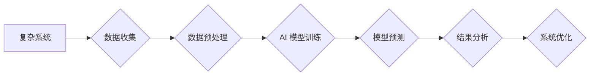

                 

## AI如何帮助人类更好地理解复杂问题

> 关键词：人工智能、复杂系统、机器学习、深度学习、数据分析、模式识别、预测建模

## 1. 背景介绍

人类文明的进步离不开对复杂问题的理解和解决。从古代的农业生产到现代的太空探索，我们一直在探索如何更好地理解世界，并利用这些知识来改善我们的生活。然而，随着科技的进步，我们所面临的复杂问题也日益增多，例如气候变化、疾病爆发、金融危机等。这些问题往往跨越多个领域，涉及大量的数据和相互关联的因素，使得传统的研究方法显得力不从心。

人工智能（AI）的出现为人类理解复杂问题提供了新的希望。AI 拥有强大的数据处理能力和模式识别能力，能够从海量数据中发现隐藏的规律和趋势，并构建出复杂的数学模型来模拟和预测系统行为。通过AI的帮助，我们可以更深入地理解复杂系统的运作机制，并找到更有效的解决问题的方法。

## 2. 核心概念与联系

**2.1 复杂系统**

复杂系统是指由许多相互作用的个体组成的系统，这些个体之间存在着非线性的相互依赖关系。复杂系统的行为往往是不可预测的，并且对初始条件非常敏感。例如，生态系统、社会网络、金融市场等都是典型的复杂系统。

**2.2 人工智能**

人工智能是指模拟人类智能的计算机系统。AI 的核心技术包括机器学习、深度学习、自然语言处理等。机器学习算法能够从数据中学习，并根据学习到的知识进行预测或决策。深度学习算法则利用多层神经网络来模拟人类大脑的学习过程，能够处理更复杂的数据和任务。

**2.3 AI 在复杂系统理解中的作用**

AI 可以通过以下方式帮助人类更好地理解复杂系统：

* **数据分析和模式识别:** AI 能够从海量数据中发现隐藏的模式和趋势，揭示复杂系统的内在规律。
* **建模和模拟:** AI 可以构建复杂的数学模型来模拟复杂系统的行为，帮助我们预测系统的未来发展趋势。
* **优化和控制:** AI 可以根据模型的预测结果，优化系统的参数和控制策略，提高系统的效率和稳定性。

**Mermaid 流程图**



## 3. 核心算法原理 & 具体操作步骤

**3.1 算法原理概述**

在理解复杂系统方面，机器学习算法发挥着至关重要的作用。其中，深度学习算法由于其强大的学习能力和对复杂模式的建模能力，在复杂系统研究中得到了广泛应用。深度学习算法的核心是多层神经网络，通过层层叠加的神经元，能够学习到数据的抽象特征和层次结构。

**3.2 算法步骤详解**

深度学习算法的训练过程通常包括以下步骤：

1. **数据收集和预处理:** 收集与复杂系统相关的原始数据，并进行清洗、转换、归一化等预处理操作，使其适合深度学习模型的训练。
2. **模型构建:** 根据问题的特点选择合适的深度学习模型架构，例如卷积神经网络（CNN）、循环神经网络（RNN）等。
3. **模型训练:** 使用训练数据训练深度学习模型，通过调整模型参数，使模型能够准确地预测或分类数据。
4. **模型评估:** 使用测试数据评估模型的性能，例如准确率、召回率、F1-score等指标。
5. **模型调优:** 根据评估结果，调整模型参数、学习率等超参数，进一步提高模型的性能。
6. **模型部署:** 将训练好的模型部署到实际应用场景中，用于预测、控制或分析复杂系统。

**3.3 算法优缺点**

**优点:**

* **强大的学习能力:** 深度学习算法能够从海量数据中学习到复杂的模式和特征。
* **对复杂数据的处理能力:** 深度学习算法能够处理文本、图像、音频等多种复杂数据类型。
* **自动特征提取:** 深度学习算法能够自动提取数据的特征，无需人工特征工程。

**缺点:**

* **数据依赖性:** 深度学习算法需要大量的训练数据才能达到良好的性能。
* **训练时间长:** 深度学习模型的训练过程通常需要很长时间。
* **可解释性差:** 深度学习模型的内部工作机制难以理解，其决策过程缺乏透明度。

**3.4 算法应用领域**

深度学习算法在复杂系统研究中应用广泛，例如：

* **金融市场预测:** 利用深度学习算法预测股票价格、汇率等金融指标。
* **疾病诊断:** 利用深度学习算法分析医学图像，辅助医生诊断疾病。
* **气候变化模拟:** 利用深度学习算法模拟气候变化趋势，预测未来气候变化的影响。
* **交通流量预测:** 利用深度学习算法预测交通流量，优化交通管理策略。

## 4. 数学模型和公式 & 详细讲解 & 举例说明

**4.1 数学模型构建**

在复杂系统研究中，数学模型是描述系统行为和关系的重要工具。深度学习算法可以构建复杂的数学模型，例如神经网络模型、概率图模型等。这些模型能够捕捉系统中隐藏的非线性关系和相互依赖性。

**4.2 公式推导过程**

深度学习算法的训练过程本质上是一个优化问题，目标是找到模型参数，使得模型的预测结果与真实值之间的误差最小化。常用的优化算法包括梯度下降法、动量法、Adam算法等。这些算法通过迭代更新模型参数，逐步逼近最优解。

**4.3 案例分析与讲解**

例如，在预测股票价格的案例中，我们可以构建一个深度学习模型，将股票的历史价格、交易量、新闻数据等作为输入，预测未来的股票价格。模型的输出是一个概率分布，表示股票价格在未来某个时间段内的可能值。

**数学公式示例:**

$$
Loss = \sum_{i=1}^{N} (y_i - \hat{y}_i)^2
$$

其中：

* $Loss$ 表示损失函数，衡量模型预测结果与真实值的误差。
* $N$ 表示样本数量。
* $y_i$ 表示第 $i$ 个样本的真实值。
* $\hat{y}_i$ 表示第 $i$ 个样本的预测值。

**4.4 举例说明**

在训练模型的过程中，我们会使用梯度下降法来更新模型参数。梯度下降法的核心思想是沿着损失函数的负梯度方向更新参数，从而逐渐降低损失函数的值。

$$
\theta = \theta - \alpha \nabla Loss(\theta)
$$

其中：

* $\theta$ 表示模型参数。
* $\alpha$ 表示学习率，控制参数更新的步长。
* $\nabla Loss(\theta)$ 表示损失函数关于参数 $\theta$ 的梯度。

## 5. 项目实践：代码实例和详细解释说明

**5.1 开发环境搭建**

为了实现深度学习算法的应用，我们需要搭建一个合适的开发环境。常用的深度学习框架包括TensorFlow、PyTorch、Keras等。

**5.2 源代码详细实现**

以下是一个使用PyTorch框架实现简单神经网络的代码示例：

```python
import torch
import torch.nn as nn

# 定义神经网络模型
class SimpleNet(nn.Module):
    def __init__(self, input_size, hidden_size, output_size):
        super(SimpleNet, self).__init__()
        self.linear1 = nn.Linear(input_size, hidden_size)
        self.relu = nn.ReLU()
        self.linear2 = nn.Linear(hidden_size, output_size)

    def forward(self, x):
        x = self.linear1(x)
        x = self.relu(x)
        x = self.linear2(x)
        return x

# 实例化模型
model = SimpleNet(input_size=10, hidden_size=5, output_size=2)

# 定义损失函数和优化器
criterion = nn.CrossEntropyLoss()
optimizer = torch.optim.Adam(model.parameters(), lr=0.001)

# 训练模型
for epoch in range(100):
    # 前向传播
    outputs = model(inputs)
    # 计算损失
    loss = criterion(outputs, labels)
    # 反向传播
    optimizer.zero_grad()
    loss.backward()
    # 更新参数
    optimizer.step()

# 保存模型
torch.save(model.state_dict(), 'model.pth')
```

**5.3 代码解读与分析**

这段代码定义了一个简单的两层神经网络模型，并使用PyTorch框架进行训练。模型的输入维度为10，隐藏层维度为5，输出维度为2。

**5.4 运行结果展示**

训练完成后，我们可以使用保存的模型文件对新的数据进行预测。

## 6. 实际应用场景

**6.1 医疗诊断**

深度学习算法在医疗诊断领域取得了显著的成果。例如，利用深度学习算法分析医学图像，可以辅助医生诊断癌症、心血管疾病等。

**6.2 金融风险管理**

深度学习算法可以用于金融风险管理，例如预测股票价格波动、识别欺诈交易等。

**6.3 智能交通**

深度学习算法可以用于智能交通系统，例如预测交通流量、优化交通信号灯控制等。

**6.4 未来应用展望**

随着人工智能技术的不断发展，深度学习算法将在更多领域得到应用，例如个性化教育、精准农业、智能制造等。

## 7. 工具和资源推荐

**7.1 学习资源推荐**

* **书籍:**
    * 深度学习 (Deep Learning) - Ian Goodfellow, Yoshua Bengio, Aaron Courville
    * 构建深度学习神经网络 (Hands-On Machine Learning with Scikit-Learn, Keras & TensorFlow) - Aurélien Géron
* **在线课程:**
    * 深度学习 Specialization - Andrew Ng (Coursera)
    * fast.ai - Practical Deep Learning for Coders
* **博客和网站:**
    * TensorFlow Blog
    * PyTorch Blog
    * Towards Data Science

**7.2 开发工具推荐**

* **深度学习框架:** TensorFlow, PyTorch, Keras
* **编程语言:** Python
* **数据处理工具:** Pandas, NumPy

**7.3 相关论文推荐**

* **ImageNet Classification with Deep Convolutional Neural Networks** - Alex Krizhevsky, Ilya Sutskever, Geoffrey E. Hinton
* **Sequence to Sequence Learning with Neural Networks** - Ilya Sutskever, Oriol Vinyals, Quoc V. Le
* **Attention Is All You Need** - Ashish Vaswani, Noam Shazeer, Niki Parmar, Jakob Uszkoreit, Llion Jones, Aidan N. Gomez, Łukasz Kaiser, Illia Polosukhin

## 8. 总结：未来发展趋势与挑战

**8.1 研究成果总结**

近年来，深度学习算法取得了令人瞩目的成果，在图像识别、自然语言处理、语音识别等领域取得了突破性的进展。这些成果为人类理解复杂系统提供了新的工具和方法。

**8.2 未来发展趋势**

未来，深度学习算法将朝着以下方向发展：

* **模型规模和复杂度提升:** 随着计算能力的提升，深度学习模型的规模和复杂度将不断提升，能够处理更复杂的数据和任务。
* **算法效率和鲁棒性增强:** 研究人员将致力于开发更有效的深度学习算法，提高算法的训练速度和推理效率，并增强算法的鲁棒性，使其能够更好地应对噪声数据和未知环境。
* **解释性和可解释性提升:** 研究人员将致力于提高深度学习模型的解释性和可解释性，使其决策过程更加透明，更容易被人类理解。

**8.3 面临的挑战**

深度学习算法也面临着一些挑战：

* **数据依赖性:** 深度学习算法需要大量的训练数据才能达到良好的性能，而获取高质量的训练数据仍然是一个难题。
* **计算资源需求:** 训练大型深度学习模型需要大量的计算资源，这对于资源有限的机构和个人来说是一个挑战。
* **伦理和安全问题:** 深度学习算法的应用也引发了一些伦理和安全问题，例如算法偏见、数据隐私等，需要引起人们的重视和关注。

**8.4 研究展望**

未来，人工智能和深度学习技术将继续发展，为人类理解复杂问题提供更强大的工具和方法。我们期待看到更多创新应用，并将人工智能技术应用于更多领域，造福人类社会。

## 9. 附录：常见问题与解答

**9.1 如何选择合适的深度学习模型？**

选择合适的深度学习模型取决于具体的应用场景和数据特点。例如，对于图像识别任务，可以使用卷积神经网络（CNN）；对于文本分类任务，可以使用循环神经网络（RNN）或Transformer模型。

**9.2 如何处理数据不平衡问题？**

数据不平衡是指训练数据中不同类别样本数量不均衡的情况。可以采用以下方法处理数据不平衡问题：

* **过采样:** 对少数类样本进行复制，增加样本数量。
* **欠采样:** 对多数类样本进行删除，减少样本数量。
* **权重调整:** 为不同类别样本分配不同的权重，提高少数类样本的影响力。

**9.3 如何评估深度学习模型的性能？**

常用的评估指标包括准确率、召回率、F1-score、AUC等。选择合适的评估指标取决于具体的应用场景和任务目标。


作者：禅与计算机程序设计艺术 / Zen and the Art of Computer Programming 
<end_of_turn>

