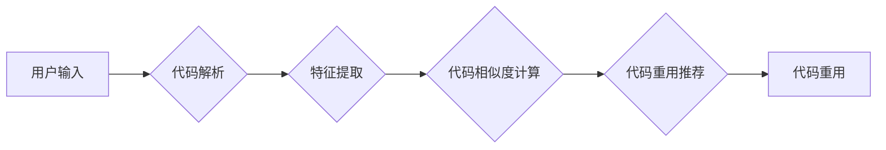

                 

## AI开发的代码重用：Lepton AI的效率工程

> 关键词：人工智能、代码重用、Lepton AI、效率工程、软件架构、代码复用、机器学习、深度学习、软件开发

## 1. 背景介绍

在当今软件开发领域，效率至关重要。随着软件系统越来越复杂，开发周期越来越长，代码重用已成为提高开发效率、降低成本和提高软件质量的关键策略。传统代码重用方法主要依赖于手动编写代码库和组件，但这种方法存在着效率低下、维护成本高、代码可读性和可维护性差等问题。

人工智能技术的快速发展为代码重用带来了新的机遇。Lepton AI 作为一种基于人工智能的代码重用平台，利用机器学习和深度学习算法，能够自动识别和重用代码片段，极大地提高了代码重用的效率和质量。

## 2. 核心概念与联系

Lepton AI 的核心概念是将代码视为数据，并利用机器学习算法进行代码理解和分析。通过训练大量的代码数据集，Lepton AI 可以学习到代码的语法结构、语义含义和代码风格等特征。

Lepton AI 的工作原理可以概括为以下几个步骤：

1. **代码解析:** 将源代码转换为机器可理解的格式，例如抽象语法树 (AST)。
2. **特征提取:** 从代码 AST 中提取各种特征，例如代码结构、变量类型、函数调用等。
3. **代码相似度计算:** 利用机器学习算法计算不同代码片段之间的相似度。
4. **代码重用推荐:** 根据用户需求，推荐最合适的代码片段进行重用。

**Lepton AI 架构流程图:**

## 3. 核心算法原理 & 具体操作步骤

### 3.1  算法原理概述

Lepton AI 使用多种机器学习算法来实现代码重用，包括：

* **词嵌入:** 将代码中的单词或代码片段映射到低维向量空间，以便计算代码之间的语义相似度。
* **神经网络:** 使用深度神经网络来学习代码的复杂结构和语义关系，提高代码相似度计算的准确性。
* **图神经网络:** 将代码表示为图结构，利用图神经网络学习代码之间的依赖关系和层次结构，进一步提高代码重用推荐的准确性。

### 3.2  算法步骤详解

1. **数据预处理:** 将原始代码转换为机器可理解的格式，例如抽象语法树 (AST)。
2. **特征工程:** 从代码 AST 中提取各种特征，例如代码结构、变量类型、函数调用等。
3. **模型训练:** 使用机器学习算法训练模型，学习代码之间的相似度关系。
4. **代码相似度计算:** 将用户输入的代码片段与训练好的模型进行比较，计算相似度得分。
5. **代码重用推荐:** 根据相似度得分，推荐最合适的代码片段进行重用。

### 3.3  算法优缺点

**优点:**

* **提高代码重用效率:** 自动识别和推荐代码片段，大大提高了代码重用的效率。
* **提高代码质量:** 推荐的代码片段经过训练和验证，质量更高，可以减少代码错误和维护成本。
* **降低开发成本:** 通过代码重用，可以减少开发时间和人力成本。

**缺点:**

* **数据依赖:** 算法的性能依赖于训练数据的质量和数量。
* **解释性差:** 一些机器学习算法的决策过程难以解释，这可能会导致代码重用结果难以理解和信任。
* **通用性有限:** 算法可能难以处理一些特定领域的代码或非常复杂的代码结构。

### 3.4  算法应用领域

Lepton AI 的代码重用算法可以应用于各种软件开发领域，例如：

* **Web 开发:** 重用常见的 Web 页面组件、功能模块和代码片段。
* **移动应用开发:** 重用常见的 UI 元素、功能模块和代码片段。
* **嵌入式系统开发:** 重用常见的驱动程序、协议处理代码和硬件交互代码。
* **数据科学和机器学习:** 重用常见的算法实现、数据处理代码和模型训练代码。

## 4. 数学模型和公式 & 详细讲解 & 举例说明

### 4.1  数学模型构建

Lepton AI 使用词嵌入模型来表示代码中的单词或代码片段。常用的词嵌入模型包括 Word2Vec 和 GloVe。这些模型将代码中的单词映射到低维向量空间，使得语义相似的单词拥有相似的向量表示。

### 4.2  公式推导过程

Word2Vec 模型使用神经网络来学习词嵌入。其核心思想是通过预测上下文单词来学习词的向量表示。

假设我们有一个句子 "The quick brown fox jumps over the lazy dog"，Word2Vec 模型会学习到 "quick" 和 "brown" 之间的语义相似性，因为它们经常出现在相似的上下文环境中。

Word2Vec 模型使用以下公式来计算词嵌入：

$$
\mathbf{v}_w = \mathbf{W}_e \mathbf{h}_w
$$

其中：

* $\mathbf{v}_w$ 是单词 $w$ 的词嵌入向量。
* $\mathbf{W}_e$ 是词嵌入矩阵。
* $\mathbf{h}_w$ 是单词 $w$ 的隐藏层向量。

### 4.3  案例分析与讲解

假设我们有两个代码片段：

* 代码片段 1: `for i in range(10): print(i)`
* 代码片段 2: `for j in range(5): print(j)`

使用 Word2Vec 模型，我们可以计算这两个代码片段的词嵌入向量，并根据向量相似度判断它们之间的关系。由于这两个代码片段都使用了 `for` 循环和 `print` 函数，它们的词嵌入向量会比较相似。

## 5. 项目实践：代码实例和详细解释说明

### 5.1  开发环境搭建

Lepton AI 的开发环境搭建需要以下软件：

* Python 3.x
* TensorFlow 或 PyTorch
* Git

### 5.2  源代码详细实现

Lepton AI 的源代码实现较为复杂，涉及到代码解析、特征提取、模型训练和代码重用推荐等多个模块。

### 5.3  代码解读与分析

Lepton AI 的代码实现主要包括以下几个部分：

* **代码解析模块:** 使用 AST 库解析代码，将代码转换为机器可理解的格式。
* **特征提取模块:** 从代码 AST 中提取各种特征，例如代码结构、变量类型、函数调用等。
* **模型训练模块:** 使用 TensorFlow 或 PyTorch 训练机器学习模型，学习代码之间的相似度关系。
* **代码重用推荐模块:** 根据用户输入的代码片段，使用训练好的模型计算相似度得分，并推荐最合适的代码片段进行重用。

### 5.4  运行结果展示

Lepton AI 的运行结果可以展示为代码片段的相似度得分和推荐的代码片段。

## 6. 实际应用场景

Lepton AI 的代码重用技术可以应用于各种实际场景，例如：

* **自动生成代码模板:** 根据用户需求，自动生成代码模板，提高开发效率。
* **代码修复:** 利用已有的代码库，自动修复代码错误。
* **代码迁移:** 将代码从一个平台迁移到另一个平台，减少人工成本。

### 6.4  未来应用展望

Lepton AI 的代码重用技术在未来将有更广泛的应用场景，例如：

* **代码生成:** 利用人工智能技术，自动生成完整的代码程序。
* **代码安全分析:** 利用人工智能技术，自动检测代码中的安全漏洞。
* **代码智能化维护:** 利用人工智能技术，自动完成代码的维护和更新工作。

## 7. 工具和资源推荐

### 7.1  学习资源推荐

* **Lepton AI 官方文档:** https://lepton.ai/docs/
* **机器学习教程:** https://www.coursera.org/learn/machine-learning
* **深度学习教程:** https://www.deeplearning.ai/

### 7.2  开发工具推荐

* **Python:** https://www.python.org/
* **TensorFlow:** https://www.tensorflow.org/
* **PyTorch:** https://pytorch.org/

### 7.3  相关论文推荐

* **Attention Is All You Need:** https://arxiv.org/abs/1706.03762
* **BERT: Pre-training of Deep Bidirectional Transformers for Language Understanding:** https://arxiv.org/abs/1810.04805

## 8. 总结：未来发展趋势与挑战

### 8.1  研究成果总结

Lepton AI 的代码重用技术取得了显著的成果，能够有效提高代码重用效率和代码质量。

### 8.2  未来发展趋势

Lepton AI 的未来发展趋势包括：

* **更强大的模型:** 开发更强大的机器学习模型，提高代码重用推荐的准确性和效率。
* **更丰富的特征:** 提取更丰富的代码特征，更好地理解代码的语义和结构。
* **更广泛的应用场景:** 将代码重用技术应用于更多实际场景，例如代码生成、代码安全分析和代码智能化维护。

### 8.3  面临的挑战

Lepton AI 的代码重用技术还面临着一些挑战，例如：

* **数据质量:** 算法的性能依赖于训练数据的质量和数量。
* **解释性:** 一些机器学习算法的决策过程难以解释，这可能会导致代码重用结果难以理解和信任。
* **通用性:** 算法可能难以处理一些特定领域的代码或非常复杂的代码结构。

### 8.4  研究展望

Lepton AI 将继续致力于代码重用技术的研发，努力解决上述挑战，为软件开发行业带来更多创新和价值。

## 9. 附录：常见问题与解答

**Q1: Lepton AI 是否可以重用任何类型的代码？**

A1: Lepton AI 可以重用大部分类型的代码，但对于一些非常特殊或复杂的代码，可能需要进行额外的处理。

**Q2: Lepton AI 的代码重用推荐结果是否准确？**

A2: Lepton AI 的代码重用推荐结果的准确性取决于训练数据的质量和模型的复杂度。

**Q3: 如何使用 Lepton AI 进行代码重用？**

A3: Lepton AI 提供了详细的文档和示例代码，可以帮助用户快速上手。

作者：禅与计算机程序设计艺术 / Zen and the Art of Computer Programming

<end_of_turn>

