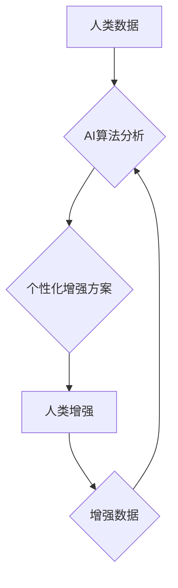

                 

## AI时代的人类增强：道德考虑与身体增强的未来发展机遇分析机遇挑战机遇趋势

> 关键词： 人类增强、AI、生物技术、伦理、道德、身体增强、未来趋势

## 1. 背景介绍

人类文明自诞生以来，就一直在探索如何超越自身的局限性。从使用工具到发明火种，再到开发人工智能，我们始终追求更高效、更强大的能力。如今，人工智能（AI）和生物技术的发展为人类增强带来了前所未有的机遇。

人类增强是指利用科技手段提升人类的生理、认知和社会能力，使其超越自然界赋予的局限。这涵盖了多种领域，包括：

* **身体增强:** 通过植入义肢、基因编辑、纳米技术等手段，增强人类的体力、耐力、感知能力等。
* **认知增强:** 利用脑机接口、人工智能辅助等技术，提升人类的记忆力、学习能力、创造力等。
* **社会增强:** 通过虚拟现实、增强现实等技术，拓展人类的社交圈、沟通方式，提升协作效率。

AI技术在人类增强领域扮演着至关重要的角色。AI算法可以分析海量数据，识别模式，并根据这些模式提供个性化的增强方案。例如，AI可以根据用户的生理数据，定制个性化的运动计划，帮助用户提高身体素质。

## 2. 核心概念与联系

### 2.1 人类增强与AI的融合

AI技术与人类增强领域相互促进，共同推动着人类能力的提升。

* **AI为人类增强提供技术支撑:** AI算法可以分析人类生理数据，识别潜在问题，并提供个性化的增强方案。
* **人类增强为AI提供数据驱动:** 人类增强产生的数据可以用于训练AI模型，使其更加智能化，更好地服务于人类。

**Mermaid 流程图:**



### 2.2 伦理与道德的考量

人类增强技术的发展也引发了广泛的伦理和道德争议。

* **公平与正义:** 人类增强技术可能加剧社会不平等，导致富人更富、穷人更穷。
* **隐私与安全:** 人类增强技术可能收集和利用大量个人数据，引发隐私泄露和安全风险。
* **人性的本质:** 人类增强技术可能会改变人类的本质，引发对人类身份和价值观的思考。

## 3. 核心算法原理 & 具体操作步骤

### 3.1 算法原理概述

人类增强领域常用的算法包括机器学习、深度学习、强化学习等。

* **机器学习:** 通过训练模型，使模型能够从数据中学习规律，并对新数据进行预测或分类。
* **深度学习:** 基于多层神经网络，能够学习更复杂的特征，并实现更精准的预测或分类。
* **强化学习:** 通过奖励机制，训练模型在特定环境中做出最优决策。

### 3.2 算法步骤详解

以机器学习为例，其基本步骤如下：

1. **数据收集:** 收集与人类增强相关的各种数据，例如生理数据、行为数据、环境数据等。
2. **数据预处理:** 对收集到的数据进行清洗、转换、特征提取等处理，使其适合模型训练。
3. **模型选择:** 根据任务需求选择合适的机器学习模型，例如线性回归、逻辑回归、决策树、支持向量机等。
4. **模型训练:** 使用训练数据训练模型，调整模型参数，使其能够准确地预测或分类。
5. **模型评估:** 使用测试数据评估模型的性能，例如准确率、召回率、F1-score等。
6. **模型部署:** 将训练好的模型部署到实际应用场景中，用于提供个性化的增强方案。

### 3.3 算法优缺点

**优点:**

* **自动化:** 机器学习算法可以自动学习和优化，无需人工干预。
* **精准度:** 深度学习算法能够学习更复杂的特征，实现更精准的预测或分类。
* **可扩展性:** 机器学习算法可以处理海量数据，并适应不同的应用场景。

**缺点:**

* **数据依赖:** 机器学习算法需要大量数据进行训练，否则性能会下降。
* **黑盒效应:** 一些深度学习算法难以解释其决策过程，导致其不可信赖性。
* **伦理风险:** 机器学习算法可能存在偏见或歧视，导致不公平的结果。

### 3.4 算法应用领域

* **医疗保健:** 诊断疾病、预测患者风险、个性化治疗方案。
* **教育:** 个性化学习方案、智能辅导系统、自动批改作业。
* **运动训练:** 运动计划定制、运动表现分析、运动损伤预防。
* **娱乐:** 个性化游戏体验、虚拟现实互动、增强现实游戏。

## 4. 数学模型和公式 & 详细讲解 & 举例说明

### 4.1 数学模型构建

人类增强领域常用的数学模型包括：

* **线性回归模型:** 用于预测连续变量，例如身高、体重等。
* **逻辑回归模型:** 用于预测分类变量，例如疾病诊断、用户行为预测等。
* **神经网络模型:** 用于学习复杂的非线性关系，例如图像识别、语音识别等。

### 4.2 公式推导过程

以线性回归模型为例，其目标是找到一条直线，使得预测值与真实值之间的误差最小。

**公式:**

$$
y = w_0 + w_1x
$$

其中：

* $y$ 是预测值
* $x$ 是输入变量
* $w_0$ 是截距
* $w_1$ 是权重

**损失函数:**

$$
L = \frac{1}{2} \sum_{i=1}^{n} (y_i - \hat{y}_i)^2
$$

其中：

* $n$ 是样本数量
* $y_i$ 是真实值
* $\hat{y}_i$ 是预测值

**梯度下降算法:**

用于优化模型参数，使得损失函数最小化。

$$
w_0 = w_0 - \alpha \frac{\partial L}{\partial w_0}
$$

$$
w_1 = w_1 - \alpha \frac{\partial L}{\partial w_1}
$$

其中：

* $\alpha$ 是学习率

### 4.3 案例分析与讲解

假设我们想要预测学生的考试成绩，输入变量是学生的学习时间，可以使用线性回归模型进行预测。

* 收集学生学习时间和考试成绩的数据。
* 使用线性回归模型训练，找到最佳的权重和截距。
* 将模型应用于新的学生数据，预测其考试成绩。

## 5. 项目实践：代码实例和详细解释说明

### 5.1 开发环境搭建

* Python 3.x
* TensorFlow 或 PyTorch 等深度学习框架
* Jupyter Notebook 或 VS Code 等代码编辑器

### 5.2 源代码详细实现

```python
import tensorflow as tf

# 定义模型
model = tf.keras.models.Sequential([
    tf.keras.layers.Dense(64, activation='relu', input_shape=(1,)),
    tf.keras.layers.Dense(1)
])

# 编译模型
model.compile(optimizer='adam', loss='mse')

# 训练模型
model.fit(x_train, y_train, epochs=100)

# 预测
predictions = model.predict(x_test)
```

### 5.3 代码解读与分析

* 使用 TensorFlow 框架定义一个简单的线性回归模型。
* 模型包含两层神经元，第一层有 64 个神经元，使用 ReLU 激活函数，输入维度为 1。
* 第二层只有一个神经元，用于输出预测值。
* 使用 Adam 优化器和均方误差损失函数编译模型。
* 使用训练数据训练模型 100 个 epochs。
* 使用测试数据预测结果。

### 5.4 运行结果展示

* 可视化训练过程中的损失函数变化趋势。
* 对预测结果进行评估，例如计算均方误差、R-squared 等指标。

## 6. 实际应用场景

### 6.1 医疗保健

* **疾病诊断:** 利用 AI 算法分析患者的医疗影像、基因数据等，辅助医生诊断疾病。
* **个性化治疗:** 根据患者的基因信息、生活习惯等，定制个性化的治疗方案。
* **药物研发:** 利用 AI 算法加速药物研发过程，降低研发成本。

### 6.2 教育

* **个性化学习:** 根据学生的学习进度、能力水平等，提供个性化的学习方案。
* **智能辅导:** 利用 AI 算法为学生提供智能辅导，解答疑问，帮助学生理解知识。
* **自动批改作业:** 利用 AI 算法自动批改学生的作业，节省教师的时间和精力。

### 6.3 运动训练

* **运动计划定制:** 根据用户的运动目标、身体状况等，定制个性化的运动计划。
* **运动表现分析:** 利用 AI 算法分析用户的运动数据，提供运动表现分析和改进建议。
* **运动损伤预防:** 利用 AI 算法识别运动风险，帮助用户预防运动损伤。

### 6.4 未来应用展望

* **脑机接口:** 人类与计算机直接交互，实现思想控制、增强认知能力。
* **基因编辑:** 修改人类基因，增强身体素质、预防疾病。
* **虚拟现实:** 创建沉浸式虚拟环境，拓展人类的感知和体验。

## 7. 工具和资源推荐

### 7.1 学习资源推荐

* **在线课程:** Coursera、edX、Udacity 等平台提供人工智能、机器学习等方面的在线课程。
* **书籍:** 《深度学习》、《机器学习实战》等书籍介绍人工智能和机器学习的基础知识和应用案例。
* **开源项目:** TensorFlow、PyTorch 等开源项目提供丰富的代码示例和工具，方便学习和实践。

### 7.2 开发工具推荐

* **Python:** 人工智能开发的常用编程语言。
* **Jupyter Notebook:** 用于编写和执行 Python 代码的交互式笔记本环境。
* **VS Code:** 功能强大的代码编辑器，支持多种编程语言和插件。

### 7.3 相关论文推荐

* **《ImageNet Classification with Deep Convolutional Neural Networks》:** 介绍了深度卷积神经网络在图像分类领域的应用。
* **《Attention Is All You Need》:** 介绍了 Transformer 模型，一种新的序列建模方法。
* **《Generative Adversarial Networks》:** 介绍了生成对抗网络，一种用于生成数据的生成模型。

## 8. 总结：未来发展趋势与挑战

### 8.1 研究成果总结

* 人工智能技术在人类增强领域取得了显著进展，例如在医疗诊断、个性化学习、运动训练等方面取得了应用成果。
* 深度学习算法在图像识别、语音识别等领域取得了突破性进展，为人类增强提供了强大的技术支撑。
* 脑机接口、基因编辑等技术正在快速发展，为未来的人类增强带来了新的可能性。

### 8.2 未来发展趋势

* **更加智能化的 AI 算法:** AI 算法将更加智能化，能够更好地理解和响应人类的需求。
* **更加个性化的增强方案:** AI 算法将能够根据用户的个体差异，提供更加个性化的增强方案。
* **更加融合的增强体验:** 人类增强将更加融合到我们的日常生活，例如智能家居、智能交通等。

### 8.3 面临的挑战

* **伦理与道德风险:** 人类增强技术可能引发伦理和道德争议，例如公平性、隐私性、人性的本质等问题。
* **技术可访问性:** 人类增强技术可能导致社会分化，富人更容易获得先进的增强技术，而穷人则难以负担。
* **安全与可靠性:** 人类增强技术可能存在安全漏洞，导致意外事故或数据泄露。

### 8.4 研究展望

* **加强伦理与道德研究:** 探索人类增强技术的伦理和道德边界，制定相应的规范和政策。
* **促进技术可持续发展:** 确保人类增强技术能够公平地惠及所有人，避免社会分化。
* **提升技术安全性和可靠性:** 加强对人类增强技术的安全性评估，降低潜在风险。


## 9. 附录：常见问题与解答

* **Q1: 人类增强技术会取代人类吗？**

A1: 人类增强技术旨在增强人类的能力，而不是取代人类。AI 算法可以帮助人类完成一些重复性或复杂的任务，但人类的创造力、情感和伦理判断仍然是不可替代的。

* **Q2: 人类增强技术会带来哪些风险？**

A2: 人类增强技术可能带来一些风险，例如伦理风险、安全风险、社会风险等。我们需要认真研究这些风险，并采取相应的措施来规避和控制风险。

* **Q3: 如何确保人类增强技术的公平性？**

A3: 确保人类增强技术的公平性需要政府、企业和个人的共同努力。政府需要制定相应的政策法规，企业需要开发可负担的增强技术，个人需要理性地使用增强技术。


作者：禅与计算机程序设计艺术 / Zen and the Art of Computer Programming 
<end_of_turn>

