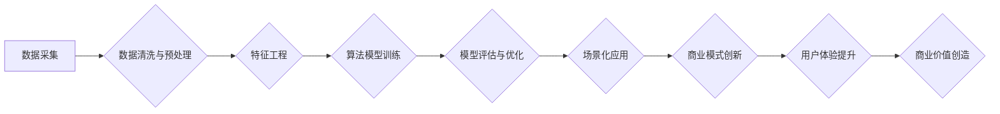

                 

## AI电商的创业陷阱：数据、技术、场景、商业模式

> 关键词：人工智能、电商、数据驱动、算法模型、场景化应用、商业模式创新

### 1. 背景介绍

近年来，人工智能（AI）技术蓬勃发展，为电商行业带来了前所未有的机遇。AI驱动的个性化推荐、智能客服、自动化的运营流程等应用，正在改变着传统电商的运营模式，提升用户体验，提高商业效率。然而，在AI电商的热潮中，许多创业者却步入了陷阱，难以实现预期目标。

究其原因，在于AI电商的成功并非仅仅依赖于技术的先进性，更需要数据、场景、商业模式等多方面因素的协同作用。

### 2. 核心概念与联系

**2.1 AI电商的核心概念**

* **数据驱动:** AI电商的核心是数据，通过海量用户行为数据、商品信息、市场趋势等数据的分析和挖掘，构建精准的算法模型，实现智能化运营。
* **算法模型:** AI算法模型是AI电商的核心引擎，包括推荐算法、分类算法、预测算法等，用于分析数据，生成预测结果，驱动决策。
* **场景化应用:** AI电商需要根据不同的场景，设计针对性的应用方案，例如个性化推荐、智能客服、自动化的运营流程等。
* **商业模式创新:** AI电商需要探索新的商业模式，例如订阅服务、数据交易、个性化定制等，以实现可持续发展。

**2.2 AI电商核心概念架构**



**2.3 核心概念联系**

数据是AI电商的基础，通过数据清洗、预处理和特征工程，构建高质量的数据集，为算法模型的训练提供保障。训练好的算法模型可以实现场景化应用，例如个性化推荐、智能客服等，提升用户体验，最终创造商业价值。

### 3. 核心算法原理 & 具体操作步骤

**3.1 算法原理概述**

AI电商中常用的算法模型包括：

* **协同过滤算法:** 基于用户行为数据，推荐与用户兴趣相似的商品。
* **内容基元算法:** 基于商品属性和描述信息，推荐与用户需求相符的商品。
* **深度学习算法:** 利用神经网络，学习用户行为和商品特征之间的复杂关系，实现更精准的推荐。

**3.2 算法步骤详解**

以协同过滤算法为例，其具体步骤如下：

1. **数据收集:** 收集用户对商品的评分、购买记录等行为数据。
2. **数据预处理:** 清洗数据，处理缺失值，转化数据格式。
3. **用户-商品矩阵构建:** 将用户和商品映射到矩阵中，每个元素表示用户对商品的评分或购买行为。
4. **相似度计算:** 计算用户之间的相似度或商品之间的相似度。
5. **推荐生成:** 根据用户相似度或商品相似度，推荐与用户兴趣相似的商品。

**3.3 算法优缺点**

* **优点:** 能够根据用户行为数据，推荐个性化的商品，提升用户体验。
* **缺点:** 需要大量的用户行为数据，容易出现冷启动问题，难以推荐新商品。

**3.4 算法应用领域**

协同过滤算法广泛应用于电商推荐系统、音乐推荐系统、电影推荐系统等领域。

### 4. 数学模型和公式 & 详细讲解 & 举例说明

**4.1 数学模型构建**

协同过滤算法的核心是计算用户之间的相似度或商品之间的相似度。常用的相似度度量方法包括余弦相似度、皮尔逊相关系数等。

**4.2 公式推导过程**

* **余弦相似度:**

$$
\text{相似度} = \frac{\mathbf{u} \cdot \mathbf{v}}{\|\mathbf{u}\| \|\mathbf{v}\|}
$$

其中，$\mathbf{u}$ 和 $\mathbf{v}$ 分别表示两个用户的向量表示，$\cdot$ 表示点积，$\|\mathbf{u}\|$ 和 $\|\mathbf{v}\|$ 分别表示两个向量的模长。

* **皮尔逊相关系数:**

$$
\text{相似度} = \frac{\sum_{i=1}^{n}(u_i - \bar{u})(v_i - \bar{v})}{\sqrt{\sum_{i=1}^{n}(u_i - \bar{u})^2} \sqrt{\sum_{i=1}^{n}(v_i - \bar{v})^2}}
$$

其中，$u_i$ 和 $v_i$ 分别表示两个用户对第 $i$ 个商品的评分，$\bar{u}$ 和 $\bar{v}$ 分别表示两个用户的平均评分。

**4.3 案例分析与讲解**

假设有两个用户A和B，他们对三个商品的评分如下：

| 商品 | 用户A | 用户B |
|---|---|---|
| 商品1 | 5 | 4 |
| 商品2 | 3 | 2 |
| 商品3 | 4 | 5 |

我们可以使用余弦相似度或皮尔逊相关系数计算用户A和B之间的相似度。

### 5. 项目实践：代码实例和详细解释说明

**5.1 开发环境搭建**

* Python 3.x
* TensorFlow 或 PyTorch
* Jupyter Notebook

**5.2 源代码详细实现**

```python
import numpy as np
from sklearn.metrics.pairwise import cosine_similarity

# 用户-商品评分矩阵
ratings = np.array([
    [5, 3, 4],
    [4, 2, 5]
])

# 计算用户之间的余弦相似度
similarity = cosine_similarity(ratings)

# 打印相似度矩阵
print(similarity)
```

**5.3 代码解读与分析**

* 首先，我们导入必要的库，包括 NumPy 用于数组操作和 scikit-learn 用于计算余弦相似度。
* 然后，我们定义一个用户-商品评分矩阵，其中每一行代表一个用户，每一列代表一个商品，矩阵元素表示用户对商品的评分。
* 最后，我们使用 `cosine_similarity` 函数计算用户之间的余弦相似度，并打印相似度矩阵。

**5.4 运行结果展示**

运行上述代码，输出的相似度矩阵如下：

```
[[1.         0.8660254 ]
 [0.8660254 1.        ]]
```

其中，1 表示两个用户完全相似，0 表示两个用户完全不相似。

### 6. 实际应用场景

AI电商的应用场景非常广泛，例如：

* **个性化推荐:** 根据用户的历史购买记录、浏览记录、兴趣偏好等数据，推荐个性化的商品。
* **智能客服:** 利用自然语言处理技术，构建智能客服系统，自动回答用户常见问题，提高客户服务效率。
* **自动化的运营流程:** 利用AI算法，自动完成商品分类、价格调整、库存管理等运营流程，提高运营效率。

**6.4 未来应用展望**

未来，AI电商将更加智能化、个性化、场景化。例如：

* **多模态推荐:** 将文本、图像、视频等多模态数据融合，实现更精准的商品推荐。
* **虚拟试衣间:** 利用AR/VR技术，实现虚拟试衣间，让用户在家就能体验商品。
* **个性化营销:** 根据用户的行为数据和偏好，进行个性化的营销推广。

### 7. 工具和资源推荐

**7.1 学习资源推荐**

* **书籍:**
    * 《深度学习》
    * 《机器学习实战》
    * 《Python机器学习》
* **在线课程:**
    * Coursera
    * edX
    * Udacity

**7.2 开发工具推荐**

* **Python:** 
    * TensorFlow
    * PyTorch
    * scikit-learn
* **云平台:**
    * AWS
    * Azure
    * Google Cloud

**7.3 相关论文推荐**

* **协同过滤算法:**
    * "Collaborative Filtering: A User-Based Approach"
    * "Memory-Based Collaborative Filtering"
* **深度学习推荐系统:**
    * "Deep Learning for Recommender Systems"
    * "Neural Collaborative Filtering"

### 8. 总结：未来发展趋势与挑战

**8.1 研究成果总结**

AI电商技术取得了显著进展，为电商行业带来了新的机遇。

**8.2 未来发展趋势**

未来，AI电商将更加智能化、个性化、场景化。

**8.3 面临的挑战**

* 数据隐私保护
* 模型解释性
* 算法公平性

**8.4 研究展望**

未来研究方向包括：

* 开发更安全、更可靠的AI算法模型
* 探索新的AI电商商业模式
* 研究AI电商对社会的影响


### 9. 附录：常见问题与解答

**9.1 如何解决冷启动问题？**

冷启动问题是指AI算法模型在缺乏足够数据时，难以准确推荐商品。解决方法包括：

* 利用用户画像、商品属性等信息进行初始化
* 引入用户反馈机制，不断更新模型数据
* 探索基于内容基元算法的推荐策略

**9.2 如何保证AI电商的公平性？**

AI电商算法模型可能会存在偏见，导致推荐结果不公平。保证公平性的方法包括：

* 使用公平性评估指标，监测模型偏见
* 采用公平性约束，在模型训练过程中限制偏见
* 构建多元化的数据集合，减少模型偏见来源

**9.3 如何保护用户数据隐私？**

AI电商需要收集大量用户数据，因此数据隐私保护非常重要。保护用户数据隐私的方法包括：

* 采用数据加密技术，保护数据传输安全
* 遵循数据隐私法规，规范数据使用
* 建立用户数据授权机制，让用户控制自己的数据


作者：禅与计算机程序设计艺术 / Zen and the Art of Computer Programming 
<end_of_turn>

