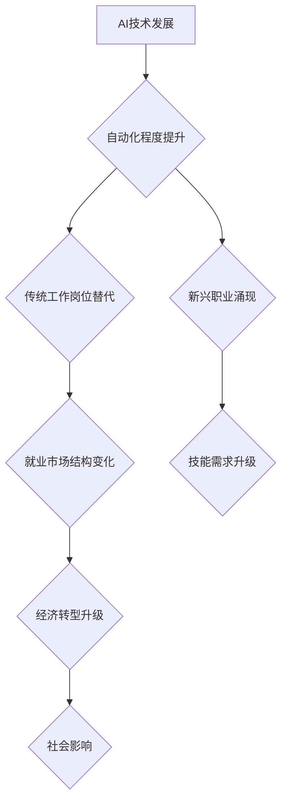

                 

## AI的就业效应:历史经验和未来展望

> 关键词：人工智能、就业市场、自动化、技术替代、新兴职业、经济转型、社会影响、政策应对、未来趋势

## 1. 背景介绍

人工智能（AI）技术的飞速发展，正在深刻地改变着人类社会各领域，其中对就业市场的影响尤为引人关注。一方面，AI技术能够提高生产效率、创造新的价值，为经济增长和社会进步提供动力；另一方面，AI技术的自动化能力也引发了人们对未来就业的担忧，担心大量工作岗位被取代。

历史经验表明，每一次科技革命都伴随着就业结构的深刻变化。从工业革命到信息革命，新兴技术不断涌现，既创造了大量新的就业机会，也导致了一些传统职业的消失。面对AI技术的冲击，我们需要理性分析其对就业的影响，并制定相应的政策应对措施，以实现人机协同发展，促进社会公平正义。

## 2. 核心概念与联系

**2.1 AI技术与就业市场**

人工智能技术是指模拟人类智能行为的计算机系统，包括机器学习、深度学习、自然语言处理等领域。AI技术的应用可以自动化许多重复性、规则性工作，例如数据录入、客服服务、物流配送等。

**2.2 自动化与就业替代**

自动化是指利用技术手段代替人工完成工作任务的过程。AI技术的应用加速了自动化进程，使得一些传统工作岗位面临被替代的风险。

**2.3 新兴职业与技能需求**

AI技术的兴起也催生了许多新兴职业，例如AI工程师、数据科学家、算法设计师等。这些新职业需要具备新的技能和知识，例如编程、数据分析、机器学习等。

**2.4 经济转型与社会影响**

AI技术的应用将推动经济结构的转型升级，促进新兴产业的发展。同时，AI技术带来的就业变化也会对社会结构、收入分配、教育培训等方面产生深远影响。

**Mermaid 流程图**



## 3. 核心算法原理 & 具体操作步骤

**3.1 算法原理概述**

机器学习算法是AI技术的核心，其原理是通过训练数据，让计算机模型自动学习并识别出数据中的规律，从而实现预测、分类、聚类等功能。常见的机器学习算法包括监督学习、无监督学习和强化学习。

**3.2 算法步骤详解**

1. **数据收集和预处理:** 收集相关数据，并进行清洗、转换、特征工程等预处理操作，以确保数据质量和算法训练效果。
2. **模型选择:** 根据具体任务选择合适的机器学习算法模型，例如线性回归、逻辑回归、决策树、支持向量机等。
3. **模型训练:** 使用训练数据训练选择的模型，调整模型参数，使其能够准确地学习数据中的规律。
4. **模型评估:** 使用测试数据评估模型的性能，例如准确率、召回率、F1-score等指标。
5. **模型部署:** 将训练好的模型部署到实际应用场景中，用于预测、分类、聚类等任务。

**3.3 算法优缺点**

**优点:**

* 自动化学习能力强，能够从海量数据中发现隐藏的规律。
* 适应性强，能够根据新的数据进行模型更新和调整。
* 应用范围广，可应用于各种领域，例如图像识别、自然语言处理、金融预测等。

**缺点:**

* 数据依赖性强，模型性能受训练数据质量影响较大。
* 算法解释性差，难以理解模型的决策过程。
* 训练成本高，需要大量的计算资源和时间。

**3.4 算法应用领域**

* **图像识别:** 人脸识别、物体检测、图像分类等。
* **自然语言处理:** 文本分类、情感分析、机器翻译等。
* **金融预测:** 股票预测、信用风险评估、欺诈检测等。
* **医疗诊断:** 疾病诊断、影像分析、药物研发等。

## 4. 数学模型和公式 & 详细讲解 & 举例说明

**4.1 数学模型构建**

机器学习算法通常基于数学模型进行构建，例如线性回归模型、逻辑回归模型、神经网络模型等。这些模型通过数学公式来描述数据之间的关系，并利用训练数据进行参数估计。

**4.2 公式推导过程**

例如，线性回归模型的目标是找到一条直线，能够最佳地拟合训练数据中的样本点。模型的数学公式如下：

$$y = w_0 + w_1x_1 + w_2x_2 + ... + w_nx_n + \epsilon$$

其中：

* $y$ 是预测值
* $w_0, w_1, w_2, ..., w_n$ 是模型参数
* $x_1, x_2, ..., x_n$ 是输入特征
* $\epsilon$ 是误差项

模型参数的估计可以通过最小化误差函数来实现，例如均方误差函数：

$$MSE = \frac{1}{n}\sum_{i=1}^{n}(y_i - \hat{y}_i)^2$$

其中：

* $n$ 是样本数量
* $y_i$ 是真实值
* $\hat{y}_i$ 是预测值

**4.3 案例分析与讲解**

假设我们想要预测房价，输入特征包括房屋面积、房间数量、地理位置等。我们可以使用线性回归模型来建立房价预测模型。通过训练数据，模型会学习到房屋面积、房间数量等特征与房价之间的关系，并得出相应的预测公式。

## 5. 项目实践：代码实例和详细解释说明

**5.1 开发环境搭建**

* Python 3.x
* Jupyter Notebook
* scikit-learn 机器学习库
* pandas 数据处理库
* matplotlib 数据可视化库

**5.2 源代码详细实现**

```python
import pandas as pd
from sklearn.linear_model import LinearRegression
from sklearn.model_selection import train_test_split
from sklearn.metrics import mean_squared_error

# 加载房价数据集
data = pd.read_csv('house_price.csv')

# 选择特征和目标变量
features = ['area', 'rooms', 'location']
target = 'price'

# 将数据分为训练集和测试集
X_train, X_test, y_train, y_test = train_test_split(data[features], data[target], test_size=0.2)

# 创建线性回归模型
model = LinearRegression()

# 训练模型
model.fit(X_train, y_train)

# 预测测试集数据
y_pred = model.predict(X_test)

# 计算模型性能
mse = mean_squared_error(y_test, y_pred)
print(f'Mean Squared Error: {mse}')
```

**5.3 代码解读与分析**

* 首先，我们加载房价数据集，并选择特征和目标变量。
* 然后，我们将数据分为训练集和测试集，用于训练和评估模型。
* 创建线性回归模型，并使用训练数据进行模型训练。
* 训练完成后，使用测试数据进行预测，并计算模型性能。

**5.4 运行结果展示**

运行代码后，会输出模型的均方误差值，该值越小，模型的预测精度越高。

## 6. 实际应用场景

**6.1 医疗诊断**

AI技术可以辅助医生进行疾病诊断，例如通过分析医学影像数据，识别肿瘤、骨折等病症。

**6.2 金融风险评估**

AI技术可以分析客户的财务数据，评估其信用风险，帮助金融机构进行贷款审批和风险控制。

**6.3 自动驾驶**

AI技术是自动驾驶的核心，通过感知环境、规划路径、控制车辆等功能，实现无人驾驶。

**6.4 个性化推荐**

AI技术可以分析用户的行为数据，推荐个性化的商品、服务、内容等。

**6.5 未来应用展望**

AI技术的应用场景还在不断扩展，未来将更加深入地融入到各个领域，例如教育、娱乐、制造业等，带来更多创新和变革。

## 7. 工具和资源推荐

**7.1 学习资源推荐**

* **在线课程:** Coursera、edX、Udacity 等平台提供丰富的AI课程。
* **书籍:** 《深度学习》、《机器学习实战》等书籍。
* **开源项目:** TensorFlow、PyTorch 等开源框架。

**7.2 开发工具推荐**

* **Python:** 广泛应用于AI开发，拥有丰富的机器学习库。
* **Jupyter Notebook:** 用于代码编写、数据分析和可视化。
* **云计算平台:** AWS、Azure、GCP 等平台提供强大的计算资源和AI服务。

**7.3 相关论文推荐**

* **《ImageNet Classification with Deep Convolutional Neural Networks》**
* **《Attention Is All You Need》**
* **《BERT: Pre-training of Deep Bidirectional Transformers for Language Understanding》**

## 8. 总结：未来发展趋势与挑战

**8.1 研究成果总结**

近年来，AI技术取得了显著进展，例如深度学习算法的突破、大规模数据量的积累、计算能力的提升等，推动了AI技术的应用范围和深度。

**8.2 未来发展趋势**

* **模型更加强大:** 模型规模、参数量、训练数据量将继续增长，模型能力将进一步提升。
* **应用更加广泛:** AI技术将应用于更多领域，例如医疗、教育、金融、制造业等。
* **伦理与安全:** AI技术的伦理问题和安全风险将受到越来越多的关注。

**8.3 面临的挑战**

* **数据获取和隐私保护:** AI技术依赖于海量数据，如何获取高质量数据并保护用户隐私是一个挑战。
* **算法解释性和可信度:** 许多AI算法的决策过程难以解释，如何提高算法的可解释性和可信度是一个重要问题。
* **人才培养和应用推广:** AI人才短缺、应用推广滞后也是面临的挑战。

**8.4 研究展望**

未来，AI研究将更加注重模型的可解释性、安全性、鲁棒性等方面，并探索AI与人类更加协同发展的模式。


## 9. 附录：常见问题与解答

**9.1 AI会不会取代所有工作？**

AI技术会改变一些工作内容和模式，但不会完全取代所有工作。AI更可能与人类协同工作，提高工作效率和创造力。

**9.2 如何应对AI带来的就业冲击？**

* 提升自身技能，学习与AI相关的知识和技能。
* 关注新兴职业的发展趋势，积极转型。
* 政府和企业需要加强职业培训和再就业服务，帮助人们适应AI时代。

**9.3 AI技术有哪些伦理风险？**

* **算法偏见:** AI算法可能存在偏见，导致不公平的结果。
* **隐私泄露:** AI技术可能收集和使用用户的个人数据，引发隐私泄露风险。
* **责任归属:** AI系统决策导致的错误或伤害，责任归属问题需要明确。


作者：禅与计算机程序设计艺术 / Zen and the Art of Computer Programming 
<end_of_turn>

