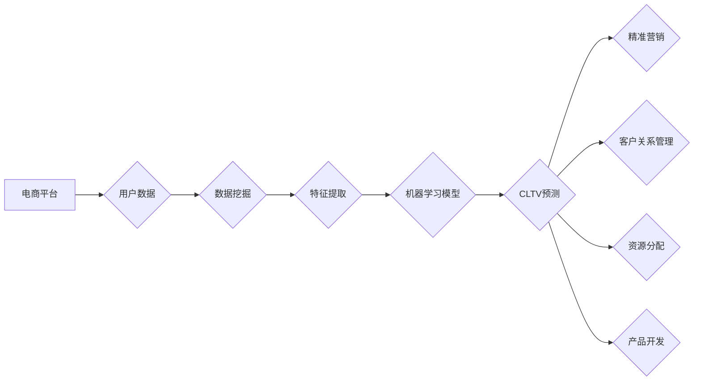

                 

## AI驱动的电商用户生命周期价值预测

> 关键词：电商用户生命周期、价值预测、机器学习、深度学习、时间序列分析、推荐系统、客户关系管理

## 1. 背景介绍

在当今数据爆炸的时代，电商平台拥有海量用户数据，这些数据蕴藏着丰富的商业价值。用户生命周期价值 (Customer Lifetime Value，CLTV) 是衡量用户在整个生命周期内为企业带来的总价值的关键指标。准确预测用户CLTV对于电商平台的运营至关重要，因为它可以帮助企业：

* **精准营销:**  针对不同价值的用户群制定个性化的营销策略，提高营销效率和回报率。
* **客户关系管理:**  识别高价值用户，提供更优质的服务，提升用户忠诚度和复购率。
* **资源分配:**  优化资源分配，将更多资源投入到高价值用户的获取和维护上。
* **产品开发:**  了解用户需求，开发更符合用户偏好的产品和服务。

传统的CLTV预测方法主要依赖于用户历史行为数据和简单的统计模型，难以捕捉用户行为的复杂性和动态性。随着人工智能技术的快速发展，机器学习和深度学习算法为电商用户CLTV预测提供了新的思路和方法。

## 2. 核心概念与联系

### 2.1 用户生命周期

用户生命周期是指用户从首次接触电商平台到最终离线整个过程，可以分为以下几个阶段：

* **获取阶段:** 用户首次访问电商平台，注册账号。
* **活跃阶段:** 用户进行浏览、搜索、下单等行为，与平台进行互动。
* **忠诚阶段:** 用户形成购买习惯，成为平台的忠实用户。
* **流失阶段:** 用户停止使用平台，不再进行任何消费行为。

### 2.2 价值预测

价值预测是指根据用户历史行为数据和特征，预测用户在未来一段时间内为企业带来的价值。

### 2.3 AI驱动的预测

人工智能技术可以帮助电商平台更准确地预测用户CLTV，主要通过以下方式：

* **数据挖掘:**  从海量用户数据中挖掘出潜在的价值特征。
* **机器学习:**  利用机器学习算法，建立用户CLTV预测模型。
* **深度学习:**  利用深度学习算法，捕捉用户行为的复杂性和动态性。

**核心概念与联系流程图:**



## 3. 核心算法原理 & 具体操作步骤

### 3.1 算法原理概述

常用的AI驱动的电商用户CLTV预测算法包括：

* **线性回归:**  一种简单的线性模型，可以预测用户未来消费金额。
* **逻辑回归:**  一种分类模型，可以预测用户是否会流失。
* **决策树:**  一种树形结构的模型，可以根据用户特征进行分类和预测。
* **支持向量机:**  一种基于核函数的模型，可以处理高维数据。
* **神经网络:**  一种模拟人脑神经网络的模型，可以学习复杂的数据模式。

### 3.2 算法步骤详解

以线性回归为例，详细说明CLTV预测的具体操作步骤：

1. **数据收集:** 收集用户历史行为数据，包括购买记录、浏览记录、评价记录等。
2. **数据预处理:** 对数据进行清洗、转换和特征工程，例如将购买时间转换为购买频率、将商品价格转换为购买金额等。
3. **模型训练:** 使用线性回归算法对预处理后的数据进行训练，建立用户CLTV预测模型。
4. **模型评估:** 使用测试数据对模型进行评估，例如计算模型的准确率、召回率等指标。
5. **模型部署:** 将训练好的模型部署到线上环境，用于预测新用户的CLTV。

### 3.3 算法优缺点

**线性回归:**

* **优点:**  简单易懂，计算速度快。
* **缺点:**  假设数据服从线性关系，难以捕捉复杂的数据模式。

**其他算法:**

* 决策树、支持向量机和神经网络等算法可以更好地捕捉复杂的数据模式，但计算复杂度更高。

### 3.4 算法应用领域

* **电商平台:**  预测用户CLTV，进行精准营销和客户关系管理。
* **金融机构:**  预测客户的信用风险和贷款违约率。
* **医疗机构:**  预测患者的疾病风险和治疗效果。

## 4. 数学模型和公式 & 详细讲解 & 举例说明

### 4.1 数学模型构建

**线性回归模型:**

$$
CLTV = \beta_0 + \beta_1 * Age + \beta_2 * Income + \beta_3 * PurchaseFrequency + \epsilon
$$

其中:

* $CLTV$ 是用户生命周期价值。
* $\beta_0$, $\beta_1$, $\beta_2$, $\beta_3$ 是模型参数，需要通过训练数据进行估计。
* $Age$ 是用户的年龄。
* $Income$ 是用户的收入。
* $PurchaseFrequency$ 是用户的购买频率。
* $\epsilon$ 是误差项。

### 4.2 公式推导过程

线性回归模型的目的是找到一条直线，使得预测值与实际值之间的误差最小。可以使用最小二乘法来估计模型参数。

### 4.3 案例分析与讲解

假设我们有一个电商平台的用户数据，包含用户的年龄、收入、购买频率和CLTV。我们可以使用线性回归模型来预测用户的CLTV。

例如，假设我们训练了一个线性回归模型，模型参数如下:

* $\beta_0 = 100$
* $\beta_1 = 5$
* $\beta_2 = 2$
* $\beta_3 = 10$

这意味着，对于一个年龄为30岁，收入为50000元，购买频率为10次的用户的CLTV预测值为:

$$
CLTV = 100 + 5 * 30 + 2 * 50000 + 10 * 10 = 100 + 150 + 100000 + 100 = 102250
$$

## 5. 项目实践：代码实例和详细解释说明

### 5.1 开发环境搭建

* Python 3.x
* scikit-learn 机器学习库
* pandas 数据处理库
* matplotlib 数据可视化库

### 5.2 源代码详细实现

```python
import pandas as pd
from sklearn.linear_model import LinearRegression
from sklearn.model_selection import train_test_split

# 加载用户数据
data = pd.read_csv('user_data.csv')

# 选择特征和目标变量
features = ['Age', 'Income', 'PurchaseFrequency']
target = 'CLTV'

# 将数据分为训练集和测试集
X_train, X_test, y_train, y_test = train_test_split(data[features], data[target], test_size=0.2)

# 创建线性回归模型
model = LinearRegression()

# 训练模型
model.fit(X_train, y_train)

# 预测测试集的CLTV
y_pred = model.predict(X_test)

# 评估模型性能
from sklearn.metrics import mean_squared_error
mse = mean_squared_error(y_test, y_pred)
print('模型均方误差:', mse)
```

### 5.3 代码解读与分析

* 首先，我们加载用户数据，选择特征和目标变量。
* 然后，我们将数据分为训练集和测试集，用于训练和评估模型。
* 创建线性回归模型，并使用训练数据进行训练。
* 训练完成后，我们可以使用模型预测测试集的CLTV。
* 最后，我们使用均方误差来评估模型的性能。

### 5.4 运行结果展示

运行代码后，会输出模型的均方误差值。均方误差值越小，模型的预测精度越高。

## 6. 实际应用场景

### 6.1 精准营销

电商平台可以根据用户CLTV预测结果，对不同用户群进行精准营销。例如，高价值用户可以获得更优惠的折扣和更个性化的推荐，而低价值用户可以获得一些引导式营销，例如推荐一些入门级的产品或服务。

### 6.2 客户关系管理

电商平台可以根据用户CLTV预测结果，对用户进行分级管理，为不同等级的用户提供不同的服务和体验。例如，高价值用户可以获得VIP服务，享受优先配送、专属客服等权益。

### 6.3 资源分配

电商平台可以根据用户CLTV预测结果，优化资源分配，将更多资源投入到高价值用户的获取和维护上。例如，可以增加对高价值用户的广告投放，提高对高价值用户的服务质量。

### 6.4 未来应用展望

随着人工智能技术的不断发展，电商用户CLTV预测的应用场景将会更加广泛，例如：

* **个性化推荐:**  根据用户CLTV预测结果，为用户提供更个性化的商品推荐。
* **用户画像:**  结合用户行为数据和CLTV预测结果，构建更精准的用户画像。
* **风险控制:**  预测用户流失风险，采取措施降低流失率。

## 7. 工具和资源推荐

### 7.1 学习资源推荐

* **书籍:**
    * 《Python机器学习》
    * 《深度学习》
* **在线课程:**
    * Coursera: 机器学习
    * edX: 深度学习
* **博客:**
    * Towards Data Science
    * Machine Learning Mastery

### 7.2 开发工具推荐

* **Python:**  一个开源的编程语言，广泛应用于数据科学和机器学习领域。
* **scikit-learn:**  一个开源的机器学习库，提供各种机器学习算法和工具。
* **pandas:**  一个开源的数据处理库，用于数据清洗、转换和分析。
* **matplotlib:**  一个开源的数据可视化库，用于生成各种图表和图形。

### 7.3 相关论文推荐

* **《Customer Lifetime Value Prediction Using Machine Learning》**
* **《Deep Learning for Customer Lifetime Value Prediction》**

## 8. 总结：未来发展趋势与挑战

### 8.1 研究成果总结

AI驱动的电商用户CLTV预测取得了显著的成果，能够帮助电商平台更精准地预测用户价值，提高运营效率。

### 8.2 未来发展趋势

* **模型复杂度提升:**  利用更复杂的深度学习模型，捕捉用户行为的更深层特征。
* **多模态数据融合:**  融合文本、图像、视频等多模态数据，构建更全面的用户画像。
* **实时预测:**  利用实时数据流，实现对用户CLTV的实时预测。

### 8.3 面临的挑战

* **数据质量:**  高质量的数据是AI模型训练的基础，数据清洗和预处理工作非常重要。
* **模型 interpretability:**  深度学习模型的决策过程往往难以解释，如何提高模型的 interpretability 是一个重要的挑战。
* **隐私保护:**  用户数据隐私保护是一个重要的伦理问题，需要采取有效的措施保护用户隐私。

### 8.4 研究展望

未来，AI驱动的电商用户CLTV预测将会更加智能化、个性化和实时化，为电商平台提供更精准的运营决策支持。


## 9. 附录：常见问题与解答

**Q1:  如何选择合适的CLTV预测算法？**

**A1:**  选择合适的CLTV预测算法需要根据具体业务场景和数据特点进行选择。

* 如果数据特征简单，可以使用线性回归等简单模型。
* 如果数据特征复杂，可以使用决策树、支持向量机或神经网络等复杂模型。

**Q2:  如何评估CLTV预测模型的性能？**

**A2:**  常用的评估指标包括均方误差 (MSE)、平均绝对误差 (MAE) 和 R-squared 等。

**Q3:  如何处理缺失数据？**

**A3:**  常用的处理缺失数据的方法包括删除缺失数据、用均值或中位数填充缺失数据、使用机器学习算法进行预测填充等。


作者：禅与计算机程序设计艺术 / Zen and the Art of Computer Programming 
<end_of_turn>

