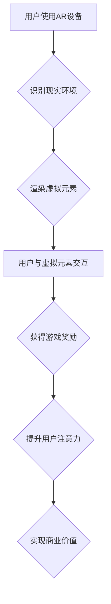

                 

## AR游戏：注意力经济的新形式

> 关键词：增强现实 (AR)、注意力经济、游戏设计、用户体验、深度学习、计算机视觉

## 1. 背景介绍

近年来，移动互联网的普及和智能手机技术的飞速发展，为增强现实 (AR) 技术的应用提供了广阔的舞台。AR技术能够将虚拟信息叠加到现实世界中，为用户提供一种全新的交互体验。游戏作为应用AR技术的热门领域之一，正在经历一场深刻的变革。传统的2D游戏和3D游戏已经无法满足用户日益增长的对沉浸式体验的需求，而AR游戏凭借其独特的特性，正在成为下一代游戏体验的趋势。

注意力经济是当今数字时代的一个重要概念，指的是在信息爆炸的时代，人们对信息的获取和处理能力有限，而注意力成为了稀缺的资源。AR游戏作为一种新型的互动娱乐方式，能够有效地吸引用户的注意力，并通过游戏机制引导用户进行特定行为，从而实现商业价值。

## 2. 核心概念与联系

### 2.1 AR游戏核心概念

AR游戏是指利用增强现实技术，将虚拟元素叠加到现实世界中，为用户提供一种沉浸式游戏体验的游戏。AR游戏通常需要结合移动设备、传感器和摄像头等硬件设备，通过识别现实环境并对虚拟元素进行定位和渲染，实现虚拟与现实的融合。

### 2.2 注意力经济核心概念

注意力经济是指在信息爆炸的时代，人们对信息的获取和处理能力有限，而注意力成为了稀缺的资源。注意力经济的核心在于如何有效地吸引和引导用户的注意力，并将其转化为商业价值。

### 2.3 AR游戏与注意力经济的联系

AR游戏能够有效地吸引用户的注意力，并通过游戏机制引导用户进行特定行为，从而实现商业价值。

* **沉浸式体验:** AR游戏能够将虚拟元素叠加到现实世界中，为用户提供一种全新的沉浸式体验，从而吸引用户的注意力。
* **互动性:** AR游戏通常具有较强的互动性，用户可以通过与虚拟元素进行交互来获得乐趣，从而提高用户的参与度和注意力。
* **个性化:** AR游戏可以根据用户的喜好和行为进行个性化定制，从而提高用户的粘性和注意力。
* **激励机制:** AR游戏通常采用各种激励机制，例如积分、奖励、排行榜等，来引导用户进行特定行为，从而提高用户的注意力和参与度。

**Mermaid 流程图**



## 3. 核心算法原理 & 具体操作步骤

### 3.1 算法原理概述

AR游戏的核心算法主要包括以下几个方面：

* **环境识别:** 利用计算机视觉技术识别现实环境中的物体和场景，为虚拟元素的定位和渲染提供基础。
* **虚拟元素渲染:** 根据环境识别结果，将虚拟元素渲染到现实世界中，并使其与现实环境融合。
* **用户交互:** 识别用户的手势和动作，并将其转化为虚拟元素的操作指令。
* **游戏逻辑:** 根据用户交互和游戏规则，控制虚拟元素的行为和游戏进程。

### 3.2 算法步骤详解

1. **环境识别:** 利用摄像头采集现实环境图像，并通过深度学习算法进行图像识别和场景理解。
2. **虚拟元素定位:** 根据环境识别结果，确定虚拟元素在现实世界中的位置和方向。
3. **虚拟元素渲染:** 利用图形渲染技术将虚拟元素渲染到现实世界中，并使其与现实环境融合。
4. **用户交互:** 识别用户的手势和动作，并将其转化为虚拟元素的操作指令。
5. **游戏逻辑:** 根据用户交互和游戏规则，控制虚拟元素的行为和游戏进程。

### 3.3 算法优缺点

**优点:**

* **沉浸式体验:** AR游戏能够将虚拟元素叠加到现实世界中，为用户提供一种全新的沉浸式体验。
* **互动性:** AR游戏通常具有较强的互动性，用户可以通过与虚拟元素进行交互来获得乐趣。
* **个性化:** AR游戏可以根据用户的喜好和行为进行个性化定制。

**缺点:**

* **技术复杂:** AR游戏的开发需要结合多种技术，例如计算机视觉、图形渲染、深度学习等，技术难度较高。
* **硬件限制:** AR游戏需要结合移动设备、传感器和摄像头等硬件设备，硬件性能限制了游戏的体验。
* **用户体验:** 部分用户可能对AR游戏的体验感到不适，例如晕动症等。

### 3.4 算法应用领域

AR游戏算法的应用领域非常广泛，包括：

* **娱乐游戏:** AR游戏能够为用户提供全新的游戏体验，例如Pokemon GO、Ingress等。
* **教育培训:** AR游戏能够将抽象的知识点转化为生动的虚拟场景，提高用户的学习兴趣和理解能力。
* **商业营销:** AR游戏能够为用户提供互动式的营销体验，例如虚拟试衣间、产品展示等。
* **医疗保健:** AR游戏能够辅助医生进行手术操作、帮助患者进行康复训练等。

## 4. 数学模型和公式 & 详细讲解 & 举例说明

### 4.1 数学模型构建

AR游戏中的核心算法通常基于数学模型进行构建，例如：

* **环境识别:** 利用深度学习算法，构建一个将图像特征映射到场景语义的数学模型。
* **虚拟元素定位:** 利用三角测量原理，构建一个将摄像头坐标和虚拟元素坐标映射到现实世界坐标的数学模型。
* **虚拟元素渲染:** 利用投影几何学原理，构建一个将虚拟元素坐标映射到屏幕坐标的数学模型。

### 4.2 公式推导过程

例如，在虚拟元素定位方面，可以使用三角测量原理推导公式：

假设摄像头坐标为 $(x_c, y_c, z_c)$, 虚拟元素在摄像头坐标系中的坐标为 $(x_v, y_v, z_v)$, 则虚拟元素在现实世界中的坐标为 $(x_r, y_r, z_r)$, 可以推导出以下公式：

$$
\begin{aligned}
x_r &= x_c + \frac{x_v \cdot z_c}{z_v} \\
y_r &= y_c + \frac{y_v \cdot z_c}{z_v} \\
z_r &= z_c + z_v
\end{aligned}
$$

### 4.3 案例分析与讲解

例如，在Pokemon GO游戏中，虚拟精灵的定位和渲染就需要利用三角测量原理和投影几何学原理。

当用户打开Pokemon GO应用程序时，摄像头会捕捉到现实环境的图像。然后，应用程序会利用深度学习算法识别图像中的物体和场景，并根据识别结果确定虚拟精灵的位置和方向。最后，应用程序会利用投影几何学原理将虚拟精灵渲染到现实世界中，使其与现实环境融合。

## 5. 项目实践：代码实例和详细解释说明

### 5.1 开发环境搭建

AR游戏开发环境通常需要包含以下软件：

* **移动设备:** 支持AR技术的智能手机或平板电脑。
* **AR开发框架:** 例如ARKit (iOS)、ARCore (Android)。
* **编程语言:** 例如Swift (iOS)、Java/Kotlin (Android)。
* **图形渲染引擎:** 例如Unity、Unreal Engine。

### 5.2 源代码详细实现

以下是一个简单的AR游戏代码示例，使用Unity引擎开发，展示虚拟球体的渲染：

```csharp
using UnityEngine;
using UnityEngine.XR.ARFoundation;
using UnityEngine.XR.ARSubsystems;

public class ARBall : MonoBehaviour
{
    public ARSessionOrigin arSessionOrigin;
    public GameObject ballPrefab;

    private void Start()
    {
        // 监听AR会话的启动事件
        arSessionOrigin.session.started += SessionStarted;
    }

    private void SessionStarted(ARSessionEventArgs args)
    {
        // 在AR会话启动后创建虚拟球体
        Instantiate(ballPrefab, Vector3.zero, Quaternion.identity);
    }
}
```

### 5.3 代码解读与分析

* `ARSessionOrigin`：AR会话的根节点，用于管理AR会话的配置和状态。
* `ballPrefab`：虚拟球体的预制体。
* `Start()`：在脚本启动时调用，监听AR会话的启动事件。
* `SessionStarted()`：当AR会话启动时调用，创建虚拟球体并将其放置在世界坐标系原点。

### 5.4 运行结果展示

当运行此代码时，在AR设备的摄像头画面中，将出现一个虚拟球体，并随着用户的移动而移动。

## 6. 实际应用场景

### 6.1 教育培训

AR游戏可以将抽象的知识点转化为生动的虚拟场景，例如，学生可以通过AR游戏学习人体解剖结构，或者模拟进行化学实验。

### 6.2 商业营销

AR游戏可以为用户提供互动式的营销体验，例如，用户可以通过AR游戏试穿虚拟服装，或者参观虚拟产品展示厅。

### 6.3 旅游景点

AR游戏可以为游客提供沉浸式的旅游体验，例如，用户可以通过AR游戏参观虚拟古迹，或者体验虚拟文化活动。

### 6.4 未来应用展望

AR游戏在未来将会有更广泛的应用场景，例如：

* **医疗保健:** AR游戏可以辅助医生进行手术操作，帮助患者进行康复训练。
* **工业制造:** AR游戏可以帮助工人进行虚拟培训，提高工作效率。
* **城市规划:** AR游戏可以帮助城市规划者进行虚拟模拟，优化城市布局。

## 7. 工具和资源推荐

### 7.1 学习资源推荐

* **ARKit官方文档:** https://developer.apple.com/documentation/arkit
* **ARCore官方文档:** https://developers.google.com/ar/develop/
* **Unity AR Foundation:** https://docs.unity3d.com/Packages/com.unity.xr.arfoundation@latest/manual/index.html
* **Unreal Engine AR:** https://docs.unrealengine.com/5.0/en-US/ar-development/

### 7.2 开发工具推荐

* **Unity:** https://unity.com/
* **Unreal Engine:** https://www.unrealengine.com/
* **Vuforia:** https://developer.vuforia.com/
* **ARToolKit:** https://www.artoolkit.org/

### 7.3 相关论文推荐

* **A Survey of Augmented Reality (AR) Applications in Education:** https://ieeexplore.ieee.org/document/8803272
* **ARKit: A Platform for Augmented Reality on iOS:** https://developer.apple.com/documentation/arkit/arkit_a_platform_for_augmented_reality_on_ios
* **ARCore: A Platform for Augmented Reality on Android:** https://developers.google.com/ar/develop/

## 8. 总结：未来发展趋势与挑战

### 8.1 研究成果总结

AR游戏技术近年来取得了长足的进步，从早期简单的虚拟叠加到如今的沉浸式体验，AR游戏已经成为一种重要的互动娱乐方式。

### 8.2 未来发展趋势

* **更逼真的虚拟体验:** 未来AR游戏将更加注重虚拟世界的逼真度，例如，利用更先进的渲染技术、更精细的模型和更真实的物理模拟。
* **更智能的交互方式:** 未来AR游戏将更加智能化，例如，利用自然语言处理、语音识别和手势识别等技术，实现更自然的交互方式。
* **更丰富的应用场景:** 未来AR游戏将应用于更多领域，例如，教育培训、商业营销、医疗保健等。

### 8.3 面临的挑战

* **技术难题:** AR游戏开发需要结合多种技术，例如计算机视觉、图形渲染、深度学习等，技术难度较高。
* **硬件限制:** AR游戏需要结合移动设备、传感器和摄像头等硬件设备，硬件性能限制了游戏的体验。
* **用户体验:** 部分用户可能对AR游戏的体验感到不适，例如晕动症等。

### 8.4 研究展望

未来AR游戏研究将继续探索以下方向：

* **更先进的AR技术:** 研究更先进的AR技术，例如，光场成像、全息投影等，以实现更逼真的虚拟体验。
* **更智能的交互方式:** 研究更智能的交互方式，例如，脑机接口、虚拟现实等，以实现更自然的交互体验。
* **更广泛的应用场景:** 探索AR游戏的更多应用场景，例如，教育培训、商业营销、医疗保健等，以提高AR游戏的社会价值。

## 9. 附录：常见问题与解答

### 9.1 AR游戏与VR游戏的区别

AR游戏将虚拟元素叠加到现实世界中，用户可以与现实世界进行交互，而VR游戏则将用户沉浸在一个完全虚拟的环境中，用户无法与现实世界进行交互。

### 9.2 AR游戏开发需要哪些技能

AR游戏开发需要掌握以下技能：

* 编程语言 (例如C#, Java, Python)
* 3D建模和动画
* 计算机视觉
* 图形渲染
* AR开发框架 (例如ARKit, ARCore)

### 9.3 AR游戏有哪些应用场景

AR游戏应用场景非常广泛，包括：

* 娱乐游戏
* 教育培训
* 商业营销
* 旅游景点
* 医疗保健
* 工业制造

### 9.4 AR游戏有哪些发展趋势

AR游戏的发展趋势包括：

* 更逼真的虚拟体验
* 更智能的交互方式
* 更丰富的应用场景

### 9.5 AR游戏有哪些挑战

AR游戏面临的挑战包括：

* 技术难题
* 硬件限制
* 用户体验

作者：禅与计算机程序设计艺术 / Zen and the Art of Computer Programming


<end_of_turn>

