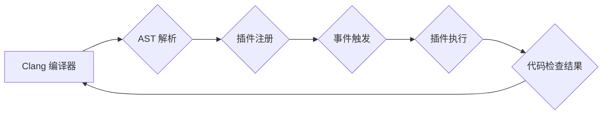

                 

## Clang插件开发与代码检查

> 关键词：Clang, 插件开发, 代码检查, 静态分析, LLVM, AST, 编程语言

## 1. 背景介绍

在现代软件开发中，代码质量至关重要。高质量的代码不仅易于维护和扩展，还能降低软件缺陷的风险。为了提高代码质量，静态代码分析工具应运而生。这些工具能够在编译之前分析源代码，识别潜在的错误、漏洞和风格问题。

Clang，作为 LLVM 项目的一部分，是一个开源的、高性能的 C、C++ 和 Objective-C 编译器前端。它拥有强大的抽象语法树 (AST) 解析能力和丰富的插件接口，使得开发自定义代码检查工具成为可能。

Clang 插件开发为软件开发人员提供了强大的工具，可以定制化代码检查规则，针对特定项目或语言规范进行分析，从而提高代码质量和开发效率。

## 2. 核心概念与联系

### 2.1 Clang 插件架构

Clang 插件是一个独立的程序，通过与 Clang 编译器进行通信，扩展其功能。Clang 插件主要通过以下几个关键组件与 Clang 互动：

* **AST（抽象语法树）:** Clang 将源代码解析为 AST，这是一个树状结构，代表了代码的语法和语义。插件可以遍历和分析 AST，识别代码中的特定模式或结构。
* **工具链接口:** Clang 提供了一套工具链接口，允许插件访问编译器状态、源文件信息和 AST 数据。
* **事件机制:** Clang 的事件机制允许插件注册回调函数，在编译过程中特定事件发生时执行自定义代码。例如，插件可以注册在 AST 解析完成后的回调函数，对解析后的 AST 进行分析。

### 2.2 插件开发流程

Clang 插件开发流程通常包括以下步骤：

1. **选择开发语言:** Clang 插件可以以 C、C++ 或 Objective-C 开发。
2. **学习 Clang 插件 API:** 熟悉 Clang 插件 API，了解如何与 Clang 编译器进行通信和访问 AST 数据。
3. **编写插件代码:** 根据需要编写插件代码，实现自定义的代码检查规则。
4. **测试插件:** 使用测试用例验证插件的正确性。
5. **集成到编译流程:** 将插件集成到 Clang 编译器中，使其能够在编译过程中执行。

### 2.3 Mermaid 流程图



## 3. 核心算法原理 & 具体操作步骤

### 3.1 算法原理概述

Clang 插件的代码检查算法通常基于以下原理：

* **模式匹配:** 插件可以定义一系列模式，用于匹配代码中的特定结构或语法。例如，可以定义一个模式来匹配所有未初始化的变量。
* **语义分析:** 插件可以利用 AST 的语义信息，进行更深入的代码分析。例如，可以分析函数调用链，识别潜在的循环依赖。
* **规则引擎:** 插件可以定义一组规则，用于检查代码是否符合特定规范。例如，可以定义一个规则来检查代码中的命名约定是否一致。

### 3.2 算法步骤详解

1. **AST 解析:** Clang 将源代码解析为 AST，插件可以访问 AST 的所有节点和属性。
2. **模式匹配:** 插件根据定义的模式，遍历 AST，识别符合模式的代码片段。
3. **语义分析:** 插件利用 AST 的语义信息，对匹配到的代码片段进行分析，识别潜在的问题。
4. **规则引擎:** 插件根据定义的规则，检查代码是否符合规范。
5. **报告结果:** 插件将检测到的问题报告给用户，并提供建议。

### 3.3 算法优缺点

**优点:**

* **定制化:** 插件可以根据特定项目或语言规范进行定制化开发。
* **高效:** Clang 的 AST 解析能力使得插件能够高效地分析代码。
* **可扩展:** Clang 插件 API 非常灵活，可以扩展插件的功能。

**缺点:**

* **开发复杂度:** 开发高质量的 Clang 插件需要一定的编程经验和对 Clang 编译器的了解。
* **维护成本:** 插件需要随着代码库的变化进行维护，以确保其有效性。

### 3.4 算法应用领域

* **代码质量检查:** 识别潜在的错误、漏洞和风格问题。
* **代码规范验证:** 确保代码符合特定规范。
* **代码重构:** 自动化代码重构任务。
* **代码生成:** 根据特定规则自动生成代码。

## 4. 数学模型和公式 & 详细讲解 & 举例说明

### 4.1 数学模型构建

在代码检查领域，数学模型常用于描述代码结构、语义关系和潜在问题。例如，可以使用图论模型来表示代码中的函数调用关系，识别循环依赖。可以使用逻辑公式来描述代码规范，例如，检查变量是否被正确初始化。

### 4.2 公式推导过程

假设我们想要检测代码中是否存在未初始化的变量。我们可以使用以下逻辑公式来描述这个规则：

$$
\forall x \in Variables: \text{initialized}(x) \implies \text{used}(x)
$$

其中：

* $x$ 代表一个变量。
* $\text{initialized}(x)$ 表示变量 $x$ 是否被初始化。
* $\text{used}(x)$ 表示变量 $x$ 是否被使用。

这个公式表示，如果一个变量被初始化，那么它必须被使用。

### 4.3 案例分析与讲解

例如，以下代码片段存在未初始化变量的问题：

```c
int main() {
  int x;
  printf("%d\n", x);
  return 0;
}
```

在这个代码片段中，变量 $x$ 没有被初始化，但它被打印输出。根据上述逻辑公式，这个代码片段违反了代码规范。

## 5. 项目实践：代码实例和详细解释说明

### 5.1 开发环境搭建

为了开发 Clang 插件，需要安装 Clang 编译器和相关工具。具体步骤可以参考 Clang 官方文档。

### 5.2 源代码详细实现

以下是一个简单的 Clang 插件示例，用于检测代码中未初始化的变量：

```c
#include "clang/ASTMatchers/ASTMatchFinder.h"
#include "clang/ASTMatchers/ASTMatchers.h"
#include "clang/Tooling/Tooling.h"
#include "clang/Tooling/Refactoring.h"

using namespace clang;
using namespace clang::ast_matchers;

class UninitializedVariableChecker : public MatchFinder::MatchCallback {
public:
  void run(const MatchFinder::MatchResult &Result) {
    const VarDecl *varDecl = Result.Nodes.getNodeAs<VarDecl>(0);
    if (varDecl->isLocalVarDecl()) {
      if (!varDecl->hasInit()) {
        SourceLocation loc = varDecl->getLocation();
        Result.Diagnostics.Report(loc, "Uninitialized variable detected: " + varDecl->getNameAsString());
      }
    }
  }
};

int main(int argc, const char **argv) {
  clang::tooling::ToolingTool tool;
  tool.addMatchCallback(new UninitializedVariableChecker());
  return tool.run(argc, argv);
}
```

### 5.3 代码解读与分析

这个插件使用 `ASTMatchFinder` 和 `ASTMatchers` 来匹配未初始化的变量。

* `UninitializedVariableChecker` 类继承自 `MatchFinder::MatchCallback`，并重写了 `run` 方法。
* `run` 方法接收一个 `MatchResult` 对象，该对象包含匹配到的 AST 节点。
* 插件首先获取匹配到的变量声明节点 (`VarDecl`)。
* 然后，它检查变量是否为局部变量 (`isLocalVarDecl()`)。
* 最后，它检查变量是否被初始化 (`hasInit()`)。如果变量没有被初始化，则插件报告一个错误。

### 5.4 运行结果展示

当运行这个插件时，它会检测到代码中的未初始化变量，并报告一个错误信息。

## 6. 实际应用场景

Clang 插件可以应用于各种实际场景，例如：

* **代码审查:** 自动化代码审查流程，识别潜在的问题。
* **代码生成:** 根据特定规则自动生成代码，例如，生成测试用例。
* **代码重构:** 自动化代码重构任务，例如，提取公共代码块。
* **代码文档生成:** 自动生成代码文档，例如，生成 API 文档。

### 6.4 未来应用展望

随着 Clang 插件生态的不断发展，未来 Clang 插件将有更广泛的应用场景，例如：

* **人工智能辅助开发:** 使用人工智能技术，自动生成更智能的代码检查规则。
* **跨语言代码分析:** 开发跨语言的 Clang 插件，对不同语言的代码进行统一分析。
* **云原生代码分析:** 开发针对云原生应用的 Clang 插件，识别云原生特有问题。

## 7. 工具和资源推荐

### 7.1 学习资源推荐

* **Clang 官方文档:** https://clang.llvm.org/docs/
* **Clang 插件开发指南:** https://clang.llvm.org/docs/Plugins.html
* **LLVM 开发者社区:** https://llvm.org/community/

### 7.2 开发工具推荐

* **Clang:** https://clang.llvm.org/
* **LLVM:** https://llvm.org/
* **CMake:** https://cmake.org/

### 7.3 相关论文推荐

* **Clang: A Modular Compiler Infrastructure for the 21st Century:** https://www.usenix.org/system/files/conference/usenixsecurity10/sec10-paper-adve.pdf
* **LLVM Compiler Infrastructure:** https://llvm.org/docs/Introduction.html

## 8. 总结：未来发展趋势与挑战

### 8.1 研究成果总结

Clang 插件开发为软件开发人员提供了强大的工具，可以定制化代码检查规则，提高代码质量和开发效率。

### 8.2 未来发展趋势

未来 Clang 插件将朝着以下方向发展：

* **更智能的代码分析:** 使用人工智能技术，自动生成更智能的代码检查规则。
* **更广泛的应用场景:** 扩展 Clang 插件的应用场景，例如，代码生成、代码重构、代码文档生成等。
* **跨语言代码分析:** 开发跨语言的 Clang 插件，对不同语言的代码进行统一分析。

### 8.3 面临的挑战

Clang 插件开发也面临一些挑战：

* **开发复杂度:** 开发高质量的 Clang 插件需要一定的编程经验和对 Clang 编译器的了解。
* **维护成本:** 插件需要随着代码库的变化进行维护，以确保其有效性。
* **性能优化:** 一些复杂的代码检查规则可能导致性能下降，需要进行性能优化。

### 8.4 研究展望

未来研究方向包括：

* **开发更智能的代码检查规则:** 使用机器学习和深度学习技术，自动生成更智能的代码检查规则。
* **开发跨语言的 Clang 插件:** 扩展 Clang 插件的应用场景，支持对不同语言的代码进行统一分析。
* **提高 Clang 插件的性能:** 开发更高效的代码检查算法，并进行性能优化。

## 9. 附录：常见问题与解答

### 9.1 如何安装 Clang 编译器？

Clang 编译器可以从 LLVM 官方网站下载安装。具体安装步骤可以参考 LLVM 官方文档。

### 9.2 如何编写 Clang 插件？

Clang 插件可以以 C、C++ 或 Objective-C 开发。需要学习 Clang 插件 API 和 AST 解析知识。

### 9.3 如何测试 Clang 插件？

可以使用 Clang 的测试工具来测试 Clang 插件。


作者：禅与计算机程序设计艺术 / Zen and the Art of Computer Programming<end_of_turn>

