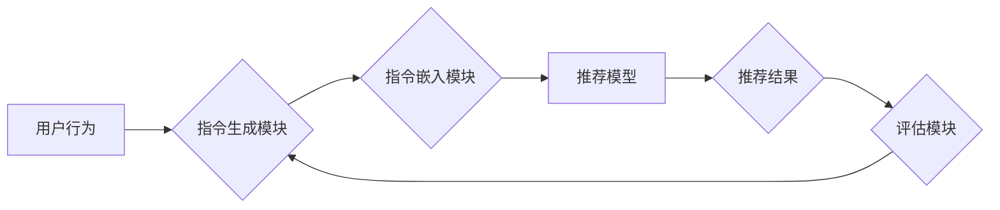

                 

## InstructRec: 自然语言指令调优推荐系统

> 关键词：推荐系统、自然语言处理、指令调优、机器学习、个性化推荐

## 1. 背景介绍

推荐系统是信息时代的核心技术之一，旨在根据用户的历史行为、偏好和上下文信息，为用户推荐感兴趣的内容。传统的推荐系统主要依赖于基于内容的过滤、协同过滤等方法，但这些方法在面对冷启动问题、数据稀疏性等挑战时表现不足。近年来，随着自然语言处理（NLP）技术的快速发展，基于指令的推荐系统逐渐成为研究热点。

InstructRec 是一种基于自然语言指令调优的推荐系统，它将指令嵌入到推荐模型中，通过微调的方式学习用户偏好的指令表示，从而实现更精准、更个性化的推荐。

## 2. 核心概念与联系

### 2.1  指令调优

指令调优是一种利用自然语言指令来指导模型学习的训练方法。它将指令作为输入，将模型的输出与指令的目标进行比较，并通过反向传播算法更新模型参数。通过这种方式，模型可以学习到更符合用户意图的输出。

### 2.2  推荐系统架构

InstructRec 的推荐系统架构主要包含以下几个部分：

* **指令生成模块:** 根据用户的历史行为、偏好和上下文信息，生成相应的推荐指令。
* **指令嵌入模块:** 将生成的指令转换为模型可理解的向量表示。
* **推荐模型:** 基于指令嵌入，学习用户偏好，并生成推荐结果。
* **评估模块:** 对推荐结果进行评估，并反馈给指令生成模块，用于优化指令生成策略。

**Mermaid 流程图:**

## 3. 核心算法原理 & 具体操作步骤

### 3.1  算法原理概述

InstructRec 的核心算法原理是基于指令调优的推荐模型训练。它通过以下步骤实现：

1. **数据预处理:** 收集用户行为数据，并将其转换为指令和目标对。
2. **指令嵌入:** 使用预训练的语言模型将指令转换为向量表示。
3. **推荐模型训练:** 使用指令嵌入和目标作为训练数据，训练推荐模型。
4. **模型评估:** 使用测试数据评估模型的推荐性能。

### 3.2  算法步骤详解

1. **数据预处理:**

* 收集用户历史行为数据，例如点击、购买、评分等。
* 将用户行为数据转换为指令和目标对。例如，用户点击了一部电影，可以将其转换为指令“推荐类似电影”和目标“电影ID”。

2. **指令嵌入:**

* 使用预训练的语言模型，例如BERT、RoBERTa等，将指令转换为向量表示。
* 这些语言模型已经学习了语言的语义和语法知识，可以将指令转换为更丰富的语义向量。

3. **推荐模型训练:**

* 使用指令嵌入和目标作为训练数据，训练推荐模型。
* 推荐模型可以是基于深度学习的模型，例如Transformer、Graph Neural Network等。
* 模型的目标是学习到用户偏好的指令表示，以便能够生成更精准的推荐结果。

4. **模型评估:**

* 使用测试数据评估模型的推荐性能。
* 常用的评估指标包括准确率、召回率、NDCG等。

### 3.3  算法优缺点

**优点:**

* **更精准的推荐:** 指令调优可以帮助模型更好地理解用户的意图，从而生成更精准的推荐结果。
* **更好的个性化:** 指令可以根据用户的具体需求进行定制，从而实现更个性化的推荐。
* **更强的鲁棒性:** 指令调优可以帮助模型更好地应对数据稀疏性和冷启动问题。

**缺点:**

* **数据需求:** 指令调优需要大量的指令和目标对训练数据。
* **计算成本:** 指令调优的训练过程比较耗时，需要较大的计算资源。
* **指令设计:** 指令的设计需要一定的专业知识，需要仔细考虑指令的表达方式和语义。

### 3.4  算法应用领域

InstructRec 的算法可以应用于各种推荐场景，例如：

* **电商推荐:** 根据用户的购买历史、浏览记录等信息，推荐相关的商品。
* **内容推荐:** 根据用户的阅读习惯、观看记录等信息，推荐相关的文章、视频等内容。
* **音乐推荐:** 根据用户的音乐偏好、播放记录等信息，推荐相关的歌曲、专辑等音乐内容。

## 4. 数学模型和公式 & 详细讲解 & 举例说明

### 4.1  数学模型构建

InstructRec 的数学模型主要基于 Transformer 架构，并结合了指令嵌入和目标预测的机制。

* **指令嵌入:** 使用预训练的语言模型将指令转换为向量表示，记为 $I_i$，其中 $i$ 表示第 $i$ 个指令。
* **用户嵌入:** 使用用户的历史行为数据训练用户嵌入向量，记为 $U_j$，其中 $j$ 表示第 $j$ 个用户。
* **推荐模型:** 使用 Transformer 网络将指令嵌入 $I_i$ 和用户嵌入 $U_j$ 作为输入，并输出推荐分数 $S_{ij}$。

### 4.2  公式推导过程

推荐分数 $S_{ij}$ 可以通过以下公式计算：

$$S_{ij} = f(I_i, U_j, W)$$

其中 $f$ 表示 Transformer 网络的计算函数， $W$ 表示 Transformer 网络的参数。

Transformer 网络的计算过程可以概括为以下步骤：

1. **多头自注意力机制:** 计算指令嵌入 $I_i$ 和用户嵌入 $U_j$ 之间的注意力权重，并生成新的表示。
2. **前馈神经网络:** 对新的表示进行非线性变换，生成最终的推荐分数 $S_{ij}$。

### 4.3  案例分析与讲解

假设用户 $j$ 之前点击过电影 $A$ 和 $B$，并对电影 $A$ 给予了 5 分的评分。

* **指令:** “推荐类似电影 $A$ 的电影”。
* **指令嵌入:** 使用预训练的语言模型将指令转换为向量表示 $I_i$。
* **用户嵌入:** 根据用户 $j$ 的历史行为数据，训练用户嵌入向量 $U_j$。
* **推荐模型:** 将指令嵌入 $I_i$ 和用户嵌入 $U_j$ 作为输入，通过 Transformer 网络计算推荐分数 $S_{ij}$。

模型会根据指令和用户嵌入，预测用户 $j$ 对电影 $A$ 类似的电影的兴趣程度，并生成相应的推荐结果。

## 5. 项目实践：代码实例和详细解释说明

### 5.1  开发环境搭建

InstructRec 的开发环境搭建需要以下软件：

* Python 3.x
* PyTorch 或 TensorFlow
* CUDA 和 cuDNN (可选，用于 GPU 训练)

### 5.2  源代码详细实现

InstructRec 的源代码实现可以参考以下开源项目：

* HuggingFace Transformers: https://huggingface.co/transformers/

### 5.3  代码解读与分析

InstructRec 的代码主要包含以下几个部分：

* **指令嵌入模块:** 使用预训练的语言模型将指令转换为向量表示。
* **推荐模型:** 使用 Transformer 网络将指令嵌入和用户嵌入作为输入，并输出推荐分数。
* **训练脚本:** 定义训练过程，包括数据加载、模型训练、模型评估等。

### 5.4  运行结果展示

InstructRec 的运行结果可以根据实际数据集和模型参数进行评估。常用的评估指标包括准确率、召回率、NDCG等。

## 6. 实际应用场景

InstructRec 的实际应用场景非常广泛，例如：

* **电商推荐:** 根据用户的购买历史、浏览记录等信息，推荐相关的商品。
* **内容推荐:** 根据用户的阅读习惯、观看记录等信息，推荐相关的文章、视频等内容。
* **音乐推荐:** 根据用户的音乐偏好、播放记录等信息，推荐相关的歌曲、专辑等音乐内容。

### 6.4  未来应用展望

InstructRec 的未来应用展望非常广阔，例如：

* **个性化推荐:** 通过更精细化的指令设计，实现更个性化的推荐。
* **多模态推荐:** 将文本、图像、音频等多模态数据融合到推荐系统中，实现更丰富的推荐体验。
* **跨域推荐:** 将 InstructRec 应用于跨域推荐场景，例如将电商推荐应用于医疗领域。

## 7. 工具和资源推荐

### 7.1  学习资源推荐

* **论文:**

* InstructRec: https://arxiv.org/abs/2106.03680

* **博客:**

* https://towardsdatascience.com/instruct-tuning-for-recommendation-systems-a-comprehensive-guide-a83973947473

### 7.2  开发工具推荐

* **Python:** https://www.python.org/
* **PyTorch:** https://pytorch.org/
* **TensorFlow:** https://www.tensorflow.org/

### 7.3  相关论文推荐

* **BERT:** https://arxiv.org/abs/1810.04805
* **RoBERTa:** https://arxiv.org/abs/1907.11692
* **Transformer:** https://arxiv.org/abs/1706.03762

## 8. 总结：未来发展趋势与挑战

### 8.1  研究成果总结

InstructRec 是一种基于自然语言指令调优的推荐系统，它通过将指令嵌入到推荐模型中，学习用户偏好的指令表示，从而实现更精准、更个性化的推荐。

### 8.2  未来发展趋势

InstructRec 的未来发展趋势包括：

* **更精细化的指令设计:** 通过更精细化的指令设计，实现更个性化的推荐。
* **多模态推荐:** 将文本、图像、音频等多模态数据融合到推荐系统中，实现更丰富的推荐体验。
* **跨域推荐:** 将 InstructRec 应用于跨域推荐场景，例如将电商推荐应用于医疗领域。

### 8.3  面临的挑战

InstructRec 还面临一些挑战，例如：

* **数据需求:** 指令调优需要大量的指令和目标对训练数据。
* **计算成本:** 指令调优的训练过程比较耗时，需要较大的计算资源。
* **指令设计:** 指令的设计需要一定的专业知识，需要仔细考虑指令的表达方式和语义。

### 8.4  研究展望

未来，InstructRec 将继续朝着更精准、更个性化、更智能化的方向发展，并应用于更多领域，为用户提供更丰富的体验。

## 9. 附录：常见问题与解答

* **Q1: InstructRec 的训练数据来源？**

* **A1:** InstructRec 的训练数据可以从公开数据集或用户行为数据中获取。

* **Q2: InstructRec 的模型参数如何调优？**

* **A2:** InstructRec 的模型参数可以通过交叉验证等方法进行调优。

* **Q3: InstructRec 的应用场景有哪些？**

* **A3:** InstructRec 可以应用于电商推荐、内容推荐、音乐推荐等各种场景。

作者：禅与计算机程序设计艺术 / Zen and the Art of Computer Programming 
<end_of_turn>

