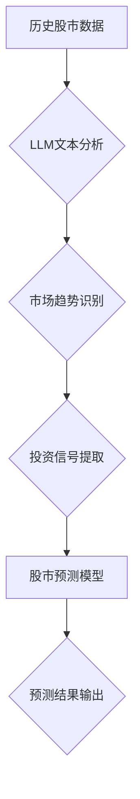

                 

## LLM在智能股市预测中的潜在贡献

> 关键词：LLM, 智能股市预测, 自然语言处理, 时间序列分析, 股票市场, 机器学习, 深度学习

## 1. 背景介绍

股市预测一直是金融领域研究的热点问题，其复杂性和不确定性使得传统预测方法难以有效应对。近年来，随着深度学习和自然语言处理（NLP）技术的快速发展，基于人工智能（AI）的股市预测方法逐渐崭露头角，展现出巨大的潜力。

大型语言模型（LLM）作为NLP领域的新兴技术，凭借其强大的文本理解和生成能力，在股市预测中展现出独特的优势。LLM能够从海量金融文本数据中提取关键信息，识别市场趋势和投资信号，为投资者提供更精准、更全面的预测分析。

## 2. 核心概念与联系

### 2.1  LLM概述

大型语言模型（LLM）是一种基于深度学习的Transformer网络架构，通过训练海量文本数据，学习语言的语法、语义和上下文关系。LLM能够理解和生成人类语言，并具备强大的文本处理能力，例如文本分类、文本摘要、机器翻译等。

### 2.2  股市预测概述

股市预测是指利用历史数据、市场分析和预测模型，预测未来股票价格走势的活动。传统的股市预测方法主要依赖于技术指标、基本面分析和专家意见，但这些方法往往受限于数据量、模型复杂性和预测精度。

### 2.3  LLM与股市预测的联系

LLM能够从海量金融文本数据中提取关键信息，例如公司财务报表、新闻报道、市场评论等，并识别市场趋势和投资信号。这些信息可以作为股市预测模型的输入，提高预测的准确性和有效性。

**Mermaid 流程图**



## 3. 核心算法原理 & 具体操作步骤

### 3.1  算法原理概述

LLM在股市预测中的核心算法原理是基于Transformer网络架构的文本理解和生成能力。通过训练海量金融文本数据，LLM能够学习语言的语法、语义和上下文关系，并识别市场趋势和投资信号。

### 3.2  算法步骤详解

1. **数据收集与预处理:** 收集历史股市数据、公司财务报表、新闻报道、市场评论等金融文本数据，并进行清洗、格式化和标注等预处理工作。
2. **LLM模型训练:** 使用预处理后的金融文本数据训练LLM模型，例如GPT-3、BERT等。训练过程中，LLM模型会学习语言的语法、语义和上下文关系。
3. **文本分析与特征提取:** 将新的金融文本数据输入到训练好的LLM模型中，利用模型的文本理解能力提取关键信息，例如公司财务状况、市场情绪、行业趋势等。
4. **市场趋势识别:** 基于提取的特征信息，利用机器学习算法，例如支持向量机、随机森林等，识别市场趋势和投资信号。
5. **股市预测模型构建:** 将市场趋势和投资信号作为输入，构建股市预测模型，例如ARIMA、LSTM等，预测未来股票价格走势。
6. **预测结果输出:** 输出预测结果，并进行可视化展示，帮助投资者做出决策。

### 3.3  算法优缺点

**优点:**

* 能够从海量金融文本数据中提取关键信息，识别市场趋势和投资信号。
* 预测结果更加精准、全面，能够提供更深入的市场洞察。
* 能够适应不断变化的市场环境，并及时更新预测模型。

**缺点:**

* 训练LLM模型需要大量的计算资源和时间。
* 预测结果仍然存在一定的误差，需要结合其他分析方法进行验证。
* 缺乏对未来不可预测事件的处理能力。

### 3.4  算法应用领域

* 股票投资预测
* 基金管理
* 风险管理
* 资产配置
* 金融市场分析

## 4. 数学模型和公式 & 详细讲解 & 举例说明

### 4.1  数学模型构建

在股市预测中，常用的数学模型包括时间序列模型、回归模型和神经网络模型。

* **时间序列模型:** 用于预测时间序列数据，例如股票价格、交易量等。常用的时间序列模型包括ARIMA、SARIMA、GARCH等。

* **回归模型:** 用于建立变量之间的关系，例如预测股票价格与公司财务指标之间的关系。常用的回归模型包括线性回归、逻辑回归、支持向量机等。

* **神经网络模型:** 用于学习复杂的数据关系，例如预测股票价格的LSTM、GRU等。

### 4.2  公式推导过程

**ARIMA模型**

ARIMA模型是一种常用的时间序列模型，其核心公式如下：

$$
y_t = c + \phi_1 y_{t-1} + \phi_2 y_{t-2} + ... + \phi_p y_{t-p} + \theta_1 \epsilon_{t-1} + \theta_2 \epsilon_{t-2} + ... + \theta_q \epsilon_{t-q} + \epsilon_t
$$

其中：

* $y_t$ 表示时间t的观测值
* $c$ 表示截距项
* $\phi_i$ 表示自回归系数
* $p$ 表示自回归阶数
* $\theta_i$ 表示移动平均系数
* $q$ 表示移动平均阶数
* $\epsilon_t$ 表示白噪声误差项

**LSTM模型**

LSTM模型是一种特殊的循环神经网络，其核心公式涉及门控机制，用于控制信息的流动和遗忘。

### 4.3  案例分析与讲解

**案例:** 使用ARIMA模型预测某股票未来价格走势。

**步骤:**

1. 收集该股票的历史价格数据。
2. 使用ARIMA模型进行参数估计，确定模型的阶数p和q。
3. 将估计的参数代入ARIMA模型公式，预测未来股票价格。
4. 将预测结果与实际价格进行比较，评估模型的预测精度。

## 5. 项目实践：代码实例和详细解释说明

### 5.1  开发环境搭建

* Python 3.7+
* TensorFlow/PyTorch
* Numpy
* Pandas
* Matplotlib

### 5.2  源代码详细实现

```python
# 导入必要的库
import numpy as np
from sklearn.preprocessing import MinMaxScaler
from tensorflow.keras.models import Sequential
from tensorflow.keras.layers import LSTM, Dense

# 数据加载和预处理
# ...

# 数据划分
train_data, test_data = train_test_split(data, test_size=0.2)

# 数据规范化
scaler = MinMaxScaler(feature_range=(0, 1))
train_data = scaler.fit_transform(train_data)
test_data = scaler.transform(test_data)

# 数据转换
def create_dataset(dataset, look_back=1):
    X, Y = [], []
    for i in range(len(dataset)-look_back-1):
        a = dataset[i:(i+look_back), 0]
        X.append(a)
        Y.append(dataset[i + look_back, 0])
    return np.array(X), np.array(Y)

look_back = 10
X_train, Y_train = create_dataset(train_data, look_back)
X_test, Y_test = create_dataset(test_data, look_back)

# 模型构建
model = Sequential()
model.add(LSTM(units=50, return_sequences=True, input_shape=(X_train.shape[1], 1)))
model.add(LSTM(units=50))
model.add(Dense(1))

# 模型训练
model.compile(loss='mean_squared_error', optimizer='adam')
model.fit(X_train, Y_train, epochs=100, batch_size=32)

# 模型评估
# ...

# 预测
# ...
```

### 5.3  代码解读与分析

* 代码首先导入必要的库，然后加载和预处理数据。
* 数据被划分为训练集和测试集，并进行规范化处理。
* 使用`create_dataset`函数将数据转换为适合LSTM模型的格式。
* 构建LSTM模型，并使用均方误差损失函数和Adam优化器进行训练。
* 训练完成后，评估模型的性能，并使用模型进行预测。

### 5.4  运行结果展示

* 运行结果展示包括模型的训练曲线、测试集的预测结果以及预测结果的可视化展示。

## 6. 实际应用场景

### 6.1  股票投资预测

LLM可以帮助投资者识别市场趋势和投资信号，预测股票价格走势，从而做出更明智的投资决策。

### 6.2  基金管理

LLM可以帮助基金经理分析市场数据，识别投资机会，并优化基金组合，提高基金收益率。

### 6.3  风险管理

LLM可以帮助金融机构识别市场风险，评估投资组合的风险敞口，并制定风险管理策略。

### 6.4  未来应用展望

LLM在股市预测领域的应用前景广阔，未来可能在以下方面得到进一步发展：

* **更精准的预测:** 随着LLM模型的不断改进和训练数据量的增加，预测结果将更加精准。
* **更全面的分析:** LLM能够从更丰富的金融数据中提取信息，提供更全面的市场分析。
* **个性化投资建议:** LLM可以根据用户的投资目标和风险偏好，提供个性化的投资建议。

## 7. 工具和资源推荐

### 7.1  学习资源推荐

* **书籍:**
    * 《深度学习》
    * 《自然语言处理》
    * 《机器学习实战》
* **在线课程:**
    * Coursera
    * edX
    * Udacity

### 7.2  开发工具推荐

* **Python:** 
    * TensorFlow
    * PyTorch
    * Keras
* **数据处理工具:**
    * Pandas
    * NumPy

### 7.3  相关论文推荐

* **Attention Is All You Need**
* **BERT: Pre-training of Deep Bidirectional Transformers for Language Understanding**
* **Long Short-Term Memory**

## 8. 总结：未来发展趋势与挑战

### 8.1  研究成果总结

LLM在股市预测领域展现出巨大的潜力，能够从海量金融文本数据中提取关键信息，识别市场趋势和投资信号，为投资者提供更精准、更全面的预测分析。

### 8.2  未来发展趋势

* **模型性能提升:** 随着LLM模型的不断改进和训练数据量的增加，预测结果将更加精准。
* **数据融合:** 将LLM与其他数据源，例如财务数据、宏观经济数据等进行融合，提高预测的准确性和有效性。
* **解释性增强:** 研究LLM预测结果的解释性，帮助投资者理解模型的决策逻辑。

### 8.3  面临的挑战

* **数据质量:** LLM模型的性能依赖于高质量的训练数据，而金融文本数据往往存在噪声和不完整性。
* **模型 interpretability:** LLM模型的决策逻辑往往难以解释，这使得投资者难以信任模型的预测结果。
* **监管挑战:** LLM在金融领域的应用需要遵守相关法律法规，并应对监管机构的审查。

### 8.4  研究展望

未来，LLM在股市预测领域的应用将继续深入发展，并与其他人工智能技术相结合，例如强化学习、图神经网络等，构建更智能、更可靠的股市预测系统。

## 9. 附录：常见问题与解答

* **Q1: LLM在股市预测中有什么优势？**

* **A1:** LLM能够从海量金融文本数据中提取关键信息，识别市场趋势和投资信号，并提供更精准、更全面的预测分析。

* **Q2: LLM在股市预测中有哪些局限性？**

* **A2:** LLM的预测结果仍然存在一定的误差，并且缺乏对未来不可预测事件的处理能力。

* **Q3: 如何评估LLM在股市预测中的性能？**

* **A3:** 可以使用均方误差、平均绝对误差等指标评估LLM在股市预测中的性能。

* **Q4: LLM在股市预测中的应用有哪些伦理问题？**

* **A4:** LLM的应用需要遵守相关法律法规，并避免被用于操纵市场或欺诈投资者。


作者：禅与计算机程序设计艺术 / Zen and the Art of Computer Programming 
<end_of_turn>

