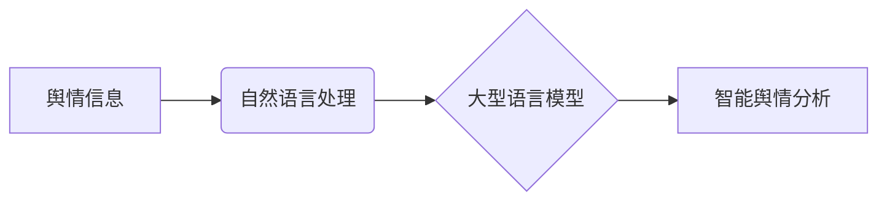

                 

## LLM在智能舆情分析中的潜力

> 关键词：大型语言模型（LLM）、舆情分析、自然语言处理（NLP）、文本分类、情感分析、趋势预测、机器学习、深度学习

## 1. 背景介绍

在当今信息爆炸的时代，舆情信息瞬息万变，其规模和复杂性呈指数级增长。传统的人工舆情分析方法面临着效率低下、成本高昂、难以捕捉细微变化等挑战。而大型语言模型（LLM）的出现为智能舆情分析带来了新的机遇。

LLM 是一种基于深度学习的强大人工智能模型，能够理解和生成人类语言。其强大的文本处理能力、语义理解能力和知识表示能力使其在舆情分析领域展现出巨大的潜力。

## 2. 核心概念与联系

### 2.1 舆情分析

舆情分析是指通过收集、整理、分析和挖掘网络、媒体等渠道上的舆情信息，以了解公众对特定事件、人物、组织或产品的态度和情绪，并预测未来舆情发展趋势。

### 2.2 自然语言处理（NLP）

自然语言处理（NLP）是人工智能领域的一个重要分支，旨在使计算机能够理解、处理和生成人类语言。NLP技术在舆情分析中扮演着至关重要的角色，例如文本分类、情感分析、主题提取等。

### 2.3 大型语言模型（LLM）

大型语言模型（LLM）是一种基于深度学习的强大人工智能模型，通过训练海量文本数据，能够掌握丰富的语言知识和模式。LLM 拥有强大的文本生成、翻译、摘要、问答等能力，并可用于各种自然语言处理任务，包括舆情分析。

**核心概念与联系流程图**



## 3. 核心算法原理 & 具体操作步骤

### 3.1 算法原理概述

LLM 在舆情分析中的核心算法原理主要基于以下几个方面：

* **文本分类:** 利用 LLM 的语义理解能力，对舆情文本进行分类，例如判断文本的主题、情感倾向、事件类型等。
* **情感分析:** 分析文本中表达的情感倾向，例如正面、负面、中性等，从而了解公众对特定事件或人物的评价。
* **主题提取:** 从大量舆情文本中提取出主要话题和关键词，帮助用户快速了解舆情热点和趋势。
* **趋势预测:** 基于历史舆情数据和 LLMs 的学习能力，预测未来舆情发展趋势，为决策者提供预警和建议。

### 3.2 算法步骤详解

以文本分类为例，LLM 在舆情分析中的具体操作步骤如下：

1. **数据预处理:** 对舆情文本进行清洗、去停用词、分词等预处理操作，以便于 LLMs 的理解和分析。
2. **特征提取:** 利用 NLP 技术，从预处理后的文本中提取特征，例如词频、词向量、语法结构等。
3. **模型训练:** 使用 LLM 模型，对提取的特征进行训练，学习不同类别舆情文本的特征分布。
4. **模型评估:** 使用测试数据集评估模型的分类准确率、召回率等指标，并进行调优。
5. **文本分类:** 将新来的舆情文本输入到训练好的模型中，预测其所属类别。

### 3.3 算法优缺点

**优点:**

* **高准确率:** LLM 拥有强大的语义理解能力，能够准确识别舆情文本的类别和情感倾向。
* **自动化程度高:** LLM 可以自动完成文本分类、情感分析等任务，提高效率和降低成本。
* **可扩展性强:** LLM 可以根据需要扩展训练数据和模型规模，提升分析能力。

**缺点:**

* **数据依赖性强:** LLM 的性能取决于训练数据的质量和数量。
* **计算资源需求高:** 训练大型语言模型需要大量的计算资源和时间。
* **解释性弱:** LLM 的决策过程较为复杂，难以解释其分类结果背后的逻辑。

### 3.4 算法应用领域

LLM 在舆情分析领域的应用领域非常广泛，例如：

* **品牌监控:** 监测品牌在网络上的舆情，及时发现负面评论和潜在危机。
* **竞选分析:** 分析候选人或政党在网络上的舆情，了解公众对其的支持度和态度。
* **市场调研:** 通过分析舆情数据，了解消费者对产品或服务的评价和需求。
* **危机公关:** 在危机发生时，利用 LLMs 分析舆情，制定有效的应对策略。

## 4. 数学模型和公式 & 详细讲解 & 举例说明

### 4.1 数学模型构建

在文本分类任务中，LLM 通常采用 softmax 函数构建概率模型，预测文本属于不同类别的概率。

假设我们有 N 个类别，文本向量为 x，模型参数为 W，则 softmax 函数的公式如下：

$$
P(y|x,W) = \frac{exp(W_y^Tx)}{ \sum_{i=1}^{N} exp(W_i^Tx)}
$$

其中：

* $P(y|x,W)$ 表示文本 x 属于类别 y 的概率。
* $W_y$ 表示类别 y 的模型参数向量。
* $W_i$ 表示类别 i 的模型参数向量。

### 4.2 公式推导过程

softmax 函数的推导过程基于指数函数的性质和概率分布的归一化条件。

1. 指数函数将每个类别的得分转换为正值，并放大差异。
2. 分母归一化所有类别的得分，使其总和为 1，满足概率分布的条件。

### 4.3 案例分析与讲解

假设我们有一个文本分类任务，需要将文本分类为“正面”、“负面”和“中性”三种类别。

训练好的 LLM 模型的参数向量分别为 $W_{正面}$, $W_{负面}$ 和 $W_{中性}$。

当输入一个文本向量 x 时，模型会计算出三个类别的得分：

* $score_{正面} = W_{正面}^Tx$
* $score_{负面} = W_{负面}^Tx$
* $score_{中性} = W_{中性}^Tx$

然后，将这些得分输入到 softmax 函数中，得到三个类别的概率：

* $P(正面|x,W) = \frac{exp(score_{正面})}{exp(score_{正面}) + exp(score_{负面}) + exp(score_{中性})}$
* $P(负面|x,W) = \frac{exp(score_{负面})}{exp(score_{正面}) + exp(score_{负面}) + exp(score_{中性})}$
* $P(中性|x,W) = \frac{exp(score_{中性})}{exp(score_{正面}) + exp(score_{负面}) + exp(score_{中性})}$

模型会选择概率最高的类别作为文本的最终分类结果。

## 5. 项目实践：代码实例和详细解释说明

### 5.1 开发环境搭建

* **操作系统:** Ubuntu 20.04 LTS
* **编程语言:** Python 3.8
* **深度学习框架:** TensorFlow 2.x
* **其他依赖:** numpy, pandas, matplotlib等

### 5.2 源代码详细实现

```python
import tensorflow as tf
from tensorflow.keras.layers import Embedding, LSTM, Dense
from tensorflow.keras.models import Sequential

# 数据预处理
# ...

# 模型构建
model = Sequential()
model.add(Embedding(input_dim=vocab_size, output_dim=embedding_dim, input_length=max_length))
model.add(LSTM(units=128))
model.add(Dense(units=num_classes, activation='softmax'))

# 模型编译
model.compile(optimizer='adam', loss='sparse_categorical_crossentropy', metrics=['accuracy'])

# 模型训练
model.fit(x_train, y_train, epochs=10, batch_size=32)

# 模型评估
loss, accuracy = model.evaluate(x_test, y_test)
print('Test Loss:', loss)
print('Test Accuracy:', accuracy)

# 模型预测
predictions = model.predict(x_new)
```

### 5.3 代码解读与分析

* **数据预处理:** 将文本数据转换为数字向量，例如使用词嵌入技术将单词映射到向量空间。
* **模型构建:** 使用 LSTM 网络作为文本分类模型，其能够捕捉文本序列中的长距离依赖关系。
* **模型编译:** 选择优化器、损失函数和评估指标。
* **模型训练:** 使用训练数据训练模型，并根据评估指标进行调优。
* **模型评估:** 使用测试数据评估模型的性能。
* **模型预测:** 将新文本输入到训练好的模型中，预测其类别。

### 5.4 运行结果展示

运行代码后，可以得到模型的训练损失、测试准确率等指标，以及对新文本的分类结果。

## 6. 实际应用场景

### 6.1 品牌监控

利用 LLM 分析品牌在社交媒体、论坛等平台上的舆情，及时发现负面评论和潜在危机，并制定相应的应对策略。例如，可以监测品牌名称、产品名称、竞争对手名称等关键词，并分析用户对这些关键词的评价和情绪。

### 6.2 竞选分析

在选举期间，LLM 可以分析候选人或政党在网络上的舆情，了解公众对其的支持度和态度，并预测选举结果。例如，可以分析候选人的政策、言论、形象等方面的舆情，并根据用户的评价和情绪进行分析。

### 6.3 市场调研

LLM 可以分析消费者对产品或服务的评价和需求，为企业提供市场调研数据。例如，可以分析用户对产品的功能、价格、设计等方面的评价，并根据用户的需求进行产品改进。

### 6.4 未来应用展望

随着 LLM 技术的不断发展，其在舆情分析领域的应用场景将更加广泛，例如：

* **个性化舆情分析:** 根据用户的兴趣和偏好，提供个性化的舆情信息和分析。
* **实时舆情监测:** 利用实时数据流，进行实时舆情监测和预警。
* **跨语言舆情分析:** 实现跨语言的舆情分析，了解不同语言环境下的舆情趋势。

## 7. 工具和资源推荐

### 7.1 学习资源推荐

* **书籍:**
    * 《深度学习》 by Ian Goodfellow, Yoshua Bengio, Aaron Courville
    * 《自然语言处理》 by Dan Jurafsky, James H. Martin
* **在线课程:**
    * Coursera: Natural Language Processing Specialization
    * edX: Deep Learning
* **博客和网站:**
    * TensorFlow Blog: https://blog.tensorflow.org/
    * Hugging Face: https://huggingface.co/

### 7.2 开发工具推荐

* **深度学习框架:** TensorFlow, PyTorch, Keras
* **自然语言处理库:** NLTK, spaCy, Gensim
* **数据处理工具:** Pandas, NumPy

### 7.3 相关论文推荐

* **BERT: Pre-training of Deep Bidirectional Transformers for Language Understanding**
* **GPT-3: Language Models are Few-Shot Learners**
* **XLNet: Generalized Autoregressive Pretraining for Language Understanding**

## 8. 总结：未来发展趋势与挑战

### 8.1 研究成果总结

LLM 在舆情分析领域取得了显著的成果，例如提高了文本分类、情感分析和趋势预测的准确率。

### 8.2 未来发展趋势

* **模型规模和能力的提升:** 随着计算资源的不断发展，LLM 的规模和能力将进一步提升，能够处理更复杂的任务。
* **多模态舆情分析:** 将文本、图像、音频等多模态数据融合到 LLM 中，实现更全面的舆情分析。
* **可解释性增强:** 研究更可解释的 LLM 模型，帮助用户理解模型的决策过程。

### 8.3 面临的挑战

* **数据质量和偏见:** LLM 的性能依赖于训练数据的质量和多样性，数据偏见会影响模型的公平性和准确性。
* **计算资源需求:** 训练大型语言模型需要大量的计算资源，这对于资源有限的机构来说是一个挑战。
* **伦理和安全问题:** LLM 的应用可能带来伦理和安全问题，例如信息操纵、隐私泄露等，需要谨慎对待。

### 8.4 研究展望

未来，LLM 在舆情分析领域的应用将更加广泛和深入，需要进一步研究以下问题：

* 如何提高 LLM 的数据效率和泛化能力。
* 如何解决 LLM 的数据偏见和可解释性问题。
* 如何确保 LLM 的安全和伦理使用。


## 9. 附录：常见问题与解答

**Q1: LLM 在舆情分析中有哪些优势？**

A1: LLM 在舆情分析中具有以下优势：

* 高准确率：LLM 能够准确识别舆情文本的类别和情感倾向。
* 自动化程度高：LLM 可以自动完成文本分类、情感分析等任务，提高效率和降低成本。
* 可扩展性强：LLM 可以根据需要扩展训练数据和模型规模，提升分析能力。

**Q2: LLM 在舆情分析中有哪些局限性？**

A2: LLM 在舆情分析中也存在一些局限性：

* 数据依赖性强：LLM 的性能取决于训练数据的质量和数量。
* 计算资源需求高：训练大型语言模型需要大量的计算资源和时间。
* 解释性弱：LLM 的决策过程较为复杂，难以解释其分类结果背后的逻辑。

**Q3: 如何选择合适的 LLM 模型用于舆情分析？**

A3: 选择合适的 LLM 模型需要考虑以下因素：

* 任务类型：不同的任务类型可能需要不同的模型架构。
* 数据规模：模型的规模应该与训练数据的规模相匹配。
* 计算资源：模型的训练和部署需要足够的计算资源。
* 可解释性：如果需要解释模型的决策过程，则需要选择可解释性较强的模型。


作者：禅与计算机程序设计艺术 / Zen and the Art of Computer Programming<end_of_turn>

