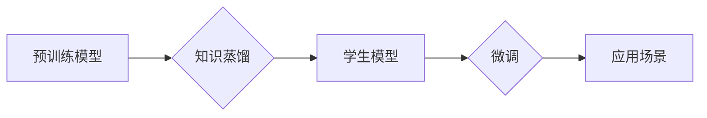

                 

## LLM处理冷启动问题的能力

> 关键词：大型语言模型 (LLM)、冷启动、知识蒸馏、参数效率、微调、联想推理、上下文窗口

## 1. 背景介绍

大型语言模型 (LLM) 在自然语言处理 (NLP) 领域取得了显著的成就，展现出强大的文本生成、翻译、问答和代码生成能力。然而，LLM 的部署往往面临一个关键挑战：**冷启动问题**。冷启动是指模型在首次使用或长时间闲置后，其性能表现不佳，需要一段时间才能达到最佳状态。

冷启动问题主要源于 LLMs 的庞大模型规模和依赖于大量训练数据的特性。在初始阶段，模型缺乏足够的上下文信息和知识积累，导致其生成结果不准确、不流畅，甚至出现逻辑错误。

解决冷启动问题对于 LLMs 的实际应用至关重要。它不仅影响着用户体验，也限制了模型在各种场景下的部署效率。

## 2. 核心概念与联系

**2.1 冷启动问题**

冷启动问题是指大型语言模型在首次使用或长时间闲置后，其性能表现不佳，需要一段时间才能达到最佳状态。

**2.2 知识蒸馏**

知识蒸馏是一种模型压缩技术，旨在将大型模型的知识迁移到小型模型中。通过训练一个学生模型来模仿大型模型的输出，可以有效地降低模型规模，同时保留大部分的性能。

**2.3 参数效率**

参数效率是指模型在训练和推理过程中使用的参数数量。降低模型参数量可以有效地减少计算资源消耗，提高模型部署效率。

**2.4 微调**

微调是指在预训练模型的基础上，使用少量特定领域的训练数据进行进一步训练，以提高模型在特定任务上的性能。

**2.5 联想推理**

联想推理是指模型根据已有的知识和上下文信息，推断出新的信息或关系的能力。

**2.6 上下文窗口**

上下文窗口是指模型在处理文本时，能够同时考虑的词语数量。更大的上下文窗口可以帮助模型更好地理解文本语义，提高生成结果的准确性和流畅度。

**2.7 Mermaid 流程图**



## 3. 核心算法原理 & 具体操作步骤

### 3.1 算法原理概述

LLM 处理冷启动问题的核心算法主要包括知识蒸馏、参数效率优化和微调技术。

* **知识蒸馏:** 将大型预训练模型的知识迁移到小型模型中，降低模型规模，同时保留大部分性能。
* **参数效率优化:** 通过模型压缩、剪枝等技术，减少模型参数量，提高模型部署效率。
* **微调:** 在预训练模型的基础上，使用特定领域的训练数据进行进一步训练，提高模型在特定任务上的性能。

### 3.2 算法步骤详解

1. **预训练模型选择:** 选择一个性能优异的预训练语言模型作为基础。
2. **知识蒸馏:** 使用教师-学生模型的训练方式，训练一个小型学生模型来模仿预训练模型的输出。
3. **参数效率优化:** 对学生模型进行模型压缩、剪枝等操作，降低模型参数量。
4. **微调:** 使用特定领域的训练数据对学生模型进行微调，提高模型在特定任务上的性能。
5. **部署与评估:** 将微调后的学生模型部署到实际应用场景中，并评估其性能表现。

### 3.3 算法优缺点

**优点:**

* 降低模型规模，减少计算资源消耗。
* 保留大部分预训练模型的性能。
* 提高模型部署效率。

**缺点:**

* 知识蒸馏过程需要大量的计算资源。
* 学生模型的性能可能无法完全达到预训练模型的水平。
* 微调过程需要特定领域的训练数据。

### 3.4 算法应用领域

* **移动端应用:** 由于移动设备的资源限制，使用小型高效的 LLMs 可以提高应用的性能和流畅度。
* **嵌入式系统:** 在资源受限的嵌入式系统中，使用参数效率优化的 LLMs 可以实现高效的语音识别、自然语言理解等功能。
* **个性化推荐:** 通过微调 LLMs，可以根据用户的偏好和历史数据进行个性化推荐。

## 4. 数学模型和公式 & 详细讲解 & 举例说明

### 4.1 数学模型构建

知识蒸馏的数学模型通常基于教师模型和学生模型的输出之间的差异。

假设教师模型的输出为 $y_t$，学生模型的输出为 $y_s$，则知识蒸馏的目标函数可以表示为：

$$
L = KL(P_t || P_s) + \lambda L_{CE}(y_t, y_s)
$$

其中：

* $KL$ 表示 KL 散度，用于衡量两个概率分布之间的差异。
* $P_t$ 和 $P_s$ 分别表示教师模型和学生模型的输出概率分布。
* $L_{CE}$ 表示交叉熵损失函数，用于衡量预测结果与真实标签之间的差异。
* $\lambda$ 是一个权重参数，用于平衡 KL 散度和交叉熵损失的贡献。

### 4.2 公式推导过程

KL 散度公式为：

$$
KL(P || Q) = \sum_{x} P(x) \log \frac{P(x)}{Q(x)}
$$

其中：

* $P$ 和 $Q$ 分别表示两个概率分布。

交叉熵损失函数公式为：

$$
L_{CE}(y, \hat{y}) = -\sum_{i} y_i \log \hat{y}_i
$$

其中：

* $y$ 表示真实标签。
* $\hat{y}$ 表示预测结果。

### 4.3 案例分析与讲解

假设我们使用 BERT 预训练模型作为教师模型，训练一个小型 GPT 模型作为学生模型。

在知识蒸馏过程中，我们可以使用教师模型的输出概率分布作为学生模型的监督信号，通过最小化 KL 散度来引导学生模型学习教师模型的知识。同时，我们也可以使用交叉熵损失函数来监督学生模型的输出结果。

通过这种方式，我们可以训练出一个参数效率更高的学生模型，同时保留大部分 BERT 模型的性能。

## 5. 项目实践：代码实例和详细解释说明

### 5.1 开发环境搭建

* Python 3.7+
* PyTorch 1.7+
* Transformers 库

### 5.2 源代码详细实现

```python
import torch
from torch import nn
from transformers import BertModel, GPT2LMHeadModel

# 定义学生模型
class StudentModel(nn.Module):
    def __init__(self, vocab_size, embedding_dim, num_layers, hidden_dim):
        super(StudentModel, self).__init__()
        self.embedding = nn.Embedding(vocab_size, embedding_dim)
        self.lstm = nn.LSTM(embedding_dim, hidden_dim, num_layers, batch_first=True)
        self.fc = nn.Linear(hidden_dim, vocab_size)

    def forward(self, x):
        x = self.embedding(x)
        x, _ = self.lstm(x)
        x = self.fc(x[:, -1, :])
        return x

# 加载预训练模型
teacher_model = BertModel.from_pretrained("bert-base-uncased")
student_model = StudentModel(vocab_size=30522, embedding_dim=768, num_layers=6, hidden_dim=768)

# 定义损失函数和优化器
criterion = nn.CrossEntropyLoss()
optimizer = torch.optim.Adam(student_model.parameters(), lr=1e-5)

# 训练循环
for epoch in range(10):
    # ... 训练代码 ...
    loss = criterion(student_model(x), y)
    optimizer.zero_grad()
    loss.backward()
    optimizer.step()

```

### 5.3 代码解读与分析

* 代码首先定义了一个学生模型，该模型是一个简单的 LSTM 模型。
* 然后加载预训练的 BERT 模型作为教师模型。
* 定义了损失函数和优化器，并开始训练循环。
* 在训练循环中，使用教师模型的输出作为监督信号，训练学生模型。

### 5.4 运行结果展示

训练完成后，可以评估学生模型在特定任务上的性能，例如文本生成、问答等。

## 6. 实际应用场景

### 6.1 个性化推荐

LLMs 可以根据用户的兴趣和偏好，生成个性化的推荐内容，例如商品推荐、电影推荐等。

### 6.2 语音助手

LLMs 可以理解用户的语音指令，并执行相应的操作，例如设置闹钟、播放音乐等。

### 6.3 自动写作

LLMs 可以辅助用户进行写作，例如生成文章标题、段落内容等。

### 6.4 未来应用展望

随着 LLMs 的不断发展，其应用场景将会更加广泛，例如：

* **医疗诊断:** LLMs 可以辅助医生进行疾病诊断，提高诊断准确率。
* **法律服务:** LLMs 可以帮助律师进行法律研究和文件撰写。
* **教育领域:** LLMs 可以作为智能教学助手，提供个性化的学习指导。

## 7. 工具和资源推荐

### 7.1 学习资源推荐

* **Hugging Face Transformers:** https://huggingface.co/docs/transformers/index
* **OpenAI API:** https://beta.openai.com/docs/api-reference/introduction

### 7.2 开发工具推荐

* **PyTorch:** https://pytorch.org/
* **TensorFlow:** https://www.tensorflow.org/

### 7.3 相关论文推荐

* **BERT: Pre-training of Deep Bidirectional Transformers for Language Understanding:** https://arxiv.org/abs/1810.04805
* **GPT-3: Language Models are Few-Shot Learners:** https://arxiv.org/abs/2005.14165

## 8. 总结：未来发展趋势与挑战

### 8.1 研究成果总结

LLMs 在处理冷启动问题方面取得了显著的进展，知识蒸馏、参数效率优化和微调技术为解决这一挑战提供了有效的方法。

### 8.2 未来发展趋势

* **模型压缩:** 研究更有效的模型压缩技术，进一步降低模型规模和计算资源消耗。
* **高效训练:** 开发更有效的训练算法，加速 LLMs 的训练过程。
* **多模态学习:** 将 LLMs 与其他模态数据（例如图像、音频）相结合，实现更全面的知识表示和理解。

### 8.3 面临的挑战

* **数据效率:** LLMs 仍然需要大量的训练数据，如何提高数据利用效率是一个关键挑战。
* **可解释性:** LLMs 的决策过程往往难以解释，如何提高模型的可解释性是一个重要的研究方向。
* **伦理问题:** LLMs 的应用可能带来一些伦理问题，例如偏见、虚假信息传播等，需要引起足够的重视。

### 8.4 研究展望

未来，LLMs 将继续朝着更强大、更智能、更安全的方向发展。

## 9. 附录：常见问题与解答

**Q1: 知识蒸馏的原理是什么？**

A1: 知识蒸馏是一种模型压缩技术，旨在将大型预训练模型的知识迁移到小型模型中。通过训练一个学生模型来模仿大型模型的输出，可以有效地降低模型规模，同时保留大部分的性能。

**Q2: 参数效率优化有哪些方法？**

A2: 参数效率优化的方法包括模型压缩、剪枝、量化等技术。模型压缩是指通过减少模型参数数量来降低模型规模。剪枝是指移除模型中不重要的参数。量化是指将模型参数的精度降低，例如将浮点数转换为整数。

**Q3: 微调的目的是什么？**

A3: 微调是指在预训练模型的基础上，使用特定领域的训练数据进行进一步训练，以提高模型在特定任务上的性能。

**Q4: LLMs 处理冷启动问题有哪些挑战？**

A4: LLMs 处理冷启动问题面临的挑战包括数据效率、可解释性和伦理问题。


作者：禅与计算机程序设计艺术 / Zen and the Art of Computer Programming 
<end_of_turn>

