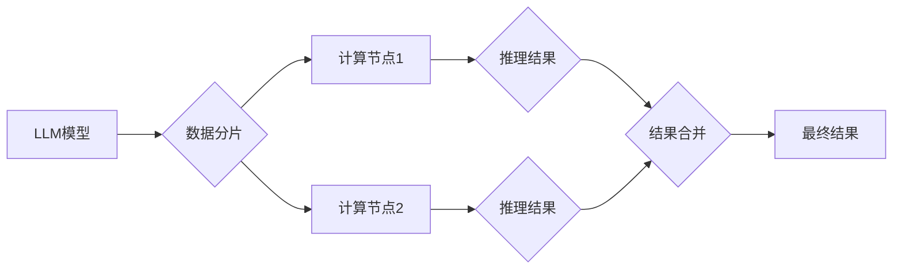

                 

## LLM的分布式推理方法与实践

> 关键词：大型语言模型 (LLM)、分布式推理、并行计算、模型压缩、微服务架构、高效推理

## 1. 背景介绍

大型语言模型 (LLM) 在自然语言处理领域取得了令人瞩目的成就，展现出强大的文本生成、翻译、问答和代码生成能力。然而，LLM 的推理过程通常需要消耗大量的计算资源和时间，这限制了其在实际应用中的部署和扩展。分布式推理 emerged as a promising solution to address this challenge by leveraging the power of parallel computing to accelerate LLM inference.

随着硬件技术的进步和云计算的普及，分布式计算逐渐成为主流，为 LLMs 的高效推理提供了强大的支持。分布式推理通过将模型参数和数据分布到多个计算节点上，并行执行推理计算，从而显著提高推理速度和吞吐量。

## 2. 核心概念与联系

### 2.1  分布式推理

分布式推理是指将一个大型机器学习模型的推理过程分解成多个子任务，并分别在不同的计算节点上执行。这些节点可以是独立的服务器、云计算实例或数据中心，通过网络进行通信和数据共享。

### 2.2  并行计算

并行计算是指同时使用多个处理器或计算单元来执行任务，以加速计算速度。分布式推理本质上是一种并行计算技术，通过将模型和数据分布到多个节点上，充分利用了并行计算的优势。

### 2.3  微服务架构

微服务架构是一种将大型应用程序分解成多个小型、独立的服务的架构模式。每个服务负责特定的功能，并通过轻量级的 API 进行通信。微服务架构与分布式推理相结合，可以实现更灵活、可扩展和可维护的 LLM 应用。

**Mermaid 流程图**



## 3. 核心算法原理 & 具体操作步骤

### 3.1  算法原理概述

分布式推理算法的核心思想是将模型参数和数据分布到多个计算节点上，并行执行推理计算。常用的分布式推理算法包括：

* **数据并行:** 将输入数据分割成多个子集，分别在不同的计算节点上进行推理，最后将结果合并。
* **模型并行:** 将模型参数分割到不同的计算节点上，每个节点负责推理一部分数据，最后将结果聚合。
* **混合并行:** 将数据和模型参数同时进行并行化，以进一步提高推理效率。

### 3.2  算法步骤详解

**数据并行推理算法步骤:**

1. 将输入数据分割成多个子集，每个子集的大小取决于计算节点的数量和模型的规模。
2. 将每个数据子集发送到不同的计算节点。
3. 每个计算节点执行模型推理，并生成相应的推理结果。
4. 将所有计算节点的推理结果收集到一起，并进行合并。

**模型并行推理算法步骤:**

1. 将模型参数分割到不同的计算节点上，每个节点负责一部分模型参数。
2. 将输入数据发送到所有计算节点，每个节点根据其负责的参数部分进行推理。
3. 将每个计算节点的推理结果收集到一起，并进行聚合。

### 3.3  算法优缺点

**数据并行:**

* **优点:** 容易实现，对模型结构要求较低。
* **缺点:** 数据冗余，计算节点之间需要进行数据通信，可能会导致通信开销较大。

**模型并行:**

* **优点:** 可以充分利用计算节点的资源，提高推理速度。
* **缺点:** 模型参数分割和通信复杂度较高，对模型结构和硬件资源要求较高。

**混合并行:**

* **优点:** 可以结合数据并行和模型并行的优势，提高推理效率。
* **缺点:** 实现复杂度较高，需要对模型和数据进行合理的分割。

### 3.4  算法应用领域

分布式推理算法广泛应用于各种 LLM 应用场景，例如：

* **聊天机器人:** 分布式推理可以提高聊天机器人的响应速度和处理能力，使其能够更流畅地与用户进行对话。
* **机器翻译:** 分布式推理可以加速机器翻译的推理过程，提高翻译速度和准确性。
* **文本摘要:** 分布式推理可以帮助生成更准确和更完整的文本摘要。
* **代码生成:** 分布式推理可以提高代码生成的速度和效率，帮助开发人员更快地编写代码。

## 4. 数学模型和公式 & 详细讲解 & 举例说明

### 4.1  数学模型构建

分布式推理的数学模型通常基于以下几个关键概念：

* **模型参数分割:** 将模型参数分割成多个子集，每个子集分配到不同的计算节点上。
* **数据分片:** 将输入数据分割成多个子集，每个子集分配到不同的计算节点上进行推理。
* **梯度聚合:** 将各个计算节点上的梯度信息聚合起来，更新全局模型参数。

### 4.2  公式推导过程

假设一个 LLM 模型的参数为 $\theta$, 输入数据为 $x$, 输出为 $y$. 分布式推理的目标是找到最优参数 $\theta$，使得模型输出与真实值 $y^*$ 最接近。

**损失函数:**

$$L(\theta, x, y^*) = ||y - y^*||^2$$

**梯度下降算法:**

$$\theta = \theta - \eta \nabla L(\theta, x, y^*)$$

其中，$\eta$ 是学习率，$\nabla L(\theta, x, y^*)$ 是损失函数关于参数 $\theta$ 的梯度。

在分布式环境下，每个计算节点负责计算一部分梯度信息，然后将这些梯度信息聚合起来更新全局模型参数。

### 4.3  案例分析与讲解

假设一个 LLM 模型有 100 万个参数，需要在 4 个计算节点上进行分布式推理。

* **数据分片:** 将输入数据分割成 4 个子集，每个子集分配到一个计算节点上进行推理。
* **模型参数分割:** 将模型参数分割成 4 个子集，每个子集分配到一个计算节点上。
* **梯度聚合:** 每个计算节点计算其负责参数部分的梯度信息，然后将这些梯度信息发送到一个中央节点进行聚合，最后更新全局模型参数。

通过这种方式，可以利用 4 个计算节点的并行计算能力，显著提高模型训练速度。

## 5. 项目实践：代码实例和详细解释说明

### 5.1  开发环境搭建

* **操作系统:** Linux (Ubuntu 20.04 或更高版本)
* **编程语言:** Python 3.7 或更高版本
* **深度学习框架:** PyTorch 或 TensorFlow
* **分布式计算框架:** Apache Spark 或 Ray

### 5.2  源代码详细实现

以下是一个使用 PyTorch 和 Ray 实现分布式推理的简单代码示例：

```python
import torch
import ray

# 定义一个简单的 LLM 模型
class SimpleLLM(torch.nn.Module):
    def __init__(self):
        super(SimpleLLM, self).__init__()
        self.linear = torch.nn.Linear(10, 1)

    def forward(self, x):
        return self.linear(x)

# 初始化模型和数据
model = SimpleLLM()
data = torch.randn(100, 10)

# 使用 Ray 分布式训练模型
ray.init()
model_actor = ray.remote(SimpleLLM)
# ... (训练代码)

# 使用 Ray 分布式推理模型
result = model_actor.forward(data).compute()
print(result)
```

### 5.3  代码解读与分析

* **Ray.init():** 初始化 Ray 集群。
* **ray.remote(SimpleLLM):** 将模型实例化成一个远程 Actor，以便在分布式环境中执行。
* **model_actor.forward(data).compute():** 将数据发送到远程 Actor 上进行推理，并获取结果。

### 5.4  运行结果展示

运行上述代码后，将输出模型对输入数据的推理结果。

## 6. 实际应用场景

### 6.1  聊天机器人

分布式推理可以提高聊天机器人的响应速度和处理能力，使其能够更流畅地与用户进行对话。例如，在大型在线聊天平台上，分布式推理可以帮助处理数百万用户的并发请求，提供更快速和更准确的对话体验。

### 6.2  机器翻译

分布式推理可以加速机器翻译的推理过程，提高翻译速度和准确性。例如，在实时翻译应用中，分布式推理可以帮助用户更快地理解外语文本，提高翻译效率。

### 6.3  文本摘要

分布式推理可以帮助生成更准确和更完整的文本摘要。例如，在新闻网站或学术期刊上，分布式推理可以帮助用户快速了解文章的主要内容，节省时间和精力。

### 6.4  未来应用展望

随着硬件技术的进步和模型规模的不断增长，分布式推理将在更多领域得到应用，例如：

* **自动驾驶:** 分布式推理可以帮助自动驾驶系统更快地处理传感器数据，提高决策速度和安全性。
* **医疗诊断:** 分布式推理可以帮助医疗诊断系统更快地分析病理图像和患者数据，提高诊断准确率。
* **金融风险管理:** 分布式推理可以帮助金融机构更快地识别和评估风险，提高风险管理效率。

## 7. 工具和资源推荐

### 7.1  学习资源推荐

* **论文:**
    * "Distributed Deep Learning: Challenges and Opportunities"
    * "Parameter Server: A Distributed Machine Learning Architecture"
* **书籍:**
    * "Deep Learning with Python" by Francois Chollet
    * "Distributed Machine Learning with Python" by  A. K. Singh

### 7.2  开发工具推荐

* **Ray:** https://ray.io/
* **Apache Spark:** https://spark.apache.org/
* **Horovod:** https://horovod.ai/

### 7.3  相关论文推荐

* "Scaling Language Modeling with Distributed Training"
* "Efficient Distributed Training of Deep Learning Models"
* "Model Parallelism for Large Language Models"

## 8. 总结：未来发展趋势与挑战

### 8.1  研究成果总结

分布式推理技术在加速 LLM 推理方面取得了显著进展，为 LLM 的实际应用提供了重要的技术支持。

### 8.2  未来发展趋势

* **模型压缩:** 通过模型压缩技术，可以进一步减小模型规模，降低分布式推理的计算成本。
* **异构计算:** 利用 CPU、GPU 和 TPU 等不同类型的计算资源，实现更有效的分布式推理。
* **边缘推理:** 将分布式推理技术部署到边缘设备上，实现更低延迟和更高效率的推理。

### 8.3  面临的挑战

* **模型并行复杂度:** 模型参数分割和通信复杂度较高，需要进一步优化算法和架构。
* **数据并行效率:** 数据冗余和通信开销可能会影响数据并行的效率，需要探索更有效的分布式数据处理方法。
* **硬件资源限制:** 分布式推理需要大量的计算资源，硬件成本和能源消耗仍然是一个挑战。

### 8.4  研究展望

未来研究方向包括：

* 开发更高效的分布式推理算法和架构。
* 探索新的模型压缩技术，降低模型规模和计算成本。
* 研究异构计算和边缘推理的分布式推理方法。


## 9. 附录：常见问题与解答

**Q1: 分布式推理和并行计算有什么区别？**

**A1:** 并行计算是一种更广泛的概念，指的是同时使用多个处理器或计算单元来执行任务。分布式推理是一种特定的并行计算技术，专门用于加速 LLM 推理。

**Q2: 分布式推理有哪些不同的算法？**

**A2:** 常见的分布式推理算法包括数据并行、模型并行和混合并行。

**Q3: 分布式推理有哪些应用场景？**

**A3:** 分布式推理广泛应用于聊天机器人、机器翻译、文本摘要、自动驾驶、医疗诊断等领域。

**Q4: 如何选择合适的分布式推理框架？**

**A4:** 选择合适的分布式推理框架取决于具体的应用场景、模型规模和硬件资源等因素。常见的分布式推理框架包括 Ray、Apache Spark 和 Horovod。

**Q5: 分布式推理有哪些挑战？**

**A5:** 分布式推理面临的挑战包括模型并行复杂度、数据并行效率和硬件资源限制等。


作者：禅与计算机程序设计艺术 / Zen and the Art of Computer Programming 
<end_of_turn>

