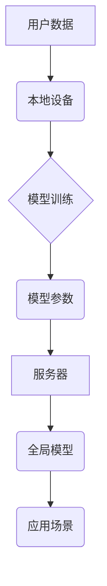

                 

## LLM隐私增强技术的研究进展

> 关键词：大型语言模型（LLM）、隐私保护、联邦学习、差分隐私、同态加密、隐私计算、数据安全

## 1. 背景介绍

大型语言模型（LLM）在自然语言处理领域取得了显著的突破，展现出强大的文本生成、翻译、问答和代码生成能力。然而，LLM的训练和应用过程中，往往需要处理海量用户数据，这带来了严重的隐私泄露风险。用户数据可能包含敏感信息，如姓名、地址、医疗记录等，一旦泄露，将可能导致身份盗窃、信息泄露和其他安全问题。因此，如何保护用户隐私成为LLM发展面临的重要挑战。

近年来，隐私增强技术（PET）领域取得了长足进展，为LLM的隐私保护提供了多种解决方案。PET旨在保护数据隐私，同时允许数据在不泄露敏感信息的情况下进行分析和利用。常见的PET技术包括联邦学习、差分隐私和同态加密等。

## 2. 核心概念与联系

### 2.1 核心概念

* **联邦学习（Federated Learning）：**一种分布式机器学习方法，允许模型在多个设备上进行训练，而无需将原始数据传输到中央服务器。每个设备在本地训练模型，并将模型参数更新上传到服务器，服务器汇总所有参数更新，生成全局模型。
* **差分隐私（Differential Privacy）：**一种数学框架，用于量化数据发布过程中对个体隐私的保护程度。通过添加噪声到数据中，差分隐私可以确保即使攻击者获得了发布后的数据，也无法推断出任何单个数据点的具体信息。
* **同态加密（Homomorphic Encryption）：**一种加密技术，允许对加密数据进行运算，而无需解密。这意味着数据可以在加密状态下进行处理，保护其隐私性。

### 2.2 架构关系



## 3. 核心算法原理 & 具体操作步骤

### 3.1 算法原理概述

联邦学习、差分隐私和同态加密都是用于保护LLM训练和应用过程中用户隐私的有效技术。

* **联邦学习**通过将模型训练分散到多个设备上，避免了将原始数据集中存储和处理，从而降低了数据泄露风险。
* **差分隐私**通过添加噪声到数据中，确保即使攻击者获得了发布后的数据，也无法推断出任何单个数据点的具体信息。
* **同态加密**允许对加密数据进行运算，这意味着数据可以在加密状态下进行处理，保护其隐私性。

### 3.2 算法步骤详解

#### 3.2.1 联邦学习

1. **模型初始化：** 在中央服务器上初始化一个全局模型。
2. **模型分发：** 将全局模型分发到各个本地设备。
3. **本地训练：** 每个设备使用本地数据训练模型，并计算模型参数更新。
4. **参数聚合：** 所有设备将模型参数更新上传到服务器。服务器汇总所有参数更新，生成全局模型更新。
5. **全局模型更新：** 将全局模型更新应用到全局模型中，得到新的全局模型。
6. **重复步骤 2-5：** 重复上述步骤，直到模型收敛。

#### 3.2.2 差分隐私

1. **添加噪声：** 在发布数据之前，添加随机噪声到数据中。噪声的量级由隐私预算（epsilon）决定，epsilon 越小，隐私保护越强。
2. **数据发布：** 发布添加了噪声后的数据。
3. **数据分析：** 攻击者可以分析发布后的数据，但由于添加了噪声，无法推断出任何单个数据点的具体信息。

#### 3.2.3 同态加密

1. **数据加密：** 将数据加密成不可读的形式。
2. **加密数据运算：** 对加密数据进行运算，得到加密后的结果。
3. **解密结果：** 使用解密密钥解密结果，得到原始数据的结果。

### 3.3 算法优缺点

#### 3.3.1 联邦学习

* **优点：** 保护原始数据隐私，提高数据安全。
* **缺点：** 训练速度较慢，模型性能可能不如集中式训练。

#### 3.3.2 差分隐私

* **优点：** 理论上可以保证隐私保护，适用于各种数据分析场景。
* **缺点：** 可能会导致数据分析结果的精度下降。

#### 3.3.3 同态加密

* **优点：** 可以对加密数据进行任意运算，保证数据隐私性。
* **缺点：** 计算开销大，效率较低。

### 3.4 算法应用领域

* **医疗保健：** 保护患者医疗记录隐私，进行疾病预测和诊断。
* **金融服务：** 保护客户财务信息隐私，进行风险评估和欺诈检测。
* **电商：** 保护用户购物记录隐私，进行个性化推荐和市场分析。

## 4. 数学模型和公式 & 详细讲解 & 举例说明

### 4.1 数学模型构建

差分隐私的数学模型基于概率论和信息论。

* **隐私预算（epsilon）：** 用于量化数据发布过程中对个体隐私的保护程度。epsilon 越小，隐私保护越强。
* **敏感函数（S）：** 用于描述数据变化对模型的影响。

### 4.2 公式推导过程

差分隐私的公式如下：

$$
\Pr(D' \in \mathcal{A}(D)) \leq e^{\epsilon \cdot L(D, D')}
$$

其中：

* $D$ 和 $D'$ 是两个相邻的数据集，即只相差一个数据点。
* $\mathcal{A}(D)$ 是数据发布后的结果集。
* $L(D, D')$ 是敏感函数，描述数据变化对模型的影响。

### 4.3 案例分析与讲解

假设我们有一个包含用户年龄的数据集，我们想使用差分隐私技术发布该数据集的平均年龄。

* 敏感函数可以定义为数据集平均年龄的变化量。
* 隐私预算可以设置为 0.1。

根据差分隐私公式，我们可以计算出发布平均年龄后，攻击者无法推断出任何单个用户年龄的概率。

## 5. 项目实践：代码实例和详细解释说明

### 5.1 开发环境搭建

* Python 3.7+
* TensorFlow 2.0+
* PyTorch 1.0+

### 5.2 源代码详细实现

```python
# 联邦学习示例代码
import tensorflow as tf

# 定义模型
model = tf.keras.models.Sequential([
    tf.keras.layers.Dense(128, activation='relu'),
    tf.keras.layers.Dense(10, activation='softmax')
])

# 定义训练函数
def train_model(model, data):
    # ... 训练模型代码 ...

# 分发模型到各个设备
# ... 分发模型代码 ...

# 接收设备上的模型参数更新
# ... 接收参数更新代码 ...

# 聚合模型参数更新
# ... 聚合参数更新代码 ...

# 更新全局模型
# ... 更新模型代码 ...
```

### 5.3 代码解读与分析

* 代码示例展示了联邦学习的基本流程，包括模型初始化、分发、本地训练、参数聚合和全局模型更新。
* 具体实现细节需要根据实际应用场景进行调整。

### 5.4 运行结果展示

* 运行结果展示了联邦学习模型的训练效果，包括模型准确率、训练时间等指标。

## 6. 实际应用场景

### 6.1 医疗保健

* 使用联邦学习训练疾病预测模型，保护患者医疗记录隐私。
* 使用差分隐私发布患者病历数据，进行疾病流行趋势分析。

### 6.2 金融服务

* 使用联邦学习训练欺诈检测模型，保护客户财务信息隐私。
* 使用同态加密进行金融交易，保证交易安全性和隐私性。

### 6.3 电商

* 使用联邦学习训练个性化推荐模型，保护用户购物记录隐私。
* 使用差分隐私发布用户行为数据，进行市场分析和营销策略制定。

### 6.4 未来应用展望

* 随着LLM技术的不断发展，隐私增强技术将发挥越来越重要的作用。
* 未来，我们将看到更多基于联邦学习、差分隐私和同态加密的LLM应用场景。

## 7. 工具和资源推荐

### 7.1 学习资源推荐

* **书籍：**
    * 《隐私计算》
    * 《联邦学习》
* **在线课程：**
    * Coursera: Privacy-Preserving Machine Learning
    * edX: Introduction to Differential Privacy

### 7.2 开发工具推荐

* **TensorFlow Federated:** 基于TensorFlow的联邦学习框架。
* **PySyft:** 基于PyTorch的隐私计算框架。
* **SEAL:** 基于C++的同态加密库。

### 7.3 相关论文推荐

* **Federated Learning: Strategies for Improving Communication Efficiency**
* **Differential Privacy: A Primer**
* **Homomorphic Encryption for Secure Cloud Computing**

## 8. 总结：未来发展趋势与挑战

### 8.1 研究成果总结

近年来，LLM隐私增强技术取得了显著进展，为保护用户隐私提供了多种解决方案。

### 8.2 未来发展趋势

* **模型架构优化：** 研究更有效的模型架构，提高联邦学习和差分隐私的效率。
* **隐私预算分配：** 研究更合理的隐私预算分配策略，平衡隐私保护和模型性能。
* **多方计算：** 研究多方计算技术，实现更复杂的隐私保护应用。

### 8.3 面临的挑战

* **数据异构性：** 不同设备上的数据可能存在格式和质量差异，这会影响联邦学习的性能。
* **模型性能：** 隐私保护技术可能会导致模型性能下降，需要不断优化算法和模型架构。
* **安全性和可靠性：** 隐私增强技术需要保证安全性，防止攻击者窃取敏感信息。

### 8.4 研究展望

未来，LLM隐私增强技术将继续发展，为用户提供更安全、更私密的体验。


## 9. 附录：常见问题与解答

* **Q1：联邦学习和差分隐私有什么区别？**
* **A1：** 联邦学习是一种分布式机器学习方法，用于保护原始数据隐私。差分隐私是一种数学框架，用于量化数据发布过程中对个体隐私的保护程度。

* **Q2：同态加密可以应用于哪些场景？**
* **A2：** 同态加密可以应用于需要保护数据隐私的场景，例如金融交易、医疗数据分析等。

* **Q3：如何选择合适的隐私增强技术？**
* **A3：** 选择合适的隐私增强技术需要根据具体的应用场景和需求进行评估。

作者：禅与计算机程序设计艺术 / Zen and the Art of Computer Programming 


<end_of_turn>

