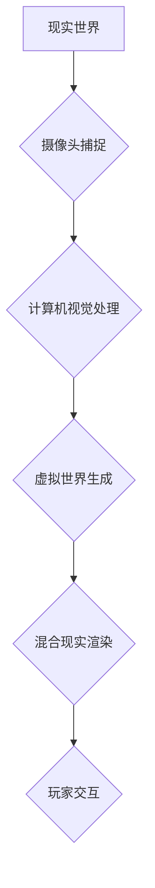

                 

## MR游戏世界构建与交互

> 关键词：增强现实 (AR)、混合现实 (MR)、游戏开发、交互设计、3D建模、计算机视觉、深度学习

## 1. 背景介绍

近年来，增强现实 (AR) 和混合现实 (MR) 技术取得了长足发展，为游戏行业带来了革命性的变革。MR游戏将虚拟元素与现实世界无缝融合，创造出沉浸式、互动性的游戏体验。这种融合不仅改变了游戏的方式，也为教育、培训、娱乐等领域提供了新的可能性。

传统的虚拟现实 (VR) 游戏需要玩家佩戴头显设备，完全沉浸在虚拟世界中。而MR游戏则不同，它利用摄像头、传感器等设备捕捉现实环境信息，并将虚拟元素叠加在现实世界之上。玩家可以与虚拟物体进行交互，体验到虚拟世界与现实世界的融合。

MR游戏的发展离不开以下几个关键技术的进步：

* **3D建模技术:**  MR游戏需要构建逼真的虚拟环境和物体，3D建模技术在其中扮演着至关重要的角色。
* **计算机视觉技术:**  MR游戏需要识别和理解现实世界环境，计算机视觉技术用于捕捉和分析现实场景信息。
* **深度学习技术:**  深度学习技术可以用于优化MR游戏的渲染效果、物体识别和交互体验。

## 2. 核心概念与联系

MR游戏世界构建与交互的核心概念包括：

* **虚拟世界:**  MR游戏中，虚拟世界是指由计算机生成的虚拟环境和物体，它可以与现实世界进行融合。
* **现实世界:**  MR游戏中，现实世界是指玩家所处的真实环境，它会与虚拟世界进行叠加。
* **混合现实:**  MR是指虚拟世界和现实世界融合在一起的体验，它将虚拟元素叠加在现实世界之上，创造出沉浸式的互动体验。
* **交互设计:**  MR游戏需要设计合理的交互方式，让玩家能够自然地与虚拟世界进行互动。

**MR游戏世界构建与交互流程图:**



## 3. 核心算法原理 & 具体操作步骤

### 3.1  算法原理概述

MR游戏世界构建与交互的核心算法包括：

* **场景重建算法:**  用于根据摄像头捕捉到的图像重建虚拟环境的3D模型。
* **物体识别算法:**  用于识别虚拟物体和现实物体，并将其与虚拟环境进行关联。
* **位置跟踪算法:**  用于跟踪玩家的移动和姿态，并更新虚拟物体的位置和姿态。
* **渲染算法:**  用于将虚拟物体渲染到现实世界中，并与现实场景进行融合。

### 3.2  算法步骤详解

**场景重建算法:**

1. **图像预处理:**  对摄像头捕捉到的图像进行预处理，例如去除噪声、校正颜色等。
2. **特征提取:**  从预处理后的图像中提取特征点，例如角点、边缘等。
3. **特征匹配:**  匹配图像中的特征点，构建场景的3D点云。
4. **点云重建:**  根据点云数据重建场景的3D模型。

**物体识别算法:**

1. **物体检测:**  利用深度学习模型检测图像中的物体，并确定物体的边界框。
2. **物体分类:**  根据物体的特征，将物体分类到不同的类别。
3. **物体跟踪:**  跟踪物体在不同帧图像中的位置和姿态。

**位置跟踪算法:**

1. **传感器融合:**  融合来自不同传感器的数据，例如摄像头、陀螺仪、加速度计等。
2. **姿态估计:**  估计玩家的姿态，例如头部方向、身体倾斜等。
3. **位置估计:**  估计玩家的位置，并将其与虚拟世界进行关联。

**渲染算法:**

1. **虚拟物体渲染:**  将虚拟物体渲染成图像。
2. **现实场景渲染:**  将现实场景渲染成图像。
3. **混合渲染:**  将虚拟物体图像与现实场景图像进行混合，生成最终的混合现实图像。

### 3.3  算法优缺点

**场景重建算法:**

* **优点:**  可以重建逼真的虚拟环境。
* **缺点:**  计算量大，实时性较差。

**物体识别算法:**

* **优点:**  可以准确识别物体，并进行分类和跟踪。
* **缺点:**  对环境光线和物体姿态变化敏感。

**位置跟踪算法:**

* **优点:**  可以跟踪玩家的移动和姿态，实现虚拟物体跟随玩家的交互。
* **缺点:**  容易受到环境干扰，精度较低。

**渲染算法:**

* **优点:**  可以将虚拟物体与现实场景无缝融合。
* **缺点:**  对硬件性能要求高，渲染速度较慢。

### 3.4  算法应用领域

MR游戏世界构建与交互算法在以下领域有广泛的应用:

* **游戏开发:**  构建沉浸式的MR游戏体验。
* **教育培训:**  创建互动式的虚拟教学环境。
* **医疗保健:**  进行虚拟手术模拟和远程医疗诊断。
* **工业设计:**  进行虚拟产品设计和测试。

## 4. 数学模型和公式 & 详细讲解 & 举例说明

### 4.1  数学模型构建

MR游戏世界构建与交互的数学模型主要包括：

* **3D空间坐标系:**  用于描述虚拟物体和现实场景的位置和姿态。
* **相机模型:**  用于描述摄像头的内部参数和外部参数，用于将3D空间坐标转换为图像坐标。
* **投影模型:**  用于将3D空间坐标投影到2D图像平面。
* **深度估计模型:**  用于估计物体到摄像头的距离。

### 4.2  公式推导过程

**相机模型:**

相机模型可以表示为：

$$
\mathbf{P} = \mathbf{K} \mathbf{R} \mathbf{T} \mathbf{X}
$$

其中：

* $\mathbf{P}$ 是图像平面上的点坐标。
* $\mathbf{K}$ 是摄像头的内参矩阵。
* $\mathbf{R}$ 是摄像头的旋转矩阵。
* $\mathbf{T}$ 是摄像头的平移矩阵。
* $\mathbf{X}$ 是3D空间中的点坐标。

**投影模型:**

投影模型可以表示为：

$$
\mathbf{p} = \mathbf{P} / P_z
$$

其中：

* $\mathbf{p}$ 是归一化图像平面上的点坐标。
* $P_z$ 是点到摄像头的深度。

### 4.3  案例分析与讲解

假设我们有一个MR游戏场景，其中包含一个虚拟球体。

1. 首先，我们需要使用场景重建算法重建场景的3D模型。
2. 然后，我们需要使用物体识别算法识别虚拟球体。
3. 接下来，我们需要使用位置跟踪算法跟踪玩家的移动和姿态。
4. 最后，我们需要使用渲染算法将虚拟球体渲染到现实世界中，并与现实场景进行融合。

通过以上步骤，我们可以实现一个MR游戏场景，其中玩家可以与虚拟球体进行交互。

## 5. 项目实践：代码实例和详细解释说明

### 5.1  开发环境搭建

MR游戏开发环境通常需要包含以下软件：

* **Unity3D:**  一款流行的游戏引擎，支持MR开发。
* **ARKit/ARCore:**  苹果和谷歌开发的AR平台，用于开发AR应用程序。
* **Visual Studio/Xcode:**  用于编写游戏代码的集成开发环境。

### 5.2  源代码详细实现

以下是一个简单的MR游戏代码示例，使用Unity3D引擎开发，并利用ARKit平台进行AR功能实现：

```csharp
using UnityEngine;
using UnityEngine.XR.ARFoundation;
using UnityEngine.XR.ARSubsystems;

public class ARObjectPlacement : MonoBehaviour
{
    public GameObject arObjectPrefab;
    private ARRaycastManager raycastManager;

    void Start()
    {
        raycastManager = GetComponent<ARRaycastManager>();
    }

    void Update()
    {
        if (Input.touchCount > 0 && Input.GetTouch(0).phase == TouchPhase.Began)
        {
            Touch touch = Input.GetTouch(0);
            if (raycastManager.Raycast(touch.position, out ARHitResult hitResult))
            {
                Vector3 hitPosition = hitResult.pose.position;
                Instantiate(arObjectPrefab, hitPosition, hitResult.pose.rotation);
            }
        }
    }
}
```

### 5.3  代码解读与分析

这段代码实现了一个简单的MR游戏功能，允许玩家在现实世界中放置虚拟物体。

1. `arObjectPrefab` 变量存储虚拟物体的预制体。
2. `raycastManager` 变量获取ARRaycastManager组件，用于进行AR射线投射。
3. `Update()` 函数在每一帧更新中检查玩家触摸事件。
4. 如果玩家触摸屏幕，则使用 `raycastManager.Raycast()` 函数进行AR射线投射，获取触摸点在现实世界中的位置和姿态。
5. 如果射线投射成功，则使用 `Instantiate()` 函数在触摸点位置放置虚拟物体。

### 5.4  运行结果展示

运行这段代码后，玩家可以使用手指触摸屏幕在现实世界中放置虚拟物体。

## 6. 实际应用场景

MR游戏已经开始应用于多个领域，例如：

* **教育:**  MR游戏可以用于创建互动式的虚拟实验室，让学生在安全的环境中进行实验。
* **培训:**  MR游戏可以用于模拟真实的工作场景，帮助员工进行培训和技能提升。
* **娱乐:**  MR游戏可以提供沉浸式的游戏体验，例如虚拟旅游、互动式故事等。
* **医疗:**  MR游戏可以用于进行虚拟手术模拟和远程医疗诊断。

### 6.4  未来应用展望

MR游戏技术的未来发展趋势包括：

* **更逼真的虚拟体验:**  随着硬件性能的提升和算法的改进，MR游戏将能够提供更逼真的虚拟体验。
* **更广泛的应用场景:**  MR游戏将应用于更多领域，例如教育、培训、医疗、工业等。
* **更智能的交互方式:**  MR游戏将支持更智能的交互方式，例如语音控制、手势识别等。

## 7. 工具和资源推荐

### 7.1  学习资源推荐

* **Unity Learn:**  https://learn.unity.com/
* **ARKit Documentation:**  https://developer.apple.com/documentation/arkit
* **ARCore Documentation:**  https://developers.google.com/ar/develop/

### 7.2  开发工具推荐

* **Unity3D:**  https://unity.com/
* **Unreal Engine:**  https://www.unrealengine.com/
* **Vuforia:**  https://developer.vuforia.com/

### 7.3  相关论文推荐

* **A Survey of Augmented Reality (AR) and Mixed Reality (MR) Technologies:**  https://ieeexplore.ieee.org/document/8887757
* **Real-Time 3D Reconstruction from Monocular Images:**  https://arxiv.org/abs/1708.00782

## 8. 总结：未来发展趋势与挑战

### 8.1  研究成果总结

MR游戏世界构建与交互技术取得了显著进展，为游戏行业带来了革命性的变革。

### 8.2  未来发展趋势

MR游戏技术将朝着更逼真、更智能、更广泛应用的方向发展。

### 8.3  面临的挑战

MR游戏技术还面临着一些挑战，例如：

* **硬件成本:**  MR设备的成本较高，限制了其普及率。
* **算法复杂度:**  MR游戏算法的复杂度较高，需要强大的计算能力。
* **内容开发:**  高质量的MR游戏内容开发需要专业技能和经验。

### 8.4  研究展望

未来，MR游戏技术将继续发展，并应用于更多领域，为人们带来更加沉浸式、交互式的体验。

## 9. 附录：常见问题与解答

**Q1: MR游戏和VR游戏有什么区别？**

**A1:**  MR游戏将虚拟元素叠加在现实世界中，而VR游戏则完全沉浸在虚拟世界中。

**Q2: 如何开发MR游戏？**

**A2:**  开发MR游戏需要使用游戏引擎、AR平台和编程语言等工具。

**Q3: MR游戏有哪些应用场景？**

**A3:**  MR游戏可以应用于教育、培训、娱乐、医疗等多个领域。


作者：禅与计算机程序设计艺术 / Zen and the Art of Computer Programming 
<end_of_turn>

