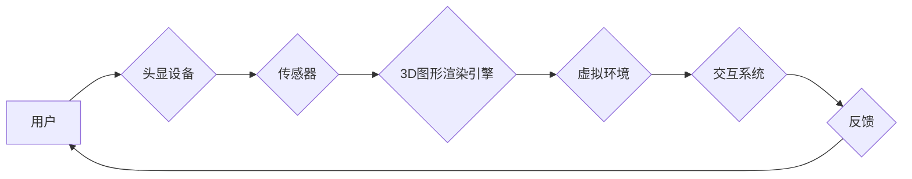

                 

## VR应用开发：构建沉浸式体验

> 关键词：虚拟现实 (VR)、沉浸式体验、3D图形渲染、交互设计、用户体验 (UX)、头显设备、游戏开发、应用开发

## 1. 背景介绍

虚拟现实 (VR) 技术近年来发展迅速，从最初的科技概念逐渐走向现实应用。VR 能够通过头显设备和传感器，模拟逼真的三维环境，让用户身临其境地体验虚拟世界。这种沉浸式体验为游戏、教育、医疗、设计等领域带来了无限可能。

随着硬件设备的不断进步和软件技术的成熟，VR 应用开发正迎来爆发式增长。从游戏、娱乐到教育、培训、医疗，VR 技术正在改变着人们的生活方式和工作模式。

## 2. 核心概念与联系

**2.1 核心概念**

* **虚拟现实 (VR):** 利用计算机技术模拟真实环境或虚构环境，让用户沉浸其中并与之交互的一种技术。
* **沉浸式体验 (Immersive Experience):**  指用户完全沉浸在虚拟环境中，并与之产生强烈的感官联结，仿佛身临其境的感觉。
* **3D图形渲染:**  将三维模型转化为二维图像的过程，是 VR 应用中不可或缺的一部分。
* **交互设计:**  设计用户与虚拟环境交互的方式，包括手势识别、语音控制、体感追踪等。
* **用户体验 (UX):**  用户在使用 VR 应用时的整体感受，包括舒适度、易用性、沉浸感等。

**2.2 架构关系**



**2.3 核心技术**

* **头显设备:**  VR 应用的核心硬件，负责显示虚拟图像并追踪用户的头部运动。
* **传感器:**  用于追踪用户的头部、手部和身体运动，实现虚拟环境的交互。
* **3D图形渲染引擎:**  负责将三维模型转化为二维图像，并根据用户的视角进行实时更新。
* **交互系统:**  负责处理用户的输入，并将其转化为虚拟环境中的动作。
* **内容创作工具:**  用于创建 VR 应用的场景、模型、交互逻辑等。

## 3. 核心算法原理 & 具体操作步骤

**3.1 算法原理概述**

VR 应用开发的核心算法主要包括：

* **3D图形渲染算法:**  用于将三维模型转化为二维图像，常见的算法包括光栅化渲染、射线追踪等。
* **运动追踪算法:**  用于追踪用户的头部、手部和身体运动，常见的算法包括惯性测量单元 (IMU) 算法、视觉追踪算法等。
* **交互算法:**  用于处理用户的输入，并将其转化为虚拟环境中的动作，常见的算法包括手势识别算法、语音识别算法等。

**3.2 算法步骤详解**

* **3D图形渲染算法:**

    1. **建模:**  创建虚拟环境中的三维模型。
    2. **材质贴图:**  为模型添加材质和纹理，使其更逼真。
    3. **灯光设置:**  设置虚拟环境中的灯光，模拟现实世界的光照效果。
    4. **渲染:**  利用渲染算法将三维模型转化为二维图像。
    5. **显示:**  将渲染后的图像显示在头显设备上。

* **运动追踪算法:**

    1. **数据采集:**  使用传感器采集用户的头部、手部和身体运动数据。
    2. **数据处理:**  对采集到的数据进行滤波、校正等处理，去除噪声和误差。
    3. **姿态估计:**  根据处理后的数据，估计用户的姿态和运动轨迹。
    4. **虚拟环境更新:**  根据用户的姿态和运动轨迹，更新虚拟环境中的视角和交互状态。

* **交互算法:**

    1. **输入识别:**  识别用户的输入，例如手势、语音、按钮等。
    2. **事件处理:**  根据识别的输入，触发相应的事件，例如移动虚拟物体、打开菜单等。
    3. **反馈机制:**  提供相应的反馈，例如声音、震动、视觉效果等，让用户感受到交互的反馈。

**3.3 算法优缺点**

* **3D图形渲染算法:**

    * **优点:**  能够生成逼真的三维图像，提供沉浸式的视觉体验。
    * **缺点:**  计算量大，对硬件性能要求高。

* **运动追踪算法:**

    * **优点:**  能够准确追踪用户的运动，实现自然的交互体验。
    * **缺点:**  受环境光线、传感器精度等因素影响，可能出现误差。

* **交互算法:**

    * **优点:**  能够实现多种类型的交互方式，丰富用户的体验。
    * **缺点:**  算法复杂度高，需要大量的测试和优化。

**3.4 算法应用领域**

* **游戏开发:**  VR 游戏能够提供更加沉浸式的游戏体验，例如射击、冒险、模拟等。
* **教育培训:**  VR 技术可以用于模拟真实场景，例如手术模拟、飞行模拟等，提高培训效果。
* **医疗保健:**  VR 可以用于治疗恐惧症、焦虑症等心理疾病，也可以用于手术规划和康复训练。
* **设计与制造:**  VR 可以用于虚拟设计和产品原型制作，提高设计效率和产品质量。

## 4. 数学模型和公式 & 详细讲解 & 举例说明

**4.1 数学模型构建**

VR 应用开发中，需要使用数学模型来描述虚拟环境中的物体、光线、运动等。常见的数学模型包括：

* **三维空间坐标系:**  用于描述虚拟环境中的物体位置和方向。
* **向量和矩阵:**  用于描述物体运动、旋转和缩放。
* **投影变换:**  用于将三维物体投影到二维屏幕上。
* **光线追踪:**  用于模拟光线在虚拟环境中的传播和反射。

**4.2 公式推导过程**

* **三维空间坐标系:**  

    * 物体的坐标可以用三维向量表示：P = (x, y, z)
    * 物体的位置可以通过坐标系变换得到：P' = T * P

* **投影变换:**  

    * 将三维物体投影到二维屏幕上的公式：P' = P * M

    其中，P 是三维物体坐标，P' 是二维屏幕坐标，M 是投影矩阵。

**4.3 案例分析与讲解**

* **光线追踪:**  

    光线追踪算法可以模拟光线在虚拟环境中的传播和反射，从而生成逼真的阴影、反射和折射效果。

    * 光线追踪公式：

        $$
        \mathbf{r}(t) = \mathbf{o} + t \mathbf{d}
        $$

    其中，r(t) 是光线在时间 t 处的坐标，o 是光线的发射点，d 是光线的方向向量。

    * 算法步骤：

        1. 从光源发射光线。
        2. 计算光线与物体相交的点。
        3. 根据材质属性计算反射和折射光线。
        4. 重复步骤 2 和 3，直到光线离开虚拟环境。

## 5. 项目实践：代码实例和详细解释说明

**5.1 开发环境搭建**

* **操作系统:**  Windows、macOS 或 Linux
* **编程语言:**  C++、C# 或 Python
* **VR SDK:**  Unity、Unreal Engine 或 OpenVR

**5.2 源代码详细实现**

以下是一个简单的 VR 应用代码示例，使用 Unity 引擎开发，实现一个简单的球体旋转场景：

```csharp
using UnityEngine;

public class VRController : MonoBehaviour
{
    public GameObject sphere;

    void Update()
    {
        // 获取用户的头部运动数据
        float headRotationX = Input.GetAxis("HeadRotationX");
        float headRotationY = Input.GetAxis("HeadRotationY");

        // 根据头部运动数据旋转球体
        sphere.transform.Rotate(Vector3.up * headRotationX * Time.deltaTime * 100f);
        sphere.transform.Rotate(Vector3.right * headRotationY * Time.deltaTime * 100f);
    }
}
```

**5.3 代码解读与分析**

* 该代码使用 Unity 引擎中的 Input 类获取用户的头部运动数据。
* headRotationX 和 headRotationY 分别表示用户的头部在 X 轴和 Y 轴上的旋转角度。
* 代码使用 sphere.transform.Rotate() 方法旋转球体，并将旋转角度与时间相乘，控制旋转速度。

**5.4 运行结果展示**

运行该代码后，用户可以通过移动头部来控制球体的旋转方向和速度。

## 6. 实际应用场景

**6.1 游戏开发**

VR 游戏能够提供更加沉浸式的游戏体验，例如射击、冒险、模拟等。

* **射击游戏:**  用户可以身临其境地体验射击战斗，增强游戏的代入感。
* **冒险游戏:**  用户可以探索虚拟世界，体验不同的冒险故事。
* **模拟游戏:**  用户可以模拟现实世界的各种活动，例如驾驶、飞行、手术等。

**6.2 教育培训**

VR 技术可以用于模拟真实场景，例如手术模拟、飞行模拟等，提高培训效果。

* **手术模拟:**  医学生可以通过 VR 技术模拟手术操作，提高手术技能和熟练度。
* **飞行模拟:**  飞行员可以通过 VR 技术模拟飞行操作，提高飞行技能和应对突发情况的能力。

**6.3 医疗保健**

VR 可以用于治疗恐惧症、焦虑症等心理疾病，也可以用于手术规划和康复训练。

* **心理治疗:**  VR 可以模拟各种恐惧场景，帮助患者克服恐惧心理。
* **手术规划:**  医生可以通过 VR 技术虚拟模拟手术操作，提前规划手术步骤，降低手术风险。
* **康复训练:**  VR 可以用于模拟日常生活场景，帮助患者进行康复训练，提高生活自理能力。

**6.4 未来应用展望**

VR 技术的发展潜力巨大，未来将应用于更多领域，例如：

* **远程协作:**  VR 可以实现远程协作，例如虚拟会议、远程教育等。
* **虚拟旅游:**  用户可以通过 VR 技术体验虚拟旅游，无需出家门即可游览世界各地。
* **虚拟社交:**  VR 可以创造虚拟社交空间，让用户与朋友和家人进行虚拟互动。

## 7. 工具和资源推荐

**7.1 学习资源推荐**

* **书籍:**

    * 《VR开发入门》
    * 《Unity VR开发指南》
    * 《Unreal Engine VR开发指南》

* **在线课程:**

    * Udemy VR 开发课程
    * Coursera VR 开发课程
    * Unity Learn VR 开发教程

**7.2 开发工具推荐**

* **Unity:**  一款流行的跨平台游戏引擎，支持 VR 开发。
* **Unreal Engine:**  Epic Games 开发的另一款流行的跨平台游戏引擎，也支持 VR 开发。
* **OpenVR:**  一个开源的 VR 头显接口，支持多种 VR 头显设备。

**7.3 相关论文推荐**

* **VR 技术发展趋势:**  [https://arxiv.org/abs/2003.06728](https://arxiv.org/abs/2003.06728)
* **VR 应用在医疗领域的进展:**  [https://www.ncbi.nlm.nih.gov/pmc/articles/PMC7081595/](https://www.ncbi.nlm.nih.gov/pmc/articles/PMC7081595/)

## 8. 总结：未来发展趋势与挑战

**8.1 研究成果总结**

VR 技术近年来取得了长足的进步，硬件设备性能不断提升，软件技术也更加成熟。VR 应用领域也越来越广泛，从游戏娱乐到教育培训、医疗保健等，VR 技术正在改变着人们的生活方式和工作模式。

**8.2 未来发展趋势**

* **硬件设备的进一步提升:**  VR 头显设备将更加轻便、舒适、逼真，并支持更丰富的交互方式。
* **软件技术的不断创新:**  VR 应用开发工具将更加易用、功能强大，并支持更复杂的场景和交互逻辑。
* **应用场景的不断拓展:**  VR 技术将应用于更多领域，例如远程协作、虚拟旅游、虚拟社交等。

**8.3 面临的挑战**

* **成本问题:**  VR 设备和内容开发成本仍然较高，限制了其普及率。
* **技术难题:**  VR 技术还面临着一些技术难题，例如运动眩晕、交互体验的提升等。
* **内容匮乏:**  VR 应用内容仍然相对匮乏，需要更多优质内容来吸引用户。

**8.4 研究展望**

未来，VR 技术将继续发展，并与其他新兴技术融合，例如人工智能、云计算、5G 等，创造出更加沉浸式、交互式、智能化的体验。


## 9. 附录：常见问题与解答

**9.1  VR 头显设备如何选择？**

选择 VR 头显设备时，需要考虑以下因素：

* **分辨率:**  更高的分辨率可以提供更清晰的图像。
* **刷新率:**  更高的刷新率可以减少画面撕裂和延迟。
* **视野:**  更广阔的视野可以提供更沉浸式的体验。
* **舒适度:**  头显设备需要舒适佩戴，避免长时间使用造成头痛或眼疲劳。
* **价格:**  VR 头显设备的价格差异较大，需要根据自己的预算选择。

**9.2  如何克服 VR 运动眩晕？**

运动眩晕是 VR 应用中常见的问题，可以通过以下方法缓解：

* **选择合适的 VR 头显设备:**  一些 VR 头显设备配备了更稳定的追踪系统，可以减少运动眩晕。
* **调整 VR 头显设备的设置:**  例如调整视野、刷新率等参数。
* **逐渐适应 VR 环境:**  不要长时间使用 VR 设备，逐渐增加使用时间。
* **保持良好的姿势:**  避免长时间低头或仰头。
* **选择合适的 VR 应用:**  避免选择过于刺激的 VR 应用。


作者：禅与计算机程序设计艺术 / Zen and the Art of Computer Programming<end_of_turn>

